# Fabric — Code Wiki

> **Source:** [github.com/pdlc-os/fabric](https://github.com/pdlc-os/fabric)
> Auto-generated documentation (Powered by Gemini), captured 2026-07-08.
> Diagrams are stored as vector SVGs under [`diagrams/`](./diagrams/) and referenced inline.

## Table of Contents

- [Fabric Agent Orchestration and Management](#fabric-agent-orchestration-and-management)
  - [Agent Lifecycle Management and Orchestration](#fabric-agent-orchestration-and-management-agent-lifecycle-management-and-orchestration)
  - [Skill Resolution Mechanisms](#fabric-agent-orchestration-and-management-skill-resolution-mechanisms)
  - [Fabric Hub API Client and Services](#fabric-agent-orchestration-and-management-fabric-hub-api-client-and-services)
  - [Runtime Broker API Client and Agent Interaction](#fabric-agent-orchestration-and-management-runtime-broker-api-client-and-agent-interaction)
  - [Event Bus for Real-time Messaging](#fabric-agent-orchestration-and-management-event-bus-for-real-time-messaging)
  - [Secure Credential and Daemon Management](#fabric-agent-orchestration-and-management-secure-credential-and-daemon-management)
  - [Database Operations with Ent ORM](#fabric-agent-orchestration-and-management-database-operations-with-ent-orm)
  - [Fabric API Definitions and Core Data Structures](#fabric-agent-orchestration-and-management-fabric-api-definitions-and-core-data-structures)
  - [Harness Abstraction and Provisioning](#fabric-agent-orchestration-and-management-harness-abstraction-and-provisioning)
  - [Local Agent Cache for Shell Completion](#fabric-agent-orchestration-and-management-local-agent-cache-for-shell-completion)
- [Command-Line Interface (CLI) Operations](#command-line-interface-cli-operations)
  - [Agent Lifecycle and Management Commands](#command-line-interface-cli-operations-agent-lifecycle-and-management-commands)
  - [Harness Configuration Management and Synchronization](#command-line-interface-cli-operations-harness-configuration-management-and-synchronization)
  - [Runtime Broker Operations and Daemon Management](#command-line-interface-cli-operations-runtime-broker-operations-and-daemon-management)
  - [Advanced CLI Mode Restrictions and Completion](#command-line-interface-cli-operations-advanced-cli-mode-restrictions-and-completion)
  - [Fabrictool: Container Init and Lifecycle Management](#command-line-interface-cli-operations-fabrictool-container-init-and-lifecycle-management)
  - [Fabrictool: Harness Hook Processing and Telemetry](#command-line-interface-cli-operations-fabrictool-harness-hook-processing-and-telemetry)
  - [Fabrictool: Authentication and `gh` CLI Integration](#command-line-interface-cli-operations-fabrictool-authentication-and-gh-cli-integration)
  - [Fabrictool: GCE Metadata Server Emulation and Diagnostics](#command-line-interface-cli-operations-fabrictool-gce-metadata-server-emulation-and-diagnostics)
- [Fabric Web User Interface](#fabric-web-user-interface)
  - [Client-Side Architecture and Routing](#fabric-web-user-interface-client-side-architecture-and-routing)
  - [Real-time State Management and SSE](#fabric-web-user-interface-real-time-state-management-and-sse)
  - [API Communication and Error Handling](#fabric-web-user-interface-api-communication-and-error-handling)
  - [UI Component Ecosystem and Design Patterns](#fabric-web-user-interface-ui-component-ecosystem-and-design-patterns)
  - [Theming, Styling, and Accessibility](#fabric-web-user-interface-theming-styling-and-accessibility)
  - [End-to-End Testing for Real-time Features](#fabric-web-user-interface-end-to-end-testing-for-real-time-features)
- [Agent Configuration and Operational Parameters](#agent-configuration-and-operational-parameters)
  - [Documentation Writer Agent Configuration](#agent-configuration-and-operational-parameters-documentation-writer-agent-configuration)
  - [Instance Manager Agent Configuration and GCP VM Integration](#agent-configuration-and-operational-parameters-instance-manager-agent-configuration-and-gcp-vm-integration)
  - [Semantic Release Notes Agent Configuration](#agent-configuration-and-operational-parameters-semantic-release-notes-agent-configuration)
  - [Web Development Agent and Chrome DevTools Integration](#agent-configuration-and-operational-parameters-web-development-agent-and-chrome-devtools-integration)
  - [Bundled Resources and Platform Skills](#agent-configuration-and-operational-parameters-bundled-resources-and-platform-skills)
- [Fabric Agent Development Kit and Examples](#fabric-agent-development-kit-and-examples)
  - [ADK Agent Lifecycle and Status Reporting](#fabric-agent-development-kit-and-examples-adk-agent-lifecycle-and-status-reporting)
  - [Multi-Agent Poker Simulation](#fabric-agent-development-kit-and-examples-multi-agent-poker-simulation)
  - [AMP CLI Harness Integration](#fabric-agent-development-kit-and-examples-amp-cli-harness-integration)
  - [Orchestration Patterns: Parallel Fan-Out](#fabric-agent-development-kit-and-examples-orchestration-patterns-parallel-fan-out)
  - [Orchestration Patterns: Sequential Task Execution](#fabric-agent-development-kit-and-examples-orchestration-patterns-sequential-task-execution)
- [Agent Harness Management](#agent-harness-management)
  - [Harness Bundle Structure and Core Functionality](#agent-harness-management-harness-bundle-structure-and-core-functionality)
  - [Shared Python Harness Library (`fabric_harness.py`)](#agent-harness-management-shared-python-harness-library-fabric-harness-py)
  - [Authentication and Credential Capture Mechanisms](#agent-harness-management-authentication-and-credential-capture-mechanisms)
  - [Instruction Projection and Prompt Management](#agent-harness-management-instruction-projection-and-prompt-management)
  - [Multi-Channel Proxy (MCP) Server Configuration](#agent-harness-management-multi-channel-proxy-mcp-server-configuration)
  - [Automated Vendoring and Consistency Enforcement](#agent-harness-management-automated-vendoring-and-consistency-enforcement)
- [Container Image Build and Management](#container-image-build-and-management)
  - [Image Hierarchy and Base Images](#container-image-build-and-management-image-hierarchy-and-base-images)
  - [Build Orchestration with `build-images.sh`](#container-image-build-and-management-build-orchestration-with-build-images-sh)
  - [Pluggable Build Backends (Docker, Podman, Cloud Build)](#container-image-build-and-management-pluggable-build-backends-docker-podman-cloud-build)
  - [Image Metadata and Dependency Graph Management](#container-image-build-and-management-image-metadata-and-dependency-graph-management)
  - [Google Cloud Build Environment Setup and Verification](#container-image-build-and-management-google-cloud-build-environment-setup-and-verification)
- [Auxiliary Tools and Integrations](#auxiliary-tools-and-integrations)
  - [Agent Activity Visualization with `agent-viz`](#auxiliary-tools-and-integrations-agent-activity-visualization-with-agent-viz)
  - [AI-Powered Q&A with Fabric Docs Agent](#auxiliary-tools-and-integrations-ai-powered-q-a-with-fabric-docs-agent)
  - [Filesystem Activity Monitoring with `fabric-fs-watcher`](#auxiliary-tools-and-integrations-filesystem-activity-monitoring-with-fabric-fs-watcher)
  - [A2A Protocol Bridge for Fabric Agents](#auxiliary-tools-and-integrations-a2a-protocol-bridge-for-fabric-agents)
  - [FABRIC Message Broker Logging Plugin](#auxiliary-tools-and-integrations-fabric-message-broker-logging-plugin)
  - [Google Chat Integration with Fabric Hub](#auxiliary-tools-and-integrations-google-chat-integration-with-fabric-hub)
  - [Discord Bot Integration for Fabric](#auxiliary-tools-and-integrations-discord-bot-integration-for-fabric)
  - [Slack Messaging Integration for Fabric](#auxiliary-tools-and-integrations-slack-messaging-integration-for-fabric)
  - [Telegram Message Broker Plugin for Fabric](#auxiliary-tools-and-integrations-telegram-message-broker-plugin-for-fabric)
- [Fabric Platform Skills](#fabric-platform-skills)
  - [Fabric CLI Operations and Constraints](#fabric-platform-skills-fabric-cli-operations-and-constraints)
  - [Inter-Agent and User Communication Protocols](#fabric-platform-skills-inter-agent-and-user-communication-protocols)
  - [Standard Agent Status Signaling Protocol](#fabric-platform-skills-standard-agent-status-signaling-protocol)
  - [Git Workflow for Sandboxed Environments](#fabric-platform-skills-git-workflow-for-sandboxed-environments)
  - [Fabric Agent Lifecycle and Project Management](#fabric-platform-skills-fabric-agent-lifecycle-and-project-management)
  - [Team Creation and Multi-Agent Orchestration Templates](#fabric-platform-skills-team-creation-and-multi-agent-orchestration-templates)
- [Design Specifications and Architecture](#design-specifications-and-architecture)
  - [Core Architectural Principles and Agent Management](#design-specifications-and-architecture-core-architectural-principles-and-agent-management)
  - [LLM Agnosticism and Harness Abstraction](#design-specifications-and-architecture-llm-agnosticism-and-harness-abstraction)
  - [Authentication and Security Design](#design-specifications-and-architecture-authentication-and-security-design)
  - [Runtime Environments and Integration](#design-specifications-and-architecture-runtime-environments-and-integration)
  - [A2A Bridge Design and Evolution](#design-specifications-and-architecture-a2a-bridge-design-and-evolution)
  - [Hosted Mode Architecture and Client-Side Interaction](#design-specifications-and-architecture-hosted-mode-architecture-and-client-side-interaction)
  - [Kubernetes Integration and Sandbox Evolution](#design-specifications-and-architecture-kubernetes-integration-and-sandbox-evolution)
  - [OpenTelemetry (OTel) Design for Observability](#design-specifications-and-architecture-opentelemetry-otel-design-for-observability)
  - [GitHub App Integration and Security Management](#design-specifications-and-architecture-github-app-integration-and-security-management)
  - [Investigations and Post-Mortems](#design-specifications-and-architecture-investigations-and-post-mortems)
- [Developer Utilities and Local Development](#developer-utilities-and-local-development)
  - [API Integration and Stress Testing](#developer-utilities-and-local-development-api-integration-and-stress-testing)
  - [PostgreSQL Database Diagnostics](#developer-utilities-and-local-development-postgresql-database-diagnostics)
  - [Kubernetes NFS Shared Workspace Testing](#developer-utilities-and-local-development-kubernetes-nfs-shared-workspace-testing)
  - [JWT Minting for Local API Testing](#developer-utilities-and-local-development-jwt-minting-for-local-api-testing)
  - [Google Cloud Run Deployment and Management](#developer-utilities-and-local-development-google-cloud-run-deployment-and-management)
  - [Google Cloud Engine Starter Hub Deployment](#developer-utilities-and-local-development-google-cloud-engine-starter-hub-deployment)
  - [PR Dependency Analysis and Merge Ordering](#developer-utilities-and-local-development-pr-dependency-analysis-and-merge-ordering)
  - [VM Pulse Health Diagnostics](#developer-utilities-and-local-development-vm-pulse-health-diagnostics)
- [Issue and Pull Request Management](#issue-and-pull-request-management)
  - [Standardized Bug Reporting Process](#issue-and-pull-request-management-standardized-bug-reporting-process)
  - [Feature Request Submission Guidelines](#issue-and-pull-request-management-feature-request-submission-guidelines)
  - [Pull Request Submission and Checklist](#issue-and-pull-request-management-pull-request-submission-and-checklist)
- [Fabric Broker Protobuf and gRPC Services](#fabric-broker-protobuf-and-grpc-services)
  - [Message Brokering RPCs and `StructuredMessage`](#fabric-broker-protobuf-and-grpc-services-message-brokering-rpcs-and-structuredmessage)
  - [Broker Configuration and Information Retrieval](#fabric-broker-protobuf-and-grpc-services-broker-configuration-and-information-retrieval)
  - [Health Check Mechanisms and Status Reporting](#fabric-broker-protobuf-and-grpc-services-health-check-mechanisms-and-status-reporting)
  - [Generated Go Client and Server Interfaces](#fabric-broker-protobuf-and-grpc-services-generated-go-client-and-server-interfaces)
- [Task Management and Onboarding](#task-management-and-onboarding)
  - [Workstation Onboarding Feature Development Phases](#task-management-and-onboarding-workstation-onboarding-feature-development-phases)
  - [Onboarding Bug Fixes and Refinements](#task-management-and-onboarding-onboarding-bug-fixes-and-refinements)
  - [Code Review Feedback and Security Fixes](#task-management-and-onboarding-code-review-feedback-and-security-fixes)
  - [Project Finalization and Rebase Instructions](#task-management-and-onboarding-project-finalization-and-rebase-instructions)
- [Changelogs and Release Notes](#changelogs-and-release-notes)
  - [Core Architecture and Infrastructure Updates](#changelogs-and-release-notes-core-architecture-and-infrastructure-updates)
  - [Agent Management and Lifecycle Enhancements](#changelogs-and-release-notes-agent-management-and-lifecycle-enhancements)
  - [Authentication, Authorization, and Security Features](#changelogs-and-release-notes-authentication-authorization-and-security-features)
  - [Workspace and Grove Management Evolution](#changelogs-and-release-notes-workspace-and-grove-management-evolution)
  - [Template and Configuration System Refinements](#changelogs-and-release-notes-template-and-configuration-system-refinements)
  - [User Interface and Experience (UI/UX) Improvements](#changelogs-and-release-notes-user-interface-and-experience-ui-ux-improvements)
  - [Observability, Telemetry, and Visualization](#changelogs-and-release-notes-observability-telemetry-and-visualization)
  - [Messaging and Notification System Development](#changelogs-and-release-notes-messaging-and-notification-system-development)
  - [Kubernetes and GitHub Integrations](#changelogs-and-release-notes-kubernetes-and-github-integrations)

---

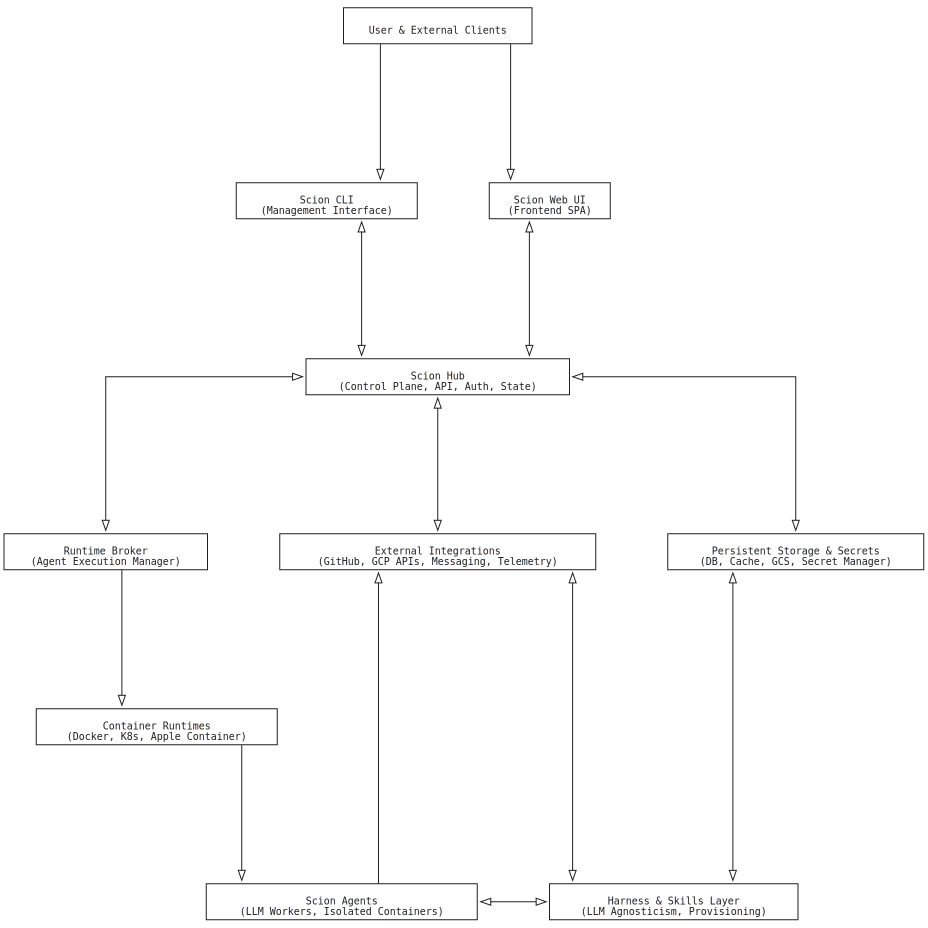

The Fabric platform orchestrates and manages concurrent LLM-based agents. It defines agent configurations, manages their lifecycle, and establishes their execution environments. A central Hub API client and a real-time event bus facilitate agent interaction and communication.

Agents operate within isolated environments, often with their own Git worktrees and credentials. This prevents conflicts during concurrent execution and supports various container runtimes such as Docker, Podman, and Kubernetes. The platform uses a "Harness" abstraction to encapsulate agent-specific logic, such as environment variables and command construction, which provides LLM agnosticism. For more details, see [Harness Abstraction and Provisioning](#fabric-agent-orchestration-and-management-harness-abstraction-and-provisioning).

The system manages the complete lifecycle of agents, including provisioning, starting, stopping, deleting, listing, and messaging. The [`Manager`](https://github.com/pdlc-os/fabric/blob/b11448f8f01fdcf12deab96204417d87f8d46ab3/pkg/agent/manager.go#L33) interface orchestrates these operations for both standard and cloud-managed agents. More information is available in [Agent Lifecycle Management and Orchestration](#fabric-agent-orchestration-and-management-agent-lifecycle-management-and-orchestration).

Agents fetch and utilize capabilities from various sources through skill resolution mechanisms. Supported sources include GCP Vertex AI registries, GitHub repositories, and the Fabric Hub API, with caching and security checks to enhance efficiency. Explore [Skill Resolution Mechanisms](#fabric-agent-orchestration-and-management-skill-resolution-mechanisms) for further details.

- A Go client in [`pkg/hubclient`](https://github.com/pdlc-os/fabric/blob/b11448f8f01fdcf12deab96204417d87f8d46ab3/pkg/hubclient) provides extensive services for managing agents, authentication, projects, and skills with the central Fabric Hub.
- Another Go client in [`pkg/brokerclient`](https://github.com/pdlc-os/fabric/blob/b11448f8f01fdcf12deab96204417d87f8d46ab3/pkg/brokerclient) enables agent-specific actions like listing, creating, and executing commands within an agent's container via the Fabric Runtime Broker API.

Real-time, publish/subscribe messaging between Fabric components occurs through an [`EventBus`](https://github.com/pdlc-os/fabric/blob/b11448f8f01fdcf12deab96204417d87f8d46ab3/pkg/eventbus/eventbus.go#L40) abstraction in [`pkg/eventbus`](https://github.com/pdlc-os/fabric/blob/b11448f8f01fdcf12deab96204417d87f8d46ab3/pkg/eventbus). It routes structured messages based on topic matching. Refer to [Event Bus for Real-time Messaging](#fabric-agent-orchestration-and-management-event-bus-for-real-time-messaging) for more.

- Database operations leverage [`ent`](https://github.com/pdlc-os/fabric/blob/b11448f8f01fdcf12deab96204417d87f8d46ab3/pkg/ent/tx.go#L1) ORM-generated code in [`pkg/ent`](https://github.com/pdlc-os/fabric/blob/b11448f8f01fdcf12deab96204417d87f8d46ab3/pkg/ent) for robust interactions with entities such as [`AccessPolicy`](https://github.com/pdlc-os/fabric/blob/b11448f8f01fdcf12deab96204417d87f8d46ab3/pkg/ent/schema/policy.go#L29) and [`Agent`](https://github.com/pdlc-os/fabric/blob/b11448f8f01fdcf12deab96204417d87f8d46ab3/pkg/store/models.go#L28).
- Core data structures and API definitions for agent configurations, actions, and telemetry reside in [`pkg/api`](https://github.com/pdlc-os/fabric/blob/b11448f8f01fdcf12deab96204417d87f8d46ab3/pkg/api).

Developers and users interact with the platform through a command-line interface (CLI) in [`cmd`](https://github.com/pdlc-os/fabric/blob/b11448f8f01fdcf12deab96204417d87f8d46ab3/cmd) and a web user interface (Web UI) in [`web`](https://github.com/pdlc-os/fabric/blob/b11448f8f01fdcf12deab96204417d87f8d46ab3/web). The CLI manages agent lifecycle and configurations, while the Web UI offers real-time state synchronization via Server-Sent Events (SSE).

## Fabric Agent Orchestration and Management

The Fabric platform facilitates the orchestration and management of concurrent LLM-based agents, enabling them to collaborate within a structured environment. This involves defining the overall architecture, configuring individual agents, managing their complete lifecycle, and establishing the execution environments in which they operate. The system provides a fundamental Go client for interacting with the Fabric Hub API, an event bus for real-time messaging, and mechanisms for skill resolution and database operations that underpin agent behavior.

Agents within Fabric are designed to operate within isolated environments, each often equipped with its own Git worktree and credentials to prevent conflicts during concurrent execution. The system supports various container runtimes, including Docker, Podman, Apple Container, and Kubernetes, providing flexibility in deployment. A central aspect of Fabric is its "Harness" abstraction, which encapsulates agent-specific logic related to environment variables, command construction, and authentication, contributing to LLM agnosticism.

Agent lifecycle management in Fabric involves provisioning, starting, stopping, deleting, listing, and messaging agents. The [`Manager`](https://github.com/pdlc-os/fabric/blob/b11448f8f01fdcf12deab96204417d87f8d46ab3/pkg/agent/manager.go#L33) interface, with distinct implementations for standard and cloud-managed agents, orchestrates these operations. This allows for both local and distributed agent deployments, with the ability to send buffered or immediate messages to an agent's harness. For more details on these operations, see [Agent Lifecycle Management and Orchestration](#fabric-agent-orchestration-and-management-agent-lifecycle-management-and-orchestration).

Skill resolution is a critical component, allowing agents to fetch and utilize capabilities from various sources. The platform supports fetching skills from GCP Vertex AI registries, GitHub repositories, and the Fabric Hub API, incorporating caching and retry mechanisms to enhance efficiency and reliability. Security checks are in place to prevent vulnerabilities like Server-Side Request Forgery (SSRF) during skill acquisition. The directory [`pkg/agent`](https://github.com/pdlc-os/fabric/blob/b11448f8f01fdcf12deab96204417d87f8d46ab3/pkg/agent) contains the implementations for these skill resolvers. For further exploration of this topic, refer to [Skill Resolution Mechanisms](#fabric-agent-orchestration-and-management-skill-resolution-mechanisms).

Interactions with the central Fabric Hub are managed through a comprehensive Go client located in [`pkg/hubclient`](https://github.com/pdlc-os/fabric/blob/b11448f8f01fdcf12deab96204417d87f8d46ab3/pkg/hubclient). This client provides extensive services for managing agents, handling authentication, and overseeing projects and skills. It also incorporates mechanisms for backward compatibility, particularly concerning terminology changes. Similarly, a Go client for the Fabric Runtime Broker API, found in [`pkg/brokerclient`](https://github.com/pdlc-os/fabric/blob/b11448f8f01fdcf12deab96204417d87f8d46ab3/pkg/brokerclient), enables agent-specific actions such as listing, creation, starting, stopping, messaging, and command execution within an agent's container. For a detailed understanding of these client functionalities, refer to [Fabric Hub API Client and Services](#fabric-agent-orchestration-and-management-fabric-hub-api-client-and-services) and [Runtime Broker API Client and Agent Interaction](#fabric-agent-orchestration-and-management-runtime-broker-api-client-and-agent-interaction).

Real-time communication within the Fabric ecosystem is facilitated by an [`EventBus`](https://github.com/pdlc-os/fabric/blob/b11448f8f01fdcf12deab96204417d87f8d46ab3/pkg/eventbus/eventbus.go#L40) abstraction, located in [`pkg/eventbus`](https://github.com/pdlc-os/fabric/blob/b11448f8f01fdcf12deab96204417d87f8d46ab3/pkg/eventbus). This event bus supports publish/subscribe messaging, offering both in-process and fan-out implementations to distribute messages across various Fabric components based on topic matching. This ensures that agents and other system components can communicate dynamically as events unfold. More information can be found in [Event Bus for Real-time Messaging](#fabric-agent-orchestration-and-management-event-bus-for-real-time-messaging).

Database operations are handled using [`ent`](https://github.com/pdlc-os/fabric/blob/b11448f8f01fdcf12deab96204417d87f8d46ab3/pkg/ent/tx.go#L1), an ORM (Object-Relational Mapper), which generates Go code for robust interactions with the underlying database. This includes schema definitions, CRUD (Create, Read, Update, Delete) operations, relationship management, and query capabilities for key entities such as [`AccessPolicy`](https://github.com/pdlc-os/fabric/blob/b11448f8f01fdcf12deab96204417d87f8d46ab3/pkg/ent/schema/policy.go#L29), [`Agent`](https://github.com/pdlc-os/fabric/blob/b11448f8f01fdcf12deab96204417d87f8d46ab3/pkg/store/models.go#L28), [`AllowListEntry`](https://github.com/pdlc-os/fabric/blob/b11448f8f01fdcf12deab96204417d87f8d46ab3/pkg/store/models.go#L710), and [`ApiKey`](https://github.com/pdlc-os/fabric/blob/b11448f8f01fdcf12deab96204417d87f8d46ab3/pkg/ent/schema/apikey.go#L34). The generated code resides in [`pkg/ent`](https://github.com/pdlc-os/fabric/blob/b11448f8f01fdcf12deab96204417d87f8d46ab3/pkg/ent). For more details, see [Database Operations with Ent ORM](#fabric-agent-orchestration-and-management-database-operations-with-ent-orm).

The core definitions and data structures that underpin Fabric agents are located in [`pkg/api`](https://github.com/pdlc-os/fabric/blob/b11448f8f01fdcf12deab96204417d87f8d46ab3/pkg/api). This includes configurations for agents, definitions for agent actions, authentication settings, telemetry configurations, and utilities for parsing skill URIs and generating slugs for unique identifiers. These API definitions establish the foundational contracts for how agents are configured and interact within the platform. See [Fabric API Definitions and Core Data Structures](#fabric-agent-orchestration-and-management-fabric-api-definitions-and-core-data-structures) for further details.

The [`Harness`](https://github.com/pdlc-os/fabric/blob/b11448f8f01fdcf12deab96204417d87f8d46ab3/pkg/api/harness.go#L23) abstraction, detailed in [`pkg/harness`](https://github.com/pdlc-os/fabric/blob/b11448f8f01fdcf12deab96204417d87f8d46ab3/pkg/harness), is crucial for enabling agent-agnostic execution. It provides interfaces and implementations for various agent execution environments, managing authentication gathering, configuration loading, and provisioning. This allows the Fabric platform to integrate diverse LLMs and execution strategies seamlessly. More information is available in [Harness Abstraction and Provisioning](#fabric-agent-orchestration-and-management-harness-abstraction-and-provisioning).

To enhance local development and user experience, Fabric includes a local, filesystem-based cache for agent names in [`pkg/agentcache`](https://github.com/pdlc-os/fabric/blob/b11448f8f01fdcf12deab96204417d87f8d46ab3/pkg/agentcache). This cache significantly speeds up shell completion and improves reliability by reducing dependencies on the Hub API, especially when network conditions are suboptimal or the API is under load. For a deeper understanding, refer to [Local Agent Cache for Shell Completion](#fabric-agent-orchestration-and-management-local-agent-cache-for-shell-completion).

### Agent Lifecycle Management and Orchestration

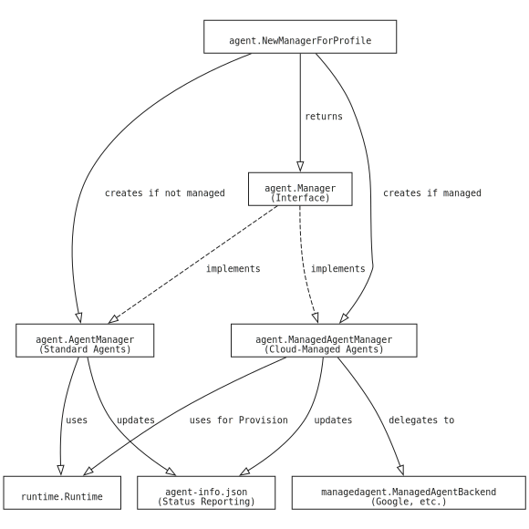

FABRIC agents undergo a comprehensive lifecycle, from initial provisioning to eventual deletion, managed through a set of core functionalities. The primary interface for orchestrating these agents is the [`Manager`](https://github.com/pdlc-os/fabric/blob/b11448f8f01fdcf12deab96204417d87f8d46ab3/pkg/agent/manager.go#L33), which has different implementations to accommodate standard and cloud-managed agents.

For standard agents, the [`AgentManager`](https://github.com/pdlc-os/fabric/blob/b11448f8f01fdcf12deab96204417d87f8d46ab3/pkg/agent/manager.go#L68) in [`pkg/agent`](https://github.com/pdlc-os/fabric/blob/b11448f8f01fdcf12deab96204417d87f8d46ab3/pkg/agent) facilitates operations such as [`Provision`](https://github.com/pdlc-os/fabric/blob/b11448f8f01fdcf12deab96204417d87f8d46ab3/pkg/api/harness.go#L36) to prepare agent environments, [`Start`](https://github.com/pdlc-os/fabric/blob/b11448f8f01fdcf12deab96204417d87f8d46ab3/pkg/hub/web.go#L1956) to launch new agents, [`Stop`](https://github.com/pdlc-os/fabric/blob/b11448f8f01fdcf12deab96204417d87f8d46ab3/pkg/runtime/mock.go#L55) to terminate them, and [`Delete`](https://github.com/pdlc-os/fabric/blob/b11448f8f01fdcf12deab96204417d87f8d46ab3/pkg/storage/gcs.go#L219) to remove their associated resources, including files and Git worktrees. Agent information is retrieved and reconciled from both the runtime environment and local storage, with an emphasis on the [`agent-info.json`](https://github.com/pdlc-os/fabric/blob/b11448f8f01fdcf12deab96204417d87f8d46ab3/pkg/agent/run.go#L965) file for status reporting. Communication with agents is handled by the [`Message`](https://github.com/pdlc-os/fabric/blob/b11448f8f01fdcf12deab96204417d87f8d46ab3/cmd/output.go#L60) function, which can send buffered or immediate messages, often using [`tmux`](https://github.com/pdlc-os/fabric/blob/b11448f8f01fdcf12deab96204417d87f8d46ab3/README.md?plain=1#L74) commands, with a [`MessageBuffer`](https://github.com/pdlc-os/fabric/blob/b11448f8f01fdcf12deab96204417d87f8d46ab3/pkg/agent/msgbuffer.go#L40) to debounce messages and prevent overwhelming the agent.

Cloud-managed agents are handled by the [`ManagedAgentManager`](https://github.com/pdlc-os/fabric/blob/b11448f8f01fdcf12deab96204417d87f8d46ab3/pkg/agent/managed_manager.go#L34) in [`pkg/agent/managed_manager.go`](https://github.com/pdlc-os/fabric/blob/b11448f8f01fdcf12deab96204417d87f8d46ab3/pkg/agent/managed_manager.go). This implementation delegates operations to a [`managedagent.ManagedAgentBackend`](https://github.com/pdlc-os/fabric/blob/b11448f8f01fdcf12deab96204417d87f8d46ab3/pkg/agent/managed_manager.go#L35), managing state locally and providing status updates through a [`Watch`](https://github.com/pdlc-os/fabric/blob/b11448f8f01fdcf12deab96204417d87f8d46ab3/pkg/agent/manager.go#L61) mechanism. A factory function, [`NewManagerForProfile`](https://github.com/pdlc-os/fabric/blob/b11448f8f01fdcf12deab96204417d87f8d46ab3/pkg/agent/manager_factory.go#L29) in [`pkg/agent/manager_factory.go`](https://github.com/pdlc-os/fabric/blob/b11448f8f01fdcf12deab96204417d87f8d46ab3/pkg/agent/manager_factory.go), determines whether to instantiate an [`AgentManager`](https://github.com/pdlc-os/fabric/blob/b11448f8f01fdcf12deab96204417d87f8d46ab3/pkg/agent/manager.go#L68) or a [`ManagedAgentManager`](https://github.com/pdlc-os/fabric/blob/b11448f8f01fdcf12deab96204417d87f8d46ab3/pkg/agent/managed_manager.go#L34) based on the agent's profile, providing a unified entry point for agent management. For a broader view of agent configuration and API definitions, refer to [Fabric API Definitions and Core Data Structures](#fabric-agent-orchestration-and-management-fabric-api-definitions-and-core-data-structures).

The CLI plays a significant role in agent lifecycle management, offering commands for creation, deletion, and other operational utilities. More details can be found in [Agent Lifecycle and Management Commands](#command-line-interface-cli-operations-agent-lifecycle-and-management-commands). The system also manages the secure storage and retrieval of credentials, which is essential for agent operations. See [Secure Credential and Daemon Management](#fabric-agent-orchestration-and-management-secure-credential-and-daemon-management) for further information.

### Skill Resolution Mechanisms

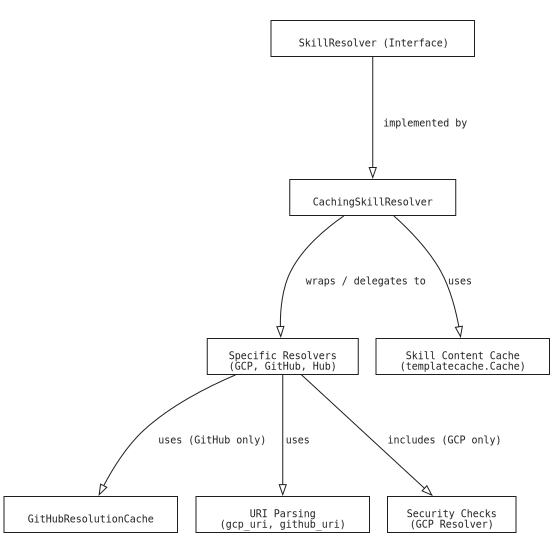

FABRIC agents resolve and fetch skills from various sources through a flexible mechanism supported by several dedicated resolvers. Each resolver handles a specific source type, while a caching layer optimizes performance and security checks protect against vulnerabilities.

The primary mechanism for fetching skills from different locations is the [`SkillResolver`](https://github.com/pdlc-os/fabric/blob/b11448f8f01fdcf12deab96204417d87f8d46ab3/pkg/agent/skill_resolver.go#L44) interface, which is implemented by several components. A [`CachingSkillResolver`](https://github.com/pdlc-os/fabric/blob/b11448f8f01fdcf12deab96204417d87f8d46ab3/pkg/agent/caching_skill_resolver.go#L30), defined in [`pkg/agent/caching_skill_resolver.go`](https://github.com/pdlc-os/fabric/blob/b11448f8f01fdcf12deab96204417d87f8d46ab3/pkg/agent/caching_skill_resolver.go), wraps other resolvers to provide a content-hash based caching layer. This prevents redundant skill downloads by storing previously resolved skills, improving efficiency. The cache is passed through the execution context, allowing deeper functions to access it without explicit arguments.

For skills hosted on Google Cloud Platform, the [`GCPSkillResolver`](https://github.com/pdlc-os/fabric/blob/b11448f8f01fdcf12deab96204417d87f8d46ab3/pkg/agent/gcp_skill_resolver.go#L53) in [`pkg/agent/gcp_skill_resolver.go`](https://github.com/pdlc-os/fabric/blob/b11448f8f01fdcf12deab96204417d87f8d46ab3/pkg/agent/gcp_skill_resolver.go) handles [`gcp-skill://`](https://github.com/pdlc-os/fabric/blob/b11448f8f01fdcf12deab96204417d87f8d46ab3/pkg/agent/gcp_uri.go#L33) URIs. It fetches skill metadata and files from GCP Vertex AI skill registries. This resolver includes critical security checks, such as [`validateFileURL`](https://github.com/pdlc-os/fabric/blob/b11448f8f01fdcf12deab96204417d87f8d46ab3/pkg/agent/gcp_skill_resolver.go#L291) and [`isBlockedHost`](https://github.com/pdlc-os/fabric/blob/b11448f8f01fdcf12deab96204417d87f8d46ab3/pkg/agent/gcp_skill_resolver.go#L314), to mitigate Server-Side Request Forgery (SSRF) vulnerabilities during file downloads. GCP skill URIs are parsed and validated by logic within [`pkg/agent/gcp_uri.go`](https://github.com/pdlc-os/fabric/blob/b11448f8f01fdcf12deab96204417d87f8d46ab3/pkg/agent/gcp_uri.go).

GitHub-hosted skills, identified by [`gh://`](https://github.com/pdlc-os/fabric/blob/b11448f8f01fdcf12deab96204417d87f8d46ab3/pkg/agent/github_uri.go#L35) or [`https://github.com/`](https://github.com/pdlc-os/fabric/blob/b11448f8f01fdcf12deab96204417d87f8d46ab3/pkg/agent/github_uri.go#L44) URIs, are managed by the [`GitHubSkillResolver`](https://github.com/pdlc-os/fabric/blob/b11448f8f01fdcf12deab96204417d87f8d46ab3/pkg/agent/github_skill_resolver.go#L50) located in [`pkg/agent/github_skill_resolver.go`](https://github.com/pdlc-os/fabric/blob/b11448f8f01fdcf12deab96204417d87f8d46ab3/pkg/agent/github_skill_resolver.go). This resolver interacts with the GitHub Contents API and raw content endpoints to retrieve skill files. It incorporates retry mechanisms with exponential backoff and rate limit handling, managed by the [`doWithRetry`](https://github.com/pdlc-os/fabric/blob/b11448f8f01fdcf12deab96204417d87f8d46ab3/pkg/agent/github_skill_resolver.go#L316) function, to ensure robustness against transient API errors. A [`GitHubResolutionCache`](https://github.com/pdlc-os/fabric/blob/b11448f8f01fdcf12deab96204417d87f8d46ab3/pkg/agent/github_resolution_cache.go#L40) in [`pkg/agent/github_resolution_cache.go`](https://github.com/pdlc-os/fabric/blob/b11448f8f01fdcf12deab96204417d87f8d46ab3/pkg/agent/github_resolution_cache.go) provides persistent caching for GitHub resolution results, improving performance for frequently accessed skills. GitHub skill URIs are parsed and validated by [`pkg/agent/github_uri.go`](https://github.com/pdlc-os/fabric/blob/b11448f8f01fdcf12deab96204417d87f8d46ab3/pkg/agent/github_uri.go).

Finally, for skills managed directly by the Fabric Hub, the [`HubSkillResolver`](https://github.com/pdlc-os/fabric/blob/b11448f8f01fdcf12deab96204417d87f8d46ab3/pkg/agent/hub_skill_resolver.go#L26) in [`pkg/agent/hub_skill_resolver.go`](https://github.com/pdlc-os/fabric/blob/b11448f8f01fdcf12deab96204417d87f8d46ab3/pkg/agent/hub_skill_resolver.go) delegates resolution requests to a remote Hub API client. This allows the Hub to centralize skill management and distribution. The [`HubSkillResolver`](https://github.com/pdlc-os/fabric/blob/b11448f8f01fdcf12deab96204417d87f8d46ab3/pkg/agent/hub_skill_resolver.go#L26) translates local skill references into appropriate requests for the [`hubclient.SkillService`](https://github.com/pdlc-os/fabric/blob/b11448f8f01fdcf12deab96204417d87f8d46ab3/pkg/agent/hub_skill_resolver.go#L27) and maps the responses back. More information on the Fabric Hub API client can be found in [Fabric Hub API Client and Services](#fabric-agent-orchestration-and-management-fabric-hub-api-client-and-services).

### Fabric Hub API Client and Services

The Fabric Hub API Client provides a Go interface for managing and orchestrating agents, projects, and skills within the Fabric platform. This client, primarily implemented within [`pkg/hubclient`](https://github.com/pdlc-os/fabric/blob/b11448f8f01fdcf12deab96204417d87f8d46ab3/pkg/hubclient), facilitates interactions with the Fabric Hub, acting as a central point for administrative and operational tasks.

The client is structured around a set of specialized services, each responsible for a distinct domain of functionality:

- **Agent Services** manage the full lifecycle of agents, including creation, deletion, starting, stopping, and updating. It also provides capabilities for agent communication through structured messages and access to agent logs, including streaming logs from Cloud Logging. This is primarily handled by the [`AgentService`](https://github.com/pdlc-os/fabric/blob/b11448f8f01fdcf12deab96204417d87f8d46ab3/pkg/hubclient/agents.go#L34) defined in [`pkg/hubclient/agents.go`](https://github.com/pdlc-os/fabric/blob/b11448f8f01fdcf12deab96204417d87f8d46ab3/pkg/hubclient/agents.go).
- **Authentication Services** handle user authentication workflows, including logging in, logging out, token refreshing, and obtaining WebSocket tickets. It supports various OAuth flows suitable for web, CLI, and device-based clients.
- **Project Services** provide comprehensive management for projects, which serve as organizational containers for agents and other resources. This includes registering, creating, updating, and deleting projects, as well as managing associated providers and project settings.
- **Skill Services** manage the lifecycle of skills, which represent capabilities that agents can acquire and execute. This involves listing, getting, creating, updating, and deleting skills, along with support for skill versioning and file transfers.
- **Runtime Broker Services** enable the management of runtime brokers, which are responsible for executing agents. This includes operations such as creating, joining, listing, and updating runtime brokers, and handling heartbeats.
- **Harness Configuration Services** manage the configurations for agent harnesses, which define how agents operate within their execution environments. This includes CRUD operations, file uploads/downloads, and validation of harness configurations.
- **Credential and Secret Services** manage various types of credentials and secrets. This includes storing and retrieving user access tokens, and managing project-scoped secrets, with an emphasis on security by ensuring secret values are write-only and never returned.

A key design aspect of the Hub API client is its approach to **backward compatibility**. Many data structures within the client, especially those related to projects and runtime brokers (defined in [`pkg/hubclient/types.go`](https://github.com/pdlc-os/fabric/blob/b11448f8f01fdcf12deab96204417d87f8d46ab3/pkg/hubclient/types.go) and other service-specific files), include custom JSON marshaling and unmarshaling logic. This allows the client to gracefully handle transitions from older API versions that used "grove" terminology (e.g., [`groveId`](https://github.com/pdlc-os/fabric/blob/b11448f8f01fdcf12deab96204417d87f8d46ab3/agents.md?plain=1#L138), [`groveName`](https://github.com/pdlc-os/fabric/blob/b11448f8f01fdcf12deab96204417d87f8d46ab3/pkg/store/models.go#L290)) to newer versions using "project" terminology (e.g., [`ProjectID`](https://github.com/pdlc-os/fabric/blob/b11448f8f01fdcf12deab96204417d87f8d46ab3/pkg/api/types.go#L882), [`ProjectName`](https://github.com/pdlc-os/fabric/blob/b11448f8f01fdcf12deab96204417d87f8d46ab3/pkg/hubclient/types.go#L312)). This ensures that the client can interact with both legacy and modern Fabric Hub deployments without requiring client-side code changes.

For **secure communication**, the client integrates various authentication mechanisms. It supports bearer token authentication for general API access, and specialized tokens for brokers and agents. In development environments, it can generate and manage development tokens for simplified authentication. A robust [`Transport`](https://github.com/pdlc-os/fabric/blob/b11448f8f01fdcf12deab96204417d87f8d46ab3/pkg/apiclient/transport.go#L31) mechanism, as described in [Fabric API Definitions and Core Data Structures](#fabric-agent-orchestration-and-management-fabric-api-definitions-and-core-data-structures), handles HTTP requests, retries, and user agent management, ensuring reliable and secure interactions with the Fabric Hub API. This [`Transport`](https://github.com/pdlc-os/fabric/blob/b11448f8f01fdcf12deab96204417d87f8d46ab3/pkg/apiclient/transport.go#L31) is also responsible for standardized error handling, converting API error responses into structured [`APIError`](https://github.com/pdlc-os/fabric/blob/b11448f8f01fdcf12deab96204417d87f8d46ab3/pkg/hub/errors.go#L31) objects for consistent processing across the client.

### Runtime Broker API Client and Agent Interaction

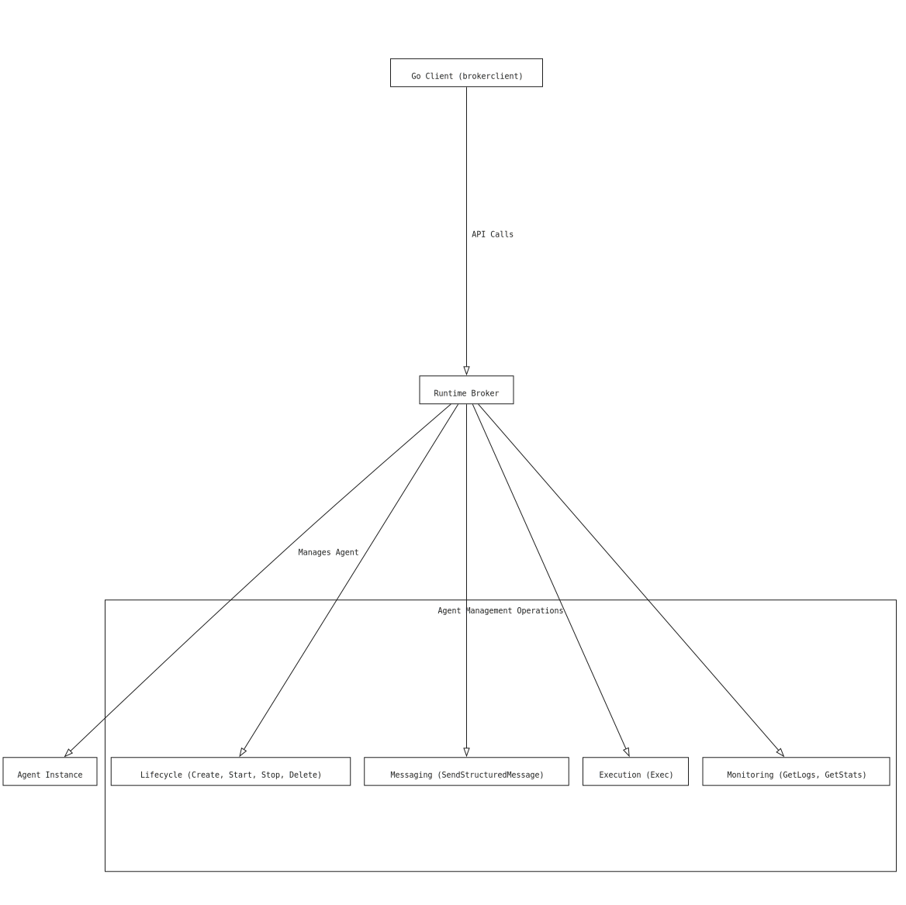

The Go client for the Fabric Runtime Broker API facilitates programmatic interaction with the Runtime Broker, primarily for managing agents. This client allows for comprehensive control over agent instances, abstracting the underlying HTTP communication and providing a straightforward interface for various operations.

The client is initialized with a base URL for the broker and can be configured with options such as bearer token authentication, broker-specific tokens, custom HTTP clients, timeouts, and retry mechanisms. It also supports automatic resolution of development tokens from environment variables or local files.

The core functionality of the Runtime Broker API client revolves around agent management. It provides methods for:

- **Agent Lifecycle Management**: Creating, listing, retrieving details, starting, stopping, restarting, and deleting agent instances.
- **Messaging**: Sending both plain text and structured messages to agents, enabling communication and command execution within the Fabric ecosystem.
- **Command Execution**: Executing arbitrary commands directly within an agent's container, which is critical for dynamic interactions and troubleshooting.
- **Monitoring**: Retrieving logs and resource statistics for agents, offering insights into their operational status and performance.

These operations are managed through an [`AgentService`](https://github.com/pdlc-os/fabric/blob/b11448f8f01fdcf12deab96204417d87f8d46ab3/pkg/hubclient/agents.go#L34) interface, which encapsulates the details of constructing API requests and parsing responses. For instance, [`ListAgentsOptions`](https://github.com/pdlc-os/fabric/blob/b11448f8f01fdcf12deab96204417d87f8d46ab3/pkg/hubclient/agents.go#L127) allows filtering and pagination when listing agents, while [`DeleteAgentOptions`](https://github.com/pdlc-os/fabric/blob/b11448f8f01fdcf12deab96204417d87f8d46ab3/pkg/hubclient/agents.go#L275) provides granular control over file and branch removal during agent deletion. The client also offers direct methods for retrieving broker-level information and health checks, which are essential for understanding the broker's status and capabilities.

The design emphasizes flexibility through functional options for configuration and separation of concerns, with agent-specific actions delegated to the [`AgentService`](https://github.com/pdlc-os/fabric/blob/b11448f8f01fdcf12deab96204417d87f8d46ab3/pkg/hubclient/agents.go#L34). This allows for a modular and extensible approach to interacting with the Runtime Broker API.

### Event Bus for Real-time Messaging

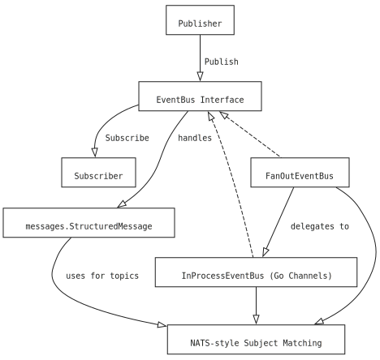

The Fabric platform utilizes an [`EventBus`](https://github.com/pdlc-os/fabric/blob/b11448f8f01fdcf12deab96204417d87f8d46ab3/pkg/eventbus/eventbus.go#L40) abstraction to facilitate real-time publish/subscribe messaging among its various components. This system, inspired by NATS-style subject matching, routes structured messages, abstracting the underlying communication mechanism.

The core [`EventBus`](https://github.com/pdlc-os/fabric/blob/b11448f8f01fdcf12deab96204417d87f8d46ab3/pkg/eventbus/eventbus.go#L40) interface, defined in [`pkg/eventbus/eventbus.go`](https://github.com/pdlc-os/fabric/blob/b11448f8f01fdcf12deab96204417d87f8d46ab3/pkg/eventbus/eventbus.go), provides methods for [`Publish`](https://github.com/pdlc-os/fabric/blob/b11448f8f01fdcf12deab96204417d87f8d46ab3/pkg/plugin/config.go#L136)ing a message to a specific topic, [`Subscribe`](https://github.com/pdlc-os/fabric/blob/b11448f8f01fdcf12deab96204417d87f8d46ab3/pkg/hub/events.go#L52)ing to topics using wildcard patterns, and [`Close`](https://github.com/pdlc-os/fabric/blob/b11448f8f01fdcf12deab96204417d87f8d46ab3/pkg/hub/events.go#L54)ing the bus to release resources. Message handlers receive the structured message along with the context and the topic it arrived on. Standardized topic naming conventions are used for agent-specific messages, project-wide broadcasts, and global broadcasts, ensuring consistent addressing across the system.

Two primary implementations of the [`EventBus`](https://github.com/pdlc-os/fabric/blob/b11448f8f01fdcf12deab96204417d87f8d46ab3/pkg/eventbus/eventbus.go#L40) are provided:

- **In-Process Event Bus**: Implemented in [`pkg/eventbus/inprocess.go`](https://github.com/pdlc-os/fabric/blob/b11448f8f01fdcf12deab96204417d87f8d46ab3/pkg/eventbus/inprocess.go), this version offers an efficient, low-latency messaging solution for single-node deployments. It uses Go channels for message delivery and manages concurrency with read-write mutexes. Publishers operate non-blockingly, with messages potentially dropped if a subscriber's buffer is full, prioritizing throughput. Each subscriber handler runs in its own goroutine, preventing slow consumers from impacting overall performance. Graceful shutdown mechanisms ensure that all active subscriber goroutines terminate cleanly when the bus is closed.
- **Fan-Out Event Bus**: The [`FanOutEventBus`](https://github.com/pdlc-os/fabric/blob/b11448f8f01fdcf12deab96204417d87f8d46ab3/pkg/eventbus/fanout.go#L46), found in [`pkg/eventbus/fanout.go`](https://github.com/pdlc-os/fabric/blob/b11448f8f01fdcf12deab96204417d87f8d46ab3/pkg/eventbus/fanout.go), acts as a composite event bus. It delegates operations to multiple underlying [`EventBus`](https://github.com/pdlc-os/fabric/blob/b11448f8f01fdcf12deab96204417d87f8d46ab3/pkg/eventbus/eventbus.go#L40) instances, allowing messages to be distributed concurrently to several different bus implementations. This is useful for scenarios where messages need to be sent to both an in-process bus and potentially an external messaging system. It supports routing messages to specific child buses using a channel ID within the message or broadcasting to all configured buses. Errors from "observer" buses (configured for fire-and-forget publishing) are logged but do not block the publisher, while errors from critical buses are returned.

The [`EventBus`](https://github.com/pdlc-os/fabric/blob/b11448f8f01fdcf12deab96204417d87f8d46ab3/pkg/eventbus/eventbus.go#L40) facilitates loose coupling between Fabric components, allowing for flexible and scalable communication patterns essential for orchestrating concurrent LLM-based agents. Further details on core data structures, including [`messages.StructuredMessage`](https://github.com/pdlc-os/fabric/blob/b11448f8f01fdcf12deab96204417d87f8d46ab3/cmd/message.go#L373), can be found in [Fabric API Definitions and Core Data Structures](#fabric-agent-orchestration-and-management-fabric-api-definitions-and-core-data-structures).

### Secure Credential and Daemon Management

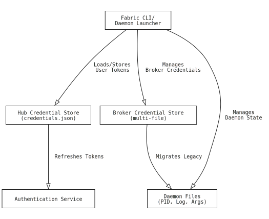

The Fabric platform incorporates mechanisms for managing authentication credentials for Fabric Hub instances and for controlling background daemon processes. These systems are designed to handle sensitive information securely and ensure the reliable operation of various Fabric components.

Authentication credentials, consisting of access and refresh tokens, are stored persistently in a [`credentials.json`](https://github.com/pdlc-os/fabric/blob/b11448f8f01fdcf12deab96204417d87f8d46ab3/pkg/api/types.go#L507) file. This credential store supports multiple Fabric Hub URLs, allowing users to authenticate with different environments. A key feature of this system is its automatic token refresh mechanism, which attempts to retrieve a new access token using a refresh token when the current access token is nearing expiration. This helps maintain continuous authenticated sessions without requiring repeated manual logins. Operations such as storing, loading, and removing credentials are provided, with appropriate file permissions ([`0600`](https://github.com/pdlc-os/fabric/blob/b11448f8f01fdcf12deab96204417d87f8d46ab3/pkg/agent/run.go#L691)) to protect sensitive data. The system also includes utilities for testing credential management by allowing temporary overrides of the credential file path.

For broker-specific authentication, the platform provides distinct [`BrokerCredentials`](https://github.com/pdlc-os/fabric/blob/b11448f8f01fdcf12deab96204417d87f8d46ab3/pkg/brokercredentials/store.go#L59) management. This system supports both a legacy single-file format and a more flexible multi-file system, where each hub connection's credentials are stored in a separate JSON file within a dedicated directory. This multi-file approach facilitates managing distinct configurations for various hub connections. The [`MultiStore`](https://github.com/pdlc-os/fabric/blob/b11448f8f01fdcf12deab96204417d87f8d46ab3/pkg/brokercredentials/multistore.go#L52) implementation provides CRUD operations for these credentials and includes a migration utility to transition from the single-file legacy format. It also enforces naming conventions for hub connections and limits the number of "dev-auth" credentials to prevent misconfigurations. Thread-safe access to credential files is ensured through the use of read-write mutexes.

In addition to credential management, the platform offers utilities for controlling background daemon processes. These daemons are long-running processes essential for various Fabric functionalities. The daemon management system enables starting, stopping, and checking the status of these processes. It handles the persistence of operational data, such as Process IDs (PIDs) and command-line arguments, in dedicated files. Log outputs from daemons are redirected to component-specific log files for monitoring and debugging. Furthermore, the system includes tools for managing network port usage. These tools can detect occupied ports, identify the processes listening on specific ports, and, if necessary, gracefully or forcefully terminate processes that are holding required ports. This ensures that Fabric components can consistently acquire and release network resources.

### Database Operations with Ent ORM

The [`ent`](https://github.com/pdlc-os/fabric/blob/b11448f8f01fdcf12deab96204417d87f8d46ab3/pkg/ent/tx.go#L1) ORM-generated code in [`pkg/ent`](https://github.com/pdlc-os/fabric/blob/b11448f8f01fdcf12deab96204417d87f8d46ab3/pkg/ent) provides a robust and type-safe layer for interacting with the database, abstracting SQL details into Go objects and methods. This framework is central to managing key entities such as [`AccessPolicy`](https://github.com/pdlc-os/fabric/blob/b11448f8f01fdcf12deab96204417d87f8d46ab3/pkg/ent/schema/policy.go#L29), [`Agent`](https://github.com/pdlc-os/fabric/blob/b11448f8f01fdcf12deab96204417d87f8d46ab3/pkg/store/models.go#L28), [`AllowListEntry`](https://github.com/pdlc-os/fabric/blob/b11448f8f01fdcf12deab96204417d87f8d46ab3/pkg/store/models.go#L710), [`ApiKey`](https://github.com/pdlc-os/fabric/blob/b11448f8f01fdcf12deab96204417d87f8d46ab3/pkg/ent/schema/apikey.go#L34), and [`BrokerDispatch`](https://github.com/pdlc-os/fabric/blob/b11448f8f01fdcf12deab96204417d87f8d46ab3/pkg/store/models.go#L825).

For each entity, [`ent`](https://github.com/pdlc-os/fabric/blob/b11448f8f01fdcf12deab96204417d87f8d46ab3/pkg/ent/tx.go#L1) generates a comprehensive set of functionalities:

- **Schema Definitions:** Files like [`pkg/ent/accesspolicy/accesspolicy.go`](https://github.com/pdlc-os/fabric/blob/b11448f8f01fdcf12deab96204417d87f8d46ab3/pkg/ent/accesspolicy/accesspolicy.go) define the structure of each entity, including fields, their types, validation rules, and default values. This ensures data integrity and consistency at the application level. Enumerated types, such as [`ScopeType`](https://github.com/pdlc-os/fabric/blob/b11448f8f01fdcf12deab96204417d87f8d46ab3/pkg/store/store.go#L808) and [`Effect`](https://github.com/pdlc-os/fabric/blob/b11448f8f01fdcf12deab96204417d87f8d46ab3/pkg/api/types.go#L333) for [`AccessPolicy`](https://github.com/pdlc-os/fabric/blob/b11448f8f01fdcf12deab96204417d87f8d46ab3/pkg/ent/schema/policy.go#L29), are also defined here.
- **Query Capabilities:** The generated code provides a fluent API for constructing and executing complex database queries. For instance, [`AccessPolicyQuery`](https://github.com/pdlc-os/fabric/blob/b11448f8f01fdcf12deab96204417d87f8d46ab3/pkg/ent/accesspolicy_query.go#L23) in [`pkg/ent/accesspolicy_query.go`](https://github.com/pdlc-os/fabric/blob/b11448f8f01fdcf12deab96204417d87f8d46ab3/pkg/ent/accesspolicy_query.go) allows filtering ([`Where`](https://github.com/pdlc-os/fabric/blob/b11448f8f01fdcf12deab96204417d87f8d46ab3/pkg/ent/mutation.go#L979)), ordering ([`Order`](https://github.com/pdlc-os/fabric/blob/b11448f8f01fdcf12deab96204417d87f8d46ab3/pkg/ent/user_query.go#L66)), pagination ([`Limit`](https://github.com/pdlc-os/fabric/blob/b11448f8f01fdcf12deab96204417d87f8d46ab3/pkg/store/models.go#L1018), [`Offset`](https://github.com/pdlc-os/fabric/blob/b11448f8f01fdcf12deab96204417d87f8d46ab3/pkg/ent/user_query.go#L53)), and fetching related entities ([`WithBindings`](https://github.com/pdlc-os/fabric/blob/b11448f8f01fdcf12deab96204417d87f8d46ab3/pkg/ent/accesspolicy_query.go#L290) for [`AccessPolicy`](https://github.com/pdlc-os/fabric/blob/b11448f8f01fdcf12deab96204417d87f8d46ab3/pkg/ent/schema/policy.go#L29)). Predicates, generated by files like [`pkg/ent/accesspolicy/where.go`](https://github.com/pdlc-os/fabric/blob/b11448f8f01fdcf12deab96204417d87f8d46ab3/pkg/ent/accesspolicy/where.go), enable granular filtering based on field values and logical operators.
- **CRUD Operations:** The [`ent`](https://github.com/pdlc-os/fabric/blob/b11448f8f01fdcf12deab96204417d87f8d46ab3/pkg/ent/tx.go#L1) framework provides builders for creating, reading, updating, and deleting entities.

  - **Create:** [`AccessPolicyCreate`](https://github.com/pdlc-os/fabric/blob/b11448f8f01fdcf12deab96204417d87f8d46ab3/pkg/ent/accesspolicy_create.go#L22) in [`pkg/ent/accesspolicy_create.go`](https://github.com/pdlc-os/fabric/blob/b11448f8f01fdcf12deab96204417d87f8d46ab3/pkg/ent/accesspolicy_create.go) facilitates the creation of new [`AccessPolicy`](https://github.com/pdlc-os/fabric/blob/b11448f8f01fdcf12deab96204417d87f8d46ab3/pkg/ent/schema/policy.go#L29) records, supporting single and bulk insertions, as well as upsert operations (insert or update on conflict).
  - **Read:** Queries retrieve entities, often returning them as Go structs like the [`AccessPolicy`](https://github.com/pdlc-os/fabric/blob/b11448f8f01fdcf12deab96204417d87f8d46ab3/pkg/ent/schema/policy.go#L29) struct defined in [`pkg/ent/accesspolicy.go`](https://github.com/pdlc-os/fabric/blob/b11448f8f01fdcf12deab96204417d87f8d46ab3/pkg/ent/accesspolicy.go).
  - **Update:** [`AccessPolicyUpdate`](https://github.com/pdlc-os/fabric/blob/b11448f8f01fdcf12deab96204417d87f8d46ab3/pkg/ent/accesspolicy_update.go#L23) and [`AccessPolicyUpdateOne`](https://github.com/pdlc-os/fabric/blob/b11448f8f01fdcf12deab96204417d87f8d46ab3/pkg/ent/accesspolicy_update.go#L498) allow for modifying existing records, including individual fields and relationships.
  - **Delete:** [`AccessPolicyDelete`](https://github.com/pdlc-os/fabric/blob/b11448f8f01fdcf12deab96204417d87f8d46ab3/pkg/ent/accesspolicy_delete.go#L16) in [`pkg/ent/accesspolicy_delete.go`](https://github.com/pdlc-os/fabric/blob/b11448f8f01fdcf12deab96204417d87f8d46ab3/pkg/ent/accesspolicy_delete.go) enables the removal of entities based on specified criteria.
- **Relationships:** The [`ent`](https://github.com/pdlc-os/fabric/blob/b11448f8f01fdcf12deab96204417d87f8d46ab3/pkg/ent/tx.go#L1) ORM handles relationships between entities, such as the [`Bindings`](https://github.com/pdlc-os/fabric/blob/b11448f8f01fdcf12deab96204417d87f8d46ab3/pkg/hub/handlers_policies.go#L71) edge for [`AccessPolicy`](https://github.com/pdlc-os/fabric/blob/b11448f8f01fdcf12deab96204417d87f8d46ab3/pkg/ent/schema/policy.go#L29) entities. This allows for querying related data efficiently and managing these connections during create and update operations.

The use of [`ent`](https://github.com/pdlc-os/fabric/blob/b11448f8f01fdcf12deab96204417d87f8d46ab3/pkg/ent/tx.go#L1) ensures that database interactions are type-safe, reducing common errors associated with raw SQL, and promotes a consistent approach to data persistence across the Fabric platform. For more details on the overarching agent management framework, refer to [Fabric Agent Orchestration and Management](#fabric-agent-orchestration-and-management).

### Fabric API Definitions and Core Data Structures

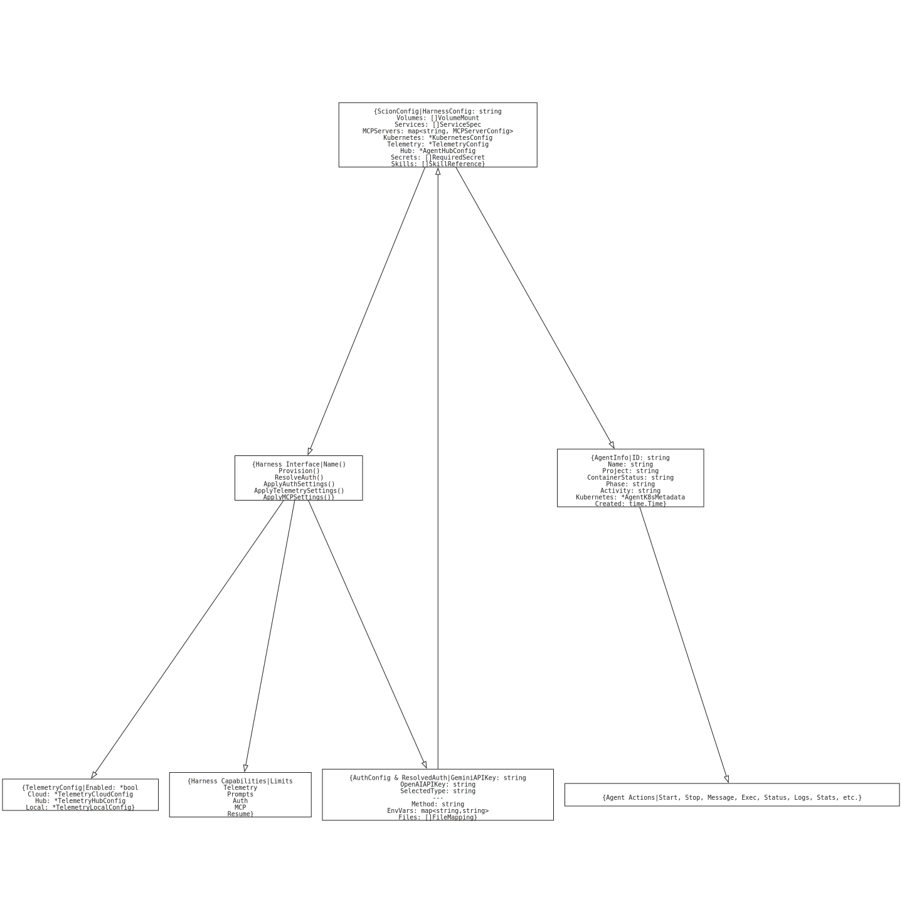

The Fabric platform defines a comprehensive set of API data structures and interfaces for managing autonomous agents, their configurations, and their interactions. This includes configuration types, agent actions, authentication mechanisms, and telemetry, along with utilities for skill URI parsing and slug generation.

The core configuration for a Fabric agent is managed through the [`FabricConfig`](https://github.com/pdlc-os/fabric/blob/b11448f8f01fdcf12deab96204417d87f8d46ab3/pkg/api/types.go#L437) structure defined in [`pkg/api/types.go`](https://github.com/pdlc-os/fabric/blob/b11448f8f01fdcf12deab96204417d87f8d46ab3/pkg/api/types.go). This structure encapsulates various aspects of an agent's operational environment, such as the [`Harness`](https://github.com/pdlc-os/fabric/blob/b11448f8f01fdcf12deab96204417d87f8d46ab3/pkg/api/harness.go#L23) type (which dictates the execution environment), environment variables ([`Env`](https://github.com/pdlc-os/fabric/blob/b11448f8f01fdcf12deab96204417d87f8d46ab3/cmd/build.go#L162)), [`VolumeMount`](https://github.com/pdlc-os/fabric/blob/b11448f8f01fdcf12deab96204417d87f8d46ab3/pkg/api/types.go#L248)s for persistent storage, [`KubernetesConfig`](https://github.com/pdlc-os/fabric/blob/b11448f8f01fdcf12deab96204417d87f8d46ab3/pkg/api/types.go#L314) for orchestrating agents within Kubernetes clusters, and resource specifications ([`ResourceSpec`](https://github.com/pdlc-os/fabric/blob/b11448f8f01fdcf12deab96204417d87f8d46ab3/pkg/api/types.go#L343)). It also includes [`ServiceSpec`](https://github.com/pdlc-os/fabric/blob/b11448f8f01fdcf12deab96204417d87f8d46ab3/pkg/api/types.go#L38)s for defining sidecar processes that run alongside the main agent, [`MCPServerConfig`](https://github.com/pdlc-os/fabric/blob/b11448f8f01fdcf12deab96204417d87f8d46ab3/pkg/api/types.go#L76)s for Micro-Control Plane server configurations, and [`TelemetryConfig`](https://github.com/pdlc-os/fabric/blob/b11448f8f01fdcf12deab96204417d87f8d46ab3/pkg/api/types.go#L364) for managing observability data. Required secrets for agent startup are declared using [`RequiredSecret`](https://github.com/pdlc-os/fabric/blob/b11448f8f01fdcf12deab96204417d87f8d46ab3/pkg/api/types.go#L664).

The behavior of an agent is guided by the [`Harness`](https://github.com/pdlc-os/fabric/blob/b11448f8f01fdcf12deab96204417d87f8d46ab3/pkg/api/harness.go#L23) interface, specified in [`pkg/api/harness.go`](https://github.com/pdlc-os/fabric/blob/b11448f8f01fdcf12deab96204417d87f8d46ab3/pkg/api/harness.go). This interface sets the contract for different agent execution environments, detailing how they provide configurations, set up environments, provision resources, and handle interactions. Implementations of this interface define methods for actions such as [`Provision`](https://github.com/pdlc-os/fabric/blob/b11448f8f01fdcf12deab96204417d87f8d46ab3/pkg/api/harness.go#L36) (for setting up the agent's environment), [`GetEnv`](https://github.com/pdlc-os/fabric/blob/b11448f8f01fdcf12deab96204417d87f8d46ab3/pkg/api/harness.go#L26) (for retrieving environment variables), and [`GetCommand`](https://github.com/pdlc-os/fabric/blob/b11448f8f01fdcf12deab96204417d87f8d46ab3/pkg/api/harness.go#L27) (for constructing the command to execute a task). Optional interfaces like [`AuthSettingsApplier`](https://github.com/pdlc-os/fabric/blob/b11448f8f01fdcf12deab96204417d87f8d46ab3/pkg/api/harness.go#L70), [`TelemetrySettingsApplier`](https://github.com/pdlc-os/fabric/blob/b11448f8f01fdcf12deab96204417d87f8d46ab3/pkg/api/harness.go#L77), and [`MCPSettingsApplier`](https://github.com/pdlc-os/fabric/blob/b11448f8f01fdcf12deab96204417d87f8d46ab3/pkg/api/harness.go#L87) allow harnesses to integrate authentication, telemetry, and MCP configurations directly into their native settings. The capabilities of these harnesses, including support for various features like run limits, system prompts, authentication types, and MCP transports, are declaratively described using structures like [`HarnessAdvancedCapabilities`](https://github.com/pdlc-os/fabric/blob/b11448f8f01fdcf12deab96204417d87f8d46ab3/pkg/api/harness_capabilities.go#L72) in [`pkg/api/harness_capabilities.go`](https://github.com/pdlc-os/fabric/blob/b11448f8f01fdcf12deab96204417d87f8d46ab3/pkg/api/harness_capabilities.go). Declarative authentication preflight metadata for harnesses is also defined, detailing environmental and file requirements for different authentication types in [`pkg/api/harness_auth_metadata.go`](https://github.com/pdlc-os/fabric/blob/b11448f8f01fdcf12deab96204417d87f8d46ab3/pkg/api/harness_auth_metadata.go).

Agent interactions are standardized through defined constants in [`pkg/api/agent_actions.go`](https://github.com/pdlc-os/fabric/blob/b11448f8f01fdcf12deab96204417d87f8d46ab3/pkg/api/agent_actions.go). These constants represent a range of actions an agent can perform or respond to, including [`AgentActionStatus`](https://github.com/pdlc-os/fabric/blob/b11448f8f01fdcf12deab96204417d87f8d46ab3/pkg/api/agent_actions.go#L20), [`AgentActionStart`](https://github.com/pdlc-os/fabric/blob/b11448f8f01fdcf12deab96204417d87f8d46ab3/pkg/api/agent_actions.go#L21), [`AgentActionStop`](https://github.com/pdlc-os/fabric/blob/b11448f8f01fdcf12deab96204417d87f8d46ab3/pkg/api/agent_actions.go#L22), [`AgentActionMessage`](https://github.com/pdlc-os/fabric/blob/b11448f8f01fdcf12deab96204417d87f8d46ab3/pkg/api/agent_actions.go#L25), and [`AgentActionExec`](https://github.com/pdlc-os/fabric/blob/b11448f8f01fdcf12deab96204417d87f8d46ab3/pkg/api/agent_actions.go#L28). A utility function, [`RuntimeBrokerAgentActionMethod`](https://github.com/pdlc-os/fabric/blob/b11448f8f01fdcf12deab96204417d87f8d46ab3/pkg/api/agent_actions.go#L46), maps these actions to specific HTTP methods for routing through a runtime broker.

Authentication credentials and configurations are centralized in the [`AuthConfig`](https://github.com/pdlc-os/fabric/blob/b11448f8f01fdcf12deab96204417d87f8d46ab3/pkg/hub/auth.go#L31) and [`ResolvedAuth`](https://github.com/pdlc-os/fabric/blob/b11448f8f01fdcf12deab96204417d87f8d46ab3/harnesses/fabric_harness.py#L315) structures within [`pkg/api/types.go`](https://github.com/pdlc-os/fabric/blob/b11448f8f01fdcf12deab96204417d87f8d46ab3/pkg/api/types.go). These structures manage the chosen authentication method, environment variables, and file mappings required for secure credential injection into agent containers.

Telemetry settings are configured via [`TelemetryConfig`](https://github.com/pdlc-os/fabric/blob/b11448f8f01fdcf12deab96204417d87f8d46ab3/pkg/api/types.go#L364) in [`pkg/api/types.go`](https://github.com/pdlc-os/fabric/blob/b11448f8f01fdcf12deab96204417d87f8d46ab3/pkg/api/types.go), enabling the management of observability data, including cloud, hub, and local configurations, filtering options, and resource attributes.

Utilities for skill URI parsing are managed by the [`SkillURI`](https://github.com/pdlc-os/fabric/blob/b11448f8f01fdcf12deab96204417d87f8d46ab3/pkg/api/skill_uri.go#L24) struct and associated functions in [`pkg/api/skill_uri.go`](https://github.com/pdlc-os/fabric/blob/b11448f8f01fdcf12deab96204417d87f8d46ab3/pkg/api/skill_uri.go). These functions, such as [`ParseSkillURI`](https://github.com/pdlc-os/fabric/blob/b11448f8f01fdcf12deab96204417d87f8d46ab3/pkg/api/skill_uri.go#L78), enable the parsing of various URI formats into structured components, facilitating the resolution and fetching of agent skills. [Skill Resolution Mechanisms](#fabric-agent-orchestration-and-management-skill-resolution-mechanisms) provides further details on how skills are resolved.

URL-safe slugs and unique identifiers are generated and managed using utilities found in [`pkg/api/slug.go`](https://github.com/pdlc-os/fabric/blob/b11448f8f01fdcf12deab96204417d87f8d46ab3/pkg/api/slug.go). Functions like [`Slugify`](https://github.com/pdlc-os/fabric/blob/b11448f8f01fdcf12deab96204417d87f8d46ab3/pkg/api/slug.go#L45) convert strings into URL-safe, lowercase forms, while [`MakeProjectID`](https://github.com/pdlc-os/fabric/blob/b11448f8f01fdcf12deab96204417d87f8d46ab3/pkg/api/slug.go#L138) constructs hosted-format project IDs. These utilities ensure consistent naming conventions and identifier management across the platform.

The [`ResolveContent`](https://github.com/pdlc-os/fabric/blob/b11448f8f01fdcf12deab96204417d87f8d46ab3/pkg/api/content.go#L32) function in [`pkg/api/content.go`](https://github.com/pdlc-os/fabric/blob/b11448f8f01fdcf12deab96204417d87f8d46ab3/pkg/api/content.go) provides a mechanism for interpreting content strings, allowing them to be either inline text or [`file://`](https://github.com/pdlc-os/fabric/blob/b11448f8f01fdcf12deab96204417d87f8d46ab3/cmd/common.go#L115) URIs that reference local or relative file paths. This supports flexible content loading for agent configurations and instructions.

### Harness Abstraction and Provisioning

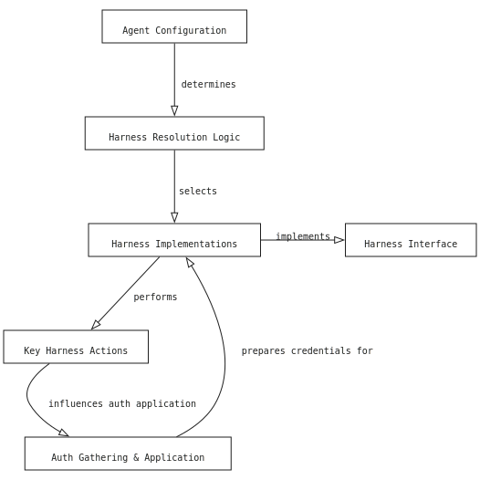

Harnesses in Fabric abstract the execution environments for agents, defining how an agent is provisioned, its commands are constructed, and its configuration is loaded. The [`pkg/harness`](https://github.com/pdlc-os/fabric/blob/b11448f8f01fdcf12deab96204417d87f8d46ab3/pkg/harness) directory implements the core logic for managing these harnesses, centralizing authentication, configuration parsing, and environment setup.

The [`Harness`](https://github.com/pdlc-os/fabric/blob/b11448f8f01fdcf12deab96204417d87f8d46ab3/pkg/api/harness.go#L23) interface is central to achieving LLM agnosticism, allowing agents to operate across different underlying Large Language Models and execution contexts. Fabric supports various harness types, primarily determined by the [`Resolve`](https://github.com/pdlc-os/fabric/blob/b11448f8f01fdcf12deab96204417d87f8d46ab3/pkg/secret/secret.go#L131) function in [`pkg/harness`](https://github.com/pdlc-os/fabric/blob/b11448f8f01fdcf12deab96204417d87f8d46ab3/pkg/harness).

- **Container-Script Harnesses** ([`ContainerScriptHarness`](https://github.com/pdlc-os/fabric/blob/b11448f8f01fdcf12deab96204417d87f8d46ab3/pkg/harness/container_script_harness.go#L41)) are used when a [`provisioner`](https://github.com/pdlc-os/fabric/blob/b11448f8f01fdcf12deab96204417d87f8d46ab3/pkg/config/settings_v1.go#L741) block is present in the agent's configuration. These harnesses manage the staging of configuration files and Python scripts, such as [`provision.py`](https://github.com/pdlc-os/fabric/blob/b11448f8f01fdcf12deab96204417d87f8d46ab3/harnesses/README.md?plain=1#L91) and [`fabric_harness.py`](https://github.com/pdlc-os/fabric/blob/b11448f8f01fdcf12deab96204417d87f8d46ab3/harnesses/README.md?plain=1#L130), into an agent's home directory. This process sets up a [`pre-start`](https://github.com/pdlc-os/fabric/blob/b11448f8f01fdcf12deab96204417d87f8d46ab3/cmd/common.go#L581) hook that invokes [`fabrictool harness provision`](https://github.com/pdlc-os/fabric/blob/b11448f8f01fdcf12deab96204417d87f8d46ab3/GLOSSARY.md?plain=1#L10) inside the agent's container.
- **Declarative Generic Harnesses** are utilized when no custom [`provisioner`](https://github.com/pdlc-os/fabric/blob/b11448f8f01fdcf12deab96204417d87f8d46ab3/pkg/config/settings_v1.go#L741) is defined but the agent's configuration includes declarative settings like [`Command`](https://github.com/pdlc-os/fabric/blob/b11448f8f01fdcf12deab96204417d87f8d46ab3/cmd/output.go#L58), [`Capabilities`](https://github.com/pdlc-os/fabric/blob/b11448f8f01fdcf12deab96204417d87f8d46ab3/pkg/store/models.go#L354), or [`EnvTemplate`](https://github.com/pdlc-os/fabric/blob/b11448f8f01fdcf12deab96204417d87f8d46ab3/pkg/config/settings_v1.go#L749). This allows for defining harness behavior purely through configuration files without custom code.
- A **Generic Harness** serves as a baseline implementation, providing default capabilities, environment variables, and command generation when more specific configurations are absent.

A key aspect of harness management is authentication. The system gathers authentication configuration ([`api.AuthConfig`](https://github.com/pdlc-os/fabric/blob/b11448f8f01fdcf12deab96204417d87f8d46ab3/pkg/agent/run.go#L443)) from diverse sources, including environment variables, well-known file paths (e.g., [`application_default_credentials.json`](https://github.com/pdlc-os/fabric/blob/b11448f8f01fdcf12deab96204417d87f8d46ab3/pkg/agent/run.go#L1270)), and resolved secrets provided by the Fabric Hub. Functions like [`GatherAuth`](https://github.com/pdlc-os/fabric/blob/b11448f8f01fdcf12deab96204417d87f8d46ab3/pkg/harness/auth.go#L33) in [`pkg/harness/auth.go`](https://github.com/pdlc-os/fabric/blob/b11448f8f01fdcf12deab96204417d87f8d46ab3/pkg/harness/auth.go) are responsible for collecting these details, with [`GatherAuthWithEnv`](https://github.com/pdlc-os/fabric/blob/b11448f8f01fdcf12deab96204417d87f8d46ab3/pkg/harness/auth.go#L50) prioritizing values from an [`env`](https://github.com/pdlc-os/fabric/blob/b11448f8f01fdcf12deab96204417d87f8d46ab3/cmd/build.go#L162) map. The system can automatically detect the most suitable authentication type (e.g., "api-key", "auth-file", "vertex-ai") based on the available credentials and configuration, and it validates the integrity of the resolved authentication configuration before use. Config-driven authentication metadata, specified in [`config.HarnessAuthMetadata`](https://github.com/pdlc-os/fabric/blob/b11448f8f01fdcf12deab96204417d87f8d46ab3/pkg/agent/run.go#L219), allows for dynamic definition of required environment variables and file secrets. For more details on the design of this system, refer to [Authentication and Security Design](#design-specifications-and-architecture-authentication-and-security-design).

Harnesses also manage the generation of environment variables and command-line arguments for agent execution. They support templating for environment variables, allowing for dynamic values such as agent names. Furthermore, harnesses facilitate the injection of agent instructions and system prompts into specific files within the agent's home directory, ensuring consistent operational guidelines. Multi-Channel Proxy (MCP) server configurations and telemetry settings are also staged by the harnesses.

The [`fabric_harness.py`](https://github.com/pdlc-os/fabric/blob/b11448f8f01fdcf12deab96204417d87f8d46ab3/harnesses/README.md?plain=1#L130) helper script is fundamental for Python-based harnesses, standardizing authentication, instruction projection, MCP server configuration, and file operations. This script's content is embedded and written to the agent's environment during provisioning, either by vendoring or injection, depending on the [`provisioner.lib`](https://github.com/pdlc-os/fabric/blob/b11448f8f01fdcf12deab96204417d87f8d46ab3/harnesses/README.md?plain=1#L143) mode. For CLI operations related to harness configuration, see [Harness Configuration Management and Synchronization](#command-line-interface-cli-operations-harness-configuration-management-and-synchronization).

### Local Agent Cache for Shell Completion

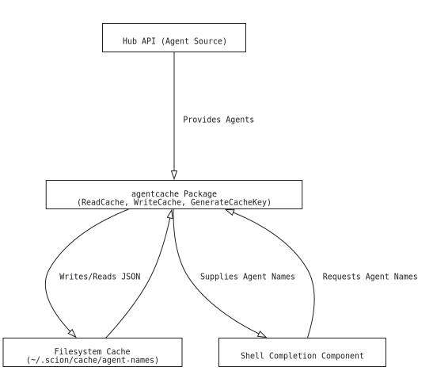

A local, filesystem-based cache enhances the responsiveness and reliability of shell completion for agent names. This cache, managed by the [`pkg/agentcache`](https://github.com/pdlc-os/fabric/blob/b11448f8f01fdcf12deab96204417d87f8d46ab3/pkg/agentcache) directory, stores lists of agent names associated with specific projects. By retrieving agent names from a local cache rather than repeatedly querying the Hub API, shell completion operates more quickly, especially in scenarios where the Hub API might be slow or temporarily unavailable.

The cache uses [`CacheEntry`](https://github.com/pdlc-os/fabric/blob/b11448f8f01fdcf12deab96204417d87f8d46ab3/pkg/agentcache/cache.go#L35) structs to store agent names and their last update times, which are then marshaled to and from JSON for persistent storage. A unique cache key, generated from the project path using a SHA256 hash, ensures that each project's agent list is stored in a distinct, filesystem-safe file. This allows for efficient retrieval and prevents naming conflicts. The system is designed to handle missing or corrupted cache files gracefully, treating them as cache misses without generating errors, thereby prioritizing application robustness. The cache can be completely cleared when necessary to ensure fresh data. This mechanism complements the broader agent management capabilities discussed in [Agent Lifecycle Management and Orchestration](#fabric-agent-orchestration-and-management-agent-lifecycle-management-and-orchestration).

## Command-Line Interface (CLI) Operations

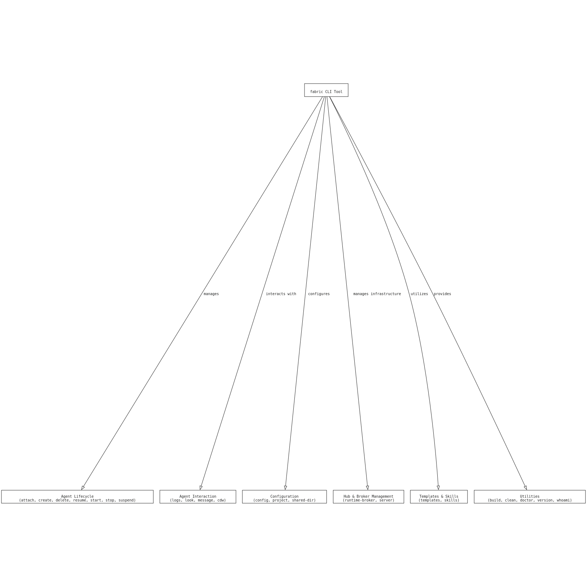

The [`fabric`](https://github.com/pdlc-os/fabric/blob/b11448f8f01fdcf12deab96204417d87f8d46ab3/README.md?plain=1#L1) command-line interface provides the primary means for users and automated systems to interact with FABRIC agents and manage the platform. This CLI tool, defined within [`cmd`](https://github.com/pdlc-os/fabric/blob/b11448f8f01fdcf12deab96204417d87f8d46ab3/cmd), offers functionalities spanning agent lifecycle, configuration management, runtime broker operations, container image building, and workspace navigation. It is structured using the [`spf13/cobra`](https://github.com/pdlc-os/fabric/blob/b11448f8f01fdcf12deab96204417d87f8d46ab3/go.mod#L36) library to provide a consistent and extensible command set, with support for JSON output for programmatic consumption.

A core capability of the [`fabric`](https://github.com/pdlc-os/fabric/blob/b11448f8f01fdcf12deab96204417d87f8d46ab3/README.md?plain=1#L1) CLI is its comprehensive [Agent Lifecycle Management and Orchestration](#fabric-agent-orchestration-and-management-agent-lifecycle-management-and-orchestration). The [`fabric attach`](https://github.com/pdlc-os/fabric/blob/b11448f8f01fdcf12deab96204417d87f8d46ab3/agents.md?plain=1#L1) command, implemented in [`cmd/attach.go`](https://github.com/pdlc-os/fabric/blob/b11448f8f01fdcf12deab96204417d87f8d46ab3/cmd/attach.go), allows users to connect to interactive sessions of running FABRIC agents, whether they are managed locally or by a remote FABRIC Hub. The command employs a dual attachment mechanism to support various deployment scenarios, and includes robust agent discovery. The [`fabric create`](https://github.com/pdlc-os/fabric/blob/b11448f8f01fdcf12deab96204417d87f8d46ab3/README.md?plain=1#L1) command, detailed in [`cmd/create.go`](https://github.com/pdlc-os/fabric/blob/b11448f8f01fdcf12deab96204417d87f8d46ab3/cmd/create.go), provisions new agents, handling template resolution and configuration overrides, while the [`fabric delete`](https://github.com/pdlc-os/fabric/blob/b11448f8f01fdcf12deab96204417d87f8d46ab3/README.md?plain=1#L1) command in [`cmd/delete.go`](https://github.com/pdlc-os/fabric/blob/b11448f8f01fdcf12deab96204417d87f8d46ab3/cmd/delete.go) facilitates agent removal, including cleanup of associated resources. Common agent operations, such as running agents and loading configurations, are supported through shared utilities in [`cmd/common.go`](https://github.com/pdlc-os/fabric/blob/b11448f8f01fdcf12deab96204417d87f8d46ab3/cmd/common.go).

For managing the execution environments of agents, the CLI includes functionality for runtime broker operations. The [`runtime-broker`](https://github.com/pdlc-os/fabric/blob/b11448f8f01fdcf12deab96204417d87f8d46ab3/cmd/hub.go#L2741) command group, primarily defined in [`cmd/broker.go`](https://github.com/pdlc-os/fabric/blob/b11448f8f01fdcf12deab96204417d87f8d46ab3/cmd/broker.go), allows a local machine to function as a runtime broker, executing agents on behalf of a Hub. This includes commands for registering, deregistering, starting, stopping, and restarting the broker daemon, as well as managing project providers and monitoring status. The [`broker_test.go`](https://github.com/pdlc-os/fabric/blob/b11448f8f01fdcf12deab96204417d87f8d46ab3/hack/check-project-compat-literals.sh#L148) file within the same directory contains tests verifying the command's metadata and flag registration.

The [`fabric`](https://github.com/pdlc-os/fabric/blob/b11448f8f01fdcf12deab96204417d87f8d46ab3/README.md?plain=1#L1) CLI also enables the building of container images for agents. The [`fabric build`](https://github.com/pdlc-os/fabric/blob/b11448f8f01fdcf12deab96204417d87f8d46ab3/go.mod#L1) command, found in [`cmd/build.go`](https://github.com/pdlc-os/fabric/blob/b11448f8f01fdcf12deab96204417d87f8d46ab3/cmd/build.go), orchestrates the creation of container images from [`Dockerfile`](https://github.com/pdlc-os/fabric/blob/b11448f8f01fdcf12deab96204417d87f8d46ab3/agents.md?plain=1#L138)s within harness configuration directories. It supports local builds using Docker or Podman, and integrates with Google Cloud Build for more complex or multi-platform builds. After a successful build, it updates the associated harness configuration with the new image reference and can synchronize these changes with a FABRIC Hub.

Navigation and project management are supported by commands like [`fabric cdw`](https://github.com/pdlc-os/fabric/blob/b11448f8f01fdcf12deab96204417d87f8d46ab3/cmd/cdw.go#L24), implemented in [`cmd/cdw.go`](https://github.com/pdlc-os/fabric/blob/b11448f8f01fdcf12deab96204417d87f8d46ab3/cmd/cdw.go). This command helps users quickly change their current directory to an agent's workspace or a Git branch's worktree, then spawns a new interactive shell in that location. For system maintenance, the [`fabric clean`](https://github.com/pdlc-os/fabric/blob/b11448f8f01fdcf12deab96204417d87f8d46ab3/Makefile#L1) command in [`cmd/clean.go`](https://github.com/pdlc-os/fabric/blob/b11448f8f01fdcf12deab96204417d87f8d46ab3/cmd/clean.go) removes FABRIC project configurations, with options to unlink from a Hub if connected.

Configuration management for the [`fabric`](https://github.com/pdlc-os/fabric/blob/b11448f8f01fdcf12deab96204417d87f8d46ab3/README.md?plain=1#L1) CLI is handled by the [`fabric config`](https://github.com/pdlc-os/fabric/blob/b11448f8f01fdcf12deab96204417d87f8d46ab3/agents.md?plain=1#L1) command group in [`cmd/config.go`](https://github.com/pdlc-os/fabric/blob/b11448f8f01fdcf12deab96204417d87f8d46ab3/cmd/config.go). This group allows users to list, set, get, and validate [`fabric`](https://github.com/pdlc-os/fabric/blob/b11448f8f01fdcf12deab96204417d87f8d46ab3/README.md?plain=1#L1) settings, and includes utilities for migrating legacy settings and navigating configuration directories. The [`fabric config schema`](https://github.com/pdlc-os/fabric/blob/b11448f8f01fdcf12deab96204417d87f8d46ab3/cmd/server.go#L25) command, defined in [`cmd/config_schema.go`](https://github.com/pdlc-os/fabric/blob/b11448f8f01fdcf12deab96204417d87f8d46ab3/cmd/config_schema.go), displays the schema for agent configuration files.

Diagnostic capabilities are provided by the [`fabric doctor`](https://github.com/pdlc-os/fabric/blob/b11448f8f01fdcf12deab96204417d87f8d46ab3/cmd/root.go#L12) command in [`cmd/doctor.go`](https://github.com/pdlc-os/fabric/blob/b11448f8f01fdcf12deab96204417d87f8d46ab3/cmd/doctor.go), which verifies system prerequisites and runtime configurations. Advanced CLI features also include explicit CLI operational modes (human, assistant, agent) that restrict command availability, as defined and enforced in [`cmd/cli_mode.go`](https://github.com/pdlc-os/fabric/blob/b11448f8f01fdcf12deab96204417d87f8d46ab3/cmd/cli_mode.go). Shell completion for agent names, fetching suggestions from both local sources and the Hub, is facilitated by functions in [`cmd/completion_helper.go`](https://github.com/pdlc-os/fabric/blob/b11448f8f01fdcf12deab96204417d87f8d46ab3/cmd/completion_helper.go).

### Agent Lifecycle and Management Commands

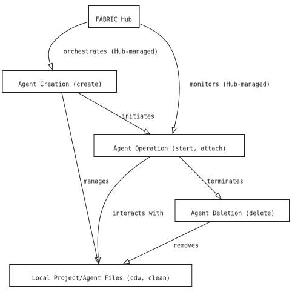

The [`fabric`](https://github.com/pdlc-os/fabric/blob/b11448f8f01fdcf12deab96204417d87f8d46ab3/README.md?plain=1#L1) CLI provides commands for managing FABRIC agents throughout their lifecycle. This includes the ability to create, delete, and interact with agents.

Agent creation is handled by the [`create`](https://github.com/pdlc-os/fabric/blob/b11448f8f01fdcf12deab96204417d87f8d46ab3/pkg/hubclient/agents.go#L42) command, which allows provisioning new FABRIC agents. This can be done for local agents using an agent manager or for remote agents managed by a Fabric Hub. The process involves template resolution, configuration overrides, and integration with skill resolution mechanisms. Agents can be provisioned on disk or through the Hub, and the command facilitates the setup of their initial configuration.

For managing agents that are no longer needed, the [`delete`](https://github.com/pdlc-os/fabric/blob/b11448f8f01fdcf12deab96204417d87f8d46ab3/pkg/storage/gcs.go#L219) command removes FABRIC agents. Users can delete specific agents by name or opt to remove all stopped agents. Deletion operations can target agents managed locally or through the Hub, ensuring that associated containers, files, and Git branches are cleaned up.

Interaction with running agents is facilitated by the [`attach`](https://github.com/pdlc-os/fabric/blob/b11448f8f01fdcf12deab96204417d87f8d46ab3/pkg/hub/server.go#L409) command, which connects to interactive sessions of FABRIC agents. This command supports attaching to local agents via the container runtime and to remote agents managed by a Fabric Hub through a WebSocket connection. The system includes mechanisms to discover agents, whether they are local or Hub-managed, and to provide user-friendly error messages if an agent is not found or is not in a running state. The implementation of [`attach`](https://github.com/pdlc-os/fabric/blob/b11448f8f01fdcf12deab96204417d87f8d46ab3/pkg/hub/server.go#L409) in [`cmd/attach.go`](https://github.com/pdlc-os/fabric/blob/b11448f8f01fdcf12deab96204417d87f8d46ab3/cmd/attach.go) distinguishes between local and Hub-managed agents, ensuring appropriate connection methods are used.

Beyond creation and deletion, other common operational utilities for agents are provided. For example, [`cmd/common.go`](https://github.com/pdlc-os/fabric/blob/b11448f8f01fdcf12deab96204417d87f8d46ab3/cmd/common.go) contains helper functions for starting or resuming agents, parsing labels from command-line arguments, and loading agent configurations.

The [`cdw`](https://github.com/pdlc-os/fabric/blob/b11448f8f01fdcf12deab96204417d87f8d46ab3/cmd/cdw.go#L31) command in [`cmd/cdw.go`](https://github.com/pdlc-os/fabric/blob/b11448f8f01fdcf12deab96204417d87f8d46ab3/cmd/cdw.go) allows users to change their current directory to an agent's workspace or a Git branch's worktree, then spawns a new shell in that directory. This streamlines navigation to project-specific environments.

Additionally, the [`clean`](https://github.com/pdlc-os/fabric/blob/b11448f8f01fdcf12deab96204417d87f8d46ab3/Makefile#L19) command in [`cmd/clean.go`](https://github.com/pdlc-os/fabric/blob/b11448f8f01fdcf12deab96204417d87f8d46ab3/cmd/clean.go) removes [`fabric`](https://github.com/pdlc-os/fabric/blob/b11448f8f01fdcf12deab96204417d87f8d46ab3/README.md?plain=1#L1) project configurations. This involves locating the project directory, checking its link status with a Fabric Hub, offering to unlink from the Hub if connected and reachable, and then removing the local project directory. This effectively reverses the project initialization process.

### Harness Configuration Management and Synchronization

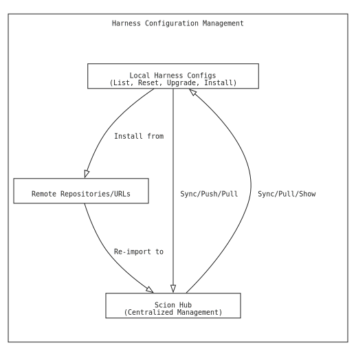

The Fabric platform provides a comprehensive set of command-line operations for managing agent harness configurations, which define how agents are provisioned and interact with their environments. These operations facilitate listing, resetting, upgrading, and synchronizing harness configurations with the Fabric Hub.

Harness configurations can be installed from various sources, including local paths, URLs, or remote repositories. This flexibility allows developers to easily integrate custom harnesses or leverage pre-defined ones. The CLI supports installation to a local directory for individual use or directly to a Hub for shared access across a team. The [`fabric harness-config install`](https://github.com/pdlc-os/fabric/blob/b11448f8f01fdcf12deab96204417d87f8d46ab3/GLOSSARY.md?plain=1#L1) command, implemented by [`harnessConfigInstallCmd`](https://github.com/pdlc-os/fabric/blob/b11448f8f01fdcf12deab96204417d87f8d46ab3/cmd/harness_config_install.go#L29) in [`cmd/harness_config_install.go`](https://github.com/pdlc-os/fabric/blob/b11448f8f01fdcf12deab96204417d87f8d46ab3/cmd/harness_config_install.go), orchestrates this process, with [`resolveInstallSource`](https://github.com/pdlc-os/fabric/blob/b11448f8f01fdcf12deab96204417d87f8d46ab3/cmd/harness_config_install.go#L107) handling the parsing of diverse input types.

Once installed, configurations can be listed to inspect their details, reset to their default states, or upgraded to newer versions. A key aspect of harness management is synchronization with the Fabric Hub. The [`harnessConfigCmd`](https://github.com/pdlc-os/fabric/blob/b11448f8f01fdcf12deab96204417d87f8d46ab3/cmd/harness_config.go#L32) within [`cmd/harness_config.go`](https://github.com/pdlc-os/fabric/blob/b11448f8f01fdcf12deab96204417d87f8d46ab3/cmd/harness_config.go) provides subcommands to [`push`](https://github.com/pdlc-os/fabric/blob/b11448f8f01fdcf12deab96204417d87f8d46ab3/extras/fabric-a2a-bridge/internal/bridge/bridge.go#L58) local configurations to the Hub, [`pull`](https://github.com/pdlc-os/fabric/blob/b11448f8f01fdcf12deab96204417d87f8d46ab3/agents.md?plain=1#L107) configurations from the Hub to the local filesystem, and [`sync`](https://github.com/pdlc-os/fabric/blob/b11448f8f01fdcf12deab96204417d87f8d46ab3/pkg/runtime/mock.go#L101) to perform a bidirectional synchronization. The [`pullHarnessConfigFromHub`](https://github.com/pdlc-os/fabric/blob/b11448f8f01fdcf12deab96204417d87f8d46ab3/cmd/harness_config.go#L752) and [`syncHarnessConfigToHub`](https://github.com/pdlc-os/fabric/blob/b11448f8f01fdcf12deab96204417d87f8d46ab3/cmd/harness_config.go#L535) functions, specifically tested in [`cmd/harness_config_hub_test.go`](https://github.com/pdlc-os/fabric/blob/b11448f8f01fdcf12deab96204417d87f8d46ab3/cmd/harness_config_hub_test.go), ensure robust two-phase downloads with hash verification and reliable updates to local and remote configurations. These mechanisms ensure consistency and facilitate collaboration across development environments.

### Runtime Broker Operations and Daemon Management

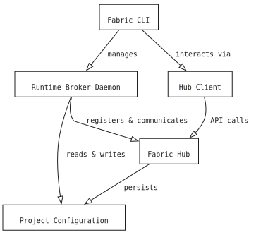

The [`fabric`](https://github.com/pdlc-os/fabric/blob/b11448f8f01fdcf12deab96204417d87f8d46ab3/README.md?plain=1#L1) CLI provides a dedicated set of commands for managing a Runtime Broker, which enables a local machine to execute agents on behalf of a Fabric Hub. These commands cover the entire lifecycle of a Runtime Broker, from initial registration to ongoing management and monitoring.

To begin, a Runtime Broker must be registered with a Fabric Hub. The CLI facilitates this process, establishing a connection between the local broker and the remote Hub. During registration, the broker's identity is recorded with the Hub, and necessary credentials are securely stored locally, often involving a two-phase process for robust authentication. Conversely, a registered Runtime Broker can be deregistered from the Hub, removing its association and cleaning up local credentials. This operation typically includes user confirmation prompts to prevent accidental removal.

The Runtime Broker operates as a daemon, allowing agents to run in the background. The CLI provides commands to start, stop, and restart this daemon process. When starting the broker, it can either run in the foreground for debugging or as a background daemon, leveraging a daemon management utility to ensure it persists across user sessions. The [`restart`](https://github.com/pdlc-os/fabric/blob/b11448f8f01fdcf12deab96204417d87f8d46ab3/pkg/hubclient/agents.go#L60) command combines the stop and start operations, ensuring a clean refresh of the broker service.

Beyond lifecycle management, the CLI also supports configuring the broker's interaction with projects and Hub connections. A Runtime Broker can be designated as a "project provider," meaning it is authorized to execute agents for a specific project on the Hub. This involves registering the broker with the project and, optionally, setting it as the default provider for that project. The corresponding command allows for withdrawing this provider status. The CLI also enables users to list all configured Hub connections the local broker is aware of, providing an overview of its operational context.

For monitoring and diagnostics, a dedicated command provides a comprehensive status report for the Runtime Broker. This report includes the local server's operational status, the daemon's activity, its registration status with the Hub, and its role as a project provider. This functionality can also extend to querying the status of remote brokers directly through the Hub. The CLI ensures that operations are performed within the correct project context, either by inferring it from the current directory or allowing explicit specification via command-line flags. User prompts are integrated into significant operations, such as deregistration or changing default project providers, to ensure intentional actions.

### Advanced CLI Mode Restrictions and Completion

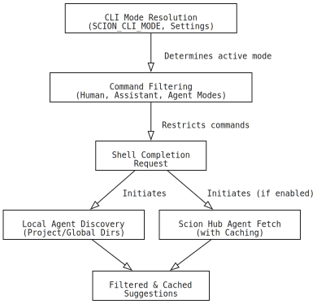

CLI operational modes in Fabric define the behavior and available commands based on the context in which the CLI is executed. Three primary modes exist: [`human`](https://github.com/pdlc-os/fabric/blob/b11448f8f01fdcf12deab96204417d87f8d46ab3/agents.md?plain=1#L15), [`assistant`](https://github.com/pdlc-os/fabric/blob/b11448f8f01fdcf12deab96204417d87f8d46ab3/agents.md?plain=1#L77), and [`agent`](https://github.com/pdlc-os/fabric/blob/b11448f8f01fdcf12deab96204417d87f8d46ab3/pkg/store/models.go#L28). The system resolves the active mode by first checking the [`FABRIC_CLI_MODE`](https://github.com/pdlc-os/fabric/blob/b11448f8f01fdcf12deab96204417d87f8d46ab3/cmd/cli_mode.go#L102) environment variable and then falling back to configured settings. Once resolved, CLI mode restrictions are applied dynamically, which filters the set of available commands. This ensures that agents or automated processes are prevented from executing commands intended only for human interaction, thereby enhancing security and preventing unintended actions. The resolution and enforcement of these modes are managed in [`cmd/cli_mode.go`](https://github.com/pdlc-os/fabric/blob/b11448f8f01fdcf12deab96204417d87f8d46ab3/cmd/cli_mode.go).

For an improved user experience, particularly in interactive shell environments, the CLI also provides mechanisms for shell completion. This functionality suggests agent names as arguments for commands, fetching these suggestions from both local configurations and the Fabric Hub. This process, defined in [`cmd/completion_helper.go`](https://github.com/pdlc-os/fabric/blob/b11448f8f01fdcf12deab96204417d87f8d46ab3/cmd/completion_helper.go), includes caching and silent error handling to maintain responsiveness even when external sources are slow or unavailable. This capability streamlines command input and reduces errors for users.

### Fabrictool: Container Init and Lifecycle Management

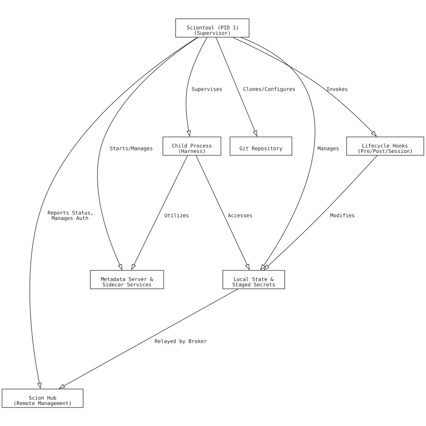

[`fabrictool`](https://github.com/pdlc-os/fabric/blob/b11448f8f01fdcf12deab96204417d87f8d46ab3/docs-site/src/content/docs/glossary.md?plain=1#L44) serves as the primary entry point and process manager (PID 1) within Fabric agent containers. Its central role, defined by the [`initCmd`](https://github.com/pdlc-os/fabric/blob/b11448f8f01fdcf12deab96204417d87f8d46ab3/cmd/init.go#L25) in [`cmd/fabrictool/commands/init.go`](https://github.com/pdlc-os/fabric/blob/b11448f8f01fdcf12deab96204417d87f8d46ab3/cmd/fabrictool/commands/init.go), is to orchestrate the agent's lifecycle, manage child processes, and ensure stable operation. This involves supervising a main child process, reaping zombie processes to prevent resource leaks, and forwarding signals for graceful shutdowns.

A key function of [`fabrictool`](https://github.com/pdlc-os/fabric/blob/b11448f8f01fdcf12deab96204417d87f8d46ab3/docs-site/src/content/docs/glossary.md?plain=1#L44) is managing secrets and environment setup within the container. It decodes and stages secrets, making them available to child processes and lifecycle hooks. For example, [`setupHostUser`](https://github.com/pdlc-os/fabric/blob/b11448f8f01fdcf12deab96204417d87f8d46ab3/cmd/fabrictool/commands/init.go#L1171) ([`cmd/fabrictool/commands/init.go`](https://github.com/pdlc-os/fabric/blob/b11448f8f01fdcf12deab96204417d87f8d46ab3/cmd/fabrictool/commands/init.go)) adjusts user IDs and group IDs to ensure the agent operates with appropriate permissions.

[`fabrictool`](https://github.com/pdlc-os/fabric/blob/b11448f8f01fdcf12deab96204417d87f8d46ab3/docs-site/src/content/docs/glossary.md?plain=1#L44) is also responsible for Git workspace operations. The [`gitCloneWorkspace`](https://github.com/pdlc-os/fabric/blob/b11448f8f01fdcf12deab96204417d87f8d46ab3/pkg/provision/provision.go#L301) function ([`cmd/fabrictool/commands/init.go`](https://github.com/pdlc-os/fabric/blob/b11448f8f01fdcf12deab96204417d87f8d46ab3/cmd/fabrictool/commands/init.go)) handles cloning repositories, managing authentication, selecting branches, and configuring Git credential helpers, ensuring the agent has access to its code and data. Further details on how [`fabrictool`](https://github.com/pdlc-os/fabric/blob/b11448f8f01fdcf12deab96204417d87f8d46ab3/docs-site/src/content/docs/glossary.md?plain=1#L44) acts as a Git credential helper can be found in [Fabrictool: Authentication and `gh` CLI Integration](#command-line-interface-cli-operations-fabrictool-authentication-and-gh-cli-integration).

Coordination with the Fabric Hub is another critical aspect. [`fabrictool`](https://github.com/pdlc-os/fabric/blob/b11448f8f01fdcf12deab96204417d87f8d46ab3/docs-site/src/content/docs/glossary.md?plain=1#L44) actively updates the Hub on the agent's status, including phases like [`state.PhaseRunning`](https://github.com/pdlc-os/fabric/blob/b11448f8f01fdcf12deab96204417d87f8d46ab3/cmd/list.go#L644) or [`state.PhaseCloning`](https://github.com/pdlc-os/fabric/blob/b11448f8f01fdcf12deab96204417d87f8d46ab3/pkg/agent/list.go#L183), and handles heartbeats and token refreshes. It also enforces resource limits such as maximum duration ([`FABRIC_MAX_DURATION`](https://github.com/pdlc-os/fabric/blob/b11448f8f01fdcf12deab96204417d87f8d46ab3/pkg/agent/run.go#L618)), turns ([`FABRIC_MAX_TURNS`](https://github.com/pdlc-os/fabric/blob/b11448f8f01fdcf12deab96204417d87f8d46ab3/pkg/agent/run.go#L612)), and model calls ([`FABRIC_MAX_MODEL_CALLS`](https://github.com/pdlc-os/fabric/blob/b11448f8f01fdcf12deab96204417d87f8d46ab3/pkg/agent/run.go#L615)), signaling when these limits are exceeded to the Hub. The various states and their management are implemented in functions like [`handleLimitsExceeded`](https://github.com/pdlc-os/fabric/blob/b11448f8f01fdcf12deab96204417d87f8d46ab3/cmd/fabrictool/commands/init.go#L1029) and [`watchLimitsTriggerFile`](https://github.com/pdlc-os/fabric/blob/b11448f8f01fdcf12deab96204417d87f8d46ab3/cmd/fabrictool/commands/init.go#L1155) within [`cmd/fabrictool/commands/init.go`](https://github.com/pdlc-os/fabric/blob/b11448f8f01fdcf12deab96204417d87f8d46ab3/cmd/fabrictool/commands/init.go).

### Fabrictool: Harness Hook Processing and Telemetry

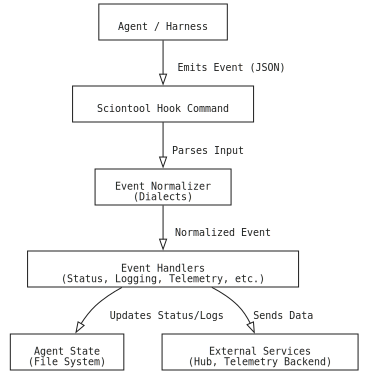

[`fabrictool`](https://github.com/pdlc-os/fabric/blob/b11448f8f01fdcf12deab96204417d87f8d46ab3/docs-site/src/content/docs/glossary.md?plain=1#L44) plays a central role in processing agent harness hook events, which are crucial for real-time communication and status updates within the Fabric ecosystem. When an agent performs an action or reaches a specific state, it emits a hook event, which [`fabrictool`](https://github.com/pdlc-os/fabric/blob/b11448f8f01fdcf12deab96204417d87f8d46ab3/docs-site/src/content/docs/glossary.md?plain=1#L44) intercepts. This tool normalizes event data, which can come from various "dialects" (e.g., [`claude`](https://github.com/pdlc-os/fabric/blob/b11448f8f01fdcf12deab96204417d87f8d46ab3/agents.md?plain=1#L27), [`gemini`](https://github.com/pdlc-os/fabric/blob/b11448f8f01fdcf12deab96204417d87f8d46ab3/agents.md?plain=1#L26), [`codex`](https://github.com/pdlc-os/fabric/blob/b11448f8f01fdcf12deab96204417d87f8d46ab3/README.md?plain=1#L83)), ensuring consistency across different types of agents and platforms.

Once normalized, these events are routed through a series of handlers. These handlers are responsible for different aspects of agent management and observability:

- **Status Updates**: Events can trigger updates to the agent's current operational status, indicating if it's waiting for input, blocked, or has completed a task.
- **Logging**: Detailed information about the event is logged, providing a comprehensive audit trail of agent activities.
- **User Prompts**: If an agent requires user interaction, the event can trigger a prompt, facilitating real-time communication between the agent and a human operator.
- **Hub Communication**: Critical events are communicated back to the Fabric Hub, the central orchestration component, to maintain an up-to-date view of all running agents.
- **Telemetry Collection**: Events contribute to telemetry data, enabling the collection of metrics, traces, and logs that are essential for monitoring agent performance and behavior.

The [`hookCmd`](https://github.com/pdlc-os/fabric/blob/b11448f8f01fdcf12deab96204417d87f8d46ab3/cmd/fabrictool/commands/hook.go#L34) in [`cmd/fabrictool/commands/hook.go`](https://github.com/pdlc-os/fabric/blob/b11448f8f01fdcf12deab96204417d87f8d46ab3/cmd/fabrictool/commands/hook.go) is the primary mechanism for this processing. It enables [`fabrictool`](https://github.com/pdlc-os/fabric/blob/b11448f8f01fdcf12deab96204417d87f8d46ab3/docs-site/src/content/docs/glossary.md?plain=1#L44) to act as an intermediary, translating raw agent events into structured information that can be consumed by other Fabric components, thereby facilitating the intelligent orchestration and management of agents. [`fabrictool`](https://github.com/pdlc-os/fabric/blob/b11448f8f01fdcf12deab96204417d87f8d46ab3/docs-site/src/content/docs/glossary.md?plain=1#L44) also directly supports [`ask_user`](https://github.com/pdlc-os/fabric/blob/b11448f8f01fdcf12deab96204417d87f8d46ab3/skills/README.md?plain=1#L13) and [`task_completed`](https://github.com/pdlc-os/fabric/blob/b11448f8f01fdcf12deab96204417d87f8d46ab3/skills/README.md?plain=1#L13) signals, allowing agents to explicitly communicate their need for input or the completion of a task. The [`statusCmd`](https://github.com/pdlc-os/fabric/blob/b11448f8f01fdcf12deab96204417d87f8d46ab3/cmd/fabrictool/commands/status.go#L22) in [`cmd/fabrictool/commands/status.go`](https://github.com/pdlc-os/fabric/blob/b11448f8f01fdcf12deab96204417d87f8d46ab3/cmd/fabrictool/commands/status.go) is dedicated to updating an agent's activity status, dispatching to various functions that update handlers, log events, and report to the Hub. These mechanisms collectively ensure that the Fabric platform has a real-time, comprehensive understanding of each agent's state and progress.

### Fabrictool: Authentication and `gh` CLI Integration

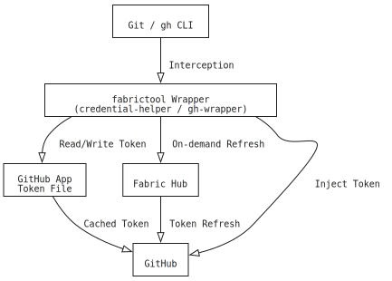

[`fabrictool`](https://github.com/pdlc-os/fabric/blob/b11448f8f01fdcf12deab96204417d87f8d46ab3/docs-site/src/content/docs/glossary.md?plain=1#L44) provides functionalities to manage Git credentials, particularly for refreshing GitHub App tokens, and integrates with the [`gh`](https://github.com/pdlc-os/fabric/blob/b11448f8f01fdcf12deab96204417d87f8d46ab3/cmd/create.go#L147) CLI by injecting fresh GitHub tokens before execution.

The [`credentialHelperCmd`](https://github.com/pdlc-os/fabric/blob/b11448f8f01fdcf12deab96204417d87f8d46ab3/cmd/fabrictool/commands/credential_helper.go#L38) within [`cmd/fabrictool/commands/credential_helper.go`](https://github.com/pdlc-os/fabric/blob/b11448f8f01fdcf12deab96204417d87f8d46ab3/cmd/fabrictool/commands/credential_helper.go) operates as a Git credential helper. When configured, it automatically provides Git with up-to-date GitHub tokens. This is especially useful in continuous integration/continuous deployment (CI/CD) environments where GitHub App tokens are often short-lived and require frequent refreshing. The credential helper checks if GitHub App integration is enabled and attempts to read or refresh a token from the Fabric Hub. If a valid token is obtained, it is supplied to Git, enabling seamless authenticated Git operations.

Additionally, the [`ghWrapperCmd`](https://github.com/pdlc-os/fabric/blob/b11448f8f01fdcf12deab96204417d87f8d46ab3/cmd/fabrictool/commands/gh_wrapper.go#L34) in [`cmd/fabrictool/commands/gh_wrapper.go`](https://github.com/pdlc-os/fabric/blob/b11448f8f01fdcf12deab96204417d87f8d46ab3/cmd/fabrictool/commands/gh_wrapper.go) acts as a wrapper around the [`gh`](https://github.com/pdlc-os/fabric/blob/b11448f8f01fdcf12deab96204417d87f8d46ab3/cmd/create.go#L147) command-line interface. When [`gh`](https://github.com/pdlc-os/fabric/blob/b11448f8f01fdcf12deab96204417d87f8d46ab3/cmd/create.go#L147) is invoked, [`fabrictool`](https://github.com/pdlc-os/fabric/blob/b11448f8f01fdcf12deab96204417d87f8d46ab3/docs-site/src/content/docs/glossary.md?plain=1#L44) intercepts the call, fetches a fresh GitHub token from the Hub, and injects it into the environment as [`GH_TOKEN`](https://github.com/pdlc-os/fabric/blob/b11448f8f01fdcf12deab96204417d87f8d46ab3/harnesses/copilot/README.md?plain=1#L42) before executing the actual [`gh`](https://github.com/pdlc-os/fabric/blob/b11448f8f01fdcf12deab96204417d87f8d46ab3/cmd/create.go#L147) binary. This ensures that the [`gh`](https://github.com/pdlc-os/fabric/blob/b11448f8f01fdcf12deab96204417d87f8d46ab3/cmd/create.go#L147) CLI always operates with a current and valid token. The wrapper is designed to replace the current process with the [`gh`](https://github.com/pdlc-os/fabric/blob/b11448f8f01fdcf12deab96204417d87f8d46ab3/cmd/create.go#L147) binary, which is an efficient way to transfer control while preserving the environment. The wrapper also includes logic to locate the legitimate [`gh`](https://github.com/pdlc-os/fabric/blob/b11448f8f01fdcf12deab96204417d87f8d46ab3/cmd/create.go#L147) binary and can be configured to respect user-provided [`GITHUB_TOKEN`](https://github.com/pdlc-os/fabric/blob/b11448f8f01fdcf12deab96204417d87f8d46ab3/cmd/hub.go#L1612) values if [`FABRIC_USER_GITHUB_TOKEN`](https://github.com/pdlc-os/fabric/blob/b11448f8f01fdcf12deab96204417d87f8d46ab3/pkg/hub/httpdispatcher.go#L489) is set to "true". For more details on the [`fabrictool`](https://github.com/pdlc-os/fabric/blob/b11448f8f01fdcf12deab96204417d87f8d46ab3/docs-site/src/content/docs/glossary.md?plain=1#L44)'s overall functionality within agent containers, refer to [Fabrictool: Container Init and Lifecycle Management](#command-line-interface-cli-operations-fabrictool-container-init-and-lifecycle-management).

### Fabrictool: GCE Metadata Server Emulation and Diagnostics

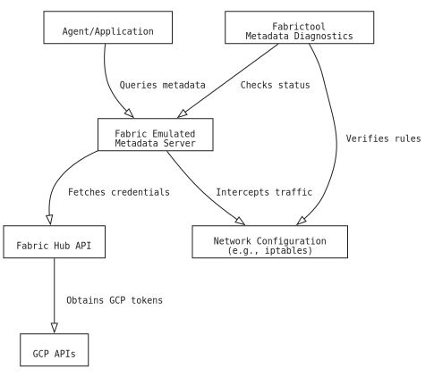

[`fabrictool`](https://github.com/pdlc-os/fabric/blob/b11448f8f01fdcf12deab96204417d87f8d46ab3/docs-site/src/content/docs/glossary.md?plain=1#L44) includes functionality for emulating the Google Compute Engine (GCE) metadata server within agent containers. This emulation provides a consistent interface for agents to retrieve information about their environment and credentials, even when not running directly on a GCE VM. The local metadata server can fetch credentials via the Fabric Hub API, offering a secure way for agents to obtain necessary authentication tokens for GCP services.

To ensure the proper functioning of this emulation, [`fabrictool`](https://github.com/pdlc-os/fabric/blob/b11448f8f01fdcf12deab96204417d87f8d46ab3/docs-site/src/content/docs/glossary.md?plain=1#L44) provides diagnostic capabilities. The [`metadataCmd`](https://github.com/pdlc-os/fabric/blob/b11448f8f01fdcf12deab96204417d87f8d46ab3/cmd/fabrictool/commands/metadata.go#L22) within [`cmd/fabrictool/commands/metadata.go`](https://github.com/pdlc-os/fabric/blob/b11448f8f01fdcf12deab96204417d87f8d46ab3/cmd/fabrictool/commands/metadata.go) offers tools for checking the health and configuration of the emulated metadata server. Specifically, the [`metadataStatusCmd`](https://github.com/pdlc-os/fabric/blob/b11448f8f01fdcf12deab96204417d87f8d46ab3/cmd/fabrictool/commands/metadata.go#L28) subcommand assesses:

- **Configuration**: It verifies environment variables such as [`FABRIC_METADATA_MODE`](https://github.com/pdlc-os/fabric/blob/b11448f8f01fdcf12deab96204417d87f8d46ab3/pkg/agent/run.go#L1289) and [`FABRIC_METADATA_PORT`](https://github.com/pdlc-os/fabric/blob/b11448f8f01fdcf12deab96204417d87f8d46ab3/pkg/fabrictool/metadata/server.go#L95), which dictate how the emulation operates and on which port it listens.
- **Connectivity**: It checks if the configured port is open and accessible, ensuring agents can communicate with the emulated server.
- **Endpoints**: It validates the reachability and responsiveness of key metadata server endpoints, including the health endpoint and token endpoints, which are crucial for credential acquisition.
- **Network Rules**: It inspects [`iptables`](https://github.com/pdlc-os/fabric/blob/b11448f8f01fdcf12deab96204417d87f8d46ab3/pkg/agent/run.go#L1286) rules to confirm that network traffic is correctly routed to the emulated server, preventing common misconfigurations that could block communication.

These diagnostic checks, as detailed in the [`runDoctor`](https://github.com/pdlc-os/fabric/blob/b11448f8f01fdcf12deab96204417d87f8d46ab3/cmd/doctor.go#L48) function within [`cmd/fabrictool/commands/doctor.go`](https://github.com/pdlc-os/fabric/blob/b11448f8f01fdcf12deab96204417d87f8d46ab3/cmd/fabrictool/commands/doctor.go), ensure that the agent's environment is correctly set up for GCP integration. The [`checkGCPMetadata`](https://github.com/pdlc-os/fabric/blob/b11448f8f01fdcf12deab96204417d87f8d46ab3/cmd/fabrictool/commands/doctor.go#L295) function, for instance, specifically validates the local GCP metadata server's reachability and its ability to vend access tokens when in "assign" mode. This proactive diagnostic approach helps in troubleshooting and maintaining the reliability of agent operations that depend on GCP services.

## Fabric Web User Interface

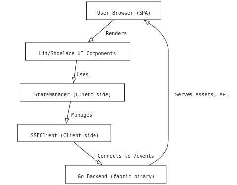

The Fabric Agent Orchestration Platform provides a client-side single-page application (SPA) located in the [`web`](https://github.com/pdlc-os/fabric/blob/b11448f8f01fdcf12deab96204417d87f8d46ab3/web) directory, which serves as the primary user interface for managing agents, projects, and brokers. This dynamic interface enables users to interact with the platform through real-time state synchronization via Server-Sent Events (SSE) and direct API interactions.

The architecture is centered around a frontend built with Lit web components and utilizes the Shoelace UI library. While Node.js and npm are used for client-side asset compilation and bundling with Vite, the Go [`fabric`](https://github.com/pdlc-os/fabric/blob/b11448f8f01fdcf12deab96204417d87f8d46ab3/README.md?plain=1#L1) binary serves the compiled web assets at runtime. This binary also handles server-side functionalities such as OAuth, sessions, SSE, and API routing, which are activated when the [`--enable-web`](https://github.com/pdlc-os/fabric/blob/b11448f8f01fdcf12deab96204417d87f8d46ab3/web/AGENTS.md?plain=1#L29) flag is used.

Key to the application's responsiveness is its state management system, implemented by the [`StateManager`](https://github.com/pdlc-os/fabric/blob/b11448f8f01fdcf12deab96204417d87f8d46ab3/web/src/client/state.ts#L67) class in [`web/src/client/state.ts`](https://github.com/pdlc-os/fabric/blob/b11448f8f01fdcf12deab96204417d87f8d46ab3/web/src/client/state.ts). This system maintains the application's state for agents, projects, and brokers, synchronizing data with the backend through the [`SSEClient`](https://github.com/pdlc-os/fabric/blob/b11448f8f01fdcf12deab96204417d87f8d46ab3/web/src/client/sse-client.ts#L42) in [`web/src/client/sse-client.ts`](https://github.com/pdlc-os/fabric/blob/b11448f8f01fdcf12deab96204417d87f8d46ab3/web/src/client/sse-client.ts). The [`SSEClient`](https://github.com/pdlc-os/fabric/blob/b11448f8f01fdcf12deab96204417d87f8d46ab3/web/src/client/sse-client.ts#L42) connects to the [`/events`](https://github.com/pdlc-os/fabric/blob/b11448f8f01fdcf12deab96204417d87f8d46ab3/web/README.md?plain=1#L78) endpoint, automatically reconnects upon disconnection, and handles authentication checks to ensure continuous data flow. It processes updates using delta merging and dispatches custom events to ensure the UI reflects real-time changes. The [`index.html`](https://github.com/pdlc-os/fabric/blob/b11448f8f01fdcf12deab96204417d87f8d46ab3/web/vite.config.ts#L66) file, located in [`web/index.html`](https://github.com/pdlc-os/fabric/blob/b11448f8f01fdcf12deab96204417d87f8d46ab3/web/index.html), serves as the main entry point, bootstrapping the client-side application and applying theme preferences based on user settings or system defaults.

All API interactions are centralized through an [`apiFetch`](https://github.com/pdlc-os/fabric/blob/b11448f8f01fdcf12deab96204417d87f8d46ab3/web/src/client/api.ts#L45) wrapper, defined in [`web/src/client/api.ts`](https://github.com/pdlc-os/fabric/blob/b11448f8f01fdcf12deab96204417d87f8d46ab3/web/src/client/api.ts). This wrapper manages credentials, logs slow requests, and handles specific HTTP error responses, such as 401 (unauthorized) and 403 (forbidden), to ensure secure communication and proper access control. Further details on UI components and design patterns can be found in [UI Component Ecosystem and Design Patterns](#fabric-web-user-interface-ui-component-ecosystem-and-design-patterns), and styling information is available in [Theming, Styling, and Accessibility](#fabric-web-user-interface-theming-styling-and-accessibility). For advanced details on client-side architecture and routing, refer to [Client-Side Architecture and Routing](#fabric-web-user-interface-client-side-architecture-and-routing).

### Client-Side Architecture and Routing

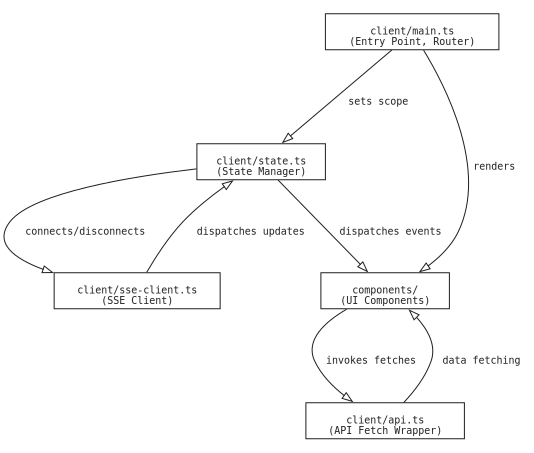

The client-side single-page application (SPA) provides the user interface for the Fabric Agent Orchestration Platform. The Go [`fabric`](https://github.com/pdlc-os/fabric/blob/b11448f8f01fdcf12deab96204417d87f8d46ab3/README.md?plain=1#L1) binary serves the compiled web assets and handles server-side functionalities such as OAuth, sessions, Server-Sent Events (SSE), and API routing. Node.js and [`npm`](https://github.com/pdlc-os/fabric/blob/b11448f8f01fdcf12deab96204417d87f8d46ab3/Makefile#L90) are used during the build process with [`Vite`](https://github.com/pdlc-os/fabric/blob/b11448f8f01fdcf12deab96204417d87f8d46ab3/web/AGENTS.md?plain=1#L35) to compile and bundle client assets.

The core of the client-side application is located in the [`web/src`](https://github.com/pdlc-os/fabric/blob/b11448f8f01fdcf12deab96204417d87f8d46ab3/web/src) directory. The main entry point, [`web/src/client/main.ts`](https://github.com/pdlc-os/fabric/blob/b11448f8f01fdcf12deab96204417d87f8d46ab3/web/src/client/main.ts), manages the application's initial setup. This includes injecting CSS, configuring the [`Shoelace`](https://github.com/pdlc-os/fabric/blob/b11448f8f01fdcf12deab96204417d87f8d46ab3/agents.md?plain=1#L70) UI library, and hydrating data from server-side rendering (SSR) to populate initial page and user information.

Client-side routing is also handled by [`web/src/client/main.ts`](https://github.com/pdlc-os/fabric/blob/b11448f8f01fdcf12deab96204417d87f8d46ab3/web/src/client/main.ts), which defines routes that map URL patterns to specific page components. It dynamically imports and renders these components, enabling smooth navigation within the SPA without full page reloads.

The application integrates the [`Shoelace`](https://github.com/pdlc-os/fabric/blob/b11448f8f01fdcf12deab96204417d87f8d46ab3/agents.md?plain=1#L70) UI library, a collection of web components, for its user interface elements. This library is configured and its assets are managed via [`setBasePath`](https://github.com/pdlc-os/fabric/blob/b11448f8f01fdcf12deab96204417d87f8d46ab3/web/src/client/main.ts#L43) during the application's initialization.

The [`StateManager`](https://github.com/pdlc-os/fabric/blob/b11448f8f01fdcf12deab96204417d87f8d46ab3/web/src/client/state.ts#L67) class, found in [`web/src/client/state.ts`](https://github.com/pdlc-os/fabric/blob/b11448f8f01fdcf12deab96204417d87f8d46ab3/web/src/client/state.ts), is central to managing the application's real-time state. It maintains [`AppState`](https://github.com/pdlc-os/fabric/blob/b11448f8f01fdcf12deab96204417d87f8d46ab3/web/src/client/state.ts#L44) for agents, projects, and brokers, synchronizing data with the backend using an [`SSEClient`](https://github.com/pdlc-os/fabric/blob/b11448f8f01fdcf12deab96204417d87f8d46ab3/web/src/client/sse-client.ts#L42). This client, defined in [`web/src/client/sse-client.ts`](https://github.com/pdlc-os/fabric/blob/b11448f8f01fdcf12deab96204417d87f8d46ab3/web/src/client/sse-client.ts), connects to the [`/events`](https://github.com/pdlc-os/fabric/blob/b11448f8f01fdcf12deab96204417d87f8d46ab3/web/README.md?plain=1#L78) endpoint to receive real-time updates via Server-Sent Events. The [`StateManager`](https://github.com/pdlc-os/fabric/blob/b11448f8f01fdcf12deab96204417d87f8d46ab3/web/src/client/state.ts#L67) processes these [`update`](https://github.com/pdlc-os/fabric/blob/b11448f8f01fdcf12deab96204417d87f8d46ab3/pkg/hubclient/users.go#L32) events, performs delta merging, and dispatches custom events to ensure the UI remains reactive and up-to-date. For more details on real-time state management, refer to [Real-time State Management and SSE](#fabric-web-user-interface-real-time-state-management-and-sse).

API interactions are centralized through the [`apiFetch`](https://github.com/pdlc-os/fabric/blob/b11448f8f01fdcf12deab96204417d87f8d46ab3/web/src/client/api.ts#L45) function in [`web/src/client/api.ts`](https://github.com/pdlc-os/fabric/blob/b11448f8f01fdcf12deab96204417d87f8d46ab3/web/src/client/api.ts). This wrapper around the standard [`fetch`](https://github.com/pdlc-os/fabric/blob/b11448f8f01fdcf12deab96204417d87f8d46ab3/agents.md?plain=1#L107) API handles credentials, logs slow requests, and manages HTTP error responses, such as redirecting to [`/login`](https://github.com/pdlc-os/fabric/blob/b11448f8f01fdcf12deab96204417d87f8d46ab3/pkg/hub/web.go#L1138) on a 401 (Unauthorized) status or dispatching an access-denied event on a 403 (Forbidden) status. For more information, see [API Communication and Error Handling](#fabric-web-user-interface-api-communication-and-error-handling).

The application's UI components, built with [`LitElement`](https://github.com/pdlc-os/fabric/blob/b11448f8f01fdcf12deab96204417d87f8d46ab3/web/AGENTS.md?plain=1#L173), are located in [`web/src/components`](https://github.com/pdlc-os/fabric/blob/b11448f8f01fdcf12deab96204417d87f8d46ab3/web/src/components). These include the main application shell ([`FabricApp`](https://github.com/pdlc-os/fabric/blob/b11448f8f01fdcf12deab96204417d87f8d46ab3/web/src/components/app-shell.ts#L59)), shared reusable components, and specific pages for administrative tasks, agent management, and project oversight. [UI Component Ecosystem and Design Patterns](#fabric-web-user-interface-ui-component-ecosystem-and-design-patterns) provides a deeper dive into these components. Theming and styling are managed through [`web/src/styles`](https://github.com/pdlc-os/fabric/blob/b11448f8f01fdcf12deab96204417d87f8d46ab3/web/src/styles), utilizing CSS custom properties for a consistent look and support for light and dark modes. See [Theming, Styling, and Accessibility](#fabric-web-user-interface-theming-styling-and-accessibility) for further details.

### Real-time State Management and SSE

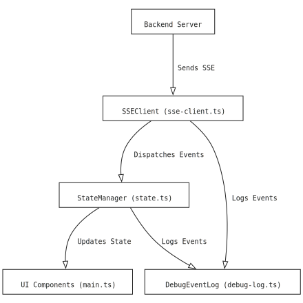

The [`StateManager`](https://github.com/pdlc-os/fabric/blob/b11448f8f01fdcf12deab96204417d87f8d46ab3/web/src/client/state.ts#L67) class in [`web/src/client/state.ts`](https://github.com/pdlc-os/fabric/blob/b11448f8f01fdcf12deab96204417d87f8d46ab3/web/src/client/state.ts) is central to managing the application's client-side state for entities such as agents, projects, and brokers. This class ensures that the user interface remains synchronized with backend data through Server-Sent Events (SSE). The [`SSEClient`](https://github.com/pdlc-os/fabric/blob/b11448f8f01fdcf12deab96204417d87f8d46ab3/web/src/client/sse-client.ts#L42) in [`web/src/client/sse-client.ts`](https://github.com/pdlc-os/fabric/blob/b11448f8f01fdcf12deab96204417d87f8d46ab3/web/src/client/sse-client.ts) establishes and maintains a connection to the backend's [`/events`](https://github.com/pdlc-os/fabric/blob/b11448f8f01fdcf12deab96204417d87f8d46ab3/web/README.md?plain=1#L78) endpoint, facilitating real-time updates.

The [`StateManager`](https://github.com/pdlc-os/fabric/blob/b11448f8f01fdcf12deab96204417d87f8d46ab3/web/src/client/state.ts#L67) processes incoming [`update`](https://github.com/pdlc-os/fabric/blob/b11448f8f01fdcf12deab96204417d87f8d46ab3/pkg/hubclient/users.go#L32) events by applying delta merging, which efficiently updates only the changed parts of the application state, reducing the overhead of full state refreshes. It also manages view-scoped subscriptions, allowing different parts of the application to subscribe only to the data relevant to their current context. After processing updates, the [`StateManager`](https://github.com/pdlc-os/fabric/blob/b11448f8f01fdcf12deab96204417d87f8d46ab3/web/src/client/state.ts#L67) dispatches custom events, such as [`agents-updated`](https://github.com/pdlc-os/fabric/blob/b11448f8f01fdcf12deab96204417d87f8d46ab3/web/src/client/state.ts#L58), to trigger UI reactivity and ensure that components re-render as needed to reflect the latest state. The [`SSEClient`](https://github.com/pdlc-os/fabric/blob/b11448f8f01fdcf12deab96204417d87f8d46ab3/web/src/client/sse-client.ts#L42) handles automatic reconnection with exponential backoff and performs authentication checks to ensure continuous and secure data flow.

For more information on the overall client-side architecture, see [Client-Side Architecture and Routing](#fabric-web-user-interface-client-side-architecture-and-routing). For details on the API communication patterns, refer to [API Communication and Error Handling](#fabric-web-user-interface-api-communication-and-error-handling).

### API Communication and Error Handling

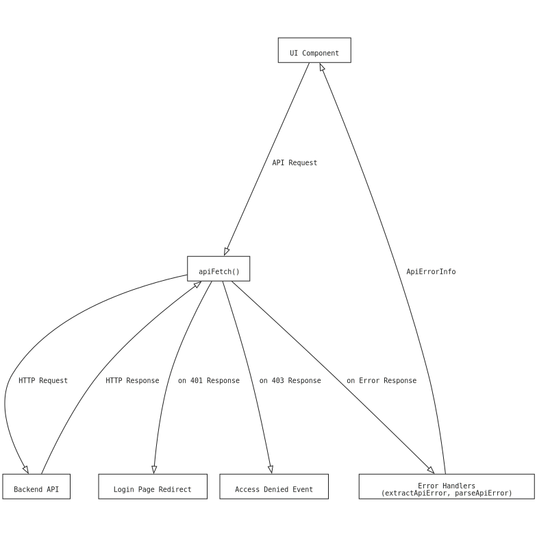

The [`apiFetch`](https://github.com/pdlc-os/fabric/blob/b11448f8f01fdcf12deab96204417d87f8d46ab3/web/src/client/api.ts#L45) function in [`web/src/client/api.ts`](https://github.com/pdlc-os/fabric/blob/b11448f8f01fdcf12deab96204417d87f8d46ab3/web/src/client/api.ts) centralizes all interactions with the backend API. This wrapper around the standard [`fetch`](https://github.com/pdlc-os/fabric/blob/b11448f8f01fdcf12deab96204417d87f8d46ab3/agents.md?plain=1#L107) API ensures consistent handling of credentials for authenticated requests and includes built-in logging for slow requests to aid in performance monitoring. Crucially, it manages specific HTTP error responses related to authentication and access control: an HTTP 401 response triggers a redirect to the [`/login`](https://github.com/pdlc-os/fabric/blob/b11448f8f01fdcf12deab96204417d87f8d46ab3/pkg/hub/web.go#L1138) page, while an HTTP 403 response dispatches a custom [`fabric:access-denied`](https://github.com/pdlc-os/fabric/blob/b11448f8f01fdcf12deab96204417d87f8d46ab3/web/src/client/api.ts#L21) event, providing a standardized mechanism for the UI to react to unauthorized access attempts. Error parsing utilities, [`extractApiError`](https://github.com/pdlc-os/fabric/blob/b11448f8f01fdcf12deab96204417d87f8d46ab3/web/src/client/api.ts#L96) and [`parseApiError`](https://github.com/pdlc-os/fabric/blob/b11448f8f01fdcf12deab96204417d87f8d46ab3/web/src/client/api.ts#L129), convert raw API error responses into structured [`ApiErrorInfo`](https://github.com/pdlc-os/fabric/blob/b11448f8f01fdcf12deab96204417d87f8d46ab3/web/src/client/api.ts#L117) objects for easier consumption by the frontend.

### UI Component Ecosystem and Design Patterns

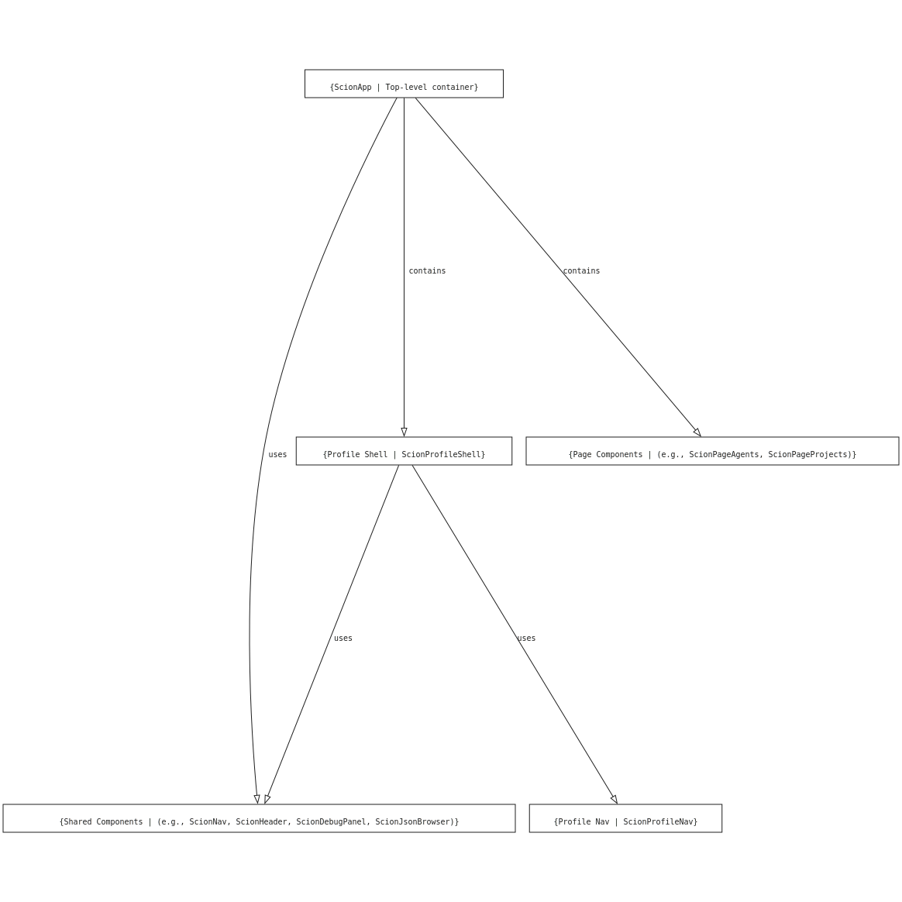

The Fabric web user interface is built as a single-page application (SPA), primarily using [`LitElement`](https://github.com/pdlc-os/fabric/blob/b11448f8f01fdcf12deab96204417d87f8d46ab3/web/AGENTS.md?plain=1#L173)-based web components. This component-driven architecture facilitates a modular and reactive user experience for managing agents, projects, and brokers. The application shell, defined by the [`FabricApp`](https://github.com/pdlc-os/fabric/blob/b11448f8f01fdcf12deab96204417d87f8d46ab3/web/src/components/app-shell.ts#L59) class in [`web/src/components/app-shell.ts`](https://github.com/pdlc-os/fabric/blob/b11448f8f01fdcf12deab96204417d87f8d46ab3/web/src/components/app-shell.ts), serves as the top-level container, orchestrating the overall layout, navigation, and global UI state. It manages elements such as the header, breadcrumbs, navigation, and a debug panel, handling responsive design and persistence of UI preferences.

A comprehensive set of shared UI components, located in [`web/src/components/shared`](https://github.com/pdlc-os/fabric/blob/b11448f8f01fdcf12deab96204417d87f8d46ab3/web/src/components/shared), provides consistent functionality and appearance across the application. These components address various needs, including status indicators and real-time notifications, debugging and observability tools (e.g., for connection status, subscriptions, and event logs), and robust data display and editing capabilities. For instance, [`FabricJsonBrowser`](https://github.com/pdlc-os/fabric/blob/b11448f8f01fdcf12deab96204417d87f8d46ab3/web/src/components/shared/json-browser.ts#L29) provides interactive viewing of JSON data, while [`FabricAgentLogViewer`](https://github.com/pdlc-os/fabric/blob/b11448f8f01fdcf12deab96204417d87f8d46ab3/web/src/components/shared/agent-log-viewer.ts#L53) and [`FabricAgentMessageViewer`](https://github.com/pdlc-os/fabric/blob/b11448f8f01fdcf12deab96204417d87f8d46ab3/web/src/components/shared/agent-message-viewer.ts#L65) manage detailed agent logs and message streams. File and directory management is handled by components such as [`FabricFileBrowser`](https://github.com/pdlc-os/fabric/blob/b11448f8f01fdcf12deab96204417d87f8d46ab3/web/src/components/shared/file-browser.ts#L436) and [`FabricFileEditor`](https://github.com/pdlc-os/fabric/blob/b11448f8f01fdcf12deab96204417d87f8d46ab3/web/src/components/shared/file-editor.ts#L189), which integrate syntax highlighting and Markdown rendering.

The user profile and settings, managed by components in [`web/src/components/profile`](https://github.com/pdlc-os/fabric/blob/b11448f8f01fdcf12deab96204417d87f8d46ab3/web/src/components/profile), provide a dedicated area for user-specific configurations. [`FabricProfileNav`](https://github.com/pdlc-os/fabric/blob/b11448f8f01fdcf12deab96204417d87f8d46ab3/web/src/components/profile/profile-nav.ts#L61) offers responsive navigation for profile sections, displaying user information, while [`FabricProfileShell`](https://github.com/pdlc-os/fabric/blob/b11448f8f01fdcf12deab96204417d87f8d46ab3/web/src/components/profile/profile-shell.ts#L43) provides the main layout for these sections, handling navigation states and title updates.

The application also features numerous dedicated pages, defined as [`LitElement`](https://github.com/pdlc-os/fabric/blob/b11448f8f01fdcf12deab96204417d87f8d46ab3/web/AGENTS.md?plain=1#L173) components within [`web/src/components/pages`](https://github.com/pdlc-os/fabric/blob/b11448f8f01fdcf12deab96204417d87f8d46ab3/web/src/components/pages). These pages facilitate interaction with the backend API for specific functionalities, encompassing administrative tasks, agent management, broker oversight, and project configurations. Examples include pages for listing and creating agents, configuring agent details, managing administrative groups and integrations, and overseeing skill registries. Common design patterns across these pages include leveraging [`apiFetch`](https://github.com/pdlc-os/fabric/blob/b11448f8f01fdcf12deab96204417d87f8d46ab3/web/src/client/api.ts#L45) for backend communication and [`stateManager`](https://github.com/pdlc-os/fabric/blob/b11448f8f01fdcf12deab96204417d87f8d46ab3/web/src/client/state.ts#L515) for real-time updates and reactive UI, ensuring that the interface remains synchronized with the system's state. The web client also incorporates features for [Real-time State Management and SSE](#fabric-web-user-interface-real-time-state-management-and-sse) and [API Communication and Error Handling](#fabric-web-user-interface-api-communication-and-error-handling) to maintain a dynamic and responsive user experience.

### Theming, Styling, and Accessibility

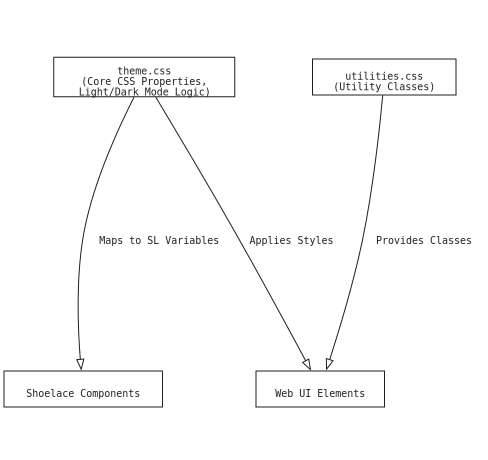

The Fabric web user interface employs a centralized styling system to ensure a consistent look and feel, support theming, and integrate effectively with the Shoelace UI library. This system is primarily defined within the [`web/src/styles`](https://github.com/pdlc-os/fabric/blob/b11448f8f01fdcf12deab96204417d87f8d46ab3/web/src/styles) directory.

The core theming is established in [`web/src/styles/theme.css`](https://github.com/pdlc-os/fabric/blob/b11448f8f01fdcf12deab96204417d87f8d46ab3/web/src/styles/theme.css), which leverages CSS custom properties, all prefixed with [`--fabric-`](https://github.com/pdlc-os/fabric/blob/b11448f8f01fdcf12deab96204417d87f8d46ab3/web/AGENTS.md?plain=1#L208). This approach defines a comprehensive color palette and semantic colors, such as [`--fabric-primary`](https://github.com/pdlc-os/fabric/blob/b11448f8f01fdcf12deab96204417d87f8d46ab3/pkg/hub/web.go#L236) and [`--fabric-bg`](https://github.com/pdlc-os/fabric/blob/b11448f8f01fdcf12deab96204417d87f8d46ab3/pkg/hub/web.go#L288), providing a foundation for the application's visual design. The styling system includes support for both light and dark modes, which can be activated through explicit selectors like [`.sl-theme-dark`](https://github.com/pdlc-os/fabric/blob/b11448f8f01fdcf12deab96204417d87f8d46ab3/web/src/styles/theme.css#L288) or [`[data-theme='dark']`](https://github.com/pdlc-os/fabric/blob/b11448f8f01fdcf12deab96204417d87f8d46ab3/web/src/styles/theme.css#L289), and automatically based on user system preferences via [`@media (prefers-color-scheme: dark)`](https://github.com/pdlc-os/fabric/blob/b11448f8f01fdcf12deab96204417d87f8d46ab3/pkg/hub/web.go#L255). Integration with the Shoelace UI library is achieved by mapping these [`--fabric-`](https://github.com/pdlc-os/fabric/blob/b11448f8f01fdcf12deab96204417d87f8d46ab3/web/AGENTS.md?plain=1#L208) custom properties to Shoelace's own custom properties, ensuring a unified visual style across all components. Layout variables, font stacks, font sizes, spacing values, and border radii are also defined within this file to maintain consistency.

In addition to theming, the application utilizes a set of reusable utility classes defined in [`web/src/styles/utilities.css`](https://github.com/pdlc-os/fabric/blob/b11448f8f01fdcf12deab96204417d87f8d46ab3/web/src/styles/utilities.css). These classes, also prefixed with [`fabric-`](https://github.com/pdlc-os/fabric/blob/b11448f8f01fdcf12deab96204417d87f8d46ab3/cmd/common.go#L572), provide atomic styling for common UI patterns. Examples include utilities for [`flex`](https://github.com/pdlc-os/fabric/blob/b11448f8f01fdcf12deab96204417d87f8d46ab3/web/src/styles/utilities.css#L27) and [`grid`](https://github.com/pdlc-os/fabric/blob/b11448f8f01fdcf12deab96204417d87f8d46ab3/web/src/styles/utilities.css#L52) layouts (e.g., [`fabric-flex`](https://github.com/pdlc-os/fabric/blob/b11448f8f01fdcf12deab96204417d87f8d46ab3/web/src/styles/utilities.css#L27), [`fabric-grid`](https://github.com/pdlc-os/fabric/blob/b11448f8f01fdcf12deab96204417d87f8d46ab3/web/src/styles/utilities.css#L52)), consistent spacing (e.g., [`fabric-gap-1`](https://github.com/pdlc-os/fabric/blob/b11448f8f01fdcf12deab96204417d87f8d46ab3/web/src/styles/utilities.css#L60)), and typographic styles (e.g., [`fabric-text-xs`](https://github.com/pdlc-os/fabric/blob/b11448f8f01fdcf12deab96204417d87f8d46ab3/web/src/styles/utilities.css#L83), [`fabric-font-medium`](https://github.com/pdlc-os/fabric/blob/b11448f8f01fdcf12deab96204417d87f8d46ab3/web/src/styles/utilities.css#L105)). These utilities contribute to responsive design, accessibility (such as [`fabric-sr-only`](https://github.com/pdlc-os/fabric/blob/b11448f8f01fdcf12deab96204417d87f8d46ab3/web/src/styles/utilities.css#L194) for screen reader-only content), and standardized interactive states. The utility-first approach and extensive use of CSS variables help streamline UI development and ensure a cohesive user experience across the application. Further details on the overall architecture and component ecosystem can be found in [Client-Side Architecture and Routing](#fabric-web-user-interface-client-side-architecture-and-routing) and [UI Component Ecosystem and Design Patterns](#fabric-web-user-interface-ui-component-ecosystem-and-design-patterns).

### End-to-End Testing for Real-time Features

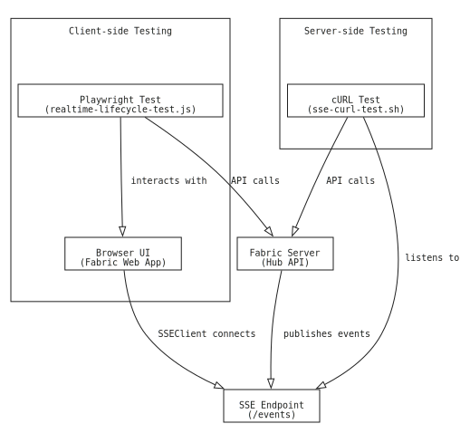

End-to-end testing for real-time features in the Fabric web application employs a two-pronged approach to validate both client-side UI reactivity and server-side event delivery. This ensures that actions in the backend correctly trigger Server-Sent Events (SSEs) and that the frontend dynamically updates in response.

The first strategy involves simulating user interactions and UI updates within a browser environment. This is achieved using [`playwright`](https://github.com/pdlc-os/fabric/blob/b11448f8f01fdcf12deab96204417d87f8d46ab3/web/AGENTS.md?plain=1#L288) through the script located at [`web/test-scripts/realtime-lifecycle-test.js`](https://github.com/pdlc-os/fabric/blob/b11448f8f01fdcf12deab96204417d87f8d46ab3/web/test-scripts/realtime-lifecycle-test.js). This script launches a Chromium browser and navigates to relevant application pages. It then performs agent lifecycle operations, such as creating, updating, and deleting agents, by directly interacting with the API via [`fetch`](https://github.com/pdlc-os/fabric/blob/b11448f8f01fdcf12deab96204417d87f8d46ab3/agents.md?plain=1#L107) calls. Critically, instead of relying on page reloads, the script observes and verifies that the UI updates dynamically as expected in response to SSEs. Screenshots are captured at various stages to visually confirm these UI reactions. The script also monitors console messages and HTTP responses, providing insight into the real-time communication flow.

The second strategy focuses on server-side validation of SSE delivery, independent of a browser. The [`bash`](https://github.com/pdlc-os/fabric/blob/b11448f8f01fdcf12deab96204417d87f8d46ab3/docs-site/src/content/docs/advanced-local/completions.md?plain=1#L35) script at [`web/test-scripts/sse-curl-test.sh`](https://github.com/pdlc-os/fabric/blob/b11448f8f01fdcf12deab96204417d87f8d46ab3/web/test-scripts/sse-curl-test.sh) uses [`curl`](https://github.com/pdlc-os/fabric/blob/b11448f8f01fdcf12deab96204417d87f8d46ab3/web/AGENTS.md?plain=1#L229) to listen for SSEs directly from the server. This allows for verification that the backend is correctly emitting event types, such as [`agent.created`](https://github.com/pdlc-os/fabric/blob/b11448f8f01fdcf12deab96204417d87f8d46ab3/cmd/common.go#L913), [`agent.status`](https://github.com/pdlc-os/fabric/blob/b11448f8f01fdcf12deab96204417d87f8d46ab3/cmd/sync.go#L542), and [`agent.deleted`](https://github.com/pdlc-os/fabric/blob/b11448f8f01fdcf12deab96204417d87f8d46ab3/pkg/hub/events.go#L417), and that the [`event: update`](https://github.com/pdlc-os/fabric/blob/b11448f8f01fdcf12deab96204417d87f8d46ab3/web/AGENTS.md?plain=1#L279) type is correctly formatted. This method helps to isolate and confirm the integrity of the server-side event publishing mechanism.

Both testing approaches are configured via environment variables, allowing for flexible setup of project IDs, authentication tokens, base URLs, and output directories. This separation of concerns in testing helps ensure the robustness of the Fabric platform's real-time features. For further details on the web application's architecture and development workflow, refer to [Fabric Web User Interface](#fabric-web-user-interface).

## Agent Configuration and Operational Parameters

| Agent Role | Primary Responsibilities | Configuration File Path | Key Operational Parameters / Constraints |
| --- | --- | --- | --- |
| Documentation Writer | Maintain and improve project documentation; ensure clarity, conciseness, and accuracy. | `.fabric/templates/docs-writer/system-prompt.md` | Adhere to conventions, mimic style, proactively update all affected docs. |
| Git Workflow Protocol | Manage Git operations in a restricted, non-interactive sandbox environment. | `.fabric/templates/instance-manager/agents-git.md` | Local-only operations, worktree-aware branch management, non-interactive conflict resolution. |
| Fabric CLI Operating | Interact with the Fabric orchestration system within a containerized sandbox. | `.fabric/templates/instance-manager/agents-hub.md` | Non-interactive mode (`--non-interactive`), structured output (`--format json`), no `sync` or `cdw`. |
| Agent Status Signals | Signal agent state to the orchestration system. | `.fabric/templates/instance-manager/agents.md` | `ask_user`, `blocked`, `task_completed` signals. |
| GCP VM Manager | Manage and interact with a GCP VM via `gcloud compute ssh`. | `.fabric/templates/instance-manager/system-prompt.md` | Specific VM details (instance, zone, project), repository config, Hub service management. |
| Release Engineer | Generate semantic release notes from Git commit history. | `.fabric/templates/release-notes/system-prompt.md` | Read-only operations, precision with Git, categorize commits (Features, Fixes, Breaking Changes). |
| Frontend Developer | Front-end web development, debugging, and troubleshooting. | `.fabric/templates/web-dev/agents.md` | Use Chrome DevTools for verification and debugging. |
| Team Creation & Extension | Create/extend Fabric agent templates from high-level descriptions. | `.fabric/templates/team-creation/SKILL.md` | Define roles, workflow, and communication patterns for multi-agent teams. |

Fabric agents operate with defined workflows and communication protocols, managed through configuration templates and bundled platform skills. This framework provides specific operational parameters for various autonomous agents, including those specializing in technical documentation, GCP VM integration testing, semantic release note generation, and web development.

The [`.fabric`](https://github.com/pdlc-os/fabric/blob/b11448f8f01fdcf12deab96204417d87f8d46ab3/agents.md?plain=1#L34) directory serves as a central repository for defining these operational parameters. Within this directory, configuration files and markdown documents specify how agents are expected to behave, interact, and perform their designated tasks.

For example, the Documentation Writer agent, configured through [`.fabric/templates/docs-writer/system-prompt.md`](https://github.com/pdlc-os/fabric/blob/b11448f8f01fdcf12deab96204417d87f8d46ab3/.fabric/templates/docs-writer/system-prompt.md), is designed to review Git changes and ensure documentation alignment with code. Its responsibilities include maintaining consistency in tone and formatting, organizing documentation, and integrating with [`AGENTS.md`](https://github.com/pdlc-os/fabric/blob/b11448f8f01fdcf12deab96204417d87f8d46ab3/harnesses/codex/config.yaml#L37) for site-specific details. The agent employs advanced reasoning to analyze tasks against defined policies, evaluate the consequences of changes, and update plans if refactoring becomes complex. Its workflow involves understanding the task, planning, implementation using [`replace`](https://github.com/pdlc-os/fabric/blob/b11448f8f01fdcf12deab96204417d87f8d46ab3/cmd/cdw.go#L103) and [`write_file`](https://github.com/pdlc-os/fabric/blob/b11448f8f01fdcf12deab96204417d87f8d46ab3/extras/agent-viz/scripts/inspect_logs.py#L92) tools, verification of documentation accuracy, and finalization.

The Instance Manager agent, detailed in [`.fabric/templates/instance-manager`](https://github.com/pdlc-os/fabric/blob/b11448f8f01fdcf12deab96204417d87f8d46ab3/.fabric/templates/instance-manager), manages autonomous Fabric agents and GCP VM integration testing. It defines strict Git workflows for non-interactive, sandboxed environments, requiring local-only operations and non-interactive conflict resolution using specific Git commands. Operational instructions in [`.fabric/templates/instance-manager/agents-hub.md`](https://github.com/pdlc-os/fabric/blob/b11448f8f01fdcf12deab96204417d87f8d46ab3/.fabric/templates/instance-manager/agents-hub.md) mandate the use of [`--non-interactive`](https://github.com/pdlc-os/fabric/blob/b11448f8f01fdcf12deab96204417d87f8d46ab3/cmd/root.go#L40) and [`--format json`](https://github.com/pdlc-os/fabric/blob/b11448f8f01fdcf12deab96204417d87f8d46ab3/cmd/hub.go#L1045) flags for [`fabric`](https://github.com/pdlc-os/fabric/blob/b11448f8f01fdcf12deab96204417d87f8d46ab3/README.md?plain=1#L1) CLI commands, while prohibiting commands like [`sync`](https://github.com/pdlc-os/fabric/blob/b11448f8f01fdcf12deab96204417d87f8d46ab3/pkg/runtime/mock.go#L101) or [`--global`](https://github.com/pdlc-os/fabric/blob/b11448f8f01fdcf12deab96204417d87f8d46ab3/cmd/hub.go#L234). The [`system-prompt.md`](https://github.com/pdlc-os/fabric/blob/b11448f8f01fdcf12deab96204417d87f8d46ab3/pkg/agent/provision.go#L960) within this directory guides the agent in managing a GCP VM for [`fabric`](https://github.com/pdlc-os/fabric/blob/b11448f8f01fdcf12deab96204417d87f8d46ab3/README.md?plain=1#L1) repository integration testing, including [`gcloud compute ssh`](https://github.com/pdlc-os/fabric/blob/b11448f8f01fdcf12deab96204417d87f8d46ab3/extras/fabric-chat-app/README.md?plain=1#L224) access, VM configuration, [`fabric`](https://github.com/pdlc-os/fabric/blob/b11448f8f01fdcf12deab96204417d87f8d46ab3/README.md?plain=1#L1) repository location, and [`fabric-hub`](https://github.com/pdlc-os/fabric/blob/b11448f8f01fdcf12deab96204417d87f8d46ab3/pkg/hub/server.go#L213) service management via [`systemd`](https://github.com/pdlc-os/fabric/blob/b11448f8f01fdcf12deab96204417d87f8d46ab3/go.mod#L93). It also outlines how to generate test user tokens using integration hub signing keys.

The Release Notes agent, configured in [`.fabric/templates/release-notes/system-prompt.md`](https://github.com/pdlc-os/fabric/blob/b11448f8f01fdcf12deab96204417d87f8d46ab3/.fabric/templates/release-notes/system-prompt.md), functions as an expert Release Engineer. Its primary role is to generate high-quality, semantic release notes from Git commit history. This agent operates in read-only mode, uses [`run_shell_command`](https://github.com/pdlc-os/fabric/blob/b11448f8f01fdcf12deab96204417d87f8d46ab3/changelog/2026-03-24-changelog.md?plain=1#L19) for Git operations, and adheres to strict Markdown formatting rules, categorizing commits into "Features" and "Fixes." It also prioritizes changes by significance, highlights breaking changes, synthesizes related commits, and filters out irrelevant information.

For web development tasks, the Web Development agent, specified in [`.fabric/templates/web-dev/agents.md`](https://github.com/pdlc-os/fabric/blob/b11448f8f01fdcf12deab96204417d87f8d46ab3/.fabric/templates/web-dev/agents.md), outlines communication protocols and defines the role of a Frontend Developer, including the use of Chrome DevTools for verification and debugging. The [`SKILL.md`](https://github.com/pdlc-os/fabric/blob/b11448f8f01fdcf12deab96204417d87f8d46ab3/cmd/skills.go#L193) file within [`.fabric/templates/web-dev/skills/chrome-devtools`](https://github.com/pdlc-os/fabric/blob/b11448f8f01fdcf12deab96204417d87f8d46ab3/.fabric/templates/web-dev/skills/chrome-devtools) details efficient Chrome DevTools usage via the Multi-Channel Proxy (MCP), covering browser lifecycle, page selection, element interaction, and workflow patterns for debugging and automation.

Bundled resources and platform skills are managed within the [`resources`](https://github.com/pdlc-os/fabric/blob/b11448f8f01fdcf12deab96204417d87f8d46ab3/resources) directory. This includes templates and platform-specific skills embedded directly into the application's binary. The [`resources/catalog.go`](https://github.com/pdlc-os/fabric/blob/b11448f8f01fdcf12deab96204417d87f8d46ab3/resources/catalog.go) file defines structures and functions for handling [`BundledResource`](https://github.com/pdlc-os/fabric/blob/b11448f8f01fdcf12deab96204417d87f8d46ab3/resources/catalog.go#L27) instances, which encapsulate metadata such as resource kind, name, scope, and source URL, along with an [`fs.FS`](https://github.com/pdlc-os/fabric/blob/b11448f8f01fdcf12deab96204417d87f8d46ab3/pkg/hub/web.go#L156) interface for content access. These resources ensure that agents operate with a consistent set of foundational knowledge and operational constraints. For instance, platform skills like [`agent-status-signals`](https://github.com/pdlc-os/fabric/blob/b11448f8f01fdcf12deab96204417d87f8d46ab3/skills/README.md?plain=1#L13), [`git-sandbox`](https://github.com/pdlc-os/fabric/blob/b11448f8f01fdcf12deab96204417d87f8d46ab3/skills/README.md?plain=1#L14), and [`fabric-cli-operations`](https://github.com/pdlc-os/fabric/blob/b11448f8f01fdcf12deab96204417d87f8d46ab3/skills/README.md?plain=1#L11) define mandatory protocols for status signaling, Git workflows in sandboxed environments, and CLI operational guidelines, respectively. The [`team-creation`](https://github.com/pdlc-os/fabric/blob/b11448f8f01fdcf12deab96204417d87f8d46ab3/skills/README.md?plain=1#L10) skill provides a methodology for structuring multi-agent systems by defining roles, responsibilities, and workflows for orchestrator and worker agents. See [Fabric Platform Skills](#fabric-platform-skills) for a deeper dive into platform-level skill definitions.

### Documentation Writer Agent Configuration

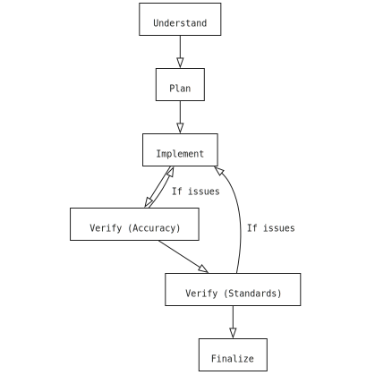

The Documentation Writer agent's configuration is primarily defined by the system prompt located at [`.fabric/templates/docs-writer/system-prompt.md`](https://github.com/pdlc-os/fabric/blob/b11448f8f01fdcf12deab96204417d87f8d46ab3/.fabric/templates/docs-writer/system-prompt.md). This prompt establishes the agent's core mandates, specific responsibilities, advanced reasoning capabilities, and a structured workflow for documentation tasks. The agent is designed to integrate seamlessly into a Git-based development process, focusing on maintaining accurate, consistent, and secure technical documentation.

The agent's mandates require it to adhere to existing documentation conventions, including style guides, terminology, tone, and formatting (e.g., Markdown, Docusaurus, MkDocs). A key responsibility is to proactively update all affected documentation, including tutorials, READMEs, and API references, whenever code changes are identified. The agent is also instructed to note ambiguities as questions for clarification and include them in [`git`](https://github.com/pdlc-os/fabric/blob/b11448f8f01fdcf12deab96204417d87f8d46ab3/agents.md?plain=1#L102) commit messages, but it is prohibited from automatically summarizing modifications unless explicitly requested. Furthermore, it cannot revert version control changes without explicit instructions and should document discrepancies between code and documentation without altering the code itself.

The agent's responsibilities include reviewing Git branch changes for documentation impact, ensuring code-documentation alignment for specific project parts, and improving documentation organization and readability through consolidation and refactoring. It can discover documentation site specifics by looking for [`AGENTS.md`](https://github.com/pdlc-os/fabric/blob/b11448f8f01fdcf12deab96204417d87f8d46ab3/harnesses/codex/config.yaml#L37) in relevant sub-directories.

To fulfill these responsibilities, the agent employs advanced reasoning and planning strategies. This includes analyzing logical dependencies against policies and prerequisites, assessing risks such as broken links, and using abductive reasoning to identify causes for code-documentation divergence. The agent prioritizes precision and grounding, ensuring documentation changes are based on actual code behavior and verifiable against existing documentation or code. It is also designed for adaptability, updating its plans and informing the user if initial refactoring becomes overly complex.

The agent follows a structured six-step workflow:

1. **Understand**: It uses [`glob`](https://github.com/pdlc-os/fabric/blob/b11448f8f01fdcf12deab96204417d87f8d46ab3/cmd/sync.go#L59) to comprehend documentation structure, site mechanics, and the underlying code.
2. **Plan**: It constructs a plan, which it may concisely share with the user.
3. **Implement**: It applies changes using tools like [`replace`](https://github.com/pdlc-os/fabric/blob/b11448f8f01fdcf12deab96204417d87f8d46ab3/cmd/cdw.go#L103) and [`write_file`](https://github.com/pdlc-os/fabric/blob/b11448f8f01fdcf12deab96204417d87f8d46ab3/extras/agent-viz/scripts/inspect_logs.py#L92), strictly adhering to project conventions.
4. **Verify (Accuracy)**: It checks that updated documentation accurately reflects the code, potentially executing doc-build or linting steps.
5. **Verify (Standards)**: It ensures language clarity, conciseness, and style adherence.
6. **Finalize**: Upon verification, it completes the task, presenting any concerns and awaiting further instructions.

Operational guidelines emphasize token efficiency, achieved by minimizing tool output tokens, using quiet/silent flags in shell commands, and redirecting large outputs to temporary files. The agent maintains a professional, direct, and concise tone and strictly adheres to security best practices, never exposing sensitive information. This comprehensive configuration ensures the Documentation Writer agent functions as an efficient and secure assistant, balancing conciseness with clarity and technical accuracy while prioritizing user control and project conventions. For details on how other agent configurations are managed, refer to [Agent Configuration and Operational Parameters](#agent-configuration-and-operational-parameters).

### Instance Manager Agent Configuration and GCP VM Integration

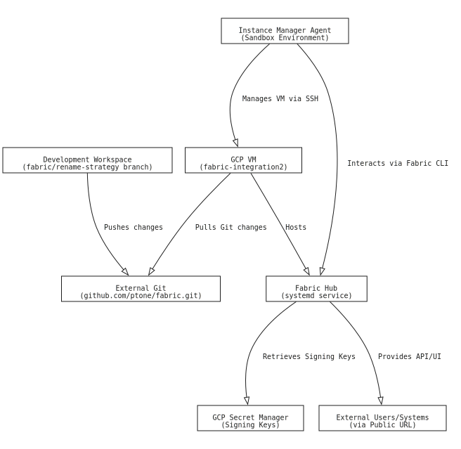

The Instance Manager agent's configuration is central to orchestrating autonomous Fabric agents and managing a dedicated GCP VM for integration testing. This setup enables automated testing and deployment within a controlled environment, ensuring the [`fabric`](https://github.com/pdlc-os/fabric/blob/b11448f8f01fdcf12deab96204417d87f8d46ab3/README.md?plain=1#L1) repository's changes are thoroughly validated.

The agent adheres to a strict Git workflow tailored for sandboxed, non-interactive environments, as defined in [`.fabric/templates/instance-manager/agents-git.md`](https://github.com/pdlc-os/fabric/blob/b11448f8f01fdcf12deab96204417d87f8d46ab3/.fabric/templates/instance-manager/agents-git.md). This protocol emphasizes local-only operations, prohibiting network-dependent Git commands such as [`fetch`](https://github.com/pdlc-os/fabric/blob/b11448f8f01fdcf12deab96204417d87f8d46ab3/agents.md?plain=1#L107), [`pull`](https://github.com/pdlc-os/fabric/blob/b11448f8f01fdcf12deab96204417d87f8d46ab3/agents.md?plain=1#L107), or [`push`](https://github.com/pdlc-os/fabric/blob/b11448f8f01fdcf12deab96204417d87f8d46ab3/extras/fabric-a2a-bridge/internal/bridge/bridge.go#L58). Instead, it mandates direct references for comparisons ([`git diff main...HEAD`](https://github.com/pdlc-os/fabric/blob/b11448f8f01fdcf12deab96204417d87f8d46ab3/agents.md?plain=1#L102)) and rebasing ([`git rebase main`](https://github.com/pdlc-os/fabric/blob/b11448f8f01fdcf12deab96204417d87f8d46ab3/agents.md?plain=1#L102)). A key aspect is non-interactive conflict resolution, which bypasses traditional editors like Vi/Vim using environment variables and flags such as [`GIT_EDITOR=true git rebase --continue`](https://github.com/pdlc-os/fabric/blob/b11448f8f01fdcf12deab96204417d87f8d46ab3/agents.md?plain=1#L102) to prevent execution hangs. This ensures that Git operations proceed automatically without requiring human intervention in the sandbox.

Operational instructions for interacting with the [`fabric`](https://github.com/pdlc-os/fabric/blob/b11448f8f01fdcf12deab96204417d87f8d46ab3/README.md?plain=1#L1) CLI are provided in [`.fabric/templates/instance-manager/agents-hub.md`](https://github.com/pdlc-os/fabric/blob/b11448f8f01fdcf12deab96204417d87f8d46ab3/.fabric/templates/instance-manager/agents-hub.md). Agents are required to use the [`--non-interactive`](https://github.com/pdlc-os/fabric/blob/b11448f8f01fdcf12deab96204417d87f8d46ab3/cmd/root.go#L40) flag with all [`fabric`](https://github.com/pdlc-os/fabric/blob/b11448f8f01fdcf12deab96204417d87f8d46ab3/README.md?plain=1#L1) CLI commands to prevent blocking prompts and [`--format json`](https://github.com/pdlc-os/fabric/blob/b11448f8f01fdcf12deab96204417d87f8d46ab3/cmd/hub.go#L1045) for machine-readable output. This ensures predictable and automatable command execution. Commands like [`fabric look <agent-id>`](https://github.com/pdlc-os/fabric/blob/b11448f8f01fdcf12deab96204417d87f8d46ab3/skills/fabric-cli-operations/SKILL.md?plain=1#L6) allow agents to inspect the output of other running agents, while [`fabrictool status blocked "<reason>"`](https://github.com/pdlc-os/fabric/blob/b11448f8f01fdcf12deab96204417d87f8d46ab3/skills/fabric-messaging/SKILL.md?plain=1#L15) is used to signal an intentional pause, preventing false stall detections. Agents are explicitly forbidden from using commands like [`sync`](https://github.com/pdlc-os/fabric/blob/b11448f8f01fdcf12deab96204417d87f8d46ab3/pkg/runtime/mock.go#L101) or [`cdw`](https://github.com/pdlc-os/fabric/blob/b11448f8f01fdcf12deab96204417d87f8d46ab3/cmd/cdw.go#L31), or accessing system internals via [`--no-hub`](https://github.com/pdlc-os/fabric/blob/b11448f8f01fdcf12deab96204417d87f8d46ab3/cmd/hub.go#L793) or [`--global`](https://github.com/pdlc-os/fabric/blob/b11448f8f01fdcf12deab96204417d87f8d46ab3/cmd/hub.go#L234), reinforcing their operation within defined boundaries. The document also outlines how agents should manage their status and communicate with users, using commands like [`fabrictool status ask_user "<question>"`](https://github.com/pdlc-os/fabric/blob/b11448f8f01fdcf12deab96204417d87f8d46ab3/docs-site/AGENTS.md?plain=1#L100) before prompting for input and [`fabrictool status task_completed "<task title>"`](https://github.com/pdlc-os/fabric/blob/b11448f8f01fdcf12deab96204417d87f8d46ab3/docs-site/AGENTS.md?plain=1#L100) upon task completion, as detailed in [`.fabric/templates/instance-manager/agents.md`](https://github.com/pdlc-os/fabric/blob/b11448f8f01fdcf12deab96204417d87f8d46ab3/.fabric/templates/instance-manager/agents.md). See [Standard Agent Status Signaling Protocol](#fabric-platform-skills-standard-agent-status-signaling-protocol) for a more general overview of status signaling.

The comprehensive management procedures for the GCP VM dedicated to [`fabric`](https://github.com/pdlc-os/fabric/blob/b11448f8f01fdcf12deab96204417d87f8d46ab3/README.md?plain=1#L1) repository integration testing are detailed in [`.fabric/templates/instance-manager/system-prompt.md`](https://github.com/pdlc-os/fabric/blob/b11448f8f01fdcf12deab96204417d87f8d46ab3/.fabric/templates/instance-manager/system-prompt.md). This includes specifics on SSH access via [`gcloud compute ssh`](https://github.com/pdlc-os/fabric/blob/b11448f8f01fdcf12deab96204417d87f8d46ab3/extras/fabric-chat-app/README.md?plain=1#L224), VM configuration (instance name, zone, project), and the location of the [`fabric`](https://github.com/pdlc-os/fabric/blob/b11448f8f01fdcf12deab96204417d87f8d46ab3/README.md?plain=1#L1) repository ([`/home/fabric/fabric`](https://github.com/pdlc-os/fabric/blob/b11448f8f01fdcf12deab96204417d87f8d46ab3/cmd/server_foreground.go#L2039)). The [`fabric-hub`](https://github.com/pdlc-os/fabric/blob/b11448f8f01fdcf12deab96204417d87f8d46ab3/pkg/hub/server.go#L213) service, managed by [`systemd`](https://github.com/pdlc-os/fabric/blob/b11448f8f01fdcf12deab96204417d87f8d46ab3/go.mod#L93), is central to this environment, with its configuration, environment variables, settings, and database paths explicitly defined. The document also provides common [`gcloud compute ssh`](https://github.com/pdlc-os/fabric/blob/b11448f8f01fdcf12deab96204417d87f8d46ab3/extras/fabric-chat-app/README.md?plain=1#L224) commands for service management, such as checking service status, pulling the latest code, rebuilding and restarting the hub, and viewing logs. The integration testing workflow involves pushing changes to a remote repository and then pulling and rebuilding them on the VM.

Furthermore, the configuration addresses secure communication and authentication within the integration environment. It specifies the use of Integration Hub Signing Keys (user and agent keys using [`HS256`](https://github.com/pdlc-os/fabric/blob/b11448f8f01fdcf12deab96204417d87f8d46ab3/pkg/hub/web.go#L451) from GCP Secret Manager) and provides instructions for generating test user tokens. These JWTs include specific headers and claims (e.g., [`iss`](https://github.com/pdlc-os/fabric/blob/b11448f8f01fdcf12deab96204417d87f8d46ab3/pkg/hub/proxyauth.go#L145), [`sub`](https://github.com/pdlc-os/fabric/blob/b11448f8f01fdcf12deab96204417d87f8d46ab3/pkg/eventbus/inprocess.go#L51), [`aud`](https://github.com/pdlc-os/fabric/blob/b11448f8f01fdcf12deab96204417d87f8d46ab3/pkg/hub/proxyauth.go#L147), [`uid`](https://github.com/pdlc-os/fabric/blob/b11448f8f01fdcf12deab96204417d87f8d46ab3/pkg/config/settings_v1.go#L517), [`email`](https://github.com/pdlc-os/fabric/blob/b11448f8f01fdcf12deab96204417d87f8d46ab3/pkg/hub/web.go#L98), [`role`](https://github.com/pdlc-os/fabric/blob/b11448f8f01fdcf12deab96204417d87f8d46ab3/pkg/hub/devauth.go#L96)) to facilitate testing of authentication and authorization mechanisms. This robust setup ensures that all interactions, from Git operations to [`fabric-hub`](https://github.com/pdlc-os/fabric/blob/b11448f8f01fdcf12deab96204417d87f8d46ab3/pkg/hub/server.go#L213) service management and token generation, are controlled and secure.

### Semantic Release Notes Agent Configuration

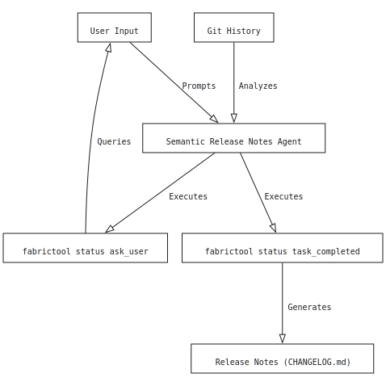

The Release Notes agent is designed to automate the generation of high-quality, semantic release notes directly from a Git commit history. Its configuration focuses on ensuring accuracy, adherence to specific formatting rules, and secure operation within the Fabric platform. This agent operates primarily as a read-only entity, though it can write generated notes to a file like [`CHANGELOG.md`](https://github.com/pdlc-os/fabric/blob/b11448f8f01fdcf12deab96204417d87f8d46ab3/.gcloudignore#L90) upon explicit instruction.

A central configuration for this agent is defined within the file [`.fabric/templates/release-notes/system-prompt.md`](https://github.com/pdlc-os/fabric/blob/b11448f8f01fdcf12deab96204417d87f8d46ab3/.fabric/templates/release-notes/system-prompt.md). This prompt acts as an expert Release Engineer, outlining the agent's core mandates and operational guidelines. It emphasizes the need for Git precision, requiring exact Git-compatible date strings for queries and translating vague user inputs into precise ranges for [`git log`](https://github.com/pdlc-os/fabric/blob/b11448f8f01fdcf12deab96204417d87f8d46ab3/go.mod#L44) commands. Security is a paramount concern, with strict prohibitions against exposing sensitive information such as secrets or API keys during its operation.

The agent follows a defined four-step workflow for generating release notes:

1. **Information Gathering and Abductive Reasoning:** This involves parsing date ranges and extracting commits using shell commands.
2. **Risk Assessment and Deep Analysis:** The agent assesses the significance of commit messages and performs deeper analyses using [`git show`](https://github.com/pdlc-os/fabric/blob/b11448f8f01fdcf12deab96204417d87f8d46ab3/Makefile#L130) for potentially vague but important commits.
3. **Synthesis and Planning:** Commits are grouped and condensed into logical features and fixes, with noise (e.g., minor cleanup, non-behavior-affecting refactors) filtered out.
4. **Execution and Output:** The final Markdown output is generated, presenting release notes clearly and concisely.

The release notes must adhere to strict formatting guidelines, categorizing changes into [`Features`](https://github.com/pdlc-os/fabric/blob/b11448f8f01fdcf12deab96204417d87f8d46ab3/extras/fabric-chat-app/README.md?plain=1#L5) and [`Fixes`](https://github.com/pdlc-os/fabric/blob/b11448f8f01fdcf12deab96204417d87f8d46ab3/changelog/2026-04-27-changelog.md?plain=1#L16), prioritizing them by significance, and prominently highlighting [`⚠️ BREAKING CHANGES`](https://github.com/pdlc-os/fabric/blob/b11448f8f01fdcf12deab96204417d87f8d46ab3/changelog/2026-04-27-changelog.md?plain=1#L5). Related serial commits are synthesized into single bullet points to improve readability. The agent's adaptability allows it to adjust its strategy for large numbers of commits, such as filtering by [`git log --merges`](https://github.com/pdlc-os/fabric/blob/b11448f8f01fdcf12deab96204417d87f8d46ab3/agents.md?plain=1#L102) or prompting the user for a more summarized approach.

Interaction protocols for this agent are specified in [`.fabric/templates/release-notes/agents.md`](https://github.com/pdlc-os/fabric/blob/b11448f8f01fdcf12deab96204417d87f8d46ab3/.fabric/templates/release-notes/agents.md). This document details how the agent should communicate with a user within the [`fabrictool`](https://github.com/pdlc-os/fabric/blob/b11448f8f01fdcf12deab96204417d87f8d46ab3/docs-site/src/content/docs/glossary.md?plain=1#L44) environment, specifically by using [`fabrictool status ask_user`](https://github.com/pdlc-os/fabric/blob/b11448f8f01fdcf12deab96204417d87f8d46ab3/docs-site/AGENTS.md?plain=1#L100) before requesting input and [`fabrictool status task_completed`](https://github.com/pdlc-os/fabric/blob/b11448f8f01fdcf12deab96204417d87f8d46ab3/docs-site/AGENTS.md?plain=1#L100) to signal task completion. These commands ensure that the agent's interaction with the user is structured and that it avoids unnecessary conversational loops after a task is finished. For a broader understanding of how agents manage their lifecycle and orchestrate tasks, refer to [Agent Lifecycle Management and Orchestration](#fabric-agent-orchestration-and-management-agent-lifecycle-management-and-orchestration).

### Web Development Agent and Chrome DevTools Integration

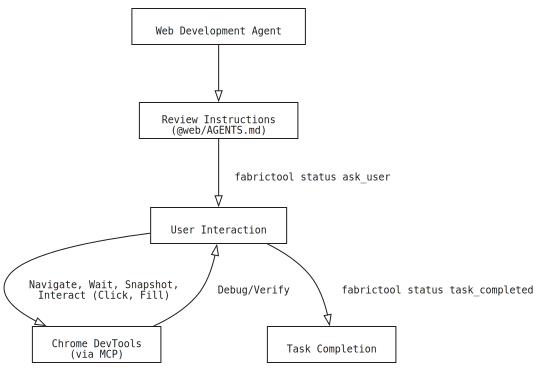

The Web Development agent's configuration, found in [`.fabric/templates/web-dev`](https://github.com/pdlc-os/fabric/blob/b11448f8f01fdcf12deab96204417d87f8d46ab3/.fabric/templates/web-dev), outlines its operational protocols and skill set. The agent is designed to interact with users and perform web development tasks, particularly leveraging Chrome DevTools through the Managed Cloud Platform (MCP). Communication protocols dictate that the agent must signal its need for user input by executing [`fabrictool status ask_user "<question>"`](https://github.com/pdlc-os/fabric/blob/b11448f8f01fdcf12deab96204417d87f8d46ab3/docs-site/AGENTS.md?plain=1#L100) and mark task completion with [`fabrictool status task_completed "<task title>"`](https://github.com/pdlc-os/fabric/blob/b11448f8f01fdcf12deab96204417d87f8d46ab3/docs-site/AGENTS.md?plain=1#L100). This ensures clear communication and prevents unintended further interactions.

The agent is defined with the skills of a Frontend Developer, with an initial action of reviewing instructions in [`.fabric/templates/web-dev/agents.md`](https://github.com/pdlc-os/fabric/blob/b11448f8f01fdcf12deab96204417d87f8d46ab3/.fabric/templates/web-dev/agents.md). A core component of this agent's capabilities is its efficient use of Chrome DevTools, detailed in [`.fabric/templates/web-dev/skills/chrome-devtools/SKILL.md`](https://github.com/pdlc-os/fabric/blob/b11448f8f01fdcf12deab96204417d87f8d46ab3/.fabric/templates/web-dev/skills/chrome-devtools/SKILL.md). This involves understanding the browser lifecycle, where Chrome starts automatically and maintains a persistent profile configured via MCP server arguments. Interaction with web pages is managed by selecting active pages and then using unique identifiers ([`uid`](https://github.com/pdlc-os/fabric/blob/b11448f8f01fdcf12deab96204417d87f8d46ab3/pkg/config/settings_v1.go#L517)s) retrieved from snapshots to interact with elements (e.g., [`click`](https://github.com/pdlc-os/fabric/blob/b11448f8f01fdcf12deab96204417d87f8d46ab3/web/AGENTS.md?plain=1#L112), [`fill`](https://github.com/pdlc-os/fabric/blob/b11448f8f01fdcf12deab96204417d87f8d46ab3/web/AGENTS.md?plain=1#L139)).

The workflow for web development tasks emphasizes a sequence of actions: navigating to a page, waiting for content to load, taking a snapshot of the page structure to identify elements, and then performing interactions. For efficiency, the agent can retrieve data by specifying file paths for large outputs, using pagination, and filtering by data types. The system distinguishes between [`take_snapshot`](https://github.com/pdlc-os/fabric/blob/b11448f8f01fdcf12deab96204417d87f8d46ab3/web/AGENTS.md?plain=1#L303) for automation due to its speed and text-based output, and [`take_screenshot`](https://github.com/pdlc-os/fabric/blob/b11448f8f01fdcf12deab96204417d87f8d46ab3/web/AGENTS.md?plain=1#L303) for visual inspection. Parallel execution of tool calls is supported, provided the order of operations—navigate, wait, snapshot, interact—is maintained. A [`system-prompt.md`](https://github.com/pdlc-os/fabric/blob/b11448f8f01fdcf12deab96204417d87f8d46ab3/pkg/agent/provision.go#L960) file in [`.fabric/templates/web-dev/system-prompt.md`](https://github.com/pdlc-os/fabric/blob/b11448f8f01fdcf12deab96204417d87f8d46ab3/.fabric/templates/web-dev/system-prompt.md) acts as a placeholder for future system prompt definitions.

### Bundled Resources and Platform Skills

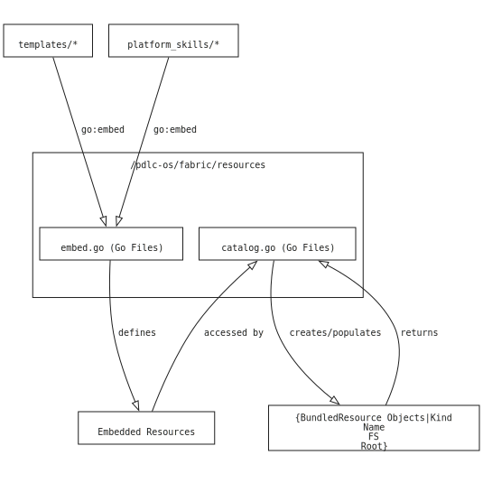

Bundled resources, including default templates, harness configurations, and platform-specific skills, are embedded directly into the application's binary to ensure consistency and availability. These resources are accessed and managed to maintain proper structure and adherence to operational standards. The [`resources`](https://github.com/pdlc-os/fabric/blob/b11448f8f01fdcf12deab96204417d87f8d46ab3/resources) directory is central to this mechanism, defining how various built-in assets, such as agent templates and platform skills, are cataloged and made available to the system.

The [`embed`](https://github.com/pdlc-os/fabric/blob/b11448f8f01fdcf12deab96204417d87f8d46ab3/agents.md?plain=1#L80) package in Go is used to integrate static assets directly into the Fabric application's binary. This includes templates from the [`resources/templates`](https://github.com/pdlc-os/fabric/blob/b11448f8f01fdcf12deab96204417d87f8d46ab3/resources/templates) directory and platform skills from [`resources/platform_skills`](https://github.com/pdlc-os/fabric/blob/b11448f8f01fdcf12deab96204417d87f8d46ab3/resources/platform_skills). Each embedded resource is represented by a [`BundledResource`](https://github.com/pdlc-os/fabric/blob/b11448f8f01fdcf12deab96204417d87f8d46ab3/resources/catalog.go#L27) object, which encapsulates its kind, name, scope, and provides an interface for accessing its content. For example, [`BuiltinTemplates`](https://github.com/pdlc-os/fabric/blob/b11448f8f01fdcf12deab96204417d87f8d46ab3/resources/catalog.go#L54) and [`BuiltinHarnessConfigs`](https://github.com/pdlc-os/fabric/blob/b11448f8f01fdcf12deab96204417d87f8d46ab3/resources/catalog.go#L73) functions systematically retrieve these predefined resources. The system also generates [`SourceURL`](https://github.com/pdlc-os/fabric/blob/b11448f8f01fdcf12deab96204417d87f8d46ab3/pkg/store/models.go#L484) values for these bundled resources, typically using a [`builtin://fabric`](https://github.com/pdlc-os/fabric/blob/b11448f8f01fdcf12deab96204417d87f8d46ab3/resources/catalog.go#L46) scheme, which helps in tracking their origin.

The templates, found in [`resources/templates/default`](https://github.com/pdlc-os/fabric/blob/b11448f8f01fdcf12deab96204417d87f8d46ab3/resources/templates/default), define core operational protocols for autonomous Fabric agents. These include specific guidelines for Git workflows in restricted, non-interactive sandbox environments ([`resources/templates/default/agents-git.md`](https://github.com/pdlc-os/fabric/blob/b11448f8f01fdcf12deab96204417d87f8d46ab3/resources/templates/default/agents-git.md)), instructions for interacting with the Fabric orchestration system via the [`fabric`](https://github.com/pdlc-os/fabric/blob/b11448f8f01fdcf12deab96204417d87f8d46ab3/README.md?plain=1#L1) CLI ([`resources/templates/default/agents-hub.md`](https://github.com/pdlc-os/fabric/blob/b11448f8f01fdcf12deab96204417d87f8d46ab3/resources/templates/default/agents-hub.md)), and protocols for managing agent status signals ([`resources/templates/default/agents.md`](https://github.com/pdlc-os/fabric/blob/b11448f8f01fdcf12deab96204417d87f8d46ab3/resources/templates/default/agents.md)).

Platform skills, located in [`resources/platform_skills`](https://github.com/pdlc-os/fabric/blob/b11448f8f01fdcf12deab96204417d87f8d46ab3/resources/platform_skills), provide foundational knowledge and operational constraints for agents. These skills cover a range of functionalities:

- **Agent Status Signaling**: The [`resources/platform_skills/agent-status-signals`](https://github.com/pdlc-os/fabric/blob/b11448f8f01fdcf12deab96204417d87f8d46ab3/resources/platform_skills/agent-status-signals) directory defines a mandatory protocol for agents to signal their status using [`fabrictool status`](https://github.com/pdlc-os/fabric/blob/b11448f8f01fdcf12deab96204417d87f8d46ab3/GLOSSARY.md?plain=1#L50) commands, such as [`ask_user`](https://github.com/pdlc-os/fabric/blob/b11448f8f01fdcf12deab96204417d87f8d46ab3/skills/README.md?plain=1#L13), [`blocked`](https://github.com/pdlc-os/fabric/blob/b11448f8f01fdcf12deab96204417d87f8d46ab3/cmd/root.go#L436), and [`task_completed`](https://github.com/pdlc-os/fabric/blob/b11448f8f01fdcf12deab96204417d87f8d46ab3/skills/README.md?plain=1#L13). This prevents false stall detections and facilitates real-time communication of agent states. See [Standard Agent Status Signaling Protocol](#fabric-platform-skills-standard-agent-status-signaling-protocol) for more details.
- **Git Sandbox Operations**: The [`resources/platform_skills/git-sandbox`](https://github.com/pdlc-os/fabric/blob/b11448f8f01fdcf12deab96204417d87f8d46ab3/resources/platform_skills/git-sandbox) directory outlines a strict Git workflow for agents operating in restricted [`worktree`](https://github.com/pdlc-os/fabric/blob/b11448f8f01fdcf12deab96204417d87f8d46ab3/agents.md?plain=1#L102) environments. This ensures agents perform Git operations in an air-gapped, non-interactive manner, emphasizing local-only operations and structured conflict resolution. See [Git Workflow for Sandboxed Environments](#fabric-platform-skills-git-workflow-for-sandboxed-environments) for further information.
- **Fabric CLI Operations**: The [`resources/platform_skills/fabric`](https://github.com/pdlc-os/fabric/blob/b11448f8f01fdcf12deab96204417d87f8d46ab3/resources/platform_skills/fabric) and [`resources/platform_skills/fabric-cli-operations`](https://github.com/pdlc-os/fabric/blob/b11448f8f01fdcf12deab96204417d87f8d46ab3/resources/platform_skills/fabric-cli-operations) directories provide core functionalities for orchestrating concurrent LLM-based agents via the [`fabric`](https://github.com/pdlc-os/fabric/blob/b11448f8f01fdcf12deab96204417d87f8d46ab3/README.md?plain=1#L1) CLI tool and its wrapper scripts ([`resources/platform_skills/fabric/scripts`](https://github.com/pdlc-os/fabric/blob/b11448f8f01fdcf12deab96204417d87f8d46ab3/resources/platform_skills/fabric/scripts)). These skills define lifecycle management commands, inter-agent messaging, and crucial operational constraints, such as mandatory use of [`--non-interactive`](https://github.com/pdlc-os/fabric/blob/b11448f8f01fdcf12deab96204417d87f8d46ab3/cmd/root.go#L40) and [`--format json`](https://github.com/pdlc-os/fabric/blob/b11448f8f01fdcf12deab96204417d87f8d46ab3/cmd/hub.go#L1045), and prohibiting certain commands. See [Fabric CLI Operations and Constraints](#fabric-platform-skills-fabric-cli-operations-and-constraints) and [Fabric Agent Lifecycle and Project Management](#fabric-platform-skills-fabric-agent-lifecycle-and-project-management) for comprehensive insights.
- **Inter-Agent Messaging**: The [`resources/platform_skills/fabric-messaging`](https://github.com/pdlc-os/fabric/blob/b11448f8f01fdcf12deab96204417d87f8d46ab3/resources/platform_skills/fabric-messaging) directory details the effective use of the [`fabric message`](https://github.com/pdlc-os/fabric/blob/b11448f8f01fdcf12deab96204417d87f8d46ab3/Makefile#L1) command for communication within the Fabric ecosystem, covering recipient types, best practices for message content and timing, and advanced messaging flags. See [Inter-Agent and User Communication Protocols](#fabric-platform-skills-inter-agent-and-user-communication-protocols) for more information.
- **Team Creation**: The [`resources/platform_skills/team-creation`](https://github.com/pdlc-os/fabric/blob/b11448f8f01fdcf12deab96204417d87f8d46ab3/resources/platform_skills/team-creation) directory describes a methodology for creating and extending Fabric agent team templates, enabling the definition of agent roles, workflows, and the integration of reusable harness skills for multi-agent orchestration. See [Team Creation and Multi-Agent Orchestration Templates](#fabric-platform-skills-team-creation-and-multi-agent-orchestration-templates) for further details.

## Fabric Agent Development Kit and Examples

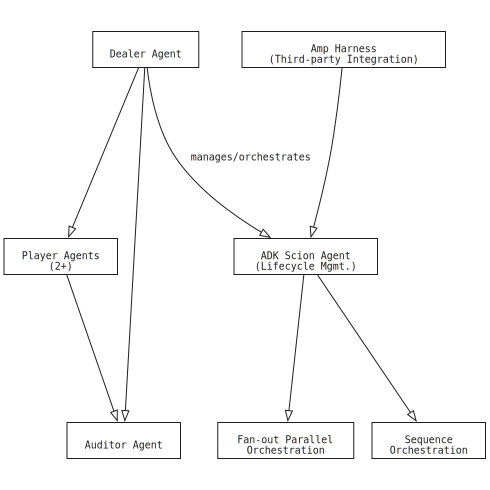

The [`examples`](https://github.com/pdlc-os/fabric/blob/b11448f8f01fdcf12deab96204417d87f8d46ab3/examples) directory contains various demonstrations of [`fabric`](https://github.com/pdlc-os/fabric/blob/b11448f8f01fdcf12deab96204417d87f8d46ab3/README.md?plain=1#L1) agent functionalities and orchestration patterns. These examples showcase how to develop and integrate agents within the [`fabric`](https://github.com/pdlc-os/fabric/blob/b11448f8f01fdcf12deab96204417d87f8d46ab3/README.md?plain=1#L1) platform, including their lifecycle management, multi-agent interactions, and different execution flows.

One example, found in [`examples/adk_fabric_agent`](https://github.com/pdlc-os/fabric/blob/b11448f8f01fdcf12deab96204417d87f8d46ab3/examples/adk_fabric_agent), illustrates how an Agent Development Kit (ADK) agent integrates with [`fabric`](https://github.com/pdlc-os/fabric/blob/b11448f8f01fdcf12deab96204417d87f8d46ab3/README.md?plain=1#L1)'s lifecycle management. This agent can report its status via [`fabrictool`](https://github.com/pdlc-os/fabric/blob/b11448f8f01fdcf12deab96204417d87f8d46ab3/docs-site/src/content/docs/glossary.md?plain=1#L44) for orchestration within a [`grove`](https://github.com/pdlc-os/fabric/blob/b11448f8f01fdcf12deab96204417d87f8d46ab3/Makefile#L72). The container image for this agent, defined in [`examples/adk_fabric_agent/Dockerfile`](https://github.com/pdlc-os/fabric/blob/b11448f8f01fdcf12deab96204417d87f8d46ab3/examples/adk_fabric_agent/Dockerfile), extends a base image to include [`google-adk`](https://github.com/pdlc-os/fabric/blob/b11448f8f01fdcf12deab96204417d87f8d46ab3/changelog/2026-04-09-changelog.md?plain=1#L8) and the agent's Python code, configuring the environment for execution and task delivery. The entry point, [`examples/adk_fabric_agent/__main__.py`](https://github.com/pdlc-os/fabric/blob/b11448f8f01fdcf12deab96204417d87f8d46ab3/examples/adk_fabric_agent/__main__.py), provides robust crash reporting, ensuring import errors and runtime failures are logged to container logs, a status file ([`agent-info.json`](https://github.com/pdlc-os/fabric/blob/b11448f8f01fdcf12deab96204417d87f8d46ab3/pkg/agent/run.go#L965)), and standard error. A lazy import mechanism in [`examples/adk_fabric_agent/__init__.py`](https://github.com/pdlc-os/fabric/blob/b11448f8f01fdcf12deab96204417d87f8d46ab3/examples/adk_fabric_agent/__init__.py) allows [`__main__.py`](https://github.com/pdlc-os/fabric/blob/b11448f8f01fdcf12deab96204417d87f8d46ab3/examples/adk_fabric_agent/README.md?plain=1#L116) to catch startup errors.

The multi-agent Texas Hold'em poker game simulation in [`examples/agent-poker`](https://github.com/pdlc-os/fabric/blob/b11448f8f01fdcf12deab96204417d87f8d46ab3/examples/agent-poker) demonstrates how [`fabric`](https://github.com/pdlc-os/fabric/blob/b11448f8f01fdcf12deab96204417d87f8d46ab3/README.md?plain=1#L1) can coordinate LLM agents through shared state and group messaging. In this simulation, [`Dealer`](https://github.com/pdlc-os/fabric/blob/b11448f8f01fdcf12deab96204417d87f8d46ab3/examples/agent-poker/README.md?plain=1#L9), [`Player`](https://github.com/pdlc-os/fabric/blob/b11448f8f01fdcf12deab96204417d87f8d46ab3/examples/agent-poker/templates/poker-player/system-prompt.md?plain=1#L1), and [`Auditor`](https://github.com/pdlc-os/fabric/blob/b11448f8f01fdcf12deab96204417d87f8d46ab3/README.md?plain=1#L87) agents interact to manage game flow, player actions, and ensure game integrity. The [`Dealer`](https://github.com/pdlc-os/fabric/blob/b11448f8f01fdcf12deab96204417d87f8d46ab3/examples/agent-poker/README.md?plain=1#L9) agent, for instance, manages the game state in [`card-table.json`](https://github.com/pdlc-os/fabric/blob/b11448f8f01fdcf12deab96204417d87f8d46ab3/examples/agent-poker/templates/poker-dealer/system-prompt.md?plain=1#L22) and controls game flow, while the [`Auditor`](https://github.com/pdlc-os/fabric/blob/b11448f8f01fdcf12deab96204417d87f8d46ab3/README.md?plain=1#L87) agent monitors for cheating.

Another example, located in [`examples/amp`](https://github.com/pdlc-os/fabric/blob/b11448f8f01fdcf12deab96204417d87f8d46ab3/examples/amp), provides an Amp harness for [`fabric`](https://github.com/pdlc-os/fabric/blob/b11448f8f01fdcf12deab96204417d87f8d46ab3/README.md?plain=1#L1). This demonstrates how to integrate external tools without modifying [`fabric`](https://github.com/pdlc-os/fabric/blob/b11448f8f01fdcf12deab96204417d87f8d46ab3/README.md?plain=1#L1)'s core Go code. It involves installing the [`amp`](https://github.com/pdlc-os/fabric/blob/b11448f8f01fdcf12deab96204417d87f8d46ab3/examples/amp/README.md?plain=1#L1) CLI, handling authentication, setting up the environment, and reconciling [`amp`](https://github.com/pdlc-os/fabric/blob/b11448f8f01fdcf12deab96204417d87f8d46ab3/examples/amp/README.md?plain=1#L1) settings, all through configuration and scripting.

The [`fabric`](https://github.com/pdlc-os/fabric/blob/b11448f8f01fdcf12deab96204417d87f8d46ab3/README.md?plain=1#L1) orchestration patterns are further explored in [`examples/orchestration-basics`](https://github.com/pdlc-os/fabric/blob/b11448f8f01fdcf12deab96204417d87f8d46ab3/examples/orchestration-basics). This directory showcases both parallel fan-out processing, where an orchestrator agent dispatches tasks to multiple researcher agents concurrently, and sequential task execution, illustrating a workflow involving data fetching, processing, and reporting across agents.

### ADK Agent Lifecycle and Status Reporting

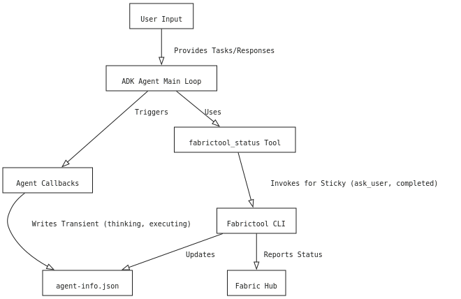

ADK (Agent Development Kit) agents integrate with Fabric's lifecycle management through various mechanisms for reporting status, handling interactive input, and ensuring robust execution within a containerized environment. This integration is exemplified by the [`adk_fabric_agent`](https://github.com/pdlc-os/fabric/blob/b11448f8f01fdcf12deab96204417d87f8d46ab3/examples/adk_fabric_agent/run.py#L27) example in [`examples/adk_fabric_agent`](https://github.com/pdlc-os/fabric/blob/b11448f8f01fdcf12deab96204417d87f8d46ab3/examples/adk_fabric_agent).

The agent employs two types of status reporting via [`fabrictool`](https://github.com/pdlc-os/fabric/blob/b11448f8f01fdcf12deab96204417d87f8d46ab3/docs-site/src/content/docs/glossary.md?plain=1#L44). Transient activities, such as "thinking," "executing," or "working," are managed by writing to a local JSON file ([`agent-info.json`](https://github.com/pdlc-os/fabric/blob/b11448f8f01fdcf12deab96204417d87f8d46ab3/pkg/agent/run.go#L965)) using [`fabrictool.write_agent_status`](https://github.com/pdlc-os/fabric/blob/b11448f8f01fdcf12deab96204417d87f8d46ab3/examples/adk_fabric_agent/callbacks.py#L33) in [`examples/adk_fabric_agent/fabrictool.py`](https://github.com/pdlc-os/fabric/blob/b11448f8f01fdcf12deab96204417d87f8d46ab3/examples/adk_fabric_agent/fabrictool.py). These updates provide real-time feedback on the agent's immediate state. For critical, persistent state changes, or "sticky" activities like "ask_user," "blocked," or "task_completed," the agent invokes the [`fabrictool`](https://github.com/pdlc-os/fabric/blob/b11448f8f01fdcf12deab96204417d87f8d46ab3/docs-site/src/content/docs/glossary.md?plain=1#L44) CLI via [`fabrictool.run_status`](https://github.com/pdlc-os/fabric/blob/b11448f8f01fdcf12deab96204417d87f8d46ab3/examples/adk_fabric_agent/tools.py#L50) in [`examples/adk_fabric_agent/tools.py`](https://github.com/pdlc-os/fabric/blob/b11448f8f01fdcf12deab96204417d87f8d46ab3/examples/adk_fabric_agent/tools.py). This mechanism ensures that important lifecycle events are reported to the Fabric Hub, preventing less significant transient states from overwriting them. Guidelines for when an agent should signal these states are defined in [`examples/adk_fabric_agent/templates/adk`](https://github.com/pdlc-os/fabric/blob/b11448f8f01fdcf12deab96204417d87f8d46ab3/examples/adk_fabric_agent/templates/adk).

Interactive input handling for ADK agents is facilitated through a custom runner in [`examples/adk_fabric_agent/run.py`](https://github.com/pdlc-os/fabric/blob/b11448f8f01fdcf12deab96204417d87f8d46ab3/examples/adk_fabric_agent/run.py). This runner allows an initial message to be provided via a command-line flag and then transitions into an interactive loop. This design enables Fabric's runtime to deliver subsequent messages to the agent using [`tmux send-keys`](https://github.com/pdlc-os/fabric/blob/b11448f8f01fdcf12deab96204417d87f8d46ab3/cmd/message.go#L271) when operating within a container.

Agents are containerized using a [`Dockerfile`](https://github.com/pdlc-os/fabric/blob/b11448f8f01fdcf12deab96204417d87f8d46ab3/agents.md?plain=1#L138) located in [`examples/adk_fabric_agent/Dockerfile`](https://github.com/pdlc-os/fabric/blob/b11448f8f01fdcf12deab96204417d87f8d46ab3/examples/adk_fabric_agent/Dockerfile). This Dockerfile extends a [`fabric-base`](https://github.com/pdlc-os/fabric/blob/b11448f8f01fdcf12deab96204417d87f8d46ab3/cmd/build.go#L84) image, setting up the necessary Python environment and dependencies like [`google-adk`](https://github.com/pdlc-os/fabric/blob/b11448f8f01fdcf12deab96204417d87f8d46ab3/changelog/2026-04-09-changelog.md?plain=1#L8) from source. It configures the container for agent execution, including the specific entry point for task delivery.

A robust entry point, implemented in [`examples/adk_fabric_agent/__main__.py`](https://github.com/pdlc-os/fabric/blob/b11448f8f01fdcf12deab96204417d87f8d46ab3/examples/adk_fabric_agent/__main__.py), wraps the agent's core application logic with comprehensive crash reporting. This ensures that any import errors or runtime failures are logged to container logs, a designated status file ([`agent-info.json`](https://github.com/pdlc-os/fabric/blob/b11448f8f01fdcf12deab96204417d87f8d46ab3/pkg/agent/run.go#L965)), and standard error. This multi-channel reporting mechanism enhances observability and aids in debugging agents running in isolated or headless environments. Additionally, an [`__init__.py`](https://github.com/pdlc-os/fabric/blob/b11448f8f01fdcf12deab96204417d87f8d46ab3/examples/adk_fabric_agent/README.md?plain=1#L115) in [`examples/adk_fabric_agent/__init__.py`](https://github.com/pdlc-os/fabric/blob/b11448f8f01fdcf12deab96204417d87f8d46ab3/examples/adk_fabric_agent/__init__.py) uses lazy importing for the agent to allow [`__main__.py`](https://github.com/pdlc-os/fabric/blob/b11448f8f01fdcf12deab96204417d87f8d46ab3/examples/adk_fabric_agent/README.md?plain=1#L116) to catch startup errors.

### Multi-Agent Poker Simulation

The Fabric platform demonstrates multi-agent collaboration through a simulated Texas Hold'em poker game, involving [`Dealer`](https://github.com/pdlc-os/fabric/blob/b11448f8f01fdcf12deab96204417d87f8d46ab3/examples/agent-poker/README.md?plain=1#L9), [`Player`](https://github.com/pdlc-os/fabric/blob/b11448f8f01fdcf12deab96204417d87f8d46ab3/examples/agent-poker/templates/poker-player/system-prompt.md?plain=1#L1), and [`Auditor`](https://github.com/pdlc-os/fabric/blob/b11448f8f01fdcf12deab96204417d87f8d46ab3/README.md?plain=1#L87) agents. This simulation orchestrates LLM-based agents to manage game flow, player actions, and ensure game integrity, relying on shared state and inter-agent messaging.

The [`Dealer`](https://github.com/pdlc-os/fabric/blob/b11448f8f01fdcf12deab96204417d87f8d46ab3/examples/agent-poker/README.md?plain=1#L9) agent, defined by [`examples/agent-poker/templates/poker-dealer/system-prompt.md`](https://github.com/pdlc-os/fabric/blob/b11448f8f01fdcf12deab96204417d87f8d46ab3/examples/agent-poker/templates/poker-dealer/system-prompt.md), acts as the central orchestrator. It is responsible for game setup, including initializing [`Player`](https://github.com/pdlc-os/fabric/blob/b11448f8f01fdcf12deab96204417d87f8d46ab3/examples/agent-poker/templates/poker-player/system-prompt.md?plain=1#L1) and [`Auditor`](https://github.com/pdlc-os/fabric/blob/b11448f8f01fdcf12deab96204417d87f8d46ab3/README.md?plain=1#L87) agents, managing the card deck using the [`python3 ~/deck.py`](https://github.com/pdlc-os/fabric/blob/b11448f8f01fdcf12deab96204417d87f8d46ab3/examples/agent-poker/templates/poker-dealer/system-prompt.md?plain=1#L11) script located at [`examples/agent-poker/templates/poker-dealer/home/deck.py`](https://github.com/pdlc-os/fabric/blob/b11448f8f01fdcf12deab96204417d87f8d46ab3/examples/agent-poker/templates/poker-dealer/home/deck.py), and establishing the initial game state in [`card-table.json`](https://github.com/pdlc-os/fabric/blob/b11448f8f01fdcf12deab96204417d87f8d46ab3/examples/agent-poker/templates/poker-dealer/system-prompt.md?plain=1#L22). The [`Dealer`](https://github.com/pdlc-os/fabric/blob/b11448f8f01fdcf12deab96204417d87f8d46ab3/examples/agent-poker/README.md?plain=1#L9) progresses the game through phases (e.g., Pre-flop, Flop, Turn, River, Showdown), enforcing betting rules and resolving hands. It uses [`broadcast`](https://github.com/pdlc-os/fabric/blob/b11448f8f01fdcf12deab96204417d87f8d46ab3/extras/fabric-a2a-bridge/internal/bridge/stream.go#L114) messages for public announcements and [`direct message`](https://github.com/pdlc-os/fabric/blob/b11448f8f01fdcf12deab96204417d87f8d46ab3/agents.md?plain=1#L113) for private communications, such as dealing hole cards to players and providing a shadow record to the [`Auditor`](https://github.com/pdlc-os/fabric/blob/b11448f8f01fdcf12deab96204417d87f8d46ab3/README.md?plain=1#L87).

[`Player`](https://github.com/pdlc-os/fabric/blob/b11448f8f01fdcf12deab96204417d87f8d46ab3/examples/agent-poker/templates/poker-player/system-prompt.md?plain=1#L1) agents, guided by [`examples/agent-poker/templates/poker-player/system-prompt.md`](https://github.com/pdlc-os/fabric/blob/b11448f8f01fdcf12deab96204417d87f8d46ab3/examples/agent-poker/templates/poker-player/system-prompt.md), make betting decisions (e.g., [`fold`](https://github.com/pdlc-os/fabric/blob/b11448f8f01fdcf12deab96204417d87f8d46ab3/pkg/ent/entc/migrate_alpha.go#L212), [`check`](https://github.com/pdlc-os/fabric/blob/b11448f8f01fdcf12deab96204417d87f8d46ab3/pkg/hub/imagecheck/checker.go#L20), [`call`](https://github.com/pdlc-os/fabric/blob/b11448f8f01fdcf12deab96204417d87f8d46ab3/cmd/hub.go#L2260), [`raise`](https://github.com/pdlc-os/fabric/blob/b11448f8f01fdcf12deab96204417d87f8d46ab3/agents.md?plain=1#L177), [`all-in`](https://github.com/pdlc-os/fabric/blob/b11448f8f01fdcf12deab96204417d87f8d46ab3/GLOSSARY.md?plain=1#L170)). They receive private hole cards from the [`Dealer`](https://github.com/pdlc-os/fabric/blob/b11448f8f01fdcf12deab96204417d87f8d46ab3/examples/agent-poker/README.md?plain=1#L9) and observe the shared [`card-table.json`](https://github.com/pdlc-os/fabric/blob/b11448f8f01fdcf12deab96204417d87f8d46ab3/examples/agent-poker/templates/poker-dealer/system-prompt.md?plain=1#L22) for current game state information. Player actions are communicated via [`broadcast`](https://github.com/pdlc-os/fabric/blob/b11448f8f01fdcf12deab96204417d87f8d46ab3/extras/fabric-a2a-bridge/internal/bridge/stream.go#L114) messages. The simulation allows [`Player`](https://github.com/pdlc-os/fabric/blob/b11448f8f01fdcf12deab96204417d87f8d46ab3/examples/agent-poker/templates/poker-player/system-prompt.md?plain=1#L1) agents to attempt cheating, which introduces a challenge for the [`Auditor`](https://github.com/pdlc-os/fabric/blob/b11448f8f01fdcf12deab96204417d87f8d46ab3/README.md?plain=1#L87).

The [`Auditor`](https://github.com/pdlc-os/fabric/blob/b11448f8f01fdcf12deab96204417d87f8d46ab3/README.md?plain=1#L87) agent, specified in [`examples/agent-poker/templates/poker-auditor/system-prompt.md`](https://github.com/pdlc-os/fabric/blob/b11448f8f01fdcf12deab96204417d87f8d46ab3/examples/agent-poker/templates/poker-auditor/system-prompt.md), functions as an independent observer to maintain game integrity. It receives shadow copies of dealt cards from the [`Dealer`](https://github.com/pdlc-os/fabric/blob/b11448f8f01fdcf12deab96204417d87f8d46ab3/examples/agent-poker/README.md?plain=1#L9) via [`direct message`](https://github.com/pdlc-os/fabric/blob/b11448f8f01fdcf12deab96204417d87f8d46ab3/agents.md?plain=1#L113) and monitors [`group messages`](https://github.com/pdlc-os/fabric/blob/b11448f8f01fdcf12deab96204417d87f8d46ab3/agents.md?plain=1#L34) for player actions. The [`Auditor`](https://github.com/pdlc-os/fabric/blob/b11448f8f01fdcf12deab96204417d87f8d46ab3/README.md?plain=1#L87) identifies and reports procedural [`Warnings`](https://github.com/pdlc-os/fabric/blob/b11448f8f01fdcf12deab96204417d87f8d46ab3/cmd/output.go#L61) (e.g., acting out of turn) and more severe [`Cheating Violations`](https://github.com/pdlc-os/fabric/blob/b11448f8f01fdcf12deab96204417d87f8d46ab3/examples/agent-poker/templates/poker-auditor/system-prompt.md?plain=1#L23) (e.g., card fraud, bet manipulation). [`Warnings`](https://github.com/pdlc-os/fabric/blob/b11448f8f01fdcf12deab96204417d87f8d46ab3/cmd/output.go#L61) are communicated via [`direct message`](https://github.com/pdlc-os/fabric/blob/b11448f8f01fdcf12deab96204417d87f8d46ab3/agents.md?plain=1#L113), while [`Cheating Violations`](https://github.com/pdlc-os/fabric/blob/b11448f8f01fdcf12deab96204417d87f8d46ab3/examples/agent-poker/templates/poker-auditor/system-prompt.md?plain=1#L23) are announced via [`group message`](https://github.com/pdlc-os/fabric/blob/b11448f8f01fdcf12deab96204417d87f8d46ab3/agents.md?plain=1#L34) ([`AUDIT VIOLATION`](https://github.com/pdlc-os/fabric/blob/b11448f8f01fdcf12deab96204417d87f8d46ab3/examples/agent-poker/templates/poker-auditor/system-prompt.md?plain=1#L31)). The [`Auditor`](https://github.com/pdlc-os/fabric/blob/b11448f8f01fdcf12deab96204417d87f8d46ab3/README.md?plain=1#L87) maintains an audit log in [`~/audit-log.md`](https://github.com/pdlc-os/fabric/blob/b11448f8f01fdcf12deab96204417d87f8d46ab3/examples/agent-poker/templates/poker-auditor/system-prompt.md?plain=1#L64) and performs end-of-hand verifications, broadcasting [`AUDIT: Hand [N] verified clean.`](https://github.com/pdlc-os/fabric/blob/b11448f8f01fdcf12deab96204417d87f8d46ab3/examples/agent-poker/templates/poker-auditor/system-prompt.md?plain=1#L45) if no issues are found.

The simulation relies on a shared [`card-table.json`](https://github.com/pdlc-os/fabric/blob/b11448f8f01fdcf12deab96204417d87f8d46ab3/examples/agent-poker/templates/poker-dealer/system-prompt.md?plain=1#L22) file in the workspace as the single source of truth for the game state. Only the [`Dealer`](https://github.com/pdlc-os/fabric/blob/b11448f8f01fdcf12deab96204417d87f8d46ab3/examples/agent-poker/README.md?plain=1#L9) has write access to this file, ensuring data consistency, while [`Player`](https://github.com/pdlc-os/fabric/blob/b11448f8f01fdcf12deab96204417d87f8d46ab3/examples/agent-poker/templates/poker-player/system-prompt.md?plain=1#L1) and [`Auditor`](https://github.com/pdlc-os/fabric/blob/b11448f8f01fdcf12deab96204417d87f8d46ab3/README.md?plain=1#L87) agents have read-only access. All inter-agent communication, including [`broadcast`](https://github.com/pdlc-os/fabric/blob/b11448f8f01fdcf12deab96204417d87f8d46ab3/extras/fabric-a2a-bridge/internal/bridge/stream.go#L114) for public events and [`direct message`](https://github.com/pdlc-os/fabric/blob/b11448f8f01fdcf12deab96204417d87f8d46ab3/agents.md?plain=1#L113) for private information, is managed through [`fabric CLI messaging commands`](https://github.com/pdlc-os/fabric/blob/b11448f8f01fdcf12deab96204417d87f8d46ab3/README.md?plain=1#L1). Agent status reporting, such as [`fabrictool status ask_user`](https://github.com/pdlc-os/fabric/blob/b11448f8f01fdcf12deab96204417d87f8d46ab3/docs-site/AGENTS.md?plain=1#L100), [`fabrictool status blocked`](https://github.com/pdlc-os/fabric/blob/b11448f8f01fdcf12deab96204417d87f8d46ab3/GLOSSARY.md?plain=1#L50), and [`fabrictool status task_completed`](https://github.com/pdlc-os/fabric/blob/b11448f8f01fdcf12deab96204417d87f8d46ab3/docs-site/AGENTS.md?plain=1#L100), is used to indicate an agent's state and facilitate interaction within the [`Fabric`](https://github.com/pdlc-os/fabric/blob/b11448f8f01fdcf12deab96204417d87f8d46ab3/README.md?plain=1#L1) environment. Further details on core architectural principles and agent management can be found in [Core Architectural Principles and Agent Management](#design-specifications-and-architecture-core-architectural-principles-and-agent-management).

### AMP CLI Harness Integration

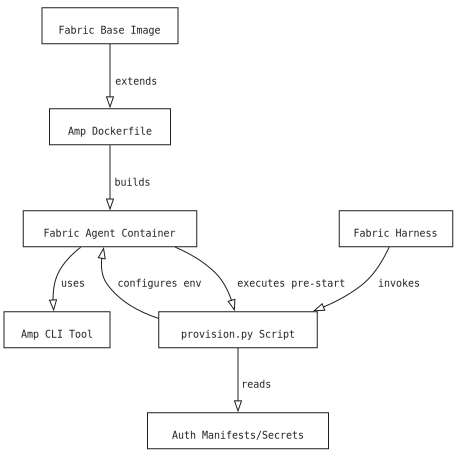

The integration of the [`amp`](https://github.com/pdlc-os/fabric/blob/b11448f8f01fdcf12deab96204417d87f8d46ab3/examples/amp/README.md?plain=1#L1) tool with Fabric agents utilizes a [`ContainerScriptHarness`](https://github.com/pdlc-os/fabric/blob/b11448f8f01fdcf12deab96204417d87f8d46ab3/pkg/harness/container_script_harness.go#L41) to enable [`fabric`](https://github.com/pdlc-os/fabric/blob/b11448f8f01fdcf12deab96204417d87f8d46ab3/README.md?plain=1#L1) agents to leverage [`amp`](https://github.com/pdlc-os/fabric/blob/b11448f8f01fdcf12deab96204417d87f8d46ab3/examples/amp/README.md?plain=1#L1)'s capabilities without requiring modifications to Fabric's core Go codebase. This integration provides a pattern for community harness authors.

The core of this integration is the Docker image construction defined in [`examples/amp/Dockerfile`](https://github.com/pdlc-os/fabric/blob/b11448f8f01fdcf12deab96204417d87f8d46ab3/examples/amp/Dockerfile). This Dockerfile extends a base Fabric image to install the [`amp`](https://github.com/pdlc-os/fabric/blob/b11448f8f01fdcf12deab96204417d87f8d46ab3/examples/amp/README.md?plain=1#L1) CLI tool globally, ensuring its availability within the agent's container environment.

Authentication handling and environment provisioning are managed by the [`provision.py`](https://github.com/pdlc-os/fabric/blob/b11448f8f01fdcf12deab96204417d87f8d46ab3/harnesses/README.md?plain=1#L91) script, executed during the [`pre-start`](https://github.com/pdlc-os/fabric/blob/b11448f8f01fdcf12deab96204417d87f8d46ab3/cmd/common.go#L581) lifecycle hook within the container. This script determines the appropriate authentication method for [`amp`](https://github.com/pdlc-os/fabric/blob/b11448f8f01fdcf12deab96204417d87f8d46ab3/examples/amp/README.md?plain=1#L1), prioritizing explicitly provided API keys or falling back to environment variables like [`AMP_API_KEY`](https://github.com/pdlc-os/fabric/blob/b11448f8f01fdcf12deab96204417d87f8d46ab3/examples/amp/README.md?plain=1#L11) or [`ANTHROPIC_API_KEY`](https://github.com/pdlc-os/fabric/blob/b11448f8f01fdcf12deab96204417d87f8d46ab3/pkg/agent/run.go#L1226). It then securely projects the resolved API key into the agent's environment as [`AMP_API_KEY`](https://github.com/pdlc-os/fabric/blob/b11448f8f01fdcf12deab96204417d87f8d46ab3/examples/amp/README.md?plain=1#L11), ensuring [`amp`](https://github.com/pdlc-os/fabric/blob/b11448f8f01fdcf12deab96204417d87f8d46ab3/examples/amp/README.md?plain=1#L1) can authenticate consistently. Additionally, [`provision.py`](https://github.com/pdlc-os/fabric/blob/b11448f8f01fdcf12deab96204417d87f8d46ab3/harnesses/README.md?plain=1#L91) reconciles [`amp`](https://github.com/pdlc-os/fabric/blob/b11448f8f01fdcf12deab96204417d87f8d46ab3/examples/amp/README.md?plain=1#L1)'s settings to ensure necessary defaults for non-interactive container operation are present without overriding user-defined configurations.

Agent instructions for status reporting are detailed in [`examples/amp/templates/amp/agents.md`](https://github.com/pdlc-os/fabric/blob/b11448f8f01fdcf12deab96204417d87f8d46ab3/examples/amp/templates/amp/agents.md). This documentation guides [`fabric`](https://github.com/pdlc-os/fabric/blob/b11448f8f01fdcf12deab96204417d87f8d46ab3/README.md?plain=1#L1) agents on how to use [`fabrictool status`](https://github.com/pdlc-os/fabric/blob/b11448f8f01fdcf12deab96204417d87f8d46ab3/GLOSSARY.md?plain=1#L50) commands to communicate their operational state to the user and the orchestration system. These instructions clarify that the agent's workspace is a Git worktree mounted at [`/workspace`](https://github.com/pdlc-os/fabric/blob/b11448f8f01fdcf12deab96204417d87f8d46ab3/agents.md?plain=1#L39), facilitating independent commit operations. This approach allows for a flexible and extensible integration of external tools like [`amp`](https://github.com/pdlc-os/fabric/blob/b11448f8f01fdcf12deab96204417d87f8d46ab3/examples/amp/README.md?plain=1#L1) within the Fabric agent ecosystem. For more details on the general Harness abstraction and its provisioning mechanisms, refer to [Harness Abstraction and Provisioning](#fabric-agent-orchestration-and-management-harness-abstraction-and-provisioning).

### Orchestration Patterns: Parallel Fan-Out

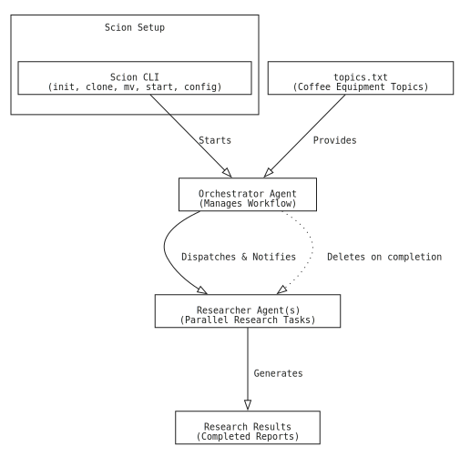

This orchestration pattern demonstrates how an [`orchestrator`](https://github.com/pdlc-os/fabric/blob/b11448f8f01fdcf12deab96204417d87f8d46ab3/image-build/README.md?plain=1#L30) agent can manage multiple [`researcher`](https://github.com/pdlc-os/fabric/blob/b11448f8f01fdcf12deab96204417d87f8d46ab3/examples/amp/README.md?plain=1#L29) agents concurrently to perform tasks in parallel. The [`examples/orchestration-basics/fan-out-parallel`](https://github.com/pdlc-os/fabric/blob/b11448f8f01fdcf12deab96204417d87f8d46ab3/examples/orchestration-basics/fan-out-parallel) directory contains the example, where an [`orchestrator`](https://github.com/pdlc-os/fabric/blob/b11448f8f01fdcf12deab96204417d87f8d46ab3/image-build/README.md?plain=1#L30) agent dispatches research topics to several [`researcher`](https://github.com/pdlc-os/fabric/blob/b11448f8f01fdcf12deab96204417d87f8d46ab3/examples/amp/README.md?plain=1#L29) agents. Each [`researcher`](https://github.com/pdlc-os/fabric/blob/b11448f8f01fdcf12deab96204417d87f8d46ab3/examples/amp/README.md?plain=1#L29) agent is designed to follow a strict protocol for unbiased, evidence-based reporting.

The [`orchestrator`](https://github.com/pdlc-os/fabric/blob/b11448f8f01fdcf12deab96204417d87f8d46ab3/image-build/README.md?plain=1#L30) agent utilizes the [`fabric`](https://github.com/pdlc-os/fabric/blob/b11448f8f01fdcf12deab96204417d87f8d46ab3/README.md?plain=1#L1) CLI to dynamically start [`researcher`](https://github.com/pdlc-os/fabric/blob/b11448f8f01fdcf12deab96204417d87f8d46ab3/examples/amp/README.md?plain=1#L29) agents, each assigned a topic from [`examples/orchestration-basics/fan-out-parallel/topics.txt`](https://github.com/pdlc-os/fabric/blob/b11448f8f01fdcf12deab96204417d87f8d46ab3/examples/orchestration-basics/fan-out-parallel/topics.txt). It then waits for completion notifications from these [`researcher`](https://github.com/pdlc-os/fabric/blob/b11448f8f01fdcf12deab96204417d87f8d46ab3/examples/amp/README.md?plain=1#L29) agents before deleting them. The [`researcher`](https://github.com/pdlc-os/fabric/blob/b11448f8f01fdcf12deab96204417d87f8d46ab3/examples/amp/README.md?plain=1#L29) agents are guided by a system prompt in [`examples/orchestration-basics/fan-out-parallel/researcher-prompt.md`](https://github.com/pdlc-os/fabric/blob/b11448f8f01fdcf12deab96204417d87f8d46ab3/examples/orchestration-basics/fan-out-parallel/researcher-prompt.md) that defines a cognitive framework, a planning process, and a mandatory five-phase research protocol. This protocol emphasizes rigorous methodology, critical analysis, and iterative refinement to ensure quality output. The research findings are structured according to the Markdown template specified in [`examples/orchestration-basics/fan-out-parallel/research-template.md`](https://github.com/pdlc-os/fabric/blob/b11448f8f01fdcf12deab96204417d87f8d46ab3/examples/orchestration-basics/fan-out-parallel/research-template.md), which helps ensure consistency across all research outputs. The setup process for this example involves several [`fabric`](https://github.com/pdlc-os/fabric/blob/b11448f8f01fdcf12deab96204417d87f8d46ab3/README.md?plain=1#L1) commands for initializing a grove, creating agent templates, and configuring the [`fabric`](https://github.com/pdlc-os/fabric/blob/b11448f8f01fdcf12deab96204417d87f8d46ab3/README.md?plain=1#L1) server, as detailed in [`examples/orchestration-basics/fan-out-parallel/README.md`](https://github.com/pdlc-os/fabric/blob/b11448f8f01fdcf12deab96204417d87f8d46ab3/examples/orchestration-basics/fan-out-parallel/README.md).

### Orchestration Patterns: Sequential Task Execution

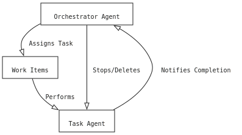

Sequential task execution within Fabric agents is demonstrated through a workflow where an orchestrator agent manages a series of tasks, ensuring each is completed before proceeding to the next. This pattern is illustrated by an example in the [`examples/orchestration-basics/sequence`](https://github.com/pdlc-os/fabric/blob/b11448f8f01fdcf12deab96204417d87f8d46ab3/examples/orchestration-basics/sequence) directory. The orchestration logic relies on the Fabric CLI tool for agent management, with tasks assigned to individual agents.

The core of this pattern involves:

- **Agent Management:** Starting a new agent for each specific task.
- **Task Assignment:** Assigning distinct work items to these agents. The orchestrator uses a notification mechanism (e.g., [`--notify`](https://github.com/pdlc-os/fabric/blob/b11448f8f01fdcf12deab96204417d87f8d46ab3/GLOSSARY.md?plain=1#L192) flag with the [`fabric`](https://github.com/pdlc-os/fabric/blob/b11448f8f01fdcf12deab96204417d87f8d46ab3/README.md?plain=1#L1) CLI) to await completion.
- **Synchronous Workflow:** The orchestrator idles and waits for an agent to signal task completion. This ensures that tasks are executed in a predefined order.
- **Resource Cleanup:** Once a task is complete and acknowledged, the agent responsible for that task is stopped and deleted, managing system resources efficiently.
- **Sequential Processing:** This cycle repeats for each step in the workflow, guaranteeing that the tasks are processed sequentially by dedicated agents.

The workflow example, detailed in [`examples/orchestration-basics/sequence/work-sequence.md`](https://github.com/pdlc-os/fabric/blob/b11448f8f01fdcf12deab96204417d87f8d46ab3/examples/orchestration-basics/sequence/work-sequence.md), demonstrates a five-step process:

1. **Data Fetching:** A Python script ([`fetch_data.py`](https://github.com/pdlc-os/fabric/blob/b11448f8f01fdcf12deab96204417d87f8d46ab3/examples/orchestration-basics/sequence/work-sequence.md?plain=1#L3)) queries a public API and saves the raw JSON data.
2. **Data Processing:** Another Python script ([`process_data.py`](https://github.com/pdlc-os/fabric/blob/b11448f8f01fdcf12deab96204417d87f8d46ab3/examples/orchestration-basics/sequence/work-sequence.md?plain=1#L5)) parses the fetched JSON, extracts specific information, and appends it to a log file.
3. **Data Accumulation and Verification:** The fetching and processing steps are repeated multiple times to accumulate data, followed by a verification step.
4. **Report Generation:** A Python script ([`generate_report.py`](https://github.com/pdlc-os/fabric/blob/b11448f8f01fdcf12deab96204417d87f8d46ab3/examples/orchestration-basics/sequence/work-sequence.md?plain=1#L9)) reads the processed data and creates an HTML report.
5. **Final Output and Archiving:** The report is generated, and all relevant scripts and the final report are archived into a compressed file.

This example highlights how a series of interdependent operations can be systematically executed across different agents, with each agent handling a specific part of the overall workflow. Further details on managing agent lifecycles and orchestrating agents can be found in [Agent Lifecycle Management and Orchestration](#fabric-agent-orchestration-and-management-agent-lifecycle-management-and-orchestration).

## Agent Harness Management

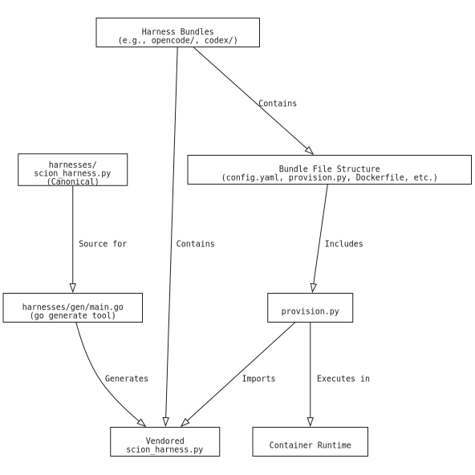

The Fabric platform supports the integration of "opt-in" coding agents, which are not installed by default, through a structured approach centered around harness configuration bundles. These bundles provide all necessary components for an agent's operation, including configuration, container-side provisioning scripts, and Docker build specifications. This modular design allows users to selectively install and manage various coding agents such as Antigravity, Claude, Codex, and Copilot, minimizing the platform's default footprint while offering broad extensibility.

Each agent's integration is defined within a dedicated directory under [`harnesses`](https://github.com/pdlc-os/fabric/blob/b11448f8f01fdcf12deab96204417d87f8d46ab3/harnesses), acting as a "harness bundle." These bundles typically include a [`config.yaml`](https://github.com/pdlc-os/fabric/blob/b11448f8f01fdcf12deab96204417d87f8d46ab3/cmd/build.go#L45) to define the harness's core configuration and capabilities, a [`provision.py`](https://github.com/pdlc-os/fabric/blob/b11448f8f01fdcf12deab96204417d87f8d46ab3/harnesses/README.md?plain=1#L91) script for container-side setup tasks (like authentication and configuration file generation), a [`Dockerfile`](https://github.com/pdlc-os/fabric/blob/b11448f8f01fdcf12deab96204417d87f8d46ab3/agents.md?plain=1#L138) for image construction, and a [`capture_auth.py`](https://github.com/pdlc-os/fabric/blob/b11448f8f01fdcf12deab96204417d87f8d46ab3/harnesses/README.md?plain=1#L83) script for credential management. An optional [`home`](https://github.com/pdlc-os/fabric/blob/b11448f8f01fdcf12deab96204417d87f8d46ab3/harnesses/fabric_harness.py#L361) directory can also provide initial user files within the agent's container.

A shared Python library, [`harnesses/fabric_harness.py`](https://github.com/pdlc-os/fabric/blob/b11448f8f01fdcf12deab96204417d87f8d46ab3/harnesses/fabric_harness.py), plays a central role in standardizing the provisioning process. This library offers utilities for declarative authentication, instruction projection, and Multi-Channel Proxy (MCP) server configuration. Declarative authentication, using [`AuthSpec`](https://github.com/pdlc-os/fabric/blob/b11448f8f01fdcf12deab96204417d87f8d46ab3/harnesses/fabric_harness.py#L297) and [`AuthMethod`](https://github.com/pdlc-os/fabric/blob/b11448f8f01fdcf12deab96204417d87f8d46ab3/harnesses/fabric_harness.py#L249), allows agents to define their credential requirements, which are then resolved based on manifest data, environment variables, or staged secrets. Instruction projection ([`project_instructions`](https://github.com/pdlc-os/fabric/blob/b11448f8f01fdcf12deab96204417d87f8d46ab3/harnesses/fabric_harness.py#L769)) enables the dynamic composition of agent prompts and instructions from multiple sources into a single target file, preserving user-authored content. Utilities like [`apply_mcp_servers_simple`](https://github.com/pdlc-os/fabric/blob/b11448f8f01fdcf12deab96204417d87f8d46ab3/harnesses/fabric_harness.py#L167) and [`apply_mcp_translated`](https://github.com/pdlc-os/fabric/blob/b11448f8f01fdcf12deab96204417d87f8d46ab3/harnesses/fabric_harness.py#L844) facilitate the translation and merging of MCP server configurations into an agent's native configuration files.

The platform ensures consistency across these harness bundles through an automated vendoring process. A Go program located at [`harnesses/gen/main.go`](https://github.com/pdlc-os/fabric/blob/b11448f8f01fdcf12deab96204417d87f8d46ab3/harnesses/gen/main.go) automatically integrates the canonical [`fabric_harness.py`](https://github.com/pdlc-os/fabric/blob/b11448f8f01fdcf12deab96204417d87f8d46ab3/harnesses/README.md?plain=1#L130) into each harness subdirectory that contains a [`provision.py`](https://github.com/pdlc-os/fabric/blob/b11448f8f01fdcf12deab96204417d87f8d46ab3/harnesses/README.md?plain=1#L91) script. This mechanism guarantees that all provisioning and authentication capture scripts utilize a consistent version of the shared library, preventing divergence and ensuring predictable behavior.

Specific harness implementations cater to the unique requirements of each agent. For instance, the Antigravity harness ([`harnesses/antigravity`](https://github.com/pdlc-os/fabric/blob/b11448f8f01fdcf12deab96204417d87f8d46ab3/harnesses/antigravity)) handles [`gnome-keyring`](https://github.com/pdlc-os/fabric/blob/b11448f8f01fdcf12deab96204417d87f8d46ab3/harnesses/antigravity/README.md?plain=1#L5) integration for authentication and bypasses interactive onboarding. The Claude harness ([`harnesses/claude`](https://github.com/pdlc-os/fabric/blob/b11448f8f01fdcf12deab96204417d87f8d46ab3/harnesses/claude)) manages network egress control through [`iptables`](https://github.com/pdlc-os/fabric/blob/b11448f8f01fdcf12deab96204417d87f8d46ab3/pkg/agent/run.go#L1286) and includes specialized logic for extracting OAuth tokens from [`tmux`](https://github.com/pdlc-os/fabric/blob/b11448f8f01fdcf12deab96204417d87f8d46ab3/README.md?plain=1#L74) scrollback. The Codex harness ([`harnesses/codex`](https://github.com/pdlc-os/fabric/blob/b11448f8f01fdcf12deab96204417d87f8d46ab3/harnesses/codex)) focuses on resolving API keys, configuring OpenTelemetry, and translating MCP settings into its [`config.toml`](https://github.com/pdlc-os/fabric/blob/b11448f8f01fdcf12deab96204417d87f8d46ab3/harnesses/codex/README.md?plain=1#L37). The Copilot harness ([`harnesses/copilot`](https://github.com/pdlc-os/fabric/blob/b11448f8f01fdcf12deab96204417d87f8d46ab3/harnesses/copilot)) is designed for non-interactive use, managing GitHub token authentication and configuring default settings to avoid interactive prompts.

This structured approach to harness management streamlines the integration of diverse coding agents, enabling the Fabric platform to support a wide range of AI-driven development workflows while maintaining consistency and security.

### Harness Bundle Structure and Core Functionality

| File/Directory | Description |
| --- | --- |
| `<name>/` | Root directory for the harness bundle. |
| `config.yaml` | Defines harness configuration, including provisioner settings, capabilities, and authentication. |
| `provision.py` | Contains the container-side provisioner, acting as a pre-start hook for the harness. |
| `Dockerfile` | Specifies the Docker image build process, based on `fabric-base`. |
| `cloudbuild.yaml` | Configuration for Cloud Build to manage the harness. |
| `README.md` | Provides bundle-specific documentation, such as authentication modes and build instructions. |
| `home/` | Directory for files that are seeded into the agent's home directory upon installation. |
| `fabric_harness.py` | Vendored copy of the shared `fabric_harness` library, essential for harness functionality. |

Agent harness bundles provide a structured approach for integrating external coding agents that are not installed by default, ensuring a consistent and manageable way to extend the Fabric platform's capabilities. Each harness bundle encapsulates all necessary components for a specific agent, supporting its installation, configuration, and runtime provisioning. This modular design allows users to selectively install agents, reducing the system's default footprint.

A harness bundle typically consists of several key files and directories:

- [`config.yaml`](https://github.com/pdlc-os/fabric/blob/b11448f8f01fdcf12deab96204417d87f8d46ab3/cmd/build.go#L45): Defines the core configuration for the harness, including its provisioner settings and declared capabilities.
- [`provision.py`](https://github.com/pdlc-os/fabric/blob/b11448f8f01fdcf12deab96204417d87f8d46ab3/harnesses/README.md?plain=1#L91): A Python script executed within the agent's Docker container during the pre-start phase. Its role is to perform essential setup tasks, such as handling authentication, generating configuration files, and preparing the agent's environment. This script leverages a shared Python library, [`harnesses/fabric_harness.py`](https://github.com/pdlc-os/fabric/blob/b11448f8f01fdcf12deab96204417d87f8d46ab3/harnesses/fabric_harness.py), to standardize these provisioning tasks.
- [`capture_auth.py`](https://github.com/pdlc-os/fabric/blob/b11448f8f01fdcf12deab96204417d87f8d46ab3/harnesses/README.md?plain=1#L83): This Python script is responsible for capturing authentication credentials, often after an interactive login, and securely storing them using [`fabrictool secret set`](https://github.com/pdlc-os/fabric/blob/b11448f8f01fdcf12deab96204417d87f8d46ab3/GLOSSARY.md?plain=1#L50).
- [`Dockerfile`](https://github.com/pdlc-os/fabric/blob/b11448f8f01fdcf12deab96204417d87f8d46ab3/agents.md?plain=1#L138): Specifies the instructions for building the Docker image for the agent. This includes installing dependencies, setting up the environment, and defining the container's entry point.
- [`cloudbuild.yaml`](https://github.com/pdlc-os/fabric/blob/b11448f8f01fdcf12deab96204417d87f8d46ab3/cmd/build.go#L199): Contains the Google Cloud Build configuration for automating the image build process, ensuring consistent and reproducible builds.
- [`README.md`](https://github.com/pdlc-os/fabric/blob/b11448f8f01fdcf12deab96204417d87f8d46ab3/README.md?plain=1#L83): Provides documentation specific to the agent's harness, detailing installation procedures, supported authentication modes, and any other relevant information.
- [`home`](https://github.com/pdlc-os/fabric/blob/b11448f8f01fdcf12deab96204417d87f8d46ab3/harnesses/fabric_harness.py#L361) directory (optional): This directory can contain files that are seeded into the agent's home directory at installation time, such as shell configuration files ([`.bashrc`](https://github.com/pdlc-os/fabric/blob/b11448f8f01fdcf12deab96204417d87f8d46ab3/pkg/store/models.go#L524)), agent-specific settings, or system prompts.

The overall design emphasizes standardization through the shared [`fabric_harness.py`](https://github.com/pdlc-os/fabric/blob/b11448f8f01fdcf12deab96204417d87f8d46ab3/harnesses/README.md?plain=1#L130) library, which offers utilities for declarative authentication, instruction projection, and Multi-Channel Proxy (MCP) server configuration. This library ensures consistency across different agent integrations. The use of [`go generate`](https://github.com/pdlc-os/fabric/blob/b11448f8f01fdcf12deab96204417d87f8d46ab3/Makefile#L15) and associated tests ([`harnesses/vendored_lib_test.go`](https://github.com/pdlc-os/fabric/blob/b11448f8f01fdcf12deab96204417d87f8d46ab3/harnesses/vendored_lib_test.go)) automates the vendoring of [`fabric_harness.py`](https://github.com/pdlc-os/fabric/blob/b11448f8f01fdcf12deab96204417d87f8d46ab3/harnesses/README.md?plain=1#L130) into each bundle, ensuring all [`provision.py`](https://github.com/pdlc-os/fabric/blob/b11448f8f01fdcf12deab96204417d87f8d46ab3/harnesses/README.md?plain=1#L91) and [`capture_auth.py`](https://github.com/pdlc-os/fabric/blob/b11448f8f01fdcf12deab96204417d87f8d46ab3/harnesses/README.md?plain=1#L83) scripts utilize a consistent version of the shared library, maintaining compatibility and preventing divergence.

### Shared Python Harness Library (`fabric_harness.py`)

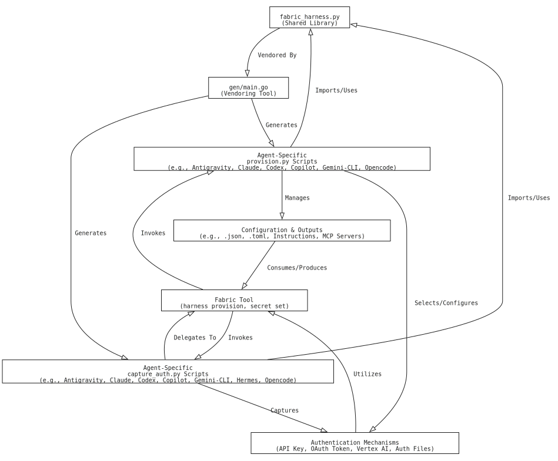

The [`fabric_harness.py`](https://github.com/pdlc-os/fabric/blob/b11448f8f01fdcf12deab96204417d87f8d46ab3/harnesses/README.md?plain=1#L130) library, located at [`harnesses/fabric_harness.py`](https://github.com/pdlc-os/fabric/blob/b11448f8f01fdcf12deab96204417d87f8d46ab3/harnesses/fabric_harness.py), provides a standardized toolkit for Fabric's agent harness scripts. It encapsulates common logic required for provisioning and authenticating agents, ensuring consistency and reducing boilerplate across different harness implementations. This library is automatically vendored into each agent's harness directory by a Go program at [`harnesses/gen/main.go`](https://github.com/pdlc-os/fabric/blob/b11448f8f01fdcf12deab96204417d87f8d46ab3/harnesses/gen/main.go), ensuring all [`provision.py`](https://github.com/pdlc-os/fabric/blob/b11448f8f01fdcf12deab96204417d87f8d46ab3/harnesses/README.md?plain=1#L91) and [`capture_auth.py`](https://github.com/pdlc-os/fabric/blob/b11448f8f01fdcf12deab96204417d87f8d46ab3/harnesses/README.md?plain=1#L83) scripts utilize a consistent version and preventing manual modifications.

A core function of [`fabric_harness.py`](https://github.com/pdlc-os/fabric/blob/b11448f8f01fdcf12deab96204417d87f8d46ab3/harnesses/README.md?plain=1#L130) is streamlining [Authentication and Credential Capture Mechanisms](#agent-harness-management-authentication-and-credential-capture-mechanisms). It offers declarative authentication through [`AuthMethod`](https://github.com/pdlc-os/fabric/blob/b11448f8f01fdcf12deab96204417d87f8d46ab3/harnesses/fabric_harness.py#L249) and [`AuthSpec`](https://github.com/pdlc-os/fabric/blob/b11448f8f01fdcf12deab96204417d87f8d46ab3/harnesses/fabric_harness.py#L297) objects, which define how an agent should acquire credentials. The [`ProvisionContext`](https://github.com/pdlc-os/fabric/blob/b11448f8f01fdcf12deab96204417d87f8d46ab3/harnesses/fabric_harness.py#L337) class's [`select_auth`](https://github.com/pdlc-os/fabric/blob/b11448f8f01fdcf12deab96204417d87f8d46ab3/harnesses/fabric_harness.py#L487) method resolves the appropriate authentication method based on manifest data, environment variables, and staged secrets, supporting both environment variable-based ([`env_method`](https://github.com/pdlc-os/fabric/blob/b11448f8f01fdcf12deab96204417d87f8d46ab3/harnesses/fabric_harness.py#L274)) and file-based ([`file_method`](https://github.com/pdlc-os/fabric/blob/b11448f8f01fdcf12deab96204417d87f8d46ab3/harnesses/fabric_harness.py#L286)) credential acquisition.

The library also facilitates [Instruction Projection and Prompt Management](#agent-harness-management-instruction-projection-and-prompt-management). The [`project_instructions`](https://github.com/pdlc-os/fabric/blob/b11448f8f01fdcf12deab96204417d87f8d46ab3/harnesses/fabric_harness.py#L769) function merges various input files, such as [`instructions.md`](https://github.com/pdlc-os/fabric/blob/b11448f8f01fdcf12deab96204417d87f8d46ab3/harnesses/fabric_harness.py#L789), [`system-prompt.md`](https://github.com/pdlc-os/fabric/blob/b11448f8f01fdcf12deab96204417d87f8d46ab3/pkg/agent/provision.go#L960), and [`SKILL.md`](https://github.com/pdlc-os/fabric/blob/b11448f8f01fdcf12deab96204417d87f8d46ab3/cmd/skills.go#L193), into a single target instruction file within the agent's container. This process is designed to respect and manage "Fabric-managed" blocks (identified by markers like [`_MANAGED_BEGIN_STANDARD`](https://github.com/pdlc-os/fabric/blob/b11448f8f01fdcf12deab96204417d87f8d46ab3/harnesses/fabric_harness.py#L671) and [`_MANAGED_END_STANDARD`](https://github.com/pdlc-os/fabric/blob/b11448f8f01fdcf12deab96204417d87f8d46ab3/harnesses/fabric_harness.py#L672)), allowing user-authored content to persist while integrating system-generated instructions.

For [Multi-Channel Proxy (MCP) Server Configuration](#agent-harness-management-multi-channel-proxy-mcp-server-configuration), [`fabric_harness.py`](https://github.com/pdlc-os/fabric/blob/b11448f8f01fdcf12deab96204417d87f8d46ab3/harnesses/README.md?plain=1#L130) includes utilities like [`apply_mcp_servers_simple`](https://github.com/pdlc-os/fabric/blob/b11448f8f01fdcf12deab96204417d87f8d46ab3/harnesses/fabric_harness.py#L167) and [`apply_mcp_translated`](https://github.com/pdlc-os/fabric/blob/b11448f8f01fdcf12deab96204417d87f8d46ab3/harnesses/fabric_harness.py#L844). These functions translate and merge MCP server configurations into an agent's native configuration formats, ensuring that agents can communicate effectively within the Fabric ecosystem.

The library offers robust file operations through functions such as [`atomic_write_json`](https://github.com/pdlc-os/fabric/blob/b11448f8f01fdcf12deab96204417d87f8d46ab3/harnesses/fabric_harness.py#L75), [`atomic_write_text`](https://github.com/pdlc-os/fabric/blob/b11448f8f01fdcf12deab96204417d87f8d46ab3/harnesses/fabric_harness.py#L946), [`load_json`](https://github.com/pdlc-os/fabric/blob/b11448f8f01fdcf12deab96204417d87f8d46ab3/harnesses/fabric_harness.py#L69), and [`read_json_skipping_comment_lines`](https://github.com/pdlc-os/fabric/blob/b11448f8f01fdcf12deab96204417d87f8d46ab3/harnesses/fabric_harness.py#L964). These utilities ensure safe and consistent handling of configuration and data files, preventing race conditions and data corruption.

Finally, [`fabric_harness.py`](https://github.com/pdlc-os/fabric/blob/b11448f8f01fdcf12deab96204417d87f8d46ab3/harnesses/README.md?plain=1#L130) provides standardized entry points for [`provision.py`](https://github.com/pdlc-os/fabric/blob/b11448f8f01fdcf12deab96204417d87f8d46ab3/harnesses/README.md?plain=1#L91) and [`capture_auth.py`](https://github.com/pdlc-os/fabric/blob/b11448f8f01fdcf12deab96204417d87f8d46ab3/harnesses/README.md?plain=1#L83) scripts. The [`run`](https://github.com/pdlc-os/fabric/blob/b11448f8f01fdcf12deab96204417d87f8d46ab3/pkg/wsclient/pty.go#L156) function acts as a main scaffold for provisioning scripts, handling argument parsing, manifest loading, command dispatch, and error handling. Similarly, [`capture_auth_main`](https://github.com/pdlc-os/fabric/blob/b11448f8f01fdcf12deab96204417d87f8d46ab3/harnesses/fabric_harness.py#L1040) serves as the entry point for authentication capture scripts, managing credential acquisition and storage via [`fabrictool secret set`](https://github.com/pdlc-os/fabric/blob/b11448f8f01fdcf12deab96204417d87f8d46ab3/GLOSSARY.md?plain=1#L50).

### Authentication and Credential Capture Mechanisms

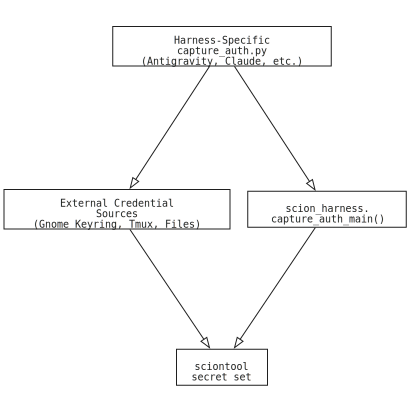

Authentication and credential capture are critical aspects of integrating external tools and services with Fabric agents. The platform employs a declarative [`AuthSpec`](https://github.com/pdlc-os/fabric/blob/b11448f8f01fdcf12deab96204417d87f8d46ab3/harnesses/fabric_harness.py#L297) and [`AuthMethod`](https://github.com/pdlc-os/fabric/blob/b11448f8f01fdcf12deab96204417d87f8d46ab3/harnesses/fabric_harness.py#L249) system to define and manage various authentication strategies across different harnesses. This system allows for flexible configuration, supporting methods such as API keys, OAuth tokens, and authentication files.

The core mechanism for acquiring and storing these credentials involves specialized [`capture_auth.py`](https://github.com/pdlc-os/fabric/blob/b11448f8f01fdcf12deab96204417d87f8d46ab3/harnesses/README.md?plain=1#L83) scripts within each harness. These scripts are responsible for retrieving authentication details and then securely persisting them using [`fabrictool secret set`](https://github.com/pdlc-os/fabric/blob/b11448f8f01fdcf12deab96204417d87f8d46ab3/GLOSSARY.md?plain=1#L50). This utility ensures that sensitive information is stored securely and can be accessed by agents as needed.

For instance, the Antigravity harness uses a [`capture_auth.py`](https://github.com/pdlc-os/fabric/blob/b11448f8f01fdcf12deab96204417d87f8d46ab3/harnesses/README.md?plain=1#L83) script that extends the standard capture functionality to integrate with [`gnome-keyring`](https://github.com/pdlc-os/fabric/blob/b11448f8f01fdcf12deab96204417d87f8d46ab3/harnesses/antigravity/README.md?plain=1#L5). This allows it to extract OAuth tokens from the keyring, especially when [`AGY_KEYRING_TOKEN`](https://github.com/pdlc-os/fabric/blob/b11448f8f01fdcf12deab96204417d87f8d46ab3/harnesses/antigravity/README.md?plain=1#L25) is used, and then stores them securely. The script ensures [`DBUS_SESSION_BUS_ADDRESS`](https://github.com/pdlc-os/fabric/blob/b11448f8f01fdcf12deab96204417d87f8d46ab3/harnesses/antigravity/Dockerfile#L38) is correctly configured for communication with [`secret-tool`](https://github.com/pdlc-os/fabric/blob/b11448f8f01fdcf12deab96204417d87f8d46ab3/changelog/2026-06-22-changelog.md?plain=1#L10), which is essential for keyring operations. Similarly, the Claude harness's [`capture_auth.py`](https://github.com/pdlc-os/fabric/blob/b11448f8f01fdcf12deab96204417d87f8d46ab3/harnesses/README.md?plain=1#L83) includes specialized logic to extract [`sk-ant`](https://github.com/pdlc-os/fabric/blob/b11448f8f01fdcf12deab96204417d87f8d46ab3/examples/amp/README.md?plain=1#L29) OAuth tokens from [`tmux`](https://github.com/pdlc-os/fabric/blob/b11448f8f01fdcf12deab96204417d87f8d46ab3/README.md?plain=1#L74) scrollback buffers, often used in interactive login flows, and then stores them via [`fabrictool secret set`](https://github.com/pdlc-os/fabric/blob/b11448f8f01fdcf12deab96204417d87f8d46ab3/GLOSSARY.md?plain=1#L50).

In cases like the Copilot harness, the [`capture_auth.py`](https://github.com/pdlc-os/fabric/blob/b11448f8f01fdcf12deab96204417d87f8d46ab3/harnesses/README.md?plain=1#L83) acts as a shim, invoking a shared [`capture_auth_main`](https://github.com/pdlc-os/fabric/blob/b11448f8f01fdcf12deab96204417d87f8d46ab3/harnesses/fabric_harness.py#L1040) function. This shared function is designed to capture credentials after an interactive login, such as when a user runs [`copilot login`](https://github.com/pdlc-os/fabric/blob/b11448f8f01fdcf12deab96204417d87f8d46ab3/harnesses/copilot/README.md?plain=1#L1), and then registers the resulting tokens with [`fabrictool secret set`](https://github.com/pdlc-os/fabric/blob/b11448f8f01fdcf12deab96204417d87f8d46ab3/GLOSSARY.md?plain=1#L50). This approach allows for a streamlined experience, enabling users to authenticate interactively and have those credentials automatically picked up by the Fabric platform.

The [`fabric_harness.py`](https://github.com/pdlc-os/fabric/blob/b11448f8f01fdcf12deab96204417d87f8d46ab3/harnesses/README.md?plain=1#L130) library, shared across various harnesses, provides a standardized framework for these operations. It defines [`AuthMethod`](https://github.com/pdlc-os/fabric/blob/b11448f8f01fdcf12deab96204417d87f8d46ab3/harnesses/fabric_harness.py#L249) and [`AuthSpec`](https://github.com/pdlc-os/fabric/blob/b11448f8f01fdcf12deab96204417d87f8d46ab3/harnesses/fabric_harness.py#L297) classes for declarative authentication, allowing harnesses to specify their supported authentication types and precedence. This library also includes the [`capture_auth_main`](https://github.com/pdlc-os/fabric/blob/b11448f8f01fdcf12deab96204417d87f8d46ab3/harnesses/fabric_harness.py#L1040) function, which manages the generic credential capture process, including conflict detection and storage via [`fabrictool secret set`](https://github.com/pdlc-os/fabric/blob/b11448f8f01fdcf12deab96204417d87f8d46ab3/GLOSSARY.md?plain=1#L50). This standardization simplifies the development of new harnesses and ensures consistency in how credentials are handled across the Fabric ecosystem. For further details on the common harness utilities, see [Shared Python Harness Library (`fabric_harness.py`)](#agent-harness-management-shared-python-harness-library-fabric-harness-py).

### Instruction Projection and Prompt Management

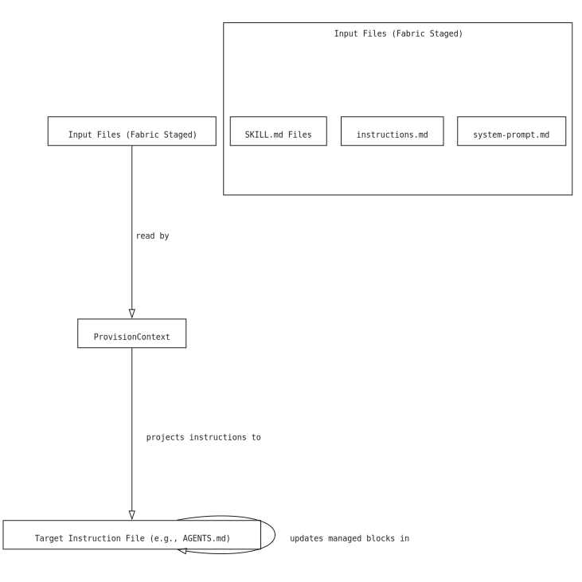

The [`project_instructions`](https://github.com/pdlc-os/fabric/blob/b11448f8f01fdcf12deab96204417d87f8d46ab3/harnesses/fabric_harness.py#L769) mechanism, implemented within the shared Python harness library at [`harnesses/fabric_harness.py`](https://github.com/pdlc-os/fabric/blob/b11448f8f01fdcf12deab96204417d87f8d46ab3/harnesses/fabric_harness.py), addresses the challenge of composing agent prompts and instructions from various sources into a single, cohesive target file. This process is crucial for providing agents with the necessary context and directives for their tasks, while also ensuring that user-authored content is preserved and not overwritten by automated system updates.

At its core, the [`project_instructions`](https://github.com/pdlc-os/fabric/blob/b11448f8f01fdcf12deab96204417d87f8d46ab3/harnesses/fabric_harness.py#L769) function merges content from multiple input files, such as [`instructions.md`](https://github.com/pdlc-os/fabric/blob/b11448f8f01fdcf12deab96204417d87f8d46ab3/harnesses/fabric_harness.py#L789), [`system-prompt.md`](https://github.com/pdlc-os/fabric/blob/b11448f8f01fdcf12deab96204417d87f8d46ab3/pkg/agent/provision.go#L960), and [`SKILL.md`](https://github.com/pdlc-os/fabric/blob/b11448f8f01fdcf12deab96204417d87f8d46ab3/cmd/skills.go#L193), into a designated target instruction file within the agent's container. A key design consideration is the use of "Fabric-managed" blocks, delimited by markers like [`_MANAGED_BEGIN_STANDARD`](https://github.com/pdlc-os/fabric/blob/b11448f8f01fdcf12deab96204417d87f8d46ab3/harnesses/fabric_harness.py#L671) and [`_MANAGED_END_STANDARD`](https://github.com/pdlc-os/fabric/blob/b11448f8f01fdcf12deab96204417d87f8d46ab3/harnesses/fabric_harness.py#L672). These markers delineate sections of the instruction file that are maintained by the Fabric system, allowing for consistent updates to platform-level guidance or skill definitions. Content outside these managed blocks, typically user-authored, remains untouched, thereby preventing accidental loss of custom instructions or contextual information.

This projection mechanism ensures that agents receive a comprehensive set of instructions, combining general operational guidelines, specific task prompts, and relevant skill documentation. For example, the Claude harness uses this to copy [`instructions.md`](https://github.com/pdlc-os/fabric/blob/b11448f8f01fdcf12deab96204417d87f8d46ab3/harnesses/fabric_harness.py#L789) to the user's home directory as [`GEMINI.md`](https://github.com/pdlc-os/fabric/blob/b11448f8f01fdcf12deab96204417d87f8d46ab3/harnesses/gemini-cli/config.yaml#L31), while the Copilot harness writes instructions to [`.github/copilot-instructions.md`](https://github.com/pdlc-os/fabric/blob/b11448f8f01fdcf12deab96204417d87f8d46ab3/harnesses/copilot/README.md?plain=1#L63). This standardized approach to prompt management contributes to predictable agent behavior and simplifies the process of updating agent capabilities or core directives without disrupting custom workflows.

### Multi-Channel Proxy (MCP) Server Configuration

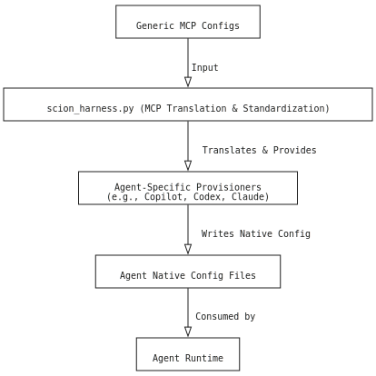

The Fabric platform utilizes Multi-Channel Proxy (MCP) servers to enable flexible communication between agents and external services. These proxies allow agents to communicate over various protocols and channels, such as standard input/output (stdio), Server-Sent Events (SSE), or streamable HTTP, without requiring the agent itself to directly manage the complexities of these communication methods. The [`fabric_harness.py`](https://github.com/pdlc-os/fabric/blob/b11448f8f01fdcf12deab96204417d87f8d46ab3/harnesses/README.md?plain=1#L130) shared Python library, located in [`harnesses/fabric_harness.py`](https://github.com/pdlc-os/fabric/blob/b11448f8f01fdcf12deab96204417d87f8d46ab3/harnesses/fabric_harness.py), plays a central role in translating and integrating these MCP server configurations into the native configuration formats of different coding agents.

Specifically, the [`fabric_harness.py`](https://github.com/pdlc-os/fabric/blob/b11448f8f01fdcf12deab96204417d87f8d46ab3/harnesses/README.md?plain=1#L130) library provides utilities such as [`apply_mcp_servers_simple`](https://github.com/pdlc-os/fabric/blob/b11448f8f01fdcf12deab96204417d87f8d46ab3/harnesses/fabric_harness.py#L167) and [`apply_mcp_translated`](https://github.com/pdlc-os/fabric/blob/b11448f8f01fdcf12deab96204417d87f8d46ab3/harnesses/fabric_harness.py#L844). These functions are designed to abstract away the differences in how various agents (e.g., Antigravity, Claude, Codex, Copilot, Hermes, OpenCode) consume network proxy settings. For instance, the [`harnesses/copilot/provision.py`](https://github.com/pdlc-os/fabric/blob/b11448f8f01fdcf12deab96204417d87f8d46ab3/harnesses/copilot/provision.py) script leverages [`translate_mcp`](https://github.com/pdlc-os/fabric/blob/b11448f8f01fdcf12deab96204417d87f8d46ab3/harnesses/copilot/provision.py#L162) to convert Fabric's universal MCP server configurations into Copilot's specific format and writes them to a dedicated configuration file within the agent's environment. Similarly, the [`harnesses/codex/provision.py`](https://github.com/pdlc-os/fabric/blob/b11448f8f01fdcf12deab96204417d87f8d46ab3/harnesses/codex/provision.py) script uses [`_build_mcp_section`](https://github.com/pdlc-os/fabric/blob/b11448f8f01fdcf12deab96204417d87f8d46ab3/harnesses/codex/provision.py#L254) and [`_write_mcp_to_config`](https://github.com/pdlc-os/fabric/blob/b11448f8f01fdcf12deab96204417d87f8d46ab3/harnesses/codex/provision.py#L287) to translate MCP definitions into TOML sections for the Codex agent's [`config.toml`](https://github.com/pdlc-os/fabric/blob/b11448f8f01fdcf12deab96204417d87f8d46ab3/harnesses/codex/README.md?plain=1#L37). The [`harnesses/claude/provision.py`](https://github.com/pdlc-os/fabric/blob/b11448f8f01fdcf12deab96204417d87f8d46ab3/harnesses/claude/provision.py) script also uses [`fabric_harness.apply_mcp_servers_simple`](https://github.com/pdlc-os/fabric/blob/b11448f8f01fdcf12deab96204417d87f8d46ab3/harnesses/README.md?plain=1#L127) to adapt MCP settings for the Claude Code CLI.

This approach ensures that regardless of an agent's internal configuration mechanisms, it can consistently leverage the MCP servers defined by the Fabric platform for its communication needs. This standardization simplifies the integration of new agents and ensures uniform network behavior across the ecosystem. For further details on the common functionalities provided by this library, refer to [Shared Python Harness Library (`fabric_harness.py`)](#agent-harness-management-shared-python-harness-library-fabric-harness-py).

### Automated Vendoring and Consistency Enforcement

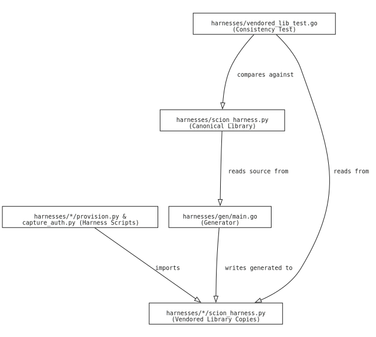

The [`fabric`](https://github.com/pdlc-os/fabric/blob/b11448f8f01fdcf12deab96204417d87f8d46ab3/README.md?plain=1#L1) platform maintains consistency across its agent harness configurations through an automated vendoring process. A Go program located at [`harnesses/gen/main.go`](https://github.com/pdlc-os/fabric/blob/b11448f8f01fdcf12deab96204417d87f8d46ab3/harnesses/gen/main.go) is responsible for distributing a canonical Python utility library, [`fabric_harness.py`](https://github.com/pdlc-os/fabric/blob/b11448f8f01fdcf12deab96204417d87f8d46ab3/harnesses/README.md?plain=1#L130), to all relevant harness subdirectories. This ensures that agent-specific [`provision.py`](https://github.com/pdlc-os/fabric/blob/b11448f8f01fdcf12deab96204417d87f8d46ab3/harnesses/README.md?plain=1#L91) and [`capture_auth.py`](https://github.com/pdlc-os/fabric/blob/b11448f8f01fdcf12deab96204417d87f8d46ab3/harnesses/README.md?plain=1#L83) scripts consistently utilize the same version of shared functionalities for tasks like authentication resolution and instruction projection, as described in [Harness Bundle Structure and Core Functionality](#agent-harness-management-harness-bundle-structure-and-core-functionality).

When executed, the Go program reads the contents of the central [`harnesses/fabric_harness.py`](https://github.com/pdlc-os/fabric/blob/b11448f8f01fdcf12deab96204417d87f8d46ab3/harnesses/fabric_harness.py). It then iterates through the harness directories, identifying those that contain a [`provision.py`](https://github.com/pdlc-os/fabric/blob/b11448f8f01fdcf12deab96204417d87f8d46ab3/harnesses/README.md?plain=1#L91) file, which signifies an active harness bundle. For each identified bundle, it creates or overwrites a [`fabric_harness.py`](https://github.com/pdlc-os/fabric/blob/b11448f8f01fdcf12deab96204417d87f8d46ab3/harnesses/README.md?plain=1#L130) file within that subdirectory. Each generated file includes a header indicating its machine-generated status, effectively discouraging manual modifications that would otherwise be overwritten during subsequent runs. This mechanism standardizes the shared Python library and prevents divergence across different agent harnesses.

To further enforce this consistency, a Go test, [`harnesses/vendored_lib_test.go`](https://github.com/pdlc-os/fabric/blob/b11448f8f01fdcf12deab96204417d87f8d46ab3/harnesses/vendored_lib_test.go), verifies that all vendored copies of [`fabric_harness.py`](https://github.com/pdlc-os/fabric/blob/b11448f8f01fdcf12deab96204417d87f8d46ab3/harnesses/README.md?plain=1#L130) precisely match the canonical source and retain the expected generated header. This test acts as a safeguard against accidental or intentional changes to vendored copies, ensuring that any modifications must be made to the central [`harnesses/fabric_harness.py`](https://github.com/pdlc-os/fabric/blob/b11448f8f01fdcf12deab96204417d87f8d46ab3/harnesses/fabric_harness.py) file, thereby maintaining a single source of truth for the shared harness logic.

## Container Image Build and Management

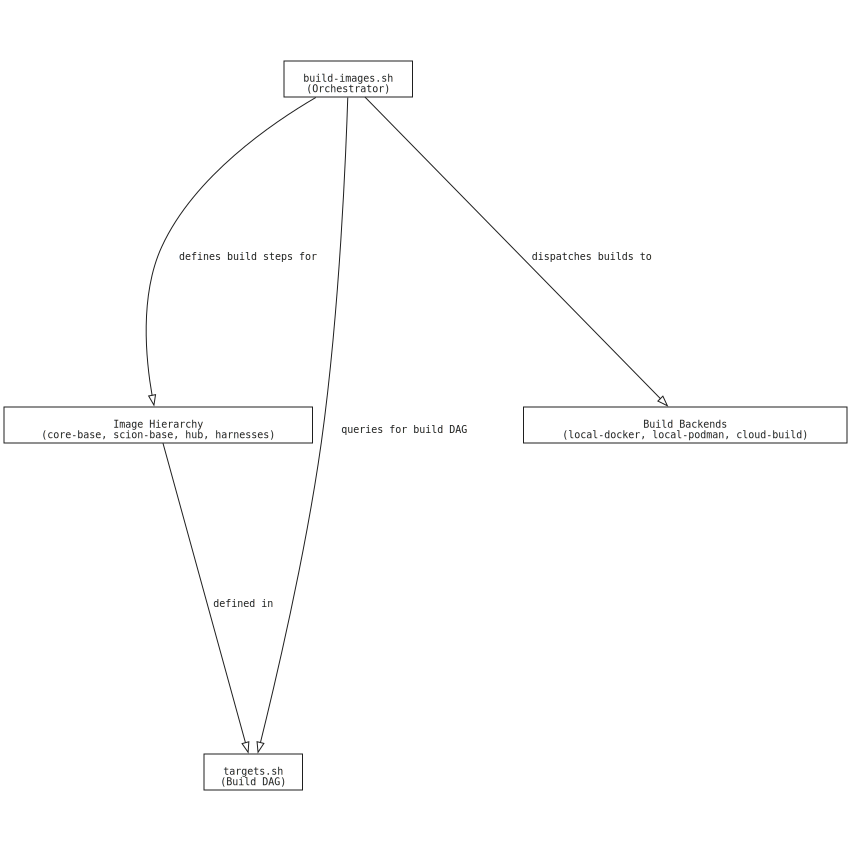

Fabric manages container image builds for its various components, encompassing base images, server images, and specialized harness images for different execution environments. This process is orchestrated through a flexible system that supports multiple build backends, including Docker, Podman, and Google Cloud Build. The system is designed to provide consistency and efficiency in image creation, ensuring that Fabric components have the necessary runtime environments.

The image hierarchy is structured to promote layering and reuse. Core images, such as [`core-base`](https://github.com/pdlc-os/fabric/blob/b11448f8f01fdcf12deab96204417d87f8d46ab3/agents.md?plain=1#L138), provide fundamental development tools like Go, Git, and various Unix utilities without any Fabric-specific tooling. Building upon this, [`fabric-base`](https://github.com/pdlc-os/fabric/blob/b11448f8f01fdcf12deab96204417d87f8d46ab3/cmd/build.go#L84) incorporates the [`fabric`](https://github.com/pdlc-os/fabric/blob/b11448f8f01fdcf12deab96204417d87f8d46ab3/README.md?plain=1#L1) and [`fabrictool`](https://github.com/pdlc-os/fabric/blob/b11448f8f01fdcf12deab96204417d87f8d46ab3/docs-site/src/content/docs/glossary.md?plain=1#L44) binaries, alongside a wrapper for the [`gh`](https://github.com/pdlc-os/fabric/blob/b11448f8f01fdcf12deab96204417d87f8d46ab3/cmd/create.go#L147) CLI to manage GitHub authentication. Further specialization leads to the [`hub`](https://github.com/pdlc-os/fabric/blob/b11448f8f01fdcf12deab96204417d87f8d46ab3/hack/apitest/main.go#L28) image, which is configured to run the Fabric Hub server, and [`gemini`](https://github.com/pdlc-os/fabric/blob/b11448f8f01fdcf12deab96204417d87f8d46ab3/agents.md?plain=1#L26) for a [`gemini-cli`](https://github.com/pdlc-os/fabric/blob/b11448f8f01fdcf12deab96204417d87f8d46ab3/harnesses/embed.go#L24) environment. Additionally, various harness images are dynamically discovered from their respective configuration bundles, extending [`fabric-base`](https://github.com/pdlc-os/fabric/blob/b11448f8f01fdcf12deab96204417d87f8d46ab3/cmd/build.go#L84) to support specific agent execution requirements. This hierarchical approach minimizes duplication and facilitates efficient updates across the Fabric ecosystem.

Build orchestration is managed by a central script, [`build-images.sh`](https://github.com/pdlc-os/fabric/blob/b11448f8f01fdcf12deab96204417d87f8d46ab3/cmd/project.go#L413) in [`image-build/scripts`](https://github.com/pdlc-os/fabric/blob/b11448f8f01fdcf12deab96204417d87f8d46ab3/image-build/scripts), which acts as the primary interface for initiating image builds. This script utilizes a pluggable backend system, allowing users to choose their preferred build environment via flags like [`--builder local-docker`](https://github.com/pdlc-os/fabric/blob/b11448f8f01fdcf12deab96204417d87f8d46ab3/image-build/README.md?plain=1#L31), [`--builder local-podman`](https://github.com/pdlc-os/fabric/blob/b11448f8f01fdcf12deab96204417d87f8d46ab3/image-build/README.md?plain=1#L31), or [`--builder cloud-build`](https://github.com/pdlc-os/fabric/blob/b11448f8f01fdcf12deab96204417d87f8d46ab3/cmd/build.go#L70). This design decouples the build logic from the underlying container technology, making the system adaptable to different infrastructure choices. The script also handles target sequencing, tag computation, and dependency resolution to ensure a consistent and reproducible build process.

For those utilizing Google Cloud Build, a dedicated setup script, [`setup-cloud-build.sh`](https://github.com/pdlc-os/fabric/blob/b11448f8f01fdcf12deab96204417d87f8d46ab3/image-build/README.md?plain=1#L35) in [`image-build/scripts`](https://github.com/pdlc-os/fabric/blob/b11448f8f01fdcf12deab96204417d87f8d46ab3/image-build/scripts), automates the necessary Google Cloud Project configurations. This includes enabling required APIs, creating Artifact Registry Docker repositories, and setting appropriate Identity and Access Management (IAM) permissions to allow Cloud Build to push images. This integrated approach streamlines the setup of cloud-based build environments for Fabric components.

The build system also includes mechanisms for image metadata and dependency management. The script [`targets.sh`](https://github.com/pdlc-os/fabric/blob/b11448f8f01fdcf12deab96204417d87f8d46ab3/image-build/README.md?plain=1#L32) in [`image-build/scripts/lib`](https://github.com/pdlc-os/fabric/blob/b11448f8f01fdcf12deab96204417d87f8d46ab3/image-build/scripts/lib) serves as the authoritative source for defining the Directed Acyclic Graph (DAG) of image builds, specifying dependencies, Dockerfile locations, build contexts, and arguments. This ensures that images are built in the correct order with the necessary upstream components. For more details on the automated vendoring process for shared harness libraries, refer to [Automated Vendoring and Consistency Enforcement](#agent-harness-management-automated-vendoring-and-consistency-enforcement).

In addition to building, the system also provides utilities for pulling pre-built images. The [`pull-containers.sh`](https://github.com/pdlc-os/fabric/blob/b11448f8f01fdcf12deab96204417d87f8d46ab3/image-build/README.md?plain=1#L34) script in [`image-build/scripts`](https://github.com/pdlc-os/fabric/blob/b11448f8f01fdcf12deab96204417d87f8d46ab3/image-build/scripts) automates the retrieval of Fabric container images from a specified registry, supporting various container runtimes and dynamically discovering images including [`fabric-base`](https://github.com/pdlc-os/fabric/blob/b11448f8f01fdcf12deab96204417d87f8d46ab3/cmd/build.go#L84), [`fabric-hub`](https://github.com/pdlc-os/fabric/blob/b11448f8f01fdcf12deab96204417d87f8d46ab3/pkg/hub/server.go#L213), and harness images. This ensures that users can easily deploy Fabric components with pre-configured images.

### Image Hierarchy and Base Images

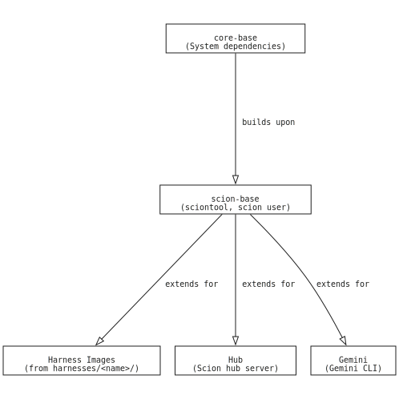

Fabric container images are structured hierarchically to promote efficient layering and reuse across different Fabric components. This architecture ensures that core dependencies are established once and then extended for more specialized images, streamlining maintenance and reducing build times. The entire image build process is managed from the [`image-build`](https://github.com/pdlc-os/fabric/blob/b11448f8f01fdcf12deab96204417d87f8d46ab3/image-build) directory.

The foundational image in this hierarchy is the [`core-base`](https://github.com/pdlc-os/fabric/blob/b11448f8f01fdcf12deab96204417d87f8d46ab3/agents.md?plain=1#L138) image, defined by the [`Dockerfile`](https://github.com/pdlc-os/fabric/blob/b11448f8f01fdcf12deab96204417d87f8d46ab3/agents.md?plain=1#L138) in [`image-build/core-base/Dockerfile`](https://github.com/pdlc-os/fabric/blob/b11448f8f01fdcf12deab96204417d87f8d46ab3/image-build/core-base/Dockerfile). This image provides a robust development environment with essential tools such as Go, Git, various Unix utilities, and Google Cloud Storage FUSE. It serves as a generic, language-specific base without any Fabric-specific tooling or user configurations, making it broadly reusable.

Building upon the [`core-base`](https://github.com/pdlc-os/fabric/blob/b11448f8f01fdcf12deab96204417d87f8d46ab3/agents.md?plain=1#L138) image is the [`fabric-base`](https://github.com/pdlc-os/fabric/blob/b11448f8f01fdcf12deab96204417d87f8d46ab3/cmd/build.go#L84) image, located in [`image-build/fabric-base`](https://github.com/pdlc-os/fabric/blob/b11448f8f01fdcf12deab96204417d87f8d46ab3/image-build/fabric-base). This image integrates the core Fabric binaries, specifically [`fabric`](https://github.com/pdlc-os/fabric/blob/b11448f8f01fdcf12deab96204417d87f8d46ab3/README.md?plain=1#L1) and [`fabrictool`](https://github.com/pdlc-os/fabric/blob/b11448f8f01fdcf12deab96204417d87f8d46ab3/docs-site/src/content/docs/glossary.md?plain=1#L44). It also configures a [`gh`](https://github.com/pdlc-os/fabric/blob/b11448f8f01fdcf12deab96204417d87f8d46ab3/cmd/create.go#L147) CLI wrapper for managing GitHub authentication and sets up a dedicated [`fabric`](https://github.com/pdlc-os/fabric/blob/b11448f8f01fdcf12deab96204417d87f8d46ab3/README.md?plain=1#L1) user to handle permissions within the container environment. The [`fabrictool init`](https://github.com/pdlc-os/fabric/blob/b11448f8f01fdcf12deab96204417d87f8d46ab3/cmd/common.go#L294) command is set as the entrypoint, allowing for flexible user ID/group ID mapping to the host system.

Harness images, located within the [`harnesses`](https://github.com/pdlc-os/fabric/blob/b11448f8f01fdcf12deab96204417d87f8d46ab3/harnesses) directory, are optional extensions that build on the [`fabric-base`](https://github.com/pdlc-os/fabric/blob/b11448f8f01fdcf12deab96204417d87f8d46ab3/cmd/build.go#L84) image. These images provide specialized environments tailored for specific coding agents or workflows. Their discovery and integration into the build process are dynamic, allowing for flexible inclusion of various toolchains and dependencies as needed by different harnesses.

The [`hub`](https://github.com/pdlc-os/fabric/blob/b11448f8f01fdcf12deab96204417d87f8d46ab3/hack/apitest/main.go#L28) image, defined by the [`Dockerfile`](https://github.com/pdlc-os/fabric/blob/b11448f8f01fdcf12deab96204417d87f8d46ab3/agents.md?plain=1#L138) in [`image-build/hub/Dockerfile`](https://github.com/pdlc-os/fabric/blob/b11448f8f01fdcf12deab96204417d87f8d46ab3/image-build/hub/Dockerfile), specializes the [`fabric-base`](https://github.com/pdlc-os/fabric/blob/b11448f8f01fdcf12deab96204417d87f8d46ab3/cmd/build.go#L84) image to run the Fabric Hub server. It configures the necessary filesystem structure and sets the default command to start the hub server in foreground mode, enabling all hub-specific functionalities.

Finally, the [`gemini`](https://github.com/pdlc-os/fabric/blob/b11448f8f01fdcf12deab96204417d87f8d46ab3/agents.md?plain=1#L26) image, configured in [`image-build/gemini/Dockerfile`](https://github.com/pdlc-os/fabric/blob/b11448f8f01fdcf12deab96204417d87f8d46ab3/image-build/gemini/Dockerfile), provides an environment for the [`gemini-cli`](https://github.com/pdlc-os/fabric/blob/b11448f8f01fdcf12deab96204417d87f8d46ab3/harnesses/embed.go#L24) application. It installs the [`gemini-cli`](https://github.com/pdlc-os/fabric/blob/b11448f8f01fdcf12deab96204417d87f8d46ab3/harnesses/embed.go#L24) globally via npm and sets up the required user directories for its operation. This image leverages a flexible base image argument, allowing it to integrate with different underlying environments.

### Build Orchestration with `build-images.sh`

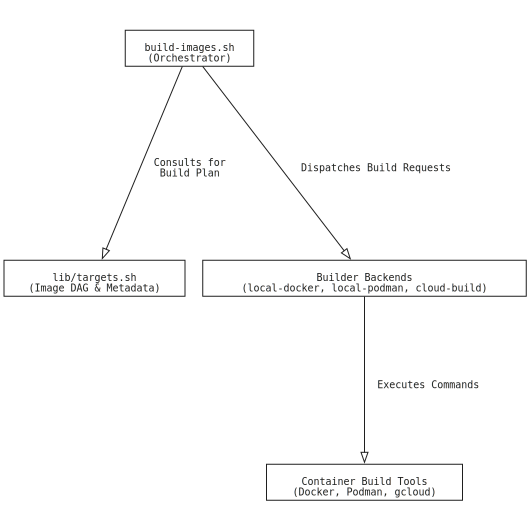

The [`build-images.sh`](https://github.com/pdlc-os/fabric/blob/b11448f8f01fdcf12deab96204417d87f8d46ab3/cmd/project.go#L413) script, located at [`image-build/scripts/build-images.sh`](https://github.com/pdlc-os/fabric/blob/b11448f8f01fdcf12deab96204417d87f8d46ab3/image-build/scripts/build-images.sh), serves as the central orchestrator for building Fabric container images. It manages the entire build process, from determining which images to build to executing the builds using various backend technologies. This orchestration script supports several key functionalities, including managing the sequence of image builds, computing appropriate tags, and enabling multi-platform builds.

The script's core strength lies in its pluggable backend architecture. It can delegate the actual image construction to different builders, such as [`local-docker`](https://github.com/pdlc-os/fabric/blob/b11448f8f01fdcf12deab96204417d87f8d46ab3/image-build/README.md?plain=1#L31), [`local-podman`](https://github.com/pdlc-os/fabric/blob/b11448f8f01fdcf12deab96204417d87f8d46ab3/image-build/README.md?plain=1#L31), or [`cloud-build`](https://github.com/pdlc-os/fabric/blob/b11448f8f01fdcf12deab96204417d87f8d46ab3/cmd/build.go#L70), depending on the specified [`--builder`](https://github.com/pdlc-os/fabric/blob/b11448f8f01fdcf12deab96204417d87f8d46ab3/cmd/build.go#L173) argument. This modularity allows the Fabric project to leverage diverse containerization tools and environments without altering the fundamental orchestration logic. Each builder ([`image-build/scripts/builders/local-docker.sh`](https://github.com/pdlc-os/fabric/blob/b11448f8f01fdcf12deab96204417d87f8d46ab3/image-build/scripts/builders/local-docker.sh), [`image-build/scripts/builders/local-podman.sh`](https://github.com/pdlc-os/fabric/blob/b11448f8f01fdcf12deab96204417d87f8d46ab3/image-build/scripts/builders/local-podman.sh), [`image-build/scripts/builders/cloud-build.sh`](https://github.com/pdlc-os/fabric/blob/b11448f8f01fdcf12deab96204417d87f8d46ab3/image-build/scripts/builders/cloud-build.sh)) adheres to a defined interface, ensuring seamless integration with [`build-images.sh`](https://github.com/pdlc-os/fabric/blob/b11448f8f01fdcf12deab96204417d87f8d46ab3/cmd/project.go#L413).

[`build-images.sh`](https://github.com/pdlc-os/fabric/blob/b11448f8f01fdcf12deab96204417d87f8d46ab3/cmd/project.go#L413) is responsible for resolving build targets and their dependencies, as defined in [`image-build/scripts/lib/targets.sh`](https://github.com/pdlc-os/fabric/blob/b11448f8f01fdcf12deab96204417d87f8d46ab3/image-build/scripts/lib/targets.sh). This file acts as the single source of truth for the Directed Acyclic Graph (DAG) of images, ensuring that base images are built before images that depend on them. The orchestrator also handles the computation of image tags, incorporating both mutable tags (like [`latest`](https://github.com/pdlc-os/fabric/blob/b11448f8f01fdcf12deab96204417d87f8d46ab3/Makefile#L76)) and short Git SHA hashes to prevent race conditions during chained builds. For details on how these images are defined, see [Image Metadata and Dependency Graph Management](#container-image-build-and-management-image-metadata-and-dependency-graph-management).

Furthermore, the script supports multi-platform builds, particularly when using the [`local-docker`](https://github.com/pdlc-os/fabric/blob/b11448f8f01fdcf12deab96204417d87f8d46ab3/image-build/README.md?plain=1#L31) builder with [`docker buildx`](https://github.com/pdlc-os/fabric/blob/b11448f8f01fdcf12deab96204417d87f8d46ab3/cmd/build.go#L96) or when submitting builds to Google Cloud Build, which inherently supports multi-architecture images. This ensures that Fabric agents and services can run consistently across different hardware architectures.

In summary, [`build-images.sh`](https://github.com/pdlc-os/fabric/blob/b11448f8f01fdcf12deab96204417d87f8d46ab3/cmd/project.go#L413) abstracts the complexities of container image building, providing a unified command-line interface for developers to build Fabric components while offering flexibility in choosing the underlying build technology and targeting various platforms.

### Pluggable Build Backends (Docker, Podman, Cloud Build)

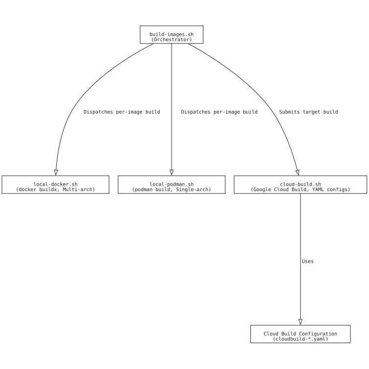

The Fabric image build system supports multiple pluggable backends for container image construction, allowing developers to choose their preferred environment. These backends are implemented as distinct scripts located in the [`image-build/scripts/builders`](https://github.com/pdlc-os/fabric/blob/b11448f8f01fdcf12deab96204417d87f8d46ab3/image-build/scripts/builders) directory.

The [`image-build/scripts/builders/local-docker.sh`](https://github.com/pdlc-os/fabric/blob/b11448f8f01fdcf12deab96204417d87f8d46ab3/image-build/scripts/builders/local-docker.sh) script leverages [`docker buildx`](https://github.com/pdlc-os/fabric/blob/b11448f8f01fdcf12deab96204417d87f8d46ab3/cmd/build.go#L96) to perform image builds. This backend is capable of orchestrating multi-architecture builds, meaning it can create images compatible with various processor architectures (e.g., [`linux/amd64`](https://github.com/pdlc-os/fabric/blob/b11448f8f01fdcf12deab96204417d87f8d46ab3/cmd/build.go#L196), [`linux/arm64`](https://github.com/pdlc-os/fabric/blob/b11448f8f01fdcf12deab96204417d87f8d46ab3/cmd/build.go#L196)). It manages the [`buildx`](https://github.com/pdlc-os/fabric/blob/b11448f8f01fdcf12deab96204417d87f8d46ab3/cmd/build.go#L204) environment, creating dedicated builder instances when necessary to handle complex build requirements, such as pushing multi-platform images to a registry.

For users preferring Podman, the [`image-build/scripts/builders/local-podman.sh`](https://github.com/pdlc-os/fabric/blob/b11448f8f01fdcf12deab96204417d87f8d46ab3/image-build/scripts/builders/local-podman.sh) script provides a wrapper around the [`podman build`](https://github.com/pdlc-os/fabric/blob/b11448f8f01fdcf12deab96204417d87f8d46ab3/cmd/build.go#L171) command. This backend is primarily designed for single-architecture builds. Notably, it explicitly prevents implicit multi-platform builds and guides users to manually configure QEMU [`binfmt`](https://github.com/pdlc-os/fabric/blob/b11448f8f01fdcf12deab96204417d87f8d46ab3/image-build/scripts/builders/local-podman.sh#L19) for such capabilities or to utilize an alternative builder like [`image-build/scripts/builders/local-docker.sh`](https://github.com/pdlc-os/fabric/blob/b11448f8f01fdcf12deab96204417d87f8d46ab3/image-build/scripts/builders/local-docker.sh). This ensures clarity regarding the underlying infrastructure required for advanced build scenarios.

The [`image-build/scripts/builders/cloud-build.sh`](https://github.com/pdlc-os/fabric/blob/b11448f8f01fdcf12deab96204417d87f8d46ab3/image-build/scripts/builders/cloud-build.sh) script integrates with Google Cloud Build, acting as a "target-mode" builder. Instead of building individual images, it submits predefined [`cloudbuild-*.yaml`](https://github.com/pdlc-os/fabric/blob/b11448f8f01fdcf12deab96204417d87f8d46ab3/cmd/build.go#L240) configurations, such as the ones found within the top-level [`image-build`](https://github.com/pdlc-os/fabric/blob/b11448f8f01fdcf12deab96204417d87f8d46ab3/image-build) directory, to Google Cloud Build. This allows the build process, including caching and multi-step image creation, to be managed and executed within the Google Cloud environment. It handles the dynamic determination of the Google Cloud Project and manages substitutions for variables like image tags and Git commit SHAs, ensuring that the Cloud Build configurations receive the necessary context for the build. This separation allows for the complexity of the build logic to reside within version-controlled Cloud Build configurations.

The overall build orchestration is managed by [`image-build/scripts/build-images.sh`](https://github.com/pdlc-os/fabric/blob/b11448f8f01fdcf12deab96204417d87f8d46ab3/image-build/scripts/build-images.sh), which selects and invokes these backend scripts based on user preferences or specified build targets. This modular approach allows for flexible and extensible image building within the Fabric platform. For more details on the orchestration, refer to [Build Orchestration with `build-images.sh`](#container-image-build-and-management-build-orchestration-with-build-images-sh).

### Image Metadata and Dependency Graph Management

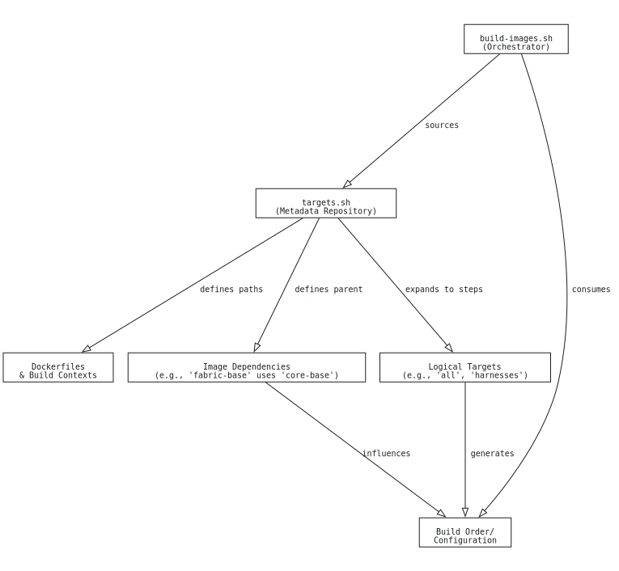

The file [`image-build/scripts/lib/targets.sh`](https://github.com/pdlc-os/fabric/blob/b11448f8f01fdcf12deab96204417d87f8d46ab3/image-build/scripts/lib/targets.sh) functions as the central repository for metadata related to Fabric container image builds. It defines the relationships and properties of various images, ensuring a consistent and ordered build process. This includes specifying which images need to be built, in what sequence, and with what configurations.

This file explicitly lists all known buildable images and groups them into logical targets, such as [`all`](https://github.com/pdlc-os/fabric/blob/b11448f8f01fdcf12deab96204417d87f8d46ab3/pkg/ent/user_query.go#L238) or [`harnesses`](https://github.com/pdlc-os/fabric/blob/b11448f8f01fdcf12deab96204417d87f8d46ab3/pkg/hub/server.go#L203), which represent collections of images for different purposes. A key function of this metadata store is to resolve dependencies, meaning it determines the correct order in which images must be built to satisfy their base image requirements. For example, building [`fabric-hub`](https://github.com/pdlc-os/fabric/blob/b11448f8f01fdcf12deab96204417d87f8d46ab3/pkg/hub/server.go#L213) requires [`fabric-base`](https://github.com/pdlc-os/fabric/blob/b11448f8f01fdcf12deab96204417d87f8d46ab3/cmd/build.go#L84) to be built first.

A notable feature is the dynamic discovery of harness images. The system automatically identifies [`Dockerfile`](https://github.com/pdlc-os/fabric/blob/b11448f8f01fdcf12deab96204417d87f8d46ab3/agents.md?plain=1#L138)s within the [`harnesses`](https://github.com/pdlc-os/fabric/blob/b11448f8f01fdcf12deab96204417d87f8d46ab3/harnesses) directory. This allows new harness images to be incorporated into the build process without manual updates to the core configuration. For each image, the metadata also specifies the location of its [`Dockerfile`](https://github.com/pdlc-os/fabric/blob/b11448f8f01fdcf12deab96204417d87f8d46ab3/agents.md?plain=1#L138), its build context directory, and any arguments needed during the build process, such as the base image tag or registry. These definitions enable the build orchestrator, typically [`image-build/scripts/build-images.sh`](https://github.com/pdlc-os/fabric/blob/b11448f8f01fdcf12deab96204417d87f8d46ab3/image-build/scripts/build-images.sh), to execute builds consistently across different environments.

### Google Cloud Build Environment Setup and Verification

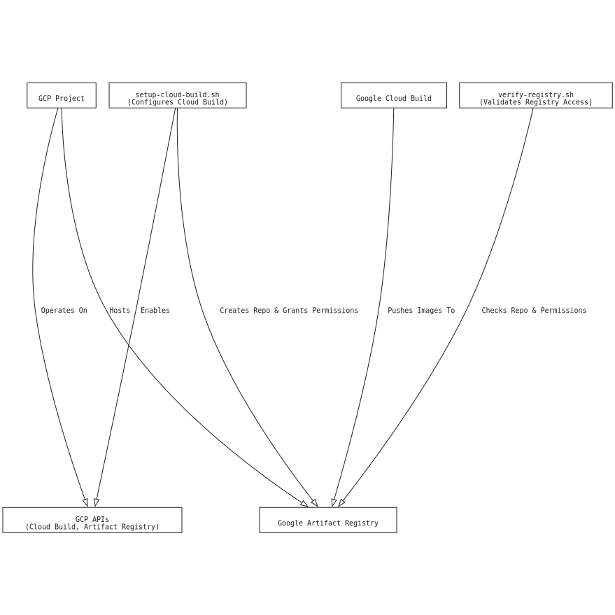

The [`fabric`](https://github.com/pdlc-os/fabric/blob/b11448f8f01fdcf12deab96204417d87f8d46ab3/README.md?plain=1#L1) project includes automated processes for setting up and verifying a Google Cloud Project for container image builds using Google Cloud Build. This setup involves enabling necessary APIs, creating an Artifact Registry repository, and granting appropriate IAM permissions to the Cloud Build service account.

The [`setup-cloud-build.sh`](https://github.com/pdlc-os/fabric/blob/b11448f8f01fdcf12deab96204417d87f8d46ab3/image-build/README.md?plain=1#L35) script automates this initial provisioning. It enables the [`cloudbuild.googleapis.com`](https://github.com/pdlc-os/fabric/blob/b11448f8f01fdcf12deab96204417d87f8d46ab3/image-build/scripts/setup-cloud-build.sh#L76) and [`artifactregistry.googleapis.com`](https://github.com/pdlc-os/fabric/blob/b11448f8f01fdcf12deab96204417d87f8d46ab3/extras/fabric-chat-app/README.md?plain=1#L40) APIs, creates an Artifact Registry Docker repository if one doesn't already exist, and then grants the Cloud Build service account the [`roles/artifactregistry.writer`](https://github.com/pdlc-os/fabric/blob/b11448f8f01fdcf12deab96204417d87f8d46ab3/image-build/scripts/setup-cloud-build.sh#L104) permission on this repository. This permission is essential for Cloud Build to push newly built container images to the registry. The script also outputs the full registry path, which is critical for subsequent build and configuration steps.

Before initiating image builds, the [`verify-registry.sh`](https://github.com/pdlc-os/fabric/blob/b11448f8f01fdcf12deab96204417d87f8d46ab3/image-build/cloudbuild.yaml#L20) script performs pre-flight checks to ensure that the Cloud Build environment is correctly configured. This script verifies two main conditions: first, that the specified Artifact Registry repository exists, and second, that the active service account has the [`artifactregistry.repositories.uploadArtifacts`](https://github.com/pdlc-os/fabric/blob/b11448f8f01fdcf12deab96204417d87f8d46ab3/image-build/scripts/verify-registry.sh#L60) permission, enabling it to push images to the registry. These checks help to proactively identify and resolve potential configuration or permission issues before they lead to build failures.

Once the Cloud Build environment is set up and verified, image builds can be orchestrated using the main [`build-images.sh`](https://github.com/pdlc-os/fabric/blob/b11448f8f01fdcf12deab96204417d87f8d46ab3/cmd/project.go#L413) script with the [`--builder cloud-build`](https://github.com/pdlc-os/fabric/blob/b11448f8f01fdcf12deab96204417d87f8d46ab3/cmd/build.go#L70) option. This script, along with the builders defined in [`image-build/scripts/builders`](https://github.com/pdlc-os/fabric/blob/b11448f8f01fdcf12deab96204417d87f8d46ab3/image-build/scripts/builders), handles the mapping of build targets to Cloud Build configurations and manages the necessary substitutions for image tags and registry paths. For more details on the overall image build orchestration, refer to [Container Image Build and Management](#container-image-build-and-management).

## Auxiliary Tools and Integrations

| Tool Name | Directory Path | Primary Function |
| --- | --- | --- |
| Agent Visualizer | `extras/agent-viz/` | Replays agent activity from Google Cloud Logging as a 2D force-directed graph visualization. |
| Fabric Docs Agent | `extras/docs-agent/` | Q&A service about Fabric using Gemini CLI, deployed as a Cloud Run service. |
| `fabric-fs-watcher` | `extras/fs-watcher-tool/` | Monitors filesystem activity across Fabric agent worktrees and attributes events to originating agents. |
| `fabric-a2a-bridge` | `extras/fabric-a2a-bridge/` | Exposes Fabric agents as A2A (Agent-to-Agent) endpoints, translating JSON-RPC requests to Hub API calls. |
| `fabric-broker-log` | `extras/fabric-broker-log/` | Logs all messages flowing through the Fabric message broker, serving as a reference and debugging tool. |
| Fabric Chat App | `extras/fabric-chat-app/` | Bridges Google Chat (and Slack) with the Fabric Hub for agent management and notifications. |
| `fabric-plugin-discord` | `extras/fabric-discord/` | Provides bidirectional messaging between Discord channels and Fabric agents. |
| `fabric-plugin-telegram` | `extras/fabric-telegram/` | Provides bidirectional messaging between Telegram group chats and Fabric agents. |

The [`extras`](https://github.com/pdlc-os/fabric/blob/b11448f8f01fdcf12deab96204417d87f8d46ab3/extras) directory provides a suite of supplementary tools and integrations designed to extend the Fabric platform's capabilities. These tools address various aspects of agent operation, observability, and communication, ranging from visualizing agent activity to integrating with popular messaging platforms.

One core utility is [`agent-viz`](https://github.com/pdlc-os/fabric/blob/b11448f8f01fdcf12deab96204417d87f8d46ab3/extras/agent-viz/go.mod#L1), located in [`extras/agent-viz`](https://github.com/pdlc-os/fabric/blob/b11448f8f01fdcf12deab96204417d87f8d46ab3/extras/agent-viz). This web-based visualizer processes Google Cloud Logging exports to reconstruct and display [`fabric`](https://github.com/pdlc-os/fabric/blob/b11448f8f01fdcf12deab96204417d87f8d46ab3/README.md?plain=1#L1) agent activity as a 2D force-directed graph. It illustrates inter-agent communications, file interactions, and agent states, offering playback controls and filtering for detailed analysis of agent behavior. The backend Go binary parses logs and serves the web frontend, which then visualizes the data.

For AI-powered Q&A, the [`Fabric Docs Agent`](https://github.com/pdlc-os/fabric/blob/b11448f8f01fdcf12deab96204417d87f8d46ab3/extras/docs-agent/README.md?plain=1#L1) in [`extras/docs-agent`](https://github.com/pdlc-os/fabric/blob/b11448f8f01fdcf12deab96204417d87f8d46ab3/extras/docs-agent) provides a service that answers questions about Fabric by querying its documentation, source code, and design documents. This agent leverages the Gemini CLI to process natural language queries and offers an embeddable chat widget, alongside endpoints for refreshing its knowledge base from the Git repository.

To monitor filesystem activity, [`fabric-fs-watcher`](https://github.com/pdlc-os/fabric/blob/b11448f8f01fdcf12deab96204417d87f8d46ab3/extras/fs-watcher-tool/README.md?plain=1#L1) (in [`extras/fs-watcher-tool`](https://github.com/pdlc-os/fabric/blob/b11448f8f01fdcf12deab96204417d87f8d46ab3/extras/fs-watcher-tool)) is a Linux utility that uses the [`fanotify`](https://github.com/pdlc-os/fabric/blob/b11448f8f01fdcf12deab96204417d87f8d46ab3/extras/fs-watcher-tool/README.md?plain=1#L3) API. It tracks file system events within [`fabric`](https://github.com/pdlc-os/fabric/blob/b11448f8f01fdcf12deab96204417d87f8d46ab3/README.md?plain=1#L1) agent worktrees and attributes these events to specific Docker-managed agents by correlating process IDs with Docker container labels. This tool is designed to identify which agent is responsible for which file modification, offering features like dynamic directory management, noise filtering, and event coalescing.

The directory also contains several messaging platform bridges that enable Fabric agents to interact with external systems. The [`fabric-a2a-bridge`](https://github.com/pdlc-os/fabric/blob/b11448f8f01fdcf12deab96204417d87f8d46ab3/extras/fabric-a2a-bridge/README.md?plain=1#L1) in [`extras/fabric-a2a-bridge`](https://github.com/pdlc-os/fabric/blob/b11448f8f01fdcf12deab96204417d87f8d46ab3/extras/fabric-a2a-bridge) serves as a protocol bridge between A2A (Application-to-Application) clients and Fabric agents. It translates JSON-RPC requests, dynamically generates A2A Agent Cards, and supports various message delivery modes including blocking, Server-Sent Events (SSE), and webhooks, with robust authentication and rate limiting.

Beyond A2A, integrations exist for widely used chat platforms. The [`fabric-broker-log`](https://github.com/pdlc-os/fabric/blob/b11448f8f01fdcf12deab96204417d87f8d46ab3/extras/fabric-broker-log/README.md?plain=1#L1) plugin in [`extras/fabric-broker-log`](https://github.com/pdlc-os/fabric/blob/b11448f8f01fdcf12deab96204417d87f8d46ab3/extras/fabric-broker-log) acts as a reference implementation for a [`go-plugin`](https://github.com/pdlc-os/fabric/blob/b11448f8f01fdcf12deab96204417d87f8d46ab3/go.mod#L24) based broker plugin, logging all [`messages.StructuredMessage`](https://github.com/pdlc-os/fabric/blob/b11448f8f01fdcf12deab96204417d87f8d46ab3/cmd/message.go#L373) instances processed by a Fabric Hub for debugging and observability. For Google Chat, the [`fabric-chat-app`](https://github.com/pdlc-os/fabric/blob/b11448f8f01fdcf12deab96204417d87f8d46ab3/docs/design/broker-fanout.md?plain=1#L322) in [`extras/fabric-chat-app`](https://github.com/pdlc-os/fabric/blob/b11448f8f01fdcf12deab96204417d87f8d46ab3/extras/fabric-chat-app) provides bidirectional messaging, agent management via slash commands, real-time notifications, and interactive flows, deployable as a Google Workspace Add-on.

Similarly, [`extras/fabric-discord`](https://github.com/pdlc-os/fabric/blob/b11448f8f01fdcf12deab96204417d87f8d46ab3/extras/fabric-discord) offers a Discord bot integration, facilitating bidirectional communication between Discord channels and Fabric agents. It supports both plugin and standalone operational modes and manages commands, callbacks, and user registration. The [`fabric-slack`](https://github.com/pdlc-os/fabric/blob/b11448f8f01fdcf12deab96204417d87f8d46ab3/extras/fabric-slack/go.mod#L1) plugin in [`extras/fabric-slack`](https://github.com/pdlc-os/fabric/blob/b11448f8f01fdcf12deab96204417d87f8d46ab3/extras/fabric-slack) enables similar bidirectional messaging for Slack channels, handling Slack events, command processing, and message formatting. Finally, [`extras/fabric-telegram`](https://github.com/pdlc-os/fabric/blob/b11448f8f01fdcf12deab96204417d87f8d46ab3/extras/fabric-telegram) provides a Telegram message broker plugin, supporting bidirectional communication between Telegram group chats and Fabric agents, managing group linking, user identities, and notifications.

### Agent Activity Visualization with `agent-viz`

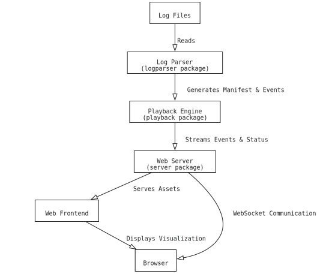

The [`agent-viz`](https://github.com/pdlc-os/fabric/blob/b11448f8f01fdcf12deab96204417d87f8d46ab3/extras/agent-viz/go.mod#L1) tool visualizes [`fabric`](https://github.com/pdlc-os/fabric/blob/b11448f8f01fdcf12deab96204417d87f8d46ab3/README.md?plain=1#L1) agent activity from Google Cloud Logging exports as a 2D force-directed graph. It reconstructs and displays inter-agent communications, file interactions, and agent lifecycle events in a web-based interface, providing playback controls and filtering capabilities.

The tool parses Google Cloud Logging (GCP) export JSON files and optional [`fs-watcher`](https://github.com/pdlc-os/fabric/blob/b11448f8f01fdcf12deab96204417d87f8d46ab3/extras/fs-watcher-tool/go.mod#L1) NDJSON logs to identify agents, map their activities, and establish a chronological sequence of events. The parsed information includes agent states, messages exchanged between agents, and file modifications. The core processing logic for this is found within the [`extras/agent-viz/internal/logparser`](https://github.com/pdlc-os/fabric/blob/b11448f8f01fdcf12deab96204417d87f8d46ab3/extras/agent-viz/internal/logparser) directory, with [`ParseLogFile`](https://github.com/pdlc-os/fabric/blob/b11448f8f01fdcf12deab96204417d87f8d46ab3/extras/agent-viz/internal/logparser/parser.go#L146) orchestrating the overall parsing process.

A playback engine, defined in [`extras/agent-viz/internal/playback`](https://github.com/pdlc-os/fabric/blob/b11448f8f01fdcf12deab96204417d87f8d46ab3/extras/agent-viz/internal/playback), manages the sequence and timing of these events. It allows users to control the playback speed, seek to specific points in time, and apply filters based on agents or event types. This engine provides real-time event streams, status updates, and snapshots for client-side state reconstruction.

The visualization is presented through a web interface, managed by a server component located in [`extras/agent-viz/internal/server`](https://github.com/pdlc-os/fabric/blob/b11448f8f01fdcf12deab96204417d87f8d46ab3/extras/agent-viz/internal/server). This server serves static web assets and establishes WebSocket connections with clients. It broadcasts playback events and status updates to connected clients and processes commands received from the client to control the playback engine.

The web frontend, found in the [`extras/agent-viz/web`](https://github.com/pdlc-os/fabric/blob/b11448f8f01fdcf12deab96204417d87f8d46ab3/extras/agent-viz/web) directory, is a single-page application responsible for rendering the visualization. It displays a force-directed graph of files, a radial layout of agents, and visual cues for messages and file edits. Playback controls, filtering options, and a communication transcript panel are integrated into the user interface. The web frontend also handles WebSocket communication to receive data from the server and send playback commands.

Developers can build, run, and test the [`agent-viz`](https://github.com/pdlc-os/fabric/blob/b11448f8f01fdcf12deab96204417d87f8d46ab3/extras/agent-viz/go.mod#L1) tool using the [`Makefile`](https://github.com/pdlc-os/fabric/blob/b11448f8f01fdcf12deab96204417d87f8d46ab3/Makefile#L1) located at [`extras/agent-viz/Makefile`](https://github.com/pdlc-os/fabric/blob/b11448f8f01fdcf12deab96204417d87f8d46ab3/extras/agent-viz/Makefile). Additionally, a Python script, [`extras/agent-viz/scripts/inspect_logs.py`](https://github.com/pdlc-os/fabric/blob/b11448f8f01fdcf12deab96204417d87f8d46ab3/extras/agent-viz/scripts/inspect_logs.py), provides a command-line utility for parsing and summarizing GCP log exports.

### AI-Powered Q&A with Fabric Docs Agent

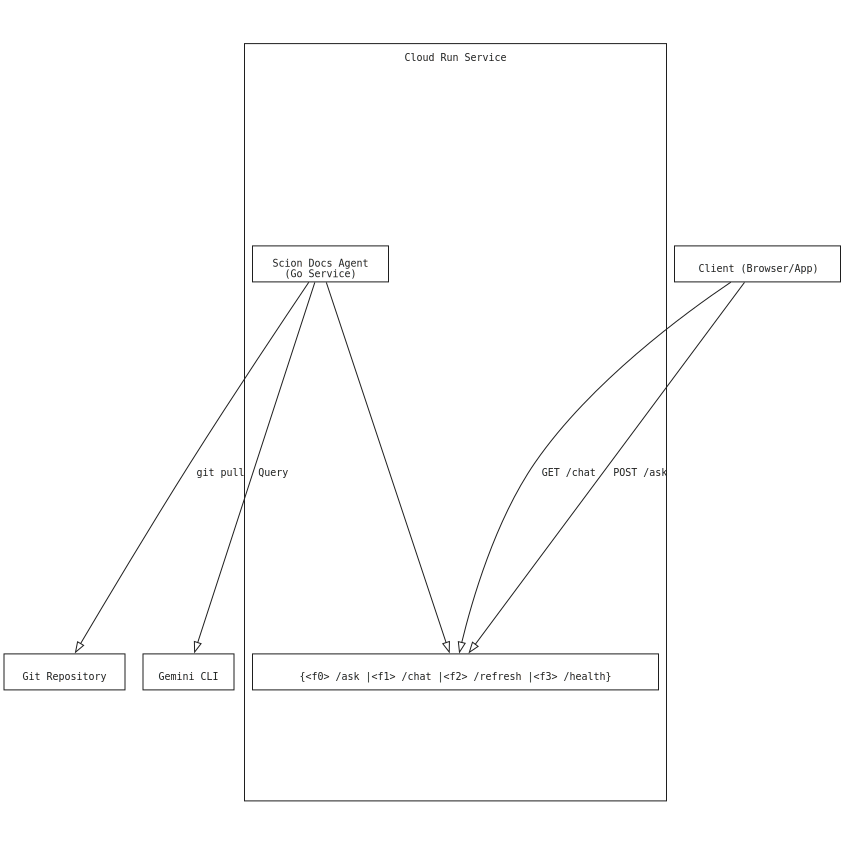

The [`Fabric Docs Agent`](https://github.com/pdlc-os/fabric/blob/b11448f8f01fdcf12deab96204417d87f8d46ab3/extras/docs-agent/README.md?plain=1#L1) provides an AI-powered Q&A service, enabling users to query Fabric's documentation and source code using the Gemini CLI. This agent is designed to run as a standalone Cloud Run service and offers various interaction methods.

The agent's capabilities are exposed through several HTTP endpoints. The [`/ask`](https://github.com/pdlc-os/fabric/blob/b11448f8f01fdcf12deab96204417d87f8d46ab3/extras/docs-agent/README.md?plain=1#L9) endpoint allows clients to submit natural language queries, which the agent processes using the [`gemini`](https://github.com/pdlc-os/fabric/blob/b11448f8f01fdcf12deab96204417d87f8d46ab3/agents.md?plain=1#L26) CLI tool and returns a Markdown-formatted answer. For interactive use, the [`/chat`](https://github.com/pdlc-os/fabric/blob/b11448f8f01fdcf12deab96204417d87f8d46ab3/extras/docs-agent/README.md?plain=1#L10) endpoint serves an embeddable HTML chat widget, allowing users to engage in real-time conversations with the agent. The agent's knowledge base, derived from Fabric's documentation, source code, and design documents, can be updated on demand via a [`git pull --ff-only`](https://github.com/pdlc-os/fabric/blob/b11448f8f01fdcf12deab96204417d87f8d46ab3/pkg/util/git.go#L637) operation triggered by the [`/refresh`](https://github.com/pdlc-os/fabric/blob/b11448f8f01fdcf12deab96204417d87f8d46ab3/extras/docs-agent/README.md?plain=1#L11) endpoint. A [`/health`](https://github.com/pdlc-os/fabric/blob/b11448f8f01fdcf12deab96204417d87f8d46ab3/pkg/hub/web.go#L1126) endpoint is also provided for operational status checks.

Configuration of the agent, including the AI model, workspace directories, and timeouts, is managed through environment variables, facilitating flexible deployment and customization. The web server uses a [`corsMiddleware`](https://github.com/pdlc-os/fabric/blob/b11448f8f01fdcf12deab96204417d87f8d46ab3/pkg/hub/server.go#L2816) to ensure secure cross-origin resource sharing for all endpoints.

The [`Fabric Docs Agent`](https://github.com/pdlc-os/fabric/blob/b11448f8f01fdcf12deab96204417d87f8d46ab3/extras/docs-agent/README.md?plain=1#L1) adheres to specific guidelines for generating responses: answers must be concise and accurate, based solely on available source material. If information cannot be found, the agent explicitly states this, and it is strictly forbidden from fabricating or speculating about undocumented features. When possible, responses reference specific files or documentation pages and are always formatted in Markdown, as defined by the system prompt in [`extras/docs-agent/system-prompt.md`](https://github.com/pdlc-os/fabric/blob/b11448f8f01fdcf12deab96204417d87f8d46ab3/extras/docs-agent/system-prompt.md).

For further details on deployment, see the [`deploy.sh`](https://github.com/pdlc-os/fabric/blob/b11448f8f01fdcf12deab96204417d87f8d46ab3/docs-site/README.md?plain=1#L72) script in [`extras/docs-agent/deploy.sh`](https://github.com/pdlc-os/fabric/blob/b11448f8f01fdcf12deab96204417d87f8d46ab3/extras/docs-agent/deploy.sh). The Docker image for the agent is built using the [`Dockerfile`](https://github.com/pdlc-os/fabric/blob/b11448f8f01fdcf12deab96204417d87f8d46ab3/agents.md?plain=1#L138) located in [`extras/docs-agent/Dockerfile`](https://github.com/pdlc-os/fabric/blob/b11448f8f01fdcf12deab96204417d87f8d46ab3/extras/docs-agent/Dockerfile).

### Filesystem Activity Monitoring with `fabric-fs-watcher`

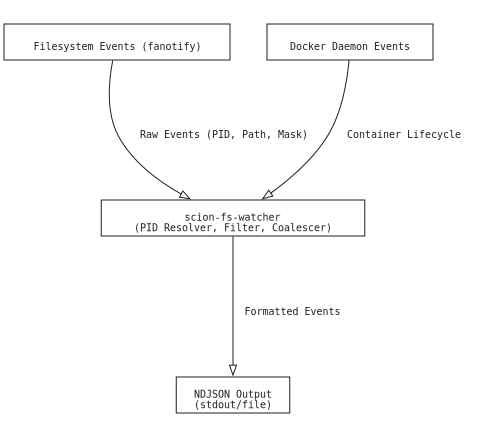

The [`fabric-fs-watcher`](https://github.com/pdlc-os/fabric/blob/b11448f8f01fdcf12deab96204417d87f8d46ab3/extras/fs-watcher-tool/README.md?plain=1#L1) is a Linux utility designed to monitor filesystem activity within [`fabric`](https://github.com/pdlc-os/fabric/blob/b11448f8f01fdcf12deab96204417d87f8d46ab3/README.md?plain=1#L1) agent worktrees. Its primary function is to attribute filesystem events, such as file creation, modification, deletion, and renaming, to specific Docker-managed agents. This attribution is achieved by correlating process IDs (PIDs) from filesystem events with Docker containers and their [`fabric.name`](https://github.com/pdlc-os/fabric/blob/b11448f8f01fdcf12deab96204417d87f8d46ab3/cmd/stop.go#L155) labels.

The tool leverages the Linux [`fanotify`](https://github.com/pdlc-os/fabric/blob/b11448f8f01fdcf12deab96204417d87f8d46ab3/extras/fs-watcher-tool/README.md?plain=1#L3) API for efficient filesystem observation. It captures events and, by inspecting [`/proc/<pid>/cgroup`](https://github.com/pdlc-os/fabric/blob/b11448f8f01fdcf12deab96204417d87f8d46ab3/extras/fs-watcher-tool/README.md?plain=1#L170) and querying Docker, resolves the PID associated with an event to the Docker container and subsequently to an [`agent_id`](https://github.com/pdlc-os/fabric/blob/b11448f8f01fdcf12deab96204417d87f8d46ab3/pkg/ent/mutation.go#L5939). This mapping is cached to enhance performance.

Key features of [`fabric-fs-watcher`](https://github.com/pdlc-os/fabric/blob/b11448f8f01fdcf12deab96204417d87f8d46ab3/extras/fs-watcher-tool/README.md?plain=1#L1) include:

- **Dynamic Directory Management**: When configured with the [`--grove`](https://github.com/pdlc-os/fabric/blob/b11448f8f01fdcf12deab96204417d87f8d46ab3/cmd/root.go#L188) flag, the watcher automatically discovers and monitors agent worktree directories by querying Docker for containers bearing a [`fabric.grove`](https://github.com/pdlc-os/fabric/blob/b11448f8f01fdcf12deab96204417d87f8d46ab3/pkg/agent/list.go#L42) label. It also listens for Docker container lifecycle events to dynamically add or remove watched directories as agents start or stop.
- **Noise Filtering**: The utility supports filtering out unwanted events using glob patterns specified via [`--ignore`](https://github.com/pdlc-os/fabric/blob/b11448f8f01fdcf12deab96204417d87f8d46ab3/Dockerfile#L5) flags or a [`.gitignore`](https://github.com/pdlc-os/fabric/blob/b11448f8f01fdcf12deab96204417d87f8d46ab3/agents.md?plain=1#L167)-style filter file designated by [`--filter-file`](https://github.com/pdlc-os/fabric/blob/b11448f8f01fdcf12deab96204417d87f8d46ab3/extras/fs-watcher-tool/README.md?plain=1#L82). This filter can be reloaded dynamically by sending a [`SIGHUP`](https://github.com/pdlc-os/fabric/blob/b11448f8f01fdcf12deab96204417d87f8d46ab3/extras/fs-watcher-tool/main.go#L100) signal.
- **Event Coalescing**: To manage event volume and improve clarity, the watcher employs two coalescing mechanisms:

  - **Debouncing**: Rapid, successive events on the same file from the same agent are collapsed into a single [`modify`](https://github.com/pdlc-os/fabric/blob/b11448f8f01fdcf12deab96204417d87f8d46ab3/LICENSE#L117) event within a configurable debounce window.
  - **Rename Coalescing**: The tool identifies common editor save patterns, where content is written to a temporary file and then renamed over the target file, translating these into a single [`modify`](https://github.com/pdlc-os/fabric/blob/b11448f8f01fdcf12deab96204417d87f8d46ab3/LICENSE#L117) event rather than separate [`rename_from`](https://github.com/pdlc-os/fabric/blob/b11448f8f01fdcf12deab96204417d87f8d46ab3/extras/fs-watcher-tool/README.md?plain=1#L142) and [`rename_to`](https://github.com/pdlc-os/fabric/blob/b11448f8f01fdcf12deab96204417d87f8d46ab3/extras/fs-watcher-tool/README.md?plain=1#L142) events.

Events are output as line-delimited JSON (NDJSON) to a specified log file or standard output, providing structured data including a timestamp, [`agent_id`](https://github.com/pdlc-os/fabric/blob/b11448f8f01fdcf12deab96204417d87f8d46ab3/pkg/ent/mutation.go#L5939), action type, path, and file size. For troubleshooting, a [`--debug`](https://github.com/pdlc-os/fabric/blob/b11448f8f01fdcf12deab96204417d87f8d46ab3/cmd/root.go#L51) flag provides verbose logging of Docker interactions, PID resolution, [`fanotify`](https://github.com/pdlc-os/fabric/blob/b11448f8f01fdcf12deab96204417d87f8d46ab3/extras/fs-watcher-tool/README.md?plain=1#L3) setup, and event processing. The tool is developed in Go, with its core logic residing in [`extras/fs-watcher-tool/pkg/fswatcher`](https://github.com/pdlc-os/fabric/blob/b11448f8f01fdcf12deab96204417d87f8d46ab3/extras/fs-watcher-tool/pkg/fswatcher).

### A2A Protocol Bridge for Fabric Agents

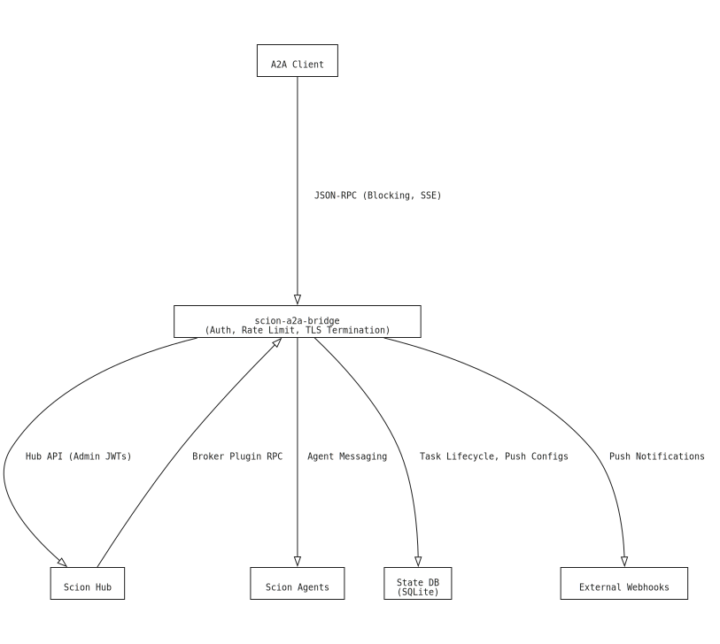

The [`fabric-a2a-bridge`](https://github.com/pdlc-os/fabric/blob/b11448f8f01fdcf12deab96204417d87f8d46ab3/extras/fabric-a2a-bridge/README.md?plain=1#L1) application facilitates communication between A2A (Application-to-Application) clients and Fabric agents. It acts as a protocol translation layer, converting A2A JSON-RPC requests into Fabric Hub API calls and vice-versa, allowing external A2A clients to interact with Fabric agents.

The bridge dynamically generates A2A Agent Cards, which provide metadata about exposed Fabric agents to A2A clients. This enables discoverability and understanding of an agent's capabilities within the A2A ecosystem.

Communication between the A2A client and Fabric agents can occur in several modes:

- **Blocking Request/Response**: For synchronous interactions where the client waits for an immediate response.
- **Server-Sent Events (SSE)**: For real-time updates and streaming task status changes from the Fabric agent back to the A2A client. The [`StreamManager`](https://github.com/pdlc-os/fabric/blob/b11448f8f01fdcf12deab96204417d87f8d46ab3/extras/fabric-a2a-bridge/internal/bridge/stream.go#L56) in [`extras/fabric-a2a-bridge/internal/bridge/stream.go`](https://github.com/pdlc-os/fabric/blob/b11448f8f01fdcf12deab96204417d87f8d46ab3/extras/fabric-a2a-bridge/internal/bridge/stream.go) handles the server-side logic for managing these event streams.
- **Webhook-based Push Notifications**: For asynchronous delivery of task state changes to client-defined webhook URLs. The [`PushDispatcher`](https://github.com/pdlc-os/fabric/blob/b11448f8f01fdcf12deab96204417d87f8d46ab3/extras/fabric-a2a-bridge/internal/bridge/push.go#L38) in [`extras/fabric-a2a-bridge/internal/bridge/push.go`](https://github.com/pdlc-os/fabric/blob/b11448f8f01fdcf12deab96204417d87f8d46ab3/extras/fabric-a2a-bridge/internal/bridge/push.go) manages the dispatching of these notifications, incorporating robust SSRF protection and retry mechanisms.

To ensure secure and controlled access, the bridge implements robust authentication and authorization mechanisms. Client authentication typically uses API keys or bearer tokens, which are processed by [`authMiddleware`](https://github.com/pdlc-os/fabric/blob/b11448f8f01fdcf12deab96204417d87f8d46ab3/extras/fabric-a2a-bridge/internal/bridge/server.go#L289) within the HTTP server handler ([`Server`](https://github.com/pdlc-os/fabric/blob/b11448f8f01fdcf12deab96204417d87f8d46ab3/pkg/hub/server.go#L559) in [`extras/fabric-a2a-bridge/internal/bridge/server.go`](https://github.com/pdlc-os/fabric/blob/b11448f8f01fdcf12deab96204417d87f8d46ab3/extras/fabric-a2a-bridge/internal/bridge/server.go)). Authorization checks ([`AuthorizeExposed`](https://github.com/pdlc-os/fabric/blob/b11448f8f01fdcf12deab96204417d87f8d46ab3/extras/fabric-a2a-bridge/internal/bridge/bridge.go#L1120), [`AuthorizeTask`](https://github.com/pdlc-os/fabric/blob/b11448f8f01fdcf12deab96204417d87f8d46ab3/extras/fabric-a2a-bridge/internal/bridge/bridge.go#L1139), [`AuthorizeContext`](https://github.com/pdlc-os/fabric/blob/b11448f8f01fdcf12deab96204417d87f8d46ab3/extras/fabric-a2a-bridge/internal/bridge/bridge.go#L1153) in [`extras/fabric-a2a-bridge/internal/bridge/bridge.go`](https://github.com/pdlc-os/fabric/blob/b11448f8f01fdcf12deab96204417d87f8d46ab3/extras/fabric-a2a-bridge/internal/bridge/bridge.go)) enforce project and agent-level access control, preventing unauthorized interaction and maintaining tenant isolation for A2A tasks. Additionally, a [`RateLimitMiddleware`](https://github.com/pdlc-os/fabric/blob/b11448f8f01fdcf12deab96204417d87f8d46ab3/extras/fabric-a2a-bridge/internal/bridge/ratelimit.go#L136) (defined in [`extras/fabric-a2a-bridge/internal/bridge/ratelimit.go`](https://github.com/pdlc-os/fabric/blob/b11448f8f01fdcf12deab96204417d87f8d46ab3/extras/fabric-a2a-bridge/internal/bridge/ratelimit.go)) is utilized to manage the rate of incoming requests, protecting the service from abuse and ensuring fair usage.

The bridge manages the lifecycle of tasks initiated by A2A clients, from creation through various states (e.g., submitted, working, completed, failed, input required) and eventual cleanup. Task lifecycle state is persistently stored, typically in a local SQLite database, allowing for resilience and continuity of operations.

The [`fabric-a2a-bridge`](https://github.com/pdlc-os/fabric/blob/b11448f8f01fdcf12deab96204417d87f8d46ab3/extras/fabric-a2a-bridge/README.md?plain=1#L1) is deployable as a Docker container, as specified in its [`Dockerfile`](https://github.com/pdlc-os/fabric/blob/b11448f8f01fdcf12deab96204417d87f8d46ab3/agents.md?plain=1#L138) in [`extras/fabric-a2a-bridge/Dockerfile`](https://github.com/pdlc-os/fabric/blob/b11448f8f01fdcf12deab96204417d87f8d46ab3/extras/fabric-a2a-bridge/Dockerfile), providing a self-contained and portable solution for integrating A2A clients with the Fabric platform. For a deeper understanding of the overall design, refer to [A2A Bridge Design and Evolution](#design-specifications-and-architecture-a2a-bridge-design-and-evolution).

### FABRIC Message Broker Logging Plugin

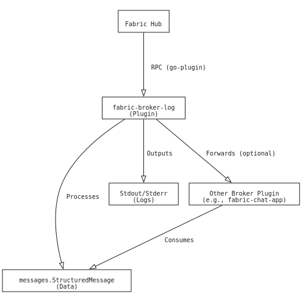

The [`fabric-broker-log`](https://github.com/pdlc-os/fabric/blob/b11448f8f01fdcf12deab96204417d87f8d46ab3/extras/fabric-broker-log/README.md?plain=1#L1) plugin, found in the [`extras/fabric-broker-log`](https://github.com/pdlc-os/fabric/blob/b11448f8f01fdcf12deab96204417d87f8d46ab3/extras/fabric-broker-log) directory, functions as a reference implementation for [`go-plugin`](https://github.com/pdlc-os/fabric/blob/b11448f8f01fdcf12deab96204417d87f8d46ab3/go.mod#L24) based broker plugins within the Fabric ecosystem. Its primary purpose is to capture and log all [`messages.StructuredMessage`](https://github.com/pdlc-os/fabric/blob/b11448f8f01fdcf12deab96204417d87f8d46ab3/cmd/message.go#L373) instances processed by a Fabric Hub. This plugin offers configurable output formats, allowing messages to be displayed in human-readable text or structured JSON Lines. Users can filter messages by topic using NATS-style subscription patterns and control the level of detail, including displaying full message bodies or truncated versions, and specifying which fields to include.

A notable feature of [`fabric-broker-log`](https://github.com/pdlc-os/fabric/blob/b11448f8f01fdcf12deab96204417d87f8d46ab3/extras/fabric-broker-log/README.md?plain=1#L1) is its "forwarding mode." When enabled, the plugin acts as a proxy: it logs messages internally and then relays them to another specified broker plugin. This capability addresses the Fabric Hub's design, which typically supports only a single broker plugin at a time, allowing [`fabric-broker-log`](https://github.com/pdlc-os/fabric/blob/b11448f8f01fdcf12deab96204417d87f8d46ab3/extras/fabric-broker-log/README.md?plain=1#L1) to coexist with other broker plugins and provide logging without disrupting the message flow. For more details on the event bus, refer to [Event Bus for Real-time Messaging](#fabric-agent-orchestration-and-management-event-bus-for-real-time-messaging).

The plugin integrates with the Fabric Hub via HashiCorp's [`go-plugin`](https://github.com/pdlc-os/fabric/blob/b11448f8f01fdcf12deab96204417d87f8d46ab3/go.mod#L24) library, allowing it to run as a separate process and communicate through RPC. This design ensures that message processing, logging, and configuration occur out-of-process from the main hub. While message traffic is directed to standard output, lifecycle events and errors are routed to standard error, facilitating easier output filtering and debugging.

### Google Chat Integration with Fabric Hub

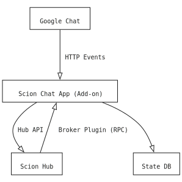

The [`fabric-chat-app`](https://github.com/pdlc-os/fabric/blob/b11448f8f01fdcf12deab96204417d87f8d46ab3/docs/design/broker-fanout.md?plain=1#L322) is a Go application that bridges Google Chat with a Fabric Hub instance, enabling users to manage Fabric agents, receive real-time notifications, and interact with the platform directly from Google Chat. It operates as a Google Workspace Add-on, receiving HTTP events from Google Chat and responding with messages, cards, and interactive dialogs.

The application facilitates bidirectional communication, allowing users to issue slash commands within Google Chat to control agents (e.g., list, start, stop, create, delete, subscribe) and manage workspace links. It leverages a [`CommandRouter`](https://github.com/pdlc-os/fabric/blob/b11448f8f01fdcf12deab96204417d87f8d46ab3/extras/fabric-chat-app/internal/chatapp/commands.go#L56) ([`extras/fabric-chat-app/internal/chatapp/commands.go`](https://github.com/pdlc-os/fabric/blob/b11448f8f01fdcf12deab96204417d87f8d46ab3/extras/fabric-chat-app/internal/chatapp/commands.go)) to process incoming chat events and dispatch them to specific handlers, streamlining agent and space management.

A core feature is the [`NotificationRelay`](https://github.com/pdlc-os/fabric/blob/b11448f8f01fdcf12deab96204417d87f8d46ab3/extras/fabric-chat-app/internal/chatapp/notifications.go#L28) ([`extras/fabric-chat-app/internal/chatapp/notifications.go`](https://github.com/pdlc-os/fabric/blob/b11448f8f01fdcf12deab96204417d87f8d46ab3/extras/fabric-chat-app/internal/chatapp/notifications.go)), which processes messages from the Fabric Hub's message broker and delivers them as formatted cards or direct messages to Google Chat spaces. This ensures users receive timely updates on agent activities and project statuses.

User identity and authentication are managed by the [`identity`](https://github.com/pdlc-os/fabric/blob/b11448f8f01fdcf12deab96204417d87f8d46ab3/pkg/hub/identity.go#L25) package ([`extras/fabric-chat-app/internal/identity`](https://github.com/pdlc-os/fabric/blob/b11448f8f01fdcf12deab96204417d87f8d46ab3/extras/fabric-chat-app/internal/identity)), which handles the creation and signing of JSON Web Tokens (JWTs) for secure communication with the Fabric Hub. It also manages the mapping between Google Chat users and Fabric Hub accounts, supporting both automatic and manual user registration. This ensures that interactions are authenticated and authorized correctly. For more details on secure credential and daemon management, see [Secure Credential and Daemon Management](#fabric-agent-orchestration-and-management-secure-credential-and-daemon-management).

Persistent local application state, such as user mappings, space-to-grove links, and agent subscriptions, is maintained in an SQLite database, managed by the [`state`](https://github.com/pdlc-os/fabric/blob/b11448f8f01fdcf12deab96204417d87f8d46ab3/pkg/store/models.go#L833) package ([`extras/fabric-chat-app/internal/state`](https://github.com/pdlc-os/fabric/blob/b11448f8f01fdcf12deab96204417d87f8d46ab3/extras/fabric-chat-app/internal/state)). This database handles schema migrations and CRUD operations to ensure data integrity and persistence.

The application integrates with Google Chat through an [`Adapter`](https://github.com/pdlc-os/fabric/blob/b11448f8f01fdcf12deab96204417d87f8d46ab3/extras/fabric-chat-app/internal/googlechat/adapter.go#L39) ([`extras/fabric-chat-app/internal/googlechat/adapter.go`](https://github.com/pdlc-os/fabric/blob/b11448f8f01fdcf12deab96204417d87f8d46ab3/extras/fabric-chat-app/internal/googlechat/adapter.go)), which normalizes Google Chat events into a platform-agnostic format for internal processing and renders generic UI components into Google Chat Cards V2. Authentication with Google Chat APIs is handled by [`auth.go`](https://github.com/pdlc-os/fabric/blob/b11448f8f01fdcf12deab96204417d87f8d46ab3/pkg/runtimebroker/handlers.go#L1976) ([`extras/fabric-chat-app/internal/googlechat/auth.go`](https://github.com/pdlc-os/fabric/blob/b11448f8f01fdcf12deab96204417d87f8d46ab3/extras/fabric-chat-app/internal/googlechat/auth.go)), including preflight checks to verify credentials and permissions.

The [`fabric-chat-app`](https://github.com/pdlc-os/fabric/blob/b11448f8f01fdcf12deab96204417d87f8d46ab3/docs/design/broker-fanout.md?plain=1#L322) can be deployed in various ways, including as a Docker container, built and installed directly on a Hub VM, or deployed to Google Cloud Run, offering flexibility in its operational environment.

### Discord Bot Integration for Fabric

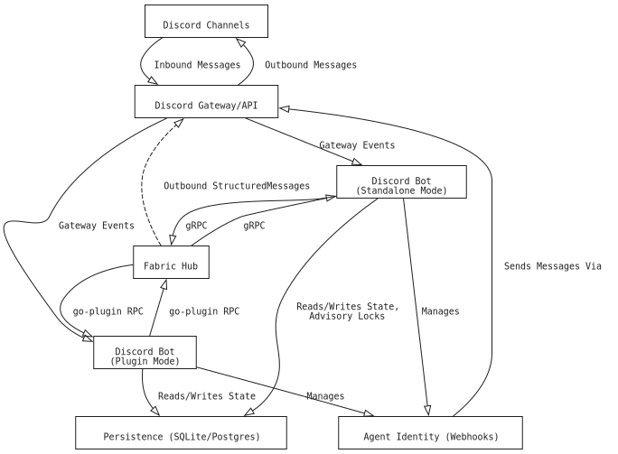

The Discord bot integration for Fabric ([`extras/fabric-discord`](https://github.com/pdlc-os/fabric/blob/b11448f8f01fdcf12deab96204417d87f8d46ab3/extras/fabric-discord)) facilitates bidirectional messaging between Discord channels and Fabric agents. This integration operates in two primary modes: [`Plugin mode`](https://github.com/pdlc-os/fabric/blob/b11448f8f01fdcf12deab96204417d87f8d46ab3/GLOSSARY.md?plain=1#L43) and [`Standalone mode`](https://github.com/pdlc-os/fabric/blob/b11448f8f01fdcf12deab96204417d87f8d46ab3/image-build/README.md?plain=1#L48).

In [`Plugin mode`](https://github.com/pdlc-os/fabric/blob/b11448f8f01fdcf12deab96204417d87f8d46ab3/GLOSSARY.md?plain=1#L43), the Discord bot functions as a [`go-plugin`](https://github.com/pdlc-os/fabric/blob/b11448f8f01fdcf12deab96204417d87f8d46ab3/go.mod#L24) subprocess, tightly coupled with the Fabric Hub. Alternatively, [`Standalone mode`](https://github.com/pdlc-os/fabric/blob/b11448f8f01fdcf12deab96204417d87f8d46ab3/image-build/README.md?plain=1#L48) allows the bot to run as an independent gRPC service. This mode provides high availability (HA) through the use of PostgreSQL advisory locks, ensuring that only one instance actively connects to the Discord Gateway at any given time, with automatic failover if the primary instance becomes unavailable.

The integration manages outbound [`StructuredMessage`](https://github.com/pdlc-os/fabric/blob/b11448f8f01fdcf12deab96204417d87f8d46ab3/proto/broker/v1/broker.proto#L33)s from the Fabric Hub to Discord. These messages are formatted and sent to linked Discord channels. To enhance clarity and user experience, each Fabric agent is represented in Discord with a distinct identity (custom name and avatar), utilizing Discord webhooks for this purpose. Conversely, inbound messages from Discord are converted into [`StructuredMessage`](https://github.com/pdlc-os/fabric/blob/b11448f8f01fdcf12deab96204417d87f8d46ab3/proto/broker/v1/broker.proto#L33)s and delivered to the relevant Fabric agents through the hub's inbound endpoint. Message routing to agents is determined by [`@-mentions`](https://github.com/pdlc-os/fabric/blob/b11448f8f01fdcf12deab96204417d87f8d46ab3/extras/fabric-discord/README.md?plain=1#L199) within Discord messages (e.g., [`@agentslug message`](https://github.com/pdlc-os/fabric/blob/b11448f8f01fdcf12deab96204417d87f8d46ab3/extras/fabric-discord/README.md?plain=1#L3) or [`@all message`](https://github.com/pdlc-os/fabric/blob/b11448f8f01fdcf12deab96204417d87f8d46ab3/extras/fabric-discord/README.md?plain=1#L3)) or by designating a [`default`](https://github.com/pdlc-os/fabric/blob/b11448f8f01fdcf12deab96204417d87f8d46ab3/pkg/api/types.go#L433) agent for channels. Replies to bot messages automatically continue the conversation with the original agent.

The bot provides various command-line interface (CLI) commands for users to manage channel links, register Discord accounts with Fabric identities, and interact with agents. For instance, commands such as [`/fabric setup`](https://github.com/pdlc-os/fabric/blob/b11448f8f01fdcf12deab96204417d87f8d46ab3/hack/dist.sh#L48), [`/fabric register`](https://github.com/pdlc-os/fabric/blob/b11448f8f01fdcf12deab96204417d87f8d46ab3/web/README.md?plain=1#L103), and [`/fabric agents`](https://github.com/pdlc-os/fabric/blob/b11448f8f01fdcf12deab96204417d87f8d46ab3/cmd/server.go#L86) enable users to configure the integration. For more details on Fabric's CLI, refer to [Command-Line Interface (CLI) Operations](#command-line-interface-cli-operations). The bot also supports agent-led installation, allowing AI coding assistants or deployment agents to remotely configure the plugin by gathering necessary Discord credentials and injecting them into the [`settings.yaml`](https://github.com/pdlc-os/fabric/blob/b11448f8f01fdcf12deab96204417d87f8d46ab3/README.md?plain=1#L58) configuration.

To prevent Discord API rate limits, the integration incorporates a [`SendQueue`](https://github.com/pdlc-os/fabric/blob/b11448f8f01fdcf12deab96204417d87f8d46ab3/extras/fabric-discord/internal/discord/sendqueue.go#L43) mechanism. This queue manages outbound messages with per-channel worker goroutines and configurable rate limiting, ensuring reliable message delivery. Persistence of channel links, user mappings, conversation contexts, and other state information is handled using an SQLite database in [`Plugin mode`](https://github.com/pdlc-os/fabric/blob/b11448f8f01fdcf12deab96204417d87f8d46ab3/GLOSSARY.md?plain=1#L43) or a PostgreSQL database in [`Standalone mode`](https://github.com/pdlc-os/fabric/blob/b11448f8f01fdcf12deab96204417d87f8d46ab3/image-build/README.md?plain=1#L48). Secure communication with the hub API for registration purposes in [`Standalone mode`](https://github.com/pdlc-os/fabric/blob/b11448f8f01fdcf12deab96204417d87f8d46ab3/image-build/README.md?plain=1#L48) is achieved using HMAC-SHA256 authentication.

### Slack Messaging Integration for Fabric

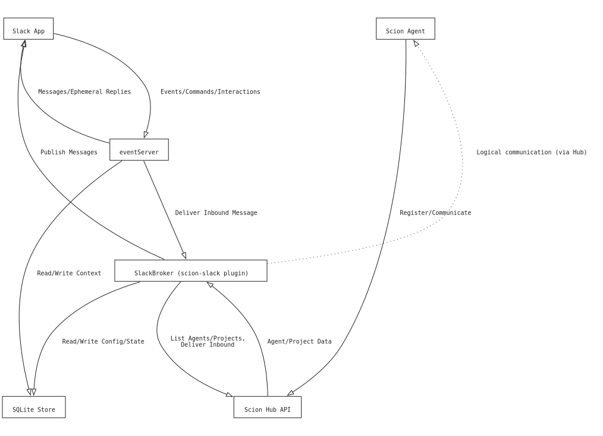

The [`fabric-slack`](https://github.com/pdlc-os/fabric/blob/b11448f8f01fdcf12deab96204417d87f8d46ab3/extras/fabric-slack/go.mod#L1) plugin facilitates bidirectional communication between Fabric agents and Slack channels, operating as a [`go-plugin`](https://github.com/pdlc-os/fabric/blob/b11448f8f01fdcf12deab96204417d87f8d46ab3/go.mod#L24) subprocess within the Fabric ecosystem. This integration enables agents to send messages to Slack users and channels, and conversely, allows Slack users to interact with Fabric agents via commands and interactive components.

The plugin's core logic is managed by the [`SlackBroker`](https://github.com/pdlc-os/fabric/blob/b11448f8f01fdcf12deab96204417d87f8d46ab3/extras/fabric-slack/internal/slack/broker.go#L102) in [`extras/fabric-slack/internal/slack/broker.go`](https://github.com/pdlc-os/fabric/blob/b11448f8f01fdcf12deab96204417d87f8d46ab3/extras/fabric-slack/internal/slack/broker.go), which handles interactions with the Slack Bot API and the central Fabric Hub API. Configuration for the broker includes Slack API tokens, signing secrets, and a [`hub_url`](https://github.com/pdlc-os/fabric/blob/b11448f8f01fdcf12deab96204417d87f8d46ab3/pkg/plugin/manager.go#L445) for communication with the Fabric platform. The broker supports both HTTP webhooks and Socket Mode for receiving Slack events, providing flexibility in deployment. Messages originating from Fabric agents, encapsulated as [`messages.StructuredMessage`](https://github.com/pdlc-os/fabric/blob/b11448f8f01fdcf12deab96204417d87f8d46ab3/cmd/message.go#L373) types, are published to Slack. The system intelligently routes these messages to appropriate channels or threads based on metadata, recipient emails, or project-linked channels. It also handles interactive messages, such as those requiring user input ([`messages.TypeInputNeeded`](https://github.com/pdlc-os/fabric/blob/b11448f8f01fdcf12deab96204417d87f8d46ab3/pkg/hub/notifications.go#L392)), by rendering Slack Block Kit components for user interaction.

Incoming Slack events, whether general messages, mentions, or interactive component actions, are processed by an [`eventServer`](https://github.com/pdlc-os/fabric/blob/b11448f8f01fdcf12deab96204417d87f8d46ab3/extras/fabric-slack/internal/slack/events.go#L27) defined in [`extras/fabric-slack/internal/slack/events.go`](https://github.com/pdlc-os/fabric/blob/b11448f8f01fdcf12deab96204417d87f8d46ab3/extras/fabric-slack/internal/slack/events.go). This server verifies request signatures for security and dispatches events to specialized handlers. Commands issued via Slack, such as [`/fabric`](https://github.com/pdlc-os/fabric/blob/b11448f8f01fdcf12deab96204417d87f8d46ab3/Makefile#L109) slash commands, and actions from interactive components are managed by functions in [`extras/fabric-slack/internal/slack/commands.go`](https://github.com/pdlc-os/fabric/blob/b11448f8f01fdcf12deab96204417d87f8d46ab3/extras/fabric-slack/internal/slack/commands.go) and [`extras/fabric-slack/internal/slack/modals.go`](https://github.com/pdlc-os/fabric/blob/b11448f8f01fdcf12deab96204417d87f8d46ab3/extras/fabric-slack/internal/slack/modals.go). These handlers route user input to the Fabric Hub, potentially triggering agent actions or workflows.

Message content is formatted for Slack's [`mrkdwn`](https://github.com/pdlc-os/fabric/blob/b11448f8f01fdcf12deab96204417d87f8d46ab3/extras/fabric-slack/internal/slack/blocks.go#L18) and Block Kit using utilities in [`extras/fabric-slack/internal/slack/blocks.go`](https://github.com/pdlc-os/fabric/blob/b11448f8f01fdcf12deab96204417d87f8d46ab3/extras/fabric-slack/internal/slack/blocks.go), ensuring proper display and handling of message length constraints. To maintain state across interactions, the plugin employs an SQLite-based persistent store, implemented in [`extras/fabric-slack/internal/slack/store.go`](https://github.com/pdlc-os/fabric/blob/b11448f8f01fdcf12deab96204417d87f8d46ab3/extras/fabric-slack/internal/slack/store.go). This store manages critical information such as links between Slack channels and Fabric projects, mappings between Slack users and Fabric identities, conversation contexts, and pending user input requests. Communication with the central Fabric Hub API is facilitated by the [`HubClient`](https://github.com/pdlc-os/fabric/blob/b11448f8f01fdcf12deab96204417d87f8d46ab3/extras/fabric-slack/internal/slack/hubclient.go#L40) interface and its implementation in [`extras/fabric-slack/internal/slack/hubclient.go`](https://github.com/pdlc-os/fabric/blob/b11448f8f01fdcf12deab96204417d87f8d46ab3/extras/fabric-slack/internal/slack/hubclient.go), which handles authenticated requests to fetch project and agent information. User registration and linking Slack users to Fabric identities are managed by the [`RegistrationHandler`](https://github.com/pdlc-os/fabric/blob/b11448f8f01fdcf12deab96204417d87f8d46ab3/extras/fabric-slack/internal/slack/register.go#L28) in [`extras/fabric-slack/internal/slack/register.go`](https://github.com/pdlc-os/fabric/blob/b11448f8f01fdcf12deab96204417d87f8d46ab3/extras/fabric-slack/internal/slack/register.go).

### Telegram Message Broker Plugin for Fabric

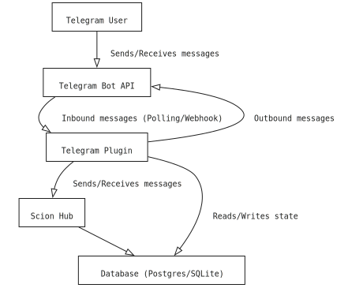

The [`fabric-telegram`](https://github.com/pdlc-os/fabric/blob/b11448f8f01fdcf12deab96204417d87f8d46ab3/extras/fabric-telegram/go.mod#L1) message broker plugin facilitates bidirectional communication between Telegram group chats and Fabric agents. This plugin can operate in various modes to integrate with the Fabric ecosystem, managing message flow, user identities, and interactive elements.

The plugin acts as an intermediary, formatting [`StructuredMessage`](https://github.com/pdlc-os/fabric/blob/b11448f8f01fdcf12deab96204417d87f8d46ab3/proto/broker/v1/broker.proto#L33)s from the Fabric hub for delivery to Telegram users and converting inbound Telegram messages into [`StructuredMessage`](https://github.com/pdlc-os/fabric/blob/b11448f8f01fdcf12deab96204417d87f8d46ab3/proto/broker/v1/broker.proto#L33)s for Fabric agents. This includes handling text messages, commands, and attachments. It relies on [`extras/fabric-telegram/internal/telegram/api.go`](https://github.com/pdlc-os/fabric/blob/b11448f8f01fdcf12deab96204417d87f8d46ab3/extras/fabric-telegram/internal/telegram/api.go) for all interactions with the Telegram Bot API, managing functionalities such as sending messages, documents, and configuring webhooks.

For persistence, the plugin stores critical state information—such as linked Telegram groups to Fabric projects, user mappings, and notification preferences—in a database, either SQLite for local operation or PostgreSQL for high-availability scenarios. Rate limiting is enforced through a [`SendQueue`](https://github.com/pdlc-os/fabric/blob/b11448f8f01fdcf12deab96204417d87f8d46ab3/extras/fabric-discord/internal/discord/sendqueue.go#L43) to comply with Telegram's API usage policies.

The plugin supports several operational modes, which are determined by environment variables or command-line arguments, as detailed in [`extras/fabric-telegram/cmd`](https://github.com/pdlc-os/fabric/blob/b11448f8f01fdcf12deab96204417d87f8d46ab3/extras/fabric-telegram/cmd):

- **Plugin Mode**: In this mode, the [`fabric-telegram`](https://github.com/pdlc-os/fabric/blob/b11448f8f01fdcf12deab96204417d87f8d46ab3/extras/fabric-telegram/go.mod#L1) plugin runs as a [`go-plugin`](https://github.com/pdlc-os/fabric/blob/b11448f8f01fdcf12deab96204417d87f8d46ab3/go.mod#L24) subprocess, integrating directly with the Fabric hub's [`FanOutBroker`](https://github.com/pdlc-os/fabric/blob/b11448f8f01fdcf12deab96204417d87f8d46ab3/docs/design/broker-fanout.md?plain=1#L82). This allows the Fabric hub to manage the plugin's lifecycle and communication.
- **Standalone gRPC Service Mode**: For deployments requiring higher availability or independent scaling, the plugin can run as a standalone gRPC service. This mode necessitates a PostgreSQL database for state persistence and exclusively uses webhooks for inbound messaging, rather than long-polling. It also incorporates mechanisms for gRPC health checks and uses PostgreSQL advisory locks to coordinate webhook registration across multiple instances, ensuring high availability.
- **Migration Tool Mode**: This mode provides a command-line utility for migrating data, such as group links and user mappings, from an SQLite database to a PostgreSQL database. This is useful when transitioning from a local setup to a more robust standalone deployment.

The plugin manages user and group interactions through several mechanisms:

- **Commands**: It processes various bot commands, such as [`/setup`](https://github.com/pdlc-os/fabric/blob/b11448f8f01fdcf12deab96204417d87f8d46ab3/hack/cleanup.sh#L49) for linking Telegram groups to Fabric projects, [`/default`](https://github.com/pdlc-os/fabric/blob/b11448f8f01fdcf12deab96204417d87f8d46ab3/extras/fabric-telegram/README.md?plain=1#L154) for setting default agents, and [`/register`](https://github.com/pdlc-os/fabric/blob/b11448f8f01fdcf12deab96204417d87f8d46ab3/extras/fabric-telegram/README.md?plain=1#L144) for associating Telegram users with Fabric identities. Command handling logic resides in [`extras/fabric-telegram/internal/telegram/commands.go`](https://github.com/pdlc-os/fabric/blob/b11448f8f01fdcf12deab96204417d87f8d46ab3/extras/fabric-telegram/internal/telegram/commands.go).
- **Callbacks**: Interactive inline keyboards, dynamically generated by functions in [`extras/fabric-telegram/internal/telegram/cards.go`](https://github.com/pdlc-os/fabric/blob/b11448f8f01fdcf12deab96204417d87f8d46ab3/extras/fabric-telegram/internal/telegram/cards.go), allow users to interact with agents through button presses. The [`CallbackHandler`](https://github.com/pdlc-os/fabric/blob/b11448f8f01fdcf12deab96204417d87f8d46ab3/extras/fabric-discord/internal/discord/callbacks.go#L18) in [`extras/fabric-telegram/internal/telegram/callbacks.go`](https://github.com/pdlc-os/fabric/blob/b11448f8f01fdcf12deab96204417d87f8d46ab3/extras/fabric-telegram/internal/telegram/callbacks.go) processes these callback queries for various actions, including multi-step setup flows and user prompts.
- **Message Routing**: Inbound messages are routed to specific Fabric agents based on [`@`](https://github.com/pdlc-os/fabric/blob/b11448f8f01fdcf12deab96204417d87f8d46ab3/Makefile#L74)-mentions within the Telegram chat, a configured default agent for the group, or by replying to bot messages.
- **User Registration**: An HTTP-based registration server, implemented in [`extras/fabric-telegram/internal/telegram/register.go`](https://github.com/pdlc-os/fabric/blob/b11448f8f01fdcf12deab96204417d87f8d46ab3/extras/fabric-telegram/internal/telegram/register.go), facilitates linking Telegram user accounts to Fabric email addresses, using time-limited tokens for secure association.

The plugin ensures that messages from Fabric agents are correctly formatted for Telegram, handling aspects like text rendering, HTML escaping, and message length limits, as implemented in [`extras/fabric-telegram/internal/telegram/format.go`](https://github.com/pdlc-os/fabric/blob/b11448f8f01fdcf12deab96204417d87f8d46ab3/extras/fabric-telegram/internal/telegram/format.go). The Dockerfile at [`extras/fabric-telegram/Dockerfile`](https://github.com/pdlc-os/fabric/blob/b11448f8f01fdcf12deab96204417d87f8d46ab3/extras/fabric-telegram/Dockerfile) outlines the build process for creating a minimal, [`distroless`](https://github.com/pdlc-os/fabric/blob/b11448f8f01fdcf12deab96204417d87f8d46ab3/extras/fabric-discord/Dockerfile#L6) container image of the [`fabric-plugin-telegram`](https://github.com/pdlc-os/fabric/blob/b11448f8f01fdcf12deab96204417d87f8d46ab3/extras/fabric-telegram/README.md?plain=1#L1) for deployment. For further details on configuration, deployment, and troubleshooting, refer to [`extras/fabric-telegram/README.md`](https://github.com/pdlc-os/fabric/blob/b11448f8f01fdcf12deab96204417d87f8d46ab3/extras/fabric-telegram/README.md).

## Fabric Platform Skills

| Skill | Description | Path to SKILL.md |
| --- | --- | --- |
| `fabric/` | Fabric CLI reference for agent management, templates, and configuration. | `fabric/SKILL.md` |
| `team-creation/` | Guides the creation and extension of Fabric agent team templates based on role descriptions and workflows. | `team-creation/SKILL.md` |
| `fabric-cli-operations/` | Defines operational constraints for Fabric agents, including non-interactive mode and prohibited commands. | `fabric-cli-operations/SKILL.md` |
| `fabric-messaging/` | Teaches effective use of `fabric message` for inter-agent and agent-to-user communication, covering recipients, timing, and content. | `fabric-messaging/SKILL.md` |
| `agent-status-signals/` | Details the mandatory status signaling protocol (`ask_user`, `blocked`, `task_completed`) for Fabric agents. | `agent-status-signals/SKILL.md` |
| `git-sandbox/` | Provides a Git workflow protocol tailored for agents in restricted sandbox/worktree environments. | `git-sandbox/SKILL.md` |

Platform-level skill definitions are automatically injected into Fabric agents, providing foundational knowledge for agents to operate within the Fabric ecosystem. These skills, located in [`skills`](https://github.com/pdlc-os/fabric/blob/b11448f8f01fdcf12deab96204417d87f8d46ab3/skills), guide agent behavior, define operational constraints, and establish communication protocols essential for multi-agent coordination and task execution.

All skills within this directory are automatically injected into agents upon provisioning. Conditional injection is managed through an [`inject_when`](https://github.com/pdlc-os/fabric/blob/b11448f8f01fdcf12deab96204417d87f8d46ab3/skills/README.md?plain=1#L18) field in the [`SKILL.md`](https://github.com/pdlc-os/fabric/blob/b11448f8f01fdcf12deab96204417d87f8d46ab3/cmd/skills.go#L193) frontmatter of each skill, allowing specific skills to be activated only when certain environmental conditions are met, such as the presence of a Git workspace. Each skill is organized into a dedicated directory containing a [`SKILL.md`](https://github.com/pdlc-os/fabric/blob/b11448f8f01fdcf12deab96204417d87f8d46ab3/cmd/skills.go#L193) file for its definition and an optional [`scripts/`](https://github.com/pdlc-os/fabric/blob/b11448f8f01fdcf12deab96204417d87f8d46ab3/web/AGENTS.md?plain=1#L225) subdirectory for backing shell scripts.

The [`fabric`](https://github.com/pdlc-os/fabric/blob/b11448f8f01fdcf12deab96204417d87f8d46ab3/README.md?plain=1#L1) skill, defined in [`skills/fabric/SKILL.md`](https://github.com/pdlc-os/fabric/blob/b11448f8f01fdcf12deab96204417d87f8d46ab3/skills/fabric/SKILL.md), provides a comprehensive command-line interface reference for agents, covering core agent lifecycle management, template handling, and configuration commands. It enables agents to initialize projects, start and stop other agents, list active agents, attach to interactive sessions, and manage agent templates.

For operational constraints, the [`fabric-cli-operations`](https://github.com/pdlc-os/fabric/blob/b11448f8f01fdcf12deab96204417d87f8d46ab3/skills/README.md?plain=1#L11) skill, detailed in [`skills/fabric-cli-operations/SKILL.md`](https://github.com/pdlc-os/fabric/blob/b11448f8f01fdcf12deab96204417d87f8d46ab3/skills/fabric-cli-operations/SKILL.md), dictates mandatory guidelines for agents operating in containerized sandboxes. This includes enforcing non-interactive mode for commands, requiring structured JSON output, and prohibiting certain operations like direct synchronization or global configurations to ensure secure and autonomous execution within the Fabric platform.

Inter-agent and agent-to-user communication protocols are established by the [`fabric-messaging`](https://github.com/pdlc-os/fabric/blob/b11448f8f01fdcf12deab96204417d87f8d46ab3/skills/README.md?plain=1#L12) skill, explained in [`skills/fabric-messaging/SKILL.md`](https://github.com/pdlc-os/fabric/blob/b11448f8f01fdcf12deab96204417d87f8d46ab3/skills/fabric-messaging/SKILL.md). This skill educates agents on effective usage of the [`fabric message`](https://github.com/pdlc-os/fabric/blob/b11448f8f01fdcf12deab96204417d87f8d46ab3/Makefile#L1) command, covering recipient types, message timing, content best practices for functional and concrete details, and advanced flags for channel and thread targeting. It also outlines coordination patterns such as [`Coordinator Relay`](https://github.com/pdlc-os/fabric/blob/b11448f8f01fdcf12deab96204417d87f8d46ab3/skills/fabric-messaging/SKILL.md?plain=1#L71) and [`Context Sharding`](https://github.com/pdlc-os/fabric/blob/b11448f8f01fdcf12deab96204417d87f8d46ab3/skills/fabric-messaging/SKILL.md?plain=1#L72), while identifying communication anti-patterns.

To prevent false stall detections and ensure accurate reporting, the [`agent-status-signals`](https://github.com/pdlc-os/fabric/blob/b11448f8f01fdcf12deab96204417d87f8d46ab3/skills/README.md?plain=1#L13) skill, specified in [`skills/agent-status-signals/SKILL.md`](https://github.com/pdlc-os/fabric/blob/b11448f8f01fdcf12deab96204417d87f8d46ab3/skills/agent-status-signals/SKILL.md), defines a standard status signaling protocol. This protocol mandates the use of [`fabrictool status`](https://github.com/pdlc-os/fabric/blob/b11448f8f01fdcf12deab96204417d87f8d46ab3/GLOSSARY.md?plain=1#L50) with signals like [`ask_user`](https://github.com/pdlc-os/fabric/blob/b11448f8f01fdcf12deab96204417d87f8d46ab3/skills/README.md?plain=1#L13) (awaiting input), [`blocked`](https://github.com/pdlc-os/fabric/blob/b11448f8f01fdcf12deab96204417d87f8d46ab3/cmd/root.go#L436) (intentionally waiting), and [`task_completed`](https://github.com/pdlc-os/fabric/blob/b11448f8f01fdcf12deab96204417d87f8d46ab3/skills/README.md?plain=1#L13) (task finished). This explicit signaling mechanism ensures that both the orchestration system and users are accurately informed of an agent's current state.

For agents operating within restricted Git environments, the [`git-sandbox`](https://github.com/pdlc-os/fabric/blob/b11448f8f01fdcf12deab96204417d87f8d46ab3/skills/README.md?plain=1#L14) skill, outlined in [`skills/git-sandbox/SKILL.md`](https://github.com/pdlc-os/fabric/blob/b11448f8f01fdcf12deab96204417d87f8d46ab3/skills/git-sandbox/SKILL.md), provides a specialized Git workflow protocol. This skill, injected when a [`git_workspace`](https://github.com/pdlc-os/fabric/blob/b11448f8f01fdcf12deab96204417d87f8d46ab3/skills/README.md?plain=1#L14) is active, guides agents through local-only Git operations (given no network access), worktree-aware branch management, and non-interactive conflict resolution techniques to prevent execution errors in sandboxed environments.

Finally, the [`team-creation`](https://github.com/pdlc-os/fabric/blob/b11448f8f01fdcf12deab96204417d87f8d46ab3/skills/README.md?plain=1#L10) skill, described in [`skills/team-creation/SKILL.md`](https://github.com/pdlc-os/fabric/blob/b11448f8f01fdcf12deab96204417d87f8d46ab3/skills/team-creation/SKILL.md), facilitates the generation and extension of [`fabric`](https://github.com/pdlc-os/fabric/blob/b11448f8f01fdcf12deab96204417d87f8d46ab3/README.md?plain=1#L1) agent templates from high-level descriptions. This enables the creation of multi-agent teams with specialized roles, defining workflows, and integrating reusable harness skills for coordinated LLM agent operations. It follows an "Orchestrator Pattern" where a single orchestrator manages multiple worker agents.

### Fabric CLI Operations and Constraints

| Category | Command/Option | Rule | Reason |
| --- | --- | --- | --- |
| **Mandatory** | `--non-interactive` | **MUST** be used with all commands. | Prevents indefinite blocking at interactive prompts. Implies `--yes`. |
| **Mandatory** | `--format json` | **SHOULD** be used for machine-readable output. | Provides detailed, structured output from most commands. |
| **Prohibited** | `sync`, `cdw` | **DO NOT USE**. | These commands are not permitted for agent operations. |
| **Prohibited** | `--no-hub` | **DO NOT USE**. | Agents only have access to the system through the hub. |
| **Prohibited** | `--global` | **NEVER USE**. | Agents operate in a grove workspace where this is implicitly set. |
| **Prohibited** | `settings`, `login` commands | **DO NOT INTERACT WITH**. | Agents should not manage system settings or authentication. |
| **Recommendation** | `fabric look <agent-id>` | Use to inspect agents. | View recent output and terminal-UI state of running agents. |
| **Recommendation** | `fabric --help` | Use for detailed CLI information. | Access specific details on all hierarchical commands. |
| **Recommendation** | Avoid pre-emptive exploration of `.fabric` folders or agent-template files. | Focus only on task-relevant CLI usage. | Prevents unnecessary actions and maintains focus. |

Fabric agents operate within containerized sandboxes, and their interactions with the Fabric CLI are subject to specific operational guidelines to ensure secure, autonomous, and non-interactive execution. These rules, detailed in [`skills/fabric-cli-operations/SKILL.md`](https://github.com/pdlc-os/fabric/blob/b11448f8f01fdcf12deab96204417d87f8d46ab3/skills/fabric-cli-operations/SKILL.md), prevent agents from blocking on user input and enforce a programmatic approach to command output.

A core directive is the mandatory use of the [`--non-interactive`](https://github.com/pdlc-os/fabric/blob/b11448f8f01fdcf12deab96204417d87f8d46ab3/cmd/root.go#L40) flag with the Fabric CLI, which implicitly includes [`--yes`](https://github.com/pdlc-os/fabric/blob/b11448f8f01fdcf12deab96204417d87f8d46ab3/cmd/hub.go#L337). This prevents commands from pausing for user confirmation, instead causing an error if interaction is required, thereby maintaining the agent's autonomous operation. Similarly, agents are instructed to use the [`--format json`](https://github.com/pdlc-os/fabric/blob/b11448f8f01fdcf12deab96204417d87f8d46ab3/cmd/hub.go#L1045) flag for nearly all commands. This ensures that command outputs are machine-readable, facilitating parsing and processing by other system components or agents.

Several commands and options are explicitly prohibited to maintain the integrity and controlled environment of the Fabric ecosystem. Agents are forbidden from using the [`sync`](https://github.com/pdlc-os/fabric/blob/b11448f8f01fdcf12deab96204417d87f8d46ab3/pkg/runtime/mock.go#L101) and [`cdw`](https://github.com/pdlc-os/fabric/blob/b11448f8f01fdcf12deab96204417d87f8d46ab3/cmd/cdw.go#L31) commands, as well as the [`--no-hub`](https://github.com/pdlc-os/fabric/blob/b11448f8f01fdcf12deab96204417d87f8d46ab3/cmd/hub.go#L793) option, which mandates all system access to occur through the central Hub. The [`--global`](https://github.com/pdlc-os/fabric/blob/b11448f8f01fdcf12deab96204417d87f8d46ab3/cmd/hub.go#L234) option is also prohibited because agents inherently operate within a [`grove`](https://github.com/pdlc-os/fabric/blob/b11448f8f01fdcf12deab96204417d87f8d46ab3/Makefile#L72) workspace. Furthermore, agents are advised against resuming another agent unless they were the one that originally stopped it, to avoid conflicts or unintended behaviors with actively working agents.

System messages directed to an agent, such as instructions or notifications, are formatted within [`---BEGIN FABRIC MESSAGE---`](https://github.com/pdlc-os/fabric/blob/b11448f8f01fdcf12deab96204417d87f8d46ab3/pkg/messages/format.go#L22) and [`---END FABRIC MESSAGE---`](https://github.com/pdlc-os/fabric/blob/b11448f8f01fdcf12deab96204417d87f8d46ab3/pkg/messages/format.go#L22) markers, indicating a structured approach to inter-agent communication. These guidelines, while specific, collectively establish a framework for Fabric agents to function reliably and securely within their orchestrated environments. For more on inter-agent communication, see [Inter-Agent and User Communication Protocols](#fabric-platform-skills-inter-agent-and-user-communication-protocols).

### Inter-Agent and User Communication Protocols

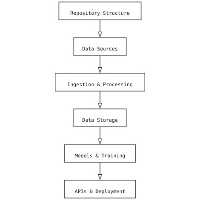

The [`fabric message`](https://github.com/pdlc-os/fabric/blob/b11448f8f01fdcf12deab96204417d87f8d46ab3/Makefile#L1) command is the designated method for all inter-agent and agent-to-user communication within the Fabric orchestration environment, where agents operate without visible terminal output. The guidance emphasizes fostering reliable and high-signal communication to prevent common failures associated with unclear or untimely information exchange.

Agents are instructed on addressing messages to specific recipients, including other agents ([`agent:<name>`](https://github.com/pdlc-os/fabric/blob/b11448f8f01fdcf12deab96204417d87f8d46ab3/cmd/message.go#L57)), human users ([`user:<email>`](https://github.com/pdlc-os/fabric/blob/b11448f8f01fdcf12deab96204417d87f8d46ab3/pkg/hub/handlers_agent_messaging.go#L128)), or predefined groups ([`set[a,b,...]`](https://github.com/pdlc-os/fabric/blob/b11448f8f01fdcf12deab96204417d87f8d46ab3/skills/fabric-messaging/SKILL.md?plain=1#L28)). The use of broadcast messaging ([`--broadcast`](https://github.com/pdlc-os/fabric/blob/b11448f8f01fdcf12deab96204417d87f8d46ab3/cmd/message.go#L62)) is discouraged to avoid information overload and maintain message relevance.

Best practices for message content focus on functional and concrete details, such as file paths, branch names, URLs, and error messages. When human input is required, agents are encouraged to [`Surface Decisions`](https://github.com/pdlc-os/fabric/blob/b11448f8f01fdcf12deab96204417d87f8d46ab3/docs-site/src/content/docs/contributing/architecture.md?plain=1#L314) by offering concrete options, which facilitates clear and efficient user interaction. Messages can be targeted to specific channels ([`--channel <name>`](https://github.com/pdlc-os/fabric/blob/b11448f8f01fdcf12deab96204417d87f8d46ab3/cmd/message.go#L112)) or linked to existing conversations using a thread ID ([`--thread-id <id>`](https://github.com/pdlc-os/fabric/blob/b11448f8f01fdcf12deab96204417d87f8d46ab3/skills/fabric-messaging/SKILL.md?plain=1#L55)).

Timing and cadence are important considerations for message delivery. Agents should provide [`Immediate Acknowledgment`](https://github.com/pdlc-os/fabric/blob/b11448f8f01fdcf12deab96204417d87f8d46ab3/skills/fabric-messaging/SKILL.md?plain=1#L37) for tasks, engage in [`Milestone Reporting`](https://github.com/pdlc-os/fabric/blob/b11448f8f01fdcf12deab96204417d87f8d46ab3/skills/fabric-messaging/SKILL.md?plain=1#L38) at significant stages, and offer updates if tasks extend beyond expectations to avoid prolonged silence. For situations where an agent is intentionally waiting for an external event, the [`fabrictool status blocked`](https://github.com/pdlc-os/fabric/blob/b11448f8f01fdcf12deab96204417d87f8d46ab3/GLOSSARY.md?plain=1#L50) command should be used. This signals to the orchestration system that the agent is not stalled but is awaiting input, preventing misinterpretation of its state.

Advanced messaging capabilities are available through various [`fabric message`](https://github.com/pdlc-os/fabric/blob/b11448f8f01fdcf12deab96204417d87f8d46ab3/Makefile#L1) flags. These include [`--raw`](https://github.com/pdlc-os/fabric/blob/b11448f8f01fdcf12deab96204417d87f8d46ab3/cmd/message.go#L117) for sending literal keystrokes to an agent's [`tmux`](https://github.com/pdlc-os/fabric/blob/b11448f8f01fdcf12deab96204417d87f8d46ab3/README.md?plain=1#L74) terminal, [`--wake`](https://github.com/pdlc-os/fabric/blob/b11448f8f01fdcf12deab96204417d87f8d46ab3/cmd/message.go#L167) to resume suspended agents, and [`--interrupt`](https://github.com/pdlc-os/fabric/blob/b11448f8f01fdcf12deab96204417d87f8d46ab3/skills/fabric/SKILL.md?plain=1#L91) to halt an agent's current process. Agents can also subscribe to state-change notifications ([`--notify`](https://github.com/pdlc-os/fabric/blob/b11448f8f01fdcf12deab96204417d87f8d46ab3/GLOSSARY.md?plain=1#L192)), attach files to messages ([`--attach <file>`](https://github.com/pdlc-os/fabric/blob/b11448f8f01fdcf12deab96204417d87f8d46ab3/extras/fabric-telegram/internal/telegram/broker_v2.go#L699)), or schedule messages for delayed delivery ([`--in <delay>`](https://github.com/pdlc-os/fabric/blob/b11448f8f01fdcf12deab96204417d87f8d46ab3/skills/fabric-messaging/SKILL.md?plain=1#L66) or [`--at <time>`](https://github.com/pdlc-os/fabric/blob/b11448f8f01fdcf12deab96204417d87f8d46ab3/GLOSSARY.md?plain=1#L271)).

For inter-agent coordination, patterns like [`Coordinator Relay`](https://github.com/pdlc-os/fabric/blob/b11448f8f01fdcf12deab96204417d87f8d46ab3/skills/fabric-messaging/SKILL.md?plain=1#L71) can be used for communication between agents, [`Context Sharding`](https://github.com/pdlc-os/fabric/blob/b11448f8f01fdcf12deab96204417d87f8d46ab3/skills/fabric-messaging/SKILL.md?plain=1#L72) for distributing long tasks, and [`Self-Callback Heartbeat`](https://github.com/pdlc-os/fabric/blob/b11448f8f01fdcf12deab96204417d87f8d46ab3/skills/fabric-messaging/SKILL.md?plain=1#L73) (using [`fabric message --in`](https://github.com/pdlc-os/fabric/blob/b11448f8f01fdcf12deab96204417d87f8d46ab3/Makefile#L1)) for managing long-running processes. The guidelines also address multi-user communication, emphasizing independent replies and context isolation to maintain clarity in projects involving multiple human participants.

The [`skills/fabric-messaging/SKILL.md`](https://github.com/pdlc-os/fabric/blob/b11448f8f01fdcf12deab96204417d87f8d46ab3/skills/fabric-messaging/SKILL.md) document explicitly outlines anti-patterns to avoid, such as excessive silence from an agent, low-signal messages, or using generic [`sleep`](https://github.com/pdlc-os/fabric/blob/b11448f8f01fdcf12deab96204417d87f8d46ab3/pkg/hub/command_bus.go#L316) commands instead of [`fabrictool status blocked`](https://github.com/pdlc-os/fabric/blob/b11448f8f01fdcf12deab96204417d87f8d46ab3/GLOSSARY.md?plain=1#L50). This framework is designed to optimize agent autonomy and coordination efficiency by distinguishing between an agent's internal cognitive processes and its external communication, thereby reducing noise and improving the overall effectiveness of multi-agent systems. The standardized [`fabrictool status`](https://github.com/pdlc-os/fabric/blob/b11448f8f01fdcf12deab96204417d87f8d46ab3/GLOSSARY.md?plain=1#L50) signaling protocol is further detailed in [Standard Agent Status Signaling Protocol](#fabric-platform-skills-standard-agent-status-signaling-protocol).

### Standard Agent Status Signaling Protocol

| Signal Name | Purpose | Post-Signal Agent Action |
| --- | --- | --- |
| `ask_user` | Signal that the agent is waiting for user or coordinator input. | Ask the question via `fabric message`. |
| `blocked` | Signal intentional waiting for an external event (e.g., child agent, scheduled event, user reply). | The agent remains idle until the blocking condition is resolved. |
| `task_completed` | Signal that the agent has successfully finished its assigned task. | The agent should stop execution. |

Fabric agents communicate their operational state to the orchestration system through a standardized signaling protocol, detailed in the [`SKILL.md`](https://github.com/pdlc-os/fabric/blob/b11448f8f01fdcf12deab96204417d87f8d46ab3/cmd/skills.go#L193) file within the [`skills/agent-status-signals`](https://github.com/pdlc-os/fabric/blob/b11448f8f01fdcf12deab96204417d87f8d46ab3/skills/agent-status-signals) directory. This protocol is crucial for preventing false stall detections, enabling accurate notifications, and ensuring that users and the orchestration system have a clear understanding of an agent's current activities. Every agent template is expected to incorporate this skill, ensuring consistent behavior across the platform.

The protocol defines three mandatory signals that agents send using the [`fabrictool status`](https://github.com/pdlc-os/fabric/blob/b11448f8f01fdcf12deab96204417d87f8d46ab3/GLOSSARY.md?plain=1#L50) command:

- **[`ask_user`](https://github.com/pdlc-os/fabric/blob/b11448f8f01fdcf12deab96204417d87f8d46ab3/skills/README.md?plain=1#L13)**: This signal indicates that an agent is awaiting input from a user or coordinator. Following this signal, the agent is expected to use the [`fabric message`](https://github.com/pdlc-os/fabric/blob/b11448f8f01fdcf12deab96204417d87f8d46ab3/Makefile#L1) command to pose a specific question.
- **[`blocked`](https://github.com/pdlc-os/fabric/blob/b11448f8f01fdcf12deab96204417d87f8d46ab3/cmd/root.go#L436)**: This signal denotes that an agent is intentionally waiting for a particular event, such as the completion of a child agent's task, a scheduled event, or a user's reply. By explicitly signaling a [`blocked`](https://github.com/pdlc-os/fabric/blob/b11448f8f01fdcf12deab96204417d87f8d46ab3/cmd/root.go#L436) state, the system avoids misinterpreting intentional pauses as stalls. The [`blocked`](https://github.com/pdlc-os/fabric/blob/b11448f8f01fdcf12deab96204417d87f8d46ab3/cmd/root.go#L436) status automatically clears when the agent resumes its work. Agents waiting for new assignments must use [`fabrictool status blocked`](https://github.com/pdlc-os/fabric/blob/b11448f8f01fdcf12deab96204417d87f8d46ab3/GLOSSARY.md?plain=1#L50) to prevent triggering stall detection.
- **[`task_completed`](https://github.com/pdlc-os/fabric/blob/b11448f8f01fdcf12deab96204417d87f8d46ab3/skills/README.md?plain=1#L13)**: This signal reports that an agent has successfully finished its current task. Upon signaling completion, agents are expected to summarize their work and then cease further activity.

This explicit state signaling mechanism differentiates between intentional waiting and unintentional stalls, which helps prevent premature termination or erroneous notifications. This design ensures that both the orchestration system and users receive precise updates regarding an agent's operational status. The [`task_completed`](https://github.com/pdlc-os/fabric/blob/b11448f8f01fdcf12deab96204417d87f8d46ab3/skills/README.md?plain=1#L13) signal provides a clear conclusion to an agent's work without requiring further prompts or actions. For more details on inter-agent communication, refer to [Inter-Agent and User Communication Protocols](#fabric-platform-skills-inter-agent-and-user-communication-protocols).

### Git Workflow for Sandboxed Environments

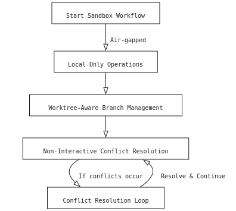

The Git workflow protocol for Fabric agents operating in restricted, non-interactive sandbox or worktree environments is defined in [`skills/git-sandbox/SKILL.md`](https://github.com/pdlc-os/fabric/blob/b11448f8f01fdcf12deab96204417d87f8d46ab3/skills/git-sandbox/SKILL.md). This protocol establishes mandatory syntax and guidelines for Git operations within such environments, primarily to prevent execution errors and processes from hanging due to environmental constraints. This ensures agents can manage changes without direct user intervention or network access for remote Git operations.

Key aspects of this workflow include:

- **Local-Only Operations**: Agents are instructed to treat the local [`main`](https://github.com/pdlc-os/fabric/blob/b11448f8f01fdcf12deab96204417d87f8d46ab3/cmd/fabric/main.go#L19) branch as the definitive source of truth, as the environment is air-gapped from [`origin`](https://github.com/pdlc-os/fabric/blob/b11448f8f01fdcf12deab96204417d87f8d46ab3/LICENSE#L141). Commands that involve network interaction, such as [`git fetch`](https://github.com/pdlc-os/fabric/blob/b11448f8f01fdcf12deab96204417d87f8d46ab3/agents.md?plain=1#L102), [`git pull`](https://github.com/pdlc-os/fabric/blob/b11448f8f01fdcf12deab96204417d87f8d46ab3/agents.md?plain=1#L102), or [`git push`](https://github.com/pdlc-os/fabric/blob/b11448f8f01fdcf12deab96204417d87f8d46ab3/agents.md?plain=1#L102), are expected to fail. Instead, agents perform rebases or merges against the local [`main`](https://github.com/pdlc-os/fabric/blob/b11448f8f01fdcf12deab96204417d87f8d46ab3/cmd/fabric/main.go#L19) branch directly.
- **Worktree-Aware Branch Management**: When operating within a Git worktree, agents cannot directly [`git checkout main`](https://github.com/pdlc-os/fabric/blob/b11448f8f01fdcf12deab96204417d87f8d46ab3/agents.md?plain=1#L102) if [`main`](https://github.com/pdlc-os/fabric/blob/b11448f8f01fdcf12deab96204417d87f8d46ab3/cmd/fabric/main.go#L19) is already checked out elsewhere. The protocol guides agents to perform comparisons, rebases, and merges from their current branch by referencing [`main`](https://github.com/pdlc-os/fabric/blob/b11448f8f01fdcf12deab96204417d87f8d46ab3/cmd/fabric/main.go#L19) directly. This includes patterns like [`git diff main...HEAD`](https://github.com/pdlc-os/fabric/blob/b11448f8f01fdcf12deab96204417d87f8d46ab3/agents.md?plain=1#L102) for viewing changes and [`git show main:path/to/file.ext`](https://github.com/pdlc-os/fabric/blob/b11448f8f01fdcf12deab96204417d87f8d46ab3/agents.md?plain=1#L102) for inspecting file content on [`main`](https://github.com/pdlc-os/fabric/blob/b11448f8f01fdcf12deab96204417d87f8d46ab3/cmd/fabric/main.go#L19) without switching branches.
- **Non-Interactive Conflict Resolution**: The protocol addresses the challenge of resolving conflicts in an environment where terminal-based editors (like Vi or Vim) are unavailable and would cause processes to hang. Agents are instructed to use environment variables and flags to automate commit message generation and continue rebases. For instance, [`GIT_EDITOR=true git rebase --continue`](https://github.com/pdlc-os/fabric/blob/b11448f8f01fdcf12deab96204417d87f8d46ab3/agents.md?plain=1#L102) is used to proceed with a rebase, and [`git merge main --no-edit`](https://github.com/pdlc-os/fabric/blob/b11448f8f01fdcf12deab96204417d87f8d46ab3/agents.md?plain=1#L102) facilitates merges without requiring an editor for the commit message.
- **Structured Conflict Resolution**: A structured approach to resolving conflicts is provided. This involves identifying conflicted files using [`git status`](https://github.com/pdlc-os/fabric/blob/b11448f8f01fdcf12deab96204417d87f8d46ab3/agents.md?plain=1#L102), resolving conflicts within the source files, staging the resolved changes with [`git add <resolved-files>`](https://github.com/pdlc-os/fabric/blob/b11448f8f01fdcf12deab96204417d87f8d46ab3/agents.md?plain=1#L102), and then finalizing the rebase or merge with [`GIT_EDITOR=true git rebase --continue`](https://github.com/pdlc-os/fabric/blob/b11448f8f01fdcf12deab96204417d87f8d46ab3/agents.md?plain=1#L102). This systematic process ensures that agents can navigate and resolve conflicts autonomously.

### Fabric Agent Lifecycle and Project Management

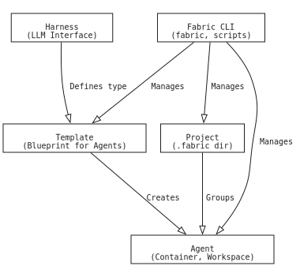

The [`fabric`](https://github.com/pdlc-os/fabric/blob/b11448f8f01fdcf12deab96204417d87f8d46ab3/README.md?plain=1#L1) platform provides a command-line interface and associated scripts for orchestrating concurrent Large Language Model (LLM)-based agents. These agents are designed to operate in parallel, each within isolated workspaces and with distinct credentials and identities. The system introduces several core concepts for agent management:

- **Projects:** Agents are organized into projects, represented by a [`.fabric`](https://github.com/pdlc-os/fabric/blob/b11448f8f01fdcf12deab96204417d87f8d46ab3/agents.md?plain=1#L34) directory. Projects can be local to a specific repository or global, residing in [`~/.fabric/`](https://github.com/pdlc-os/fabric/blob/b11448f8f01fdcf12deab96204417d87f8d46ab3/cmd/project.go#L121).
- **Agents:** An agent is an isolated LLM instance executing within a container. Each agent possesses its own Git worktree as a workspace, dedicated credentials, and specific configuration.
- **Templates:** Templates act as blueprints for agent creation, defining their initial setup and characteristics. Examples include templates for [`gemini`](https://github.com/pdlc-os/fabric/blob/b11448f8f01fdcf12deab96204417d87f8d46ab3/agents.md?plain=1#L26), [`claude`](https://github.com/pdlc-os/fabric/blob/b11448f8f01fdcf12deab96204417d87f8d46ab3/agents.md?plain=1#L27), [`opencode`](https://github.com/pdlc-os/fabric/blob/b11448f8f01fdcf12deab96204417d87f8d46ab3/README.md?plain=1#L83), and [`codex`](https://github.com/pdlc-os/fabric/blob/b11448f8f01fdcf12deab96204417d87f8d46ab3/README.md?plain=1#L83) agents.
- **Harnesses:** A harness specifies the particular LLM interface an agent utilizes, such as the Gemini CLI or Claude Code.

The [`fabric`](https://github.com/pdlc-os/fabric/blob/b11448f8f01fdcf12deab96204417d87f8d46ab3/README.md?plain=1#L1) command-line tool offers a comprehensive set of subcommands for managing the lifecycle of these agents, as detailed in [`skills/fabric/SKILL.md`](https://github.com/pdlc-os/fabric/blob/b11448f8f01fdcf12deab96204417d87f8d46ab3/skills/fabric/SKILL.md). Commands are available for project initialization ([`fabric init`](https://github.com/pdlc-os/fabric/blob/b11448f8f01fdcf12deab96204417d87f8d46ab3/agents.md?plain=1#L1)), starting agents ([`fabric start`](https://github.com/pdlc-os/fabric/blob/b11448f8f01fdcf12deab96204417d87f8d46ab3/agents.md?plain=1#L1)), listing active agents ([`fabric list`](https://github.com/pdlc-os/fabric/blob/b11448f8f01fdcf12deab96204417d87f8d46ab3/Makefile#L1)), attaching to interactive agent sessions ([`fabric attach`](https://github.com/pdlc-os/fabric/blob/b11448f8f01fdcf12deab96204417d87f8d46ab3/agents.md?plain=1#L1)), and sending messages between agents ([`fabric message`](https://github.com/pdlc-os/fabric/blob/b11448f8f01fdcf12deab96204417d87f8d46ab3/Makefile#L1)). Agents can be stopped ([`fabric stop`](https://github.com/pdlc-os/fabric/blob/b11448f8f01fdcf12deab96204417d87f8d46ab3/README.md?plain=1#L1)), resumed ([`fabric resume`](https://github.com/pdlc-os/fabric/blob/b11448f8f01fdcf12deab96204417d87f8d46ab3/README.md?plain=1#L1)), and deleted ([`fabric delete`](https://github.com/pdlc-os/fabric/blob/b11448f8f01fdcf12deab96204417d87f8d46ab3/README.md?plain=1#L1)), with options to preserve associated Git branches during deletion. The [`fabric sync`](https://github.com/pdlc-os/fabric/blob/b11448f8f01fdcf12deab96204417d87f8d46ab3/agents.md?plain=1#L1) command facilitates workspace synchronization, and [`fabric templates`](https://github.com/pdlc-os/fabric/blob/b11448f8f01fdcf12deab96204417d87f8d46ab3/agents.md?plain=1#L1) enables management of agent templates, including listing, showing configurations, creating new templates, and updating defaults. Configuration settings for [`fabric`](https://github.com/pdlc-os/fabric/blob/b11448f8f01fdcf12deab96204417d87f8d46ab3/README.md?plain=1#L1) can be managed using [`fabric config`](https://github.com/pdlc-os/fabric/blob/b11448f8f01fdcf12deab96204417d87f8d46ab3/agents.md?plain=1#L1), allowing for both local and global modifications.

Supporting scripts within [`skills/fabric/scripts`](https://github.com/pdlc-os/fabric/blob/b11448f8f01fdcf12deab96204417d87f8d46ab3/skills/fabric/scripts) simplify common agent operations by wrapping [`fabric`](https://github.com/pdlc-os/fabric/blob/b11448f8f01fdcf12deab96204417d87f8d46ab3/README.md?plain=1#L1) CLI commands. These include scripts to retrieve agent status ([`skills/fabric/scripts/agent-status.sh`](https://github.com/pdlc-os/fabric/blob/b11448f8f01fdcf12deab96204417d87f8d46ab3/skills/fabric/scripts/agent-status.sh)), list agents ([`skills/fabric/scripts/list-agents.sh`](https://github.com/pdlc-os/fabric/blob/b11448f8f01fdcf12deab96204417d87f8d46ab3/skills/fabric/scripts/list-agents.sh)), send messages ([`skills/fabric/scripts/send-message.sh`](https://github.com/pdlc-os/fabric/blob/b11448f8f01fdcf12deab96204417d87f8d46ab3/skills/fabric/scripts/send-message.sh)), and start agents ([`skills/fabric/scripts/start-agent.sh`](https://github.com/pdlc-os/fabric/blob/b11448f8f01fdcf12deab96204417d87f8d46ab3/skills/fabric/scripts/start-agent.sh)). These scripts handle argument parsing and forward them to the [`fabric`](https://github.com/pdlc-os/fabric/blob/b11448f8f01fdcf12deab96204417d87f8d46ab3/README.md?plain=1#L1) utility, streamlining command execution for users. For further details on inter-agent communication, refer to [Inter-Agent and User Communication Protocols](#fabric-platform-skills-inter-agent-and-user-communication-protocols).

### Team Creation and Multi-Agent Orchestration Templates

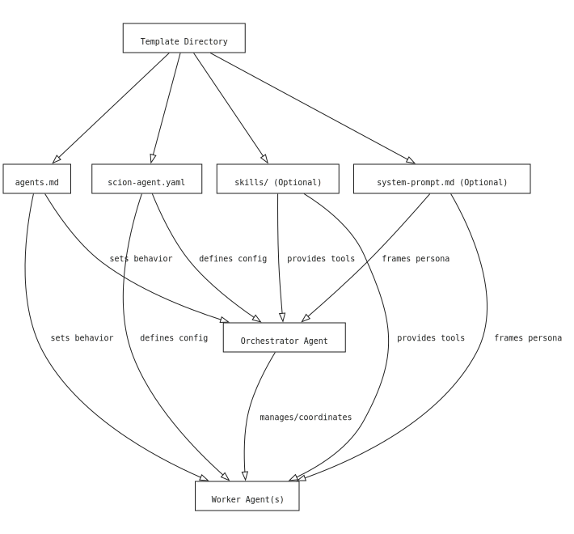

The [`team-creation`](https://github.com/pdlc-os/fabric/blob/b11448f8f01fdcf12deab96204417d87f8d46ab3/skills/README.md?plain=1#L10) skill provides mechanisms for generating and extending [`fabric`](https://github.com/pdlc-os/fabric/blob/b11448f8f01fdcf12deab96204417d87f8d46ab3/README.md?plain=1#L1) agent templates from high-level descriptions. This facilitates the creation of multi-agent teams with specialized roles, defining workflows, and integrating reusable harness skills, all structured within the [`.fabric/templates/`](https://github.com/pdlc-os/fabric/blob/b11448f8f01fdcf12deab96204417d87f8d46ab3/pkg/config/init.go#L357) directory.

Each agent template is represented by a directory under [`.fabric/templates/`](https://github.com/pdlc-os/fabric/blob/b11448f8f01fdcf12deab96204417d87f8d46ab3/pkg/config/init.go#L357) and includes several key files:

- [`fabric-agent.yaml`](https://github.com/pdlc-os/fabric/blob/b11448f8f01fdcf12deab96204417d87f8d46ab3/skills/team-creation/SKILL.md?plain=1#L40): Configures metadata such as [`schema_version`](https://github.com/pdlc-os/fabric/blob/b11448f8f01fdcf12deab96204417d87f8d46ab3/web/src/components/pages/admin-server-config.ts#L189), [`description`](https://github.com/pdlc-os/fabric/blob/b11448f8f01fdcf12deab96204417d87f8d46ab3/pkg/api/types.go#L666), references to behavioral instructions ([`agents.md`](https://github.com/pdlc-os/fabric/blob/b11448f8f01fdcf12deab96204417d87f8d46ab3/agents.md?plain=1#L173)), and persona framing ([`system-prompt.md`](https://github.com/pdlc-os/fabric/blob/b11448f8f01fdcf12deab96204417d87f8d46ab3/pkg/agent/provision.go#L960)). It can also define optional parameters like [`max_turns`](https://github.com/pdlc-os/fabric/blob/b11448f8f01fdcf12deab96204417d87f8d46ab3/web/src/shared/types.ts#L328), [`max_duration`](https://github.com/pdlc-os/fabric/blob/b11448f8f01fdcf12deab96204417d87f8d46ab3/web/src/shared/types.ts#L330), environment variables ([`env`](https://github.com/pdlc-os/fabric/blob/b11448f8f01fdcf12deab96204417d87f8d46ab3/cmd/build.go#L162)), and service dependencies.
- [`agents.md`](https://github.com/pdlc-os/fabric/blob/b11448f8f01fdcf12deab96204417d87f8d46ab3/agents.md?plain=1#L173): Contains the behavioral instructions for the agent, outlining its responsibilities and task constraints.
- [`system-prompt.md`](https://github.com/pdlc-os/fabric/blob/b11448f8f01fdcf12deab96204417d87f8d46ab3/pkg/agent/provision.go#L960): Defines the agent's persona, expertise, and perspective. This file is optional; if omitted, the [`system_prompt`](https://github.com/pdlc-os/fabric/blob/b11448f8f01fdcf12deab96204417d87f8d46ab3/web/src/components/pages/agent-configure.ts#L39) entry is removed from [`fabric-agent.yaml`](https://github.com/pdlc-os/fabric/blob/b11448f8f01fdcf12deab96204417d87f8d46ab3/skills/team-creation/SKILL.md?plain=1#L40).
- [`skills/`](https://github.com/pdlc-os/fabric/blob/b11448f8f01fdcf12deab96204417d87f8d46ab3/.gcloudignore#L31): An optional directory for reusable skill definitions, each conforming to the [agentskills.io](https://agentskills.io/) standard, with its own [`SKILL.md`](https://github.com/pdlc-os/fabric/blob/b11448f8f01fdcf12deab96204417d87f8d46ab3/cmd/skills.go#L193) file. These skills are designed to be harness-agnostic and are automatically integrated into the appropriate harness-specific location during agent provisioning. The [`team-creation`](https://github.com/pdlc-os/fabric/blob/b11448f8f01fdcf12deab96204417d87f8d46ab3/skills/README.md?plain=1#L10) skill itself is defined by [`skills/team-creation/SKILL.md`](https://github.com/pdlc-os/fabric/blob/b11448f8f01fdcf12deab96204417d87f8d46ab3/skills/team-creation/SKILL.md).

The design of multi-agent teams typically follows an "Orchestrator Pattern":

- **Orchestrator**: A single orchestrator agent serves as the entry point for the team. Its instructions define the available worker templates, the overall workflow, communication protocols, and criteria for task completion.
- **Workers**: Other agents are workers, managed and initiated by the orchestrator. They communicate primarily with the orchestrator, simplifying communication flow within the team.

New teams are created by analyzing requirements, designing the team structure, generating templates for each role, adding specialized skills, and validating adherence to defined formats. Existing teams can be extended by reviewing current configurations and applying changes to roles, workflows, or capabilities while maintaining consistency across templates.

Key design principles include:

- **Inheritance**: Custom templates inherit from a built-in [`default`](https://github.com/pdlc-os/fabric/blob/b11448f8f01fdcf12deab96204417d87f8d46ab3/pkg/api/types.go#L433) template, providing base [`fabric`](https://github.com/pdlc-os/fabric/blob/b11448f8f01fdcf12deab96204417d87f8d46ab3/README.md?plain=1#L1) infrastructure without requiring duplication.
- **Separation of Concerns**: [`agents.md`](https://github.com/pdlc-os/fabric/blob/b11448f8f01fdcf12deab96204417d87f8d46ab3/agents.md?plain=1#L173) focuses on agent actions ("what"), while [`system-prompt.md`](https://github.com/pdlc-os/fabric/blob/b11448f8f01fdcf12deab96204417d87f8d46ab3/pkg/agent/provision.go#L960) defines agent identity ("who"), promoting clarity and modularity.
- **Harness Portability**: Skills defined in [`SKILL.md`](https://github.com/pdlc-os/fabric/blob/b11448f8f01fdcf12deab96204417d87f8d46ab3/cmd/skills.go#L193) are designed to function across different LLM harnesses.
- **Centralized Orchestration**: Worker agents communicate exclusively with the orchestrator, streamlining inter-agent communication.

## Design Specifications and Architecture

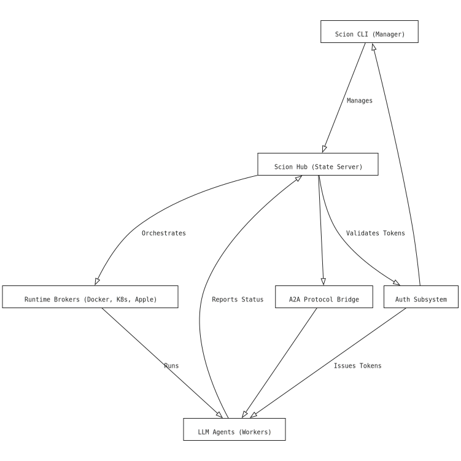

The [`.design`](https://github.com/pdlc-os/fabric/blob/b11448f8f01fdcf12deab96204417d87f8d46ab3/.design) directory serves as the central repository for technical design specifications and architectural decisions within the Fabric project. This directory organizes documents into categories such as [`.design/hosted`](https://github.com/pdlc-os/fabric/blob/b11448f8f01fdcf12deab96204417d87f8d46ab3/.design/hosted) for distributed architecture, [`.design/kubernetes`](https://github.com/pdlc-os/fabric/blob/b11448f8f01fdcf12deab96204417d87f8d46ab3/.design/kubernetes) for deployment and sandboxing, [`.design/metrics`](https://github.com/pdlc-os/fabric/blob/b11448f8f01fdcf12deab96204417d87f8d46ab3/.design/metrics) for observability, and [`.design/_archive`](https://github.com/pdlc-os/fabric/blob/b11448f8f01fdcf12deab96204417d87f8d46ab3/.design/_archive) for historical specifications. Top-level markdown files address core design aspects related to local architecture and CLI features, as documented in [`.design/README.md`](https://github.com/pdlc-os/fabric/blob/b11448f8f01fdcf12deab96204417d87f8d46ab3/.design/README.md).

The design documents provide foundational blueprints for various system components. Key architectural principles include Fabric's Manager-Worker pattern, where [`fabric`](https://github.com/pdlc-os/fabric/blob/b11448f8f01fdcf12deab96204417d87f8d46ab3/README.md?plain=1#L1) acts as a Grove Manager orchestrating agents (Grove Workers) within isolated containers. This isolation is crucial for managing concurrent agents and ensuring resource separation. Programmatic access to core agent logic is achieved by decoupling it from the CLI, introducing a clear separation between data types and business logic in [`pkg/api`](https://github.com/pdlc-os/fabric/blob/b11448f8f01fdcf12deab96204417d87f8d46ab3/pkg/api) and business logic in [`pkg/agent`](https://github.com/pdlc-os/fabric/blob/b11448f8f01fdcf12deab96204417d87f8d46ab3/pkg/agent).

Agent state and lifecycle management are central to Fabric's design. The system includes a refactored agent state model that captures an agent's [`Phase`](https://github.com/pdlc-os/fabric/blob/b11448f8f01fdcf12deab96204417d87f8d46ab3/pkg/api/types.go#L576), [`Activity`](https://github.com/pdlc-os/fabric/blob/b11448f8f01fdcf12deab96204417d87f8d46ab3/pkg/api/types.go#L577), and [`Detail`](https://github.com/pdlc-os/fabric/blob/b11448f8f01fdcf12deab96204417d87f8d46ab3/pkg/agent/state/state.go#L225), providing a more granular view of its operational status, as detailed in [`.design/agent-state-refactor.md`](https://github.com/pdlc-os/fabric/blob/b11448f8f01fdcf12deab96204417d87f8d46ab3/.design/agent-state-refactor.md). Mechanisms are also in place to address agent resume functionality, crash handling, and auto-suspension, particularly within Docker runtimes, described in [`.design/agent-state-lifecycle-fixes.md`](https://github.com/pdlc-os/fabric/blob/b11448f8f01fdcf12deab96204417d87f8d46ab3/.design/agent-state-lifecycle-fixes.md). To manage resource consumption, agents can be configured with execution limits such as [`max_turns`](https://github.com/pdlc-os/fabric/blob/b11448f8f01fdcf12deab96204417d87f8d46ab3/web/src/shared/types.ts#L328) and [`max_duration`](https://github.com/pdlc-os/fabric/blob/b11448f8f01fdcf12deab96204417d87f8d46ab3/web/src/shared/types.ts#L330), enforced by [`fabrictool`](https://github.com/pdlc-os/fabric/blob/b11448f8f01fdcf12deab96204417d87f8d46ab3/docs-site/src/content/docs/glossary.md?plain=1#L44), which are documented in [`.design/agent-limits.md`](https://github.com/pdlc-os/fabric/blob/b11448f8f01fdcf12deab96204417d87f8d46ab3/.design/agent-limits.md). The design also specifies how agent configurations are assembled from various sources during provisioning and runtime launch, analyzed in [`.design/agent-config-flow.md`](https://github.com/pdlc-os/fabric/blob/b11448f8f01fdcf12deab96204417d87f8d46ab3/.design/agent-config-flow.md).

LLM agnosticism is achieved through a [`Harness`](https://github.com/pdlc-os/fabric/blob/b11448f8f01fdcf12deab96204417d87f8d46ab3/pkg/api/harness.go#L23) abstraction, which encapsulates agent-specific logic for environment variables, command construction, and authentication. This design allows Fabric to integrate with various Language Model providers without requiring significant changes to the core platform. The template system has evolved to be harness-agnostic, defining an agent's role independently of the underlying LLM, as discussed in [`.design/agnostic-template-design.md`](https://github.com/pdlc-os/fabric/blob/b11448f8f01fdcf12deab96204417d87f8d46ab3/.design/agnostic-template-design.md).

Authentication and security are critical components of the design. A robust system propagates authentication credentials from the host to containerized agents, employing a multi-stage credential resolution pipeline. This pipeline resolves LLM credentials across different harness types and deployment modes, primarily using [`pkg/harness/auth.go`](https://github.com/pdlc-os/fabric/blob/b11448f8f01fdcf12deab96204417d87f8d46ab3/pkg/harness/auth.go) and data structures from [`pkg/api/types.go`](https://github.com/pdlc-os/fabric/blob/b11448f8f01fdcf12deab96204417d87f8d46ab3/pkg/api/types.go), as detailed in [`.design/agent-credentials.md`](https://github.com/pdlc-os/fabric/blob/b11448f8f01fdcf12deab96204417d87f8d46ab3/.design/agent-credentials.md). The design also addresses secure secret access for sub-agents by introducing [`AllowProgeny`](https://github.com/pdlc-os/fabric/blob/b11448f8f01fdcf12deab96204417d87f8d46ab3/pkg/store/models.go#L1084) metadata and integrating ancestry information into agent tokens, leveraging the policy engine for access control, as outlined in [`.design/agent-progeny-secret-access.md`](https://github.com/pdlc-os/fabric/blob/b11448f8f01fdcf12deab96204417d87f8d46ab3/.design/agent-progeny-secret-access.md). A phased plan to implement fine-grained access visibility for resources within the Hub is discussed in [`.design/access-visibility.md`](https://github.com/pdlc-os/fabric/blob/b11448f8f01fdcf12deab96204417d87f8d46ab3/.design/access-visibility.md).

Fabric supports various runtime environments, including integration with Apple's native [`container`](https://github.com/pdlc-os/fabric/blob/b11448f8f01fdcf12deab96204417d87f8d46ab3/extras/agent-viz/web/src/graph.ts#L32) CLI for macOS-native virtualization and [`tmux`](https://github.com/pdlc-os/fabric/blob/b11448f8f01fdcf12deab96204417d87f8d46ab3/README.md?plain=1#L74)-based solutions for persistent [`fabric attach`](https://github.com/pdlc-os/fabric/blob/b11448f8f01fdcf12deab96204417d87f8d46ab3/agents.md?plain=1#L1) functionality, as proposed in [`.design/_archive/tmux.md`](https://github.com/pdlc-os/fabric/blob/b11448f8f01fdcf12deab96204417d87f8d46ab3/.design/_archive/tmux.md). The system also supports mounting non-Git workspaces into agent containers, as suggested in [`.design/_archive/non-git-workspace-mount.md`](https://github.com/pdlc-os/fabric/blob/b11448f8f01fdcf12deab96204417d87f8d46ab3/.design/_archive/non-git-workspace-mount.md).

The [`fabric-a2a-bridge`](https://github.com/pdlc-os/fabric/blob/b11448f8f01fdcf12deab96204417d87f8d46ab3/extras/fabric-a2a-bridge/README.md?plain=1#L1) is designed to enable external A2A agents to interact with Fabric agents. This bridge translates between the A2A protocol and Fabric's Hub API, dynamically generating agent card metadata, managing task lifecycles, and facilitating message translation. It supports real-time updates through Server-Sent Events (SSE) and push notifications. The evolution of this bridge includes migrating to the official [`a2a-go`](https://github.com/pdlc-os/fabric/blob/b11448f8f01fdcf12deab96204417d87f8d46ab3/extras/fabric-a2a-bridge/go.mod#L8) SDK for improved specification compliance and maintainability. For more details on the A2A bridge, refer to [A2A Bridge Design and Evolution](#design-specifications-and-architecture-a2a-bridge-design-and-evolution).

The design documents also cover developer experience aspects such as a Python-based hook processor for providing status visibility and detailed logging, described in [`.design/_archive/hooks.md`](https://github.com/pdlc-os/fabric/blob/b11448f8f01fdcf12deab96204417d87f8d46ab3/.design/_archive/hooks.md), and a standalone visualizer tool for replaying agent activity from Google Cloud Logging exports, proposed in [`.design/agent-visualizer.md`](https://github.com/pdlc-os/fabric/blob/b11448f8f01fdcf12deab96204417d87f8d46ab3/.design/agent-visualizer.md). Additionally, the [`.design`](https://github.com/pdlc-os/fabric/blob/b11448f8f01fdcf12deab96204417d87f8d46ab3/.design) directory contains documents addressing technical debt, control plane design, and documentation migration strategies.

### Core Architectural Principles and Agent Management

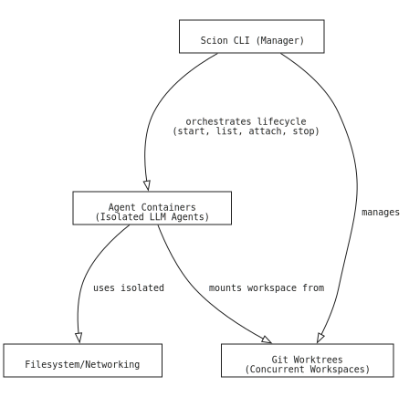

Fabric operates on a Manager-Worker pattern, where the Fabric platform acts as the "Grove Manager," orchestrating various "Agent Workers" within isolated environments known as Groves. A Grove typically corresponds to a Git repository or a project workspace, and agents within a Grove can be configured to collaborate on tasks. Agent lifecycle management involves commands such as starting, listing, attaching to, and stopping these agents. Resource isolation is achieved by running agents in dedicated containers, each with its own filesystem, network, and [`git worktree`](https://github.com/pdlc-os/fabric/blob/b11448f8f01fdcf12deab96204417d87f8d46ab3/agents.md?plain=1#L102)-based workspaces, enabling concurrent code modifications.

Programmatic access to Fabric's core agent logic is provided through an API, which decouples the core functionality from the command-line interface. This API defines fundamental types for agent information, status events, and start options, while a dedicated [`Manager`](https://github.com/pdlc-os/fabric/blob/b11448f8f01fdcf12deab96204417d87f8d46ab3/pkg/agent/manager.go#L33) interface handles the business logic for agent operations.

The platform employs a refined agent state model that tracks [`Phase`](https://github.com/pdlc-os/fabric/blob/b11448f8f01fdcf12deab96204417d87f8d46ab3/pkg/api/types.go#L576), [`Activity`](https://github.com/pdlc-os/fabric/blob/b11448f8f01fdcf12deab96204417d87f8d46ab3/pkg/api/types.go#L577), and [`Detail`](https://github.com/pdlc-os/fabric/blob/b11448f8f01fdcf12deab96204417d87f8d46ab3/pkg/agent/state/state.go#L225) dimensions, replacing a more fragmented system. This model helps in accurately representing an agent's current operational status, addressing issues related to resume functionality, crash handling, and automatic suspension. Agents can also have configurable execution limits, such as maximum turns or duration, which are enforced to prevent runaway processes and manage resource consumption. Support for sidecar processes, referred to as "services," is also integrated, allowing agents to launch and manage auxiliary functionalities alongside their primary tasks.

The agent's configuration flow involves a merging process where configurations are assembled during agent creation and at runtime launch. This ensures that agents are provisioned with the necessary settings and environmental variables to operate correctly. Resource specifications, including CPU, memory, and disk requirements, can be defined within the agent's configuration, catering to various runtime environments like Apple Container, Docker, and Kubernetes.

The overall architecture for the hosted mode further elaborates on this distributed nature, emphasizing Grove-centric operations, authentication, and authorization systems. Client-side interactions with the Hub and Runtime Broker APIs are designed to facilitate real-time updates and agent detail views in the frontend. For a detailed understanding of the overall architecture and historical context, refer to the [Design Specifications and Architecture](#design-specifications-and-architecture) section. Specific aspects of agent lifecycle management are also covered in [Agent Lifecycle Management and Orchestration](#fabric-agent-orchestration-and-management-agent-lifecycle-management-and-orchestration).

### LLM Agnosticism and Harness Abstraction

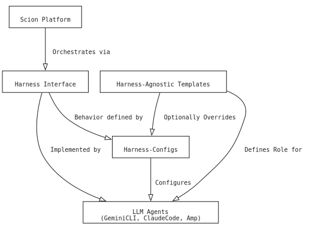

Achieving agnosticism to large language models (LLMs) and other agent types is a core architectural principle in Fabric, enabled through the [`Harness`](https://github.com/pdlc-os/fabric/blob/b11448f8f01fdcf12deab96204417d87f8d46ab3/pkg/api/harness.go#L23) abstraction. This abstraction centralizes agent-specific logic, allowing the platform to support various agents without tight coupling to their internal mechanisms. The [`Harness`](https://github.com/pdlc-os/fabric/blob/b11448f8f01fdcf12deab96204417d87f8d46ab3/pkg/api/harness.go#L23) interface, defined in [`pkg/harness`](https://github.com/pdlc-os/fabric/blob/b11448f8f01fdcf12deab96204417d87f8d46ab3/pkg/harness), encapsulates functionalities such as setting environment variables, constructing commands for agent execution, and managing authentication flows specific to each agent type. For instance, while [`GeminiCLI`](https://github.com/pdlc-os/fabric/blob/b11448f8f01fdcf12deab96204417d87f8d46ab3/docs-site/src/content/docs/concepts.md?plain=1#L32) might be an existing implementation, the design accommodates other agents like [`ClaudeCode`](https://github.com/pdlc-os/fabric/blob/b11448f8f01fdcf12deab96204417d87f8d46ab3/harnesses/claude/provision.py#L108).

This approach extends to the template system, which has evolved to become harness-agnostic. Instead of embedding specific LLM details within agent templates, the system defines an agent's role independently, combining it with a [`harness-config`](https://github.com/pdlc-os/fabric/blob/b11448f8f01fdcf12deab96204417d87f8d46ab3/GLOSSARY.md?plain=1#L22) during agent creation. This enables greater flexibility and reususability of templates across different LLM backends. An example of this flexibility is demonstrated by the design for a third-party [`Amp`](https://github.com/pdlc-os/fabric/blob/b11448f8f01fdcf12deab96204417d87f8d46ab3/examples/amp/README.md?plain=1#L1) coding agent, where its harness is entirely implemented via scripts using a [`container-script`](https://github.com/pdlc-os/fabric/blob/b11448f8f01fdcf12deab96204417d87f8d46ab3/GLOSSARY.md?plain=1#L32) provisioner type, as detailed in [`.design/amp-harness-scripts.md`](https://github.com/pdlc-os/fabric/blob/b11448f8f01fdcf12deab96204417d87f8d46ab3/.design/amp-harness-scripts.md). This design pattern ensures that [`fabric`](https://github.com/pdlc-os/fabric/blob/b11448f8f01fdcf12deab96204417d87f8d46ab3/README.md?plain=1#L1) can integrate diverse agents with minimal changes to its core orchestration logic.

### Authentication and Security Design

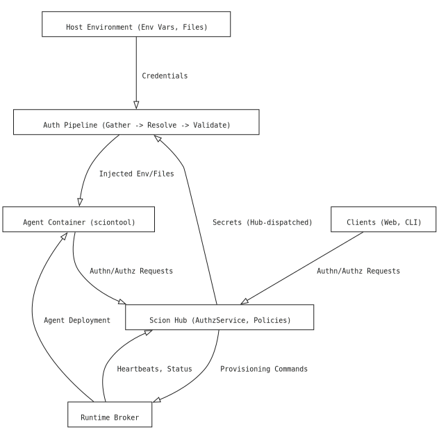

The Fabric platform manages authentication and authorization across the host system, containerized agents, and the Fabric Hub. A primary focus is the secure propagation and management of credentials from the host to containerized agents, ensuring their operation within isolated environments.

Authentication credentials for agents are processed through a multi-stage resolution pipeline. This pipeline is detailed in [`.design/agent-credentials.md`](https://github.com/pdlc-os/fabric/blob/b11448f8f01fdcf12deab96204417d87f8d46ab3/.design/agent-credentials.md) and involves gathering authentication information, overlaying settings, resolving final credentials, and validating them. The process primarily uses the Go package [`pkg/harness/auth.go`](https://github.com/pdlc-os/fabric/blob/b11448f8f01fdcf12deab96204417d87f8d46ab3/pkg/harness/auth.go), which defines the logic for handling various authentication types and integrates with data structures from [`pkg/api/types.go`](https://github.com/pdlc-os/fabric/blob/b11448f8f01fdcf12deab96204417d87f8d46ab3/pkg/api/types.go). For instance, in the context of large language models, the system discovers and injects credentials, such as API keys and application credentials, into the agent's runtime environment. This injection can occur via environment variables or by mirroring filesystem paths from the host. This ensures agents have the necessary permissions to interact with external services while remaining within their isolated containers. The documents [`.design/_archive/auth.md`](https://github.com/pdlc-os/fabric/blob/b11448f8f01fdcf12deab96204417d87f8d46ab3/.design/_archive/auth.md) and [`.design/agent-auth-refactor.md`](https://github.com/pdlc-os/fabric/blob/b11448f8f01fdcf12deab96204417d87f8d46ab3/.design/agent-auth-refactor.md) further elaborate on the consistent implementation and validation of this system.

For secure secret access within agent hierarchies, particularly for sub-agents, a mechanism exists to manage user-scoped secrets. This involves associating [`AllowProgeny`](https://github.com/pdlc-os/fabric/blob/b11448f8f01fdcf12deab96204417d87f8d46ab3/pkg/store/models.go#L1084) metadata with secrets and integrating ancestry information into agent tokens. This approach enables the policy engine to enforce access control, ensuring that only authorized sub-agents can access specific secrets. The design for this capability is outlined in [`.design/agent-progeny-secret-access.md`](https://github.com/pdlc-os/fabric/blob/b11448f8f01fdcf12deab96204417d87f8d46ab3/.design/agent-progeny-secret-access.md).

The Fabric Hub employs a phased strategy for access visibility for resources, as documented in [`.design/access-visibility.md`](https://github.com/pdlc-os/fabric/blob/b11448f8f01fdcf12deab96204417d87f8d46ab3/.design/access-visibility.md). This plan aims to evolve access control from simple metadata to a core mechanism with defined levels such as [`private`](https://github.com/pdlc-os/fabric/blob/b11448f8f01fdcf12deab96204417d87f8d46ab3/pkg/hub/githubapp/githubapp.go#L495), [`team`](https://github.com/pdlc-os/fabric/blob/b11448f8f01fdcf12deab96204417d87f8d46ab3/README.md?plain=1#L21), and [`public`](https://github.com/pdlc-os/fabric/blob/b11448f8f01fdcf12deab96204417d87f8d46ab3/cmd/hub.go#L342). This granular control helps ensure that resources within the Hub are appropriately secured and accessible only to authorized users or teams.

Within the hosted mode, the authentication and authorization systems are further refined. The [`.design/hosted/auth`](https://github.com/pdlc-os/fabric/blob/b11448f8f01fdcf12deab96204417d87f8d46ab3/.design/hosted/auth) directory details the use of Unified Identity and Secure Token Management, adhering to OAuth 2.0 standards. This includes defining user and agent identities, managing various token types (access, refresh, CLI, JWT), and implementing client-specific authentication mechanisms (OAuth for web/CLI, JWT for agents, API keys for direct API access). Server-side authentication uses [`authMiddleware`](https://github.com/pdlc-os/fabric/blob/b11448f8f01fdcf12deab96204417d87f8d46ab3/extras/fabric-a2a-bridge/internal/bridge/server.go#L289) for token validation, and the CLI implements a browser-based OAuth flow with PKCE for secure credential acquisition. Agents utilize Hub-generated JWTs for authentication, with scopes for authorization, while runtime brokers use HMAC-based mutual authentication with the Hub. The permissions design introduces [`principal`](https://github.com/pdlc-os/fabric/blob/b11448f8f01fdcf12deab96204417d87f8d46ab3/pkg/hub/handlers_principals.go#L38) and [`Group`](https://github.com/pdlc-os/fabric/blob/b11448f8f01fdcf12deab96204417d87f8d46ab3/pkg/store/models.go#L1129) models, defining [`Principals`](https://github.com/pdlc-os/fabric/blob/b11448f8f01fdcf12deab96204417d87f8d46ab3/docs-site/src/content/docs/hub-admin/permissions.md?plain=1#L12), [`Resources`](https://github.com/pdlc-os/fabric/blob/b11448f8f01fdcf12deab96204417d87f8d46ab3/pkg/api/types.go#L319), [`Actions`](https://github.com/pdlc-os/fabric/blob/b11448f8f01fdcf12deab96204417d87f8d46ab3/pkg/store/models.go#L1207), and [`Policies`](https://github.com/pdlc-os/fabric/blob/b11448f8f01fdcf12deab96204417d87f8d46ab3/pkg/hub/handlers_policies.go#L33) to enforce authorization via an `AuthzMiddleware`. The design also supports agent-to-agent interaction with defined scopes like [`ScopeAgentCreate`](https://github.com/pdlc-os/fabric/blob/b11448f8f01fdcf12deab96204417d87f8d46ab3/pkg/hub/agenttoken.go#L51) and [`ScopeAgentLifecycle`](https://github.com/pdlc-os/fabric/blob/b11448f8f01fdcf12deab96204417d87f8d46ab3/pkg/hub/agenttoken.go#L53), configured via an `hub_access` field in agent templates. This capability allows agents to create and manage other agents within their grove with appropriate permissions.

### Runtime Environments and Integration

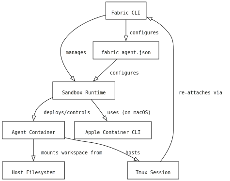

The design of the Fabric platform incorporates various runtime environments to execute agents. One notable integration is with Apple's native [`container`](https://github.com/pdlc-os/fabric/blob/b11448f8f01fdcf12deab96204417d87f8d46ab3/extras/agent-viz/web/src/graph.ts#L32) CLI, detailed in [`.design/_archive/apple-container.md`](https://github.com/pdlc-os/fabric/blob/b11448f8f01fdcf12deab96204417d87f8d46ab3/.design/_archive/apple-container.md). This allows Fabric agents to leverage macOS-native virtualization, providing a lightweight and secure execution environment on Apple hardware. The design addresses configuration, runtime adaptations for [`container`](https://github.com/pdlc-os/fabric/blob/b11448f8f01fdcf12deab96204417d87f8d46ab3/extras/agent-viz/web/src/graph.ts#L32)-specific flags, mount constraints, and network considerations unique to this environment.

To enhance the user experience, particularly for [`fabric attach`](https://github.com/pdlc-os/fabric/blob/b11448f8f01fdcf12deab96204417d87f8d46ab3/agents.md?plain=1#L1) functionality, [`tmux`](https://github.com/pdlc-os/fabric/blob/b11448f8f01fdcf12deab96204417d87f8d46ab3/README.md?plain=1#L74) integration is proposed in [`.design/_archive/apple-container-attach.md`](https://github.com/pdlc-os/fabric/blob/b11448f8f01fdcf12deab96204417d87f8d46ab3/.design/_archive/apple-container-attach.md) and [`.design/_archive/tmux.md`](https://github.com/pdlc-os/fabric/blob/b11448f8f01fdcf12deab96204417d87f8d46ab3/.design/_archive/tmux.md). This solution allows for persistent interactive sessions with agents, even when the underlying [`container`](https://github.com/pdlc-os/fabric/blob/b11448f8f01fdcf12deab96204417d87f8d46ab3/extras/agent-viz/web/src/graph.ts#L32) CLI might not natively support such persistence. By installing [`tmux`](https://github.com/pdlc-os/fabric/blob/b11448f8f01fdcf12deab96204417d87f8d46ab3/README.md?plain=1#L74) within the agent image and modifying the agent's entrypoint, users can attach to and detach from agent sessions without losing context. This includes adapting the [`Run`](https://github.com/pdlc-os/fabric/blob/b11448f8f01fdcf12deab96204417d87f8d46ab3/pkg/wsclient/pty.go#L156) and [`Attach`](https://github.com/pdlc-os/fabric/blob/b11448f8f01fdcf12deab96204417d87f8d46ab3/pkg/runtime/mock.go#L83) commands in the CLI to interact with [`tmux`](https://github.com/pdlc-os/fabric/blob/b11448f8f01fdcf12deab96204417d87f8d46ab3/README.md?plain=1#L74) sessions.

Beyond Git-based workspaces, the platform also envisions supporting non-Git workspaces. The document [`.design/_archive/non-git-workspace-mount.md`](https://github.com/pdlc-os/fabric/blob/b11448f8f01fdcf12deab96204417d87f8d46ab3/.design/_archive/non-git-workspace-mount.md) proposes mounting project roots directly into agent containers at a designated [`/workspace`](https://github.com/pdlc-os/fabric/blob/b11448f8f01fdcf12deab96204417d87f8d46ab3/agents.md?plain=1#L39) path. This feature would involve updating the [`ProvisionAgent`](https://github.com/pdlc-os/fabric/blob/b11448f8f01fdcf12deab96204417d87f8d46ab3/pkg/agent/provision.go#L400) function to handle [`VolumeMount`](https://github.com/pdlc-os/fabric/blob/b11448f8f01fdcf12deab96204417d87f8d46ab3/pkg/api/types.go#L248) entries in the agent's configuration, allowing agents to operate on arbitrary filesystem directories provided by the user.

For further details on how Fabric handles the deployment and management of its core components, refer to [Google Cloud Run Deployment and Management](#developer-utilities-and-local-development-google-cloud-run-deployment-and-management) and [Google Cloud Engine Starter Hub Deployment](#developer-utilities-and-local-development-google-cloud-engine-starter-hub-deployment).

### A2A Bridge Design and Evolution

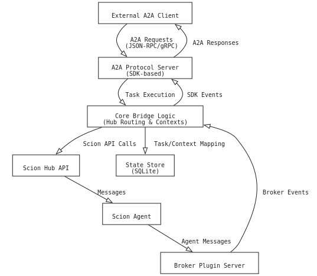

The [`fabric-a2a-bridge`](https://github.com/pdlc-os/fabric/blob/b11448f8f01fdcf12deab96204417d87f8d46ab3/extras/fabric-a2a-bridge/README.md?plain=1#L1) is designed to enable external A2A agents to interact with Fabric agents. This bridge acts as a translator, converting requests between the A2A protocol and Fabric's internal Hub API. Its architecture features a self-managed broker plugin and an HTTP frontend for communication.

A core function of the bridge is dynamic agent card generation, which creates JSON metadata for Fabric agents based on their templates and current runtime state. This metadata is then served to A2A clients, allowing them to discover and understand the capabilities of available Fabric agents.

The bridge manages the lifecycle of A2A tasks by translating them into Fabric agent messages. It tracks task states such as [`submitted`](https://github.com/pdlc-os/fabric/blob/b11448f8f01fdcf12deab96204417d87f8d46ab3/LICENSE#L51), [`working`](https://github.com/pdlc-os/fabric/blob/b11448f8f01fdcf12deab96204417d87f8d46ab3/agents.md?plain=1#L175), [`completed`](https://github.com/pdlc-os/fabric/blob/b11448f8f01fdcf12deab96204417d87f8d46ab3/pkg/hub/resource_import.go#L97), [`failed`](https://github.com/pdlc-os/fabric/blob/b11448f8f01fdcf12deab96204417d87f8d46ab3/pkg/hubclient/agents.go#L154), and [`input-required`](https://github.com/pdlc-os/fabric/blob/b11448f8f01fdcf12deab96204417d87f8d46ab3/extras/fabric-a2a-bridge/README.md?plain=1#L275), persisting this state in an SQLite database. This ensures that the interaction flow between A2A clients and Fabric agents is consistent and reliable. The design also addresses the issue of premature task completion in multi-turn interactions, ensuring that tasks remain active as long as the Fabric agent is processing or awaiting input, rather than marking them as complete after the first message. This is achieved by allowing content messages to be broadcast as [`StatusUpdate`](https://github.com/pdlc-os/fabric/blob/b11448f8f01fdcf12deab96204417d87f8d46ab3/pkg/fabrictool/hub/client.go#L134) events without altering the task's state or closing subscriptions, as detailed in [`.design/a2a-multi-turn-lifecycle.md`](https://github.com/pdlc-os/fabric/blob/b11448f8f01fdcf12deab96204417d87f8d46ab3/.design/a2a-multi-turn-lifecycle.md).

For message exchange, the bridge translates [`a2a.Message`](https://github.com/pdlc-os/fabric/blob/b11448f8f01fdcf12deab96204417d87f8d46ab3/extras/fabric-a2a-bridge/internal/bridge/translate.go#L230) objects into Fabric [`StructuredMessage`](https://github.com/pdlc-os/fabric/blob/b11448f8f01fdcf12deab96204417d87f8d46ab3/proto/broker/v1/broker.proto#L33) and vice versa. This translation includes handling various content types, such as text, URLs (as attachments), structured data, and raw binary. Real-time updates are supported through Server-Sent Events (SSE), allowing the bridge to fan out broker messages to active streams for [`SendStreamingMessage`](https://github.com/pdlc-os/fabric/blob/b11448f8f01fdcf12deab96204417d87f8d46ab3/extras/fabric-a2a-bridge/internal/bridge/stream.go#L175) and [`SubscribeToTask`](https://github.com/pdlc-os/fabric/blob/b11448f8f01fdcf12deab96204417d87f8d46ab3/extras/fabric-a2a-bridge/internal/bridge/stream.go#L271) functionalities. Push notifications are also supported, dispatching A2A task updates to configured webhooks for disconnected clients.

Authentication is a critical component, covering external A2A client authentication (API Key, JWT Bearer, OAuth2) and internal authentication to the Fabric Hub with user impersonation capabilities. The bridge also maps A2A [`contextId`](https://github.com/pdlc-os/fabric/blob/b11448f8f01fdcf12deab96204417d87f8d46ab3/extras/fabric-a2a-bridge/internal/state/state.go#L39)s to specific Fabric agent instances, supporting multi-turn conversations and offering configurable agent auto-provisioning.

An important evolution of the [`fabric-a2a-bridge`](https://github.com/pdlc-os/fabric/blob/b11448f8f01fdcf12deab96204417d87f8d46ab3/extras/fabric-a2a-bridge/README.md?plain=1#L1) involves migrating from a custom A2A protocol implementation to the official [`a2a-go`](https://github.com/pdlc-os/fabric/blob/b11448f8f01fdcf12deab96204417d87f8d46ab3/extras/fabric-a2a-bridge/go.mod#L8) SDK, as described in [`.design/a2a-sdk-migration.md`](https://github.com/pdlc-os/fabric/blob/b11448f8f01fdcf12deab96204417d87f8d46ab3/.design/a2a-sdk-migration.md). This migration aims to improve A2A spec compliance, reduce maintenance overhead by replacing custom JSON-RPC, task lifecycle, and streaming implementations with SDK equivalents, and gain multi-transport capabilities. The new architecture introduces a [`FabricExecutor`](https://github.com/pdlc-os/fabric/blob/b11448f8f01fdcf12deab96204417d87f8d46ab3/extras/fabric-a2a-bridge/internal/bridge/executor.go#L57) that implements [`a2asrv.AgentExecutor`](https://github.com/pdlc-os/fabric/blob/b11448f8f01fdcf12deab96204417d87f8d46ab3/extras/fabric-a2a-bridge/internal/bridge/executor.go#L51) to translate SDK messages to Fabric [`StructuredMessage`](https://github.com/pdlc-os/fabric/blob/b11448f8f01fdcf12deab96204417d87f8d46ab3/proto/broker/v1/broker.proto#L33)s, send them to the Hub, and yield SDK events. While core Hub routing, the broker plugin, agent lookup, context resolution, and auto-provisioning are preserved, the SDK handles JSON-RPC processing, task lifecycle, and streaming, relying on the [`SQLite`](https://github.com/pdlc-os/fabric/blob/b11448f8f01fdcf12deab96204417d87f8d46ab3/Makefile#L59) store for context mapping and broker correlation. The migration strategy focuses on gradually adopting the SDK's components while maintaining existing functionalities.

### Hosted Mode Architecture and Client-Side Interaction

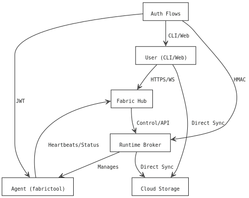

Fabric's hosted mode provides a distributed architecture for managing agents, focusing on grove-centricity, location transparency, and robust security. The architecture emphasizes the Hub as a centralized authority and the Runtime Broker for handling agent lifecycles, with [`fabrictool`](https://github.com/pdlc-os/fabric/blob/b11448f8f01fdcf12deab96204417d87f8d46ab3/docs-site/src/content/docs/glossary.md?plain=1#L44) within agents reporting heartbeats and observability data. Grove-centricity implies that Git remote URLs serve as the primary identity for groves, supporting Hub-first creation and agent workspace provisioning. Location transparency is achieved through the Hub API, allowing communication without needing to know the physical location of agents or brokers. NAT traversal is a key feature for Runtime Brokers to connect to the Hub, and direct-to-storage synchronization facilitates handling large data. Multi-context security ensures that agents operate within secure boundaries.

Central to the system is a comprehensive authentication and authorization framework. This includes Unified Identity, Secure Token Management, and OAuth 2.0-compliant developer experience. User, agent, and runtime broker authentication are supported, with distinct token types and mechanisms. For instance, CLI authentication uses a browser-based OAuth flow with a [`LocalhostAuthServer`](https://github.com/pdlc-os/fabric/blob/b11448f8f01fdcf12deab96204417d87f8d46ab3/pkg/hub/auth/localhost_server.go#L129) and [`PKCE`](https://github.com/pdlc-os/fabric/blob/b11448f8f01fdcf12deab96204417d87f8d46ab3/pkg/hub/handlers_auth.go#L63), storing credentials locally in [`~/.fabric/credentials.json`](https://github.com/pdlc-os/fabric/blob/b11448f8f01fdcf12deab96204417d87f8d46ab3/docs-site/src/content/docs/reference/security.md?plain=1#L17). Agents authenticate using Hub-generated JSON Web Tokens (JWTs) passed via the [`FABRIC_HUB_TOKEN`](https://github.com/pdlc-os/fabric/blob/b11448f8f01fdcf12deab96204417d87f8d46ab3/cmd/hub.go#L494) environment variable, with scopes like [`agent:status:update`](https://github.com/pdlc-os/fabric/blob/b11448f8f01fdcf12deab96204417d87f8d46ab3/pkg/hub/agenttoken.go#L45) for authorization. Runtime brokers utilize HMAC-based mutual authentication with the Hub. The system enforces policy-based authorization using [`principal`](https://github.com/pdlc-os/fabric/blob/b11448f8f01fdcf12deab96204417d87f8d46ab3/pkg/hub/handlers_principals.go#L38) and [`Group`](https://github.com/pdlc-os/fabric/blob/b11448f8f01fdcf12deab96204417d87f8d46ab3/pkg/store/models.go#L1129) models, defining Principals (Users, Groups), Resources (hub, grove, agent), Actions (CRUD), and Policies. Middleware enforces authorization via the [`CheckAccess`](https://github.com/pdlc-os/fabric/blob/b11448f8f01fdcf12deab96204417d87f8d46ab3/pkg/hub/authz.go#L94) method. This framework also enables a "lead agent" to create and manage "sub-agents" within its grove using new scopes like [`ScopeAgentCreate`](https://github.com/pdlc-os/fabric/blob/b11448f8f01fdcf12deab96204417d87f8d46ab3/pkg/hub/agenttoken.go#L51) and [`ScopeAgentLifecycle`](https://github.com/pdlc-os/fabric/blob/b11448f8f01fdcf12deab96204417d87f8d46ab3/pkg/hub/agenttoken.go#L53), configured via an `hub_access` field in agent templates. This allows for autonomous multi-agent workflows while maintaining strict grove isolation, where agents can only operate on resources within their designated [`grove_id`](https://github.com/pdlc-os/fabric/blob/b11448f8f01fdcf12deab96204417d87f8d46ab3/agents.md?plain=1#L176). The design for access control for environment variables and secrets further refines authorization by leveraging existing [`CheckAccess`](https://github.com/pdlc-os/fabric/blob/b11448f8f01fdcf12deab96204417d87f8d46ab3/pkg/hub/authz.go#L94) to ensure scope-based authorization, identity enforcement, and policy-based access for user, grove, and broker scopes, without introducing new resource types for simplicity. See [Authentication and Security Design](#design-specifications-and-architecture-authentication-and-security-design) for more details.

Client-side interaction with the Fabric Hub and Runtime Broker APIs is facilitated by Go client libraries. A shared client infrastructure in [`pkg/apiclient`](https://github.com/pdlc-os/fabric/blob/b11448f8f01fdcf12deab96204417d87f8d46ab3/pkg/apiclient) provides a [`Transport`](https://github.com/pdlc-os/fabric/blob/b11448f8f01fdcf12deab96204417d87f8d46ab3/pkg/apiclient/transport.go#L31) layer for HTTP requests, an [`Authenticator`](https://github.com/pdlc-os/fabric/blob/b11448f8f01fdcf12deab96204417d87f8d46ab3/pkg/apiclient/auth.go#L20) interface for credentials, and structured error handling. The Hub API client in [`pkg/hubclient`](https://github.com/pdlc-os/fabric/blob/b11448f8f01fdcf12deab96204417d87f8d46ab3/pkg/hubclient) exposes services for managing agents, groves, runtime brokers, templates, users, environment variables, secrets, and authentication. Similarly, a Runtime Broker API client in [`pkg/brokerclient`](https://github.com/pdlc-os/fabric/blob/b11448f8f01fdcf12deab96204417d87f8d46ab3/pkg/brokerclient) manages agent operations, information retrieval, and health checks on a Runtime Broker, including WebSocket-based PTY connections for interactive sessions. The Fabric Hub's REST API and WebSocket interfaces define conventions and data models for various entities, supporting both standard CRUD operations and real-time interactions via WebSocket endpoints for agent PTY, status streams, and events. Enhancements to the [`fabric`](https://github.com/pdlc-os/fabric/blob/b11448f8f01fdcf12deab96204417d87f8d46ab3/README.md?plain=1#L1) CLI completion allow merging local scans with Hub API calls for agent name suggestions, using a fast-path client with timeouts and caching. Furthermore, the [`fabric message`](https://github.com/pdlc-os/fabric/blob/b11448f8f01fdcf12deab96204417d87f8d46ab3/Makefile#L1) CLI command integrates with the Hub for consistent message routing, supporting single-agent, broadcast, and all-agents messaging. For more details on API interactions, refer to [Fabric Hub API Client and Services](#fabric-agent-orchestration-and-management-fabric-hub-api-client-and-services) and [Runtime Broker API Client and Agent Interaction](#fabric-agent-orchestration-and-management-runtime-broker-api-client-and-agent-interaction).

The frontend development focuses on a single-page application (SPA) that serves as the primary user interface. Key milestones include a Koa server foundation, Lit SSR integration, a web component library, and robust authentication flows. The frontend interacts with the Hub API via a proxy and features dedicated pages for managing groves and agents. Real-time updates are driven by Server-Sent Events (SSE) and a NATS server infrastructure, enabling client-side state management. The agent detail page, for example, is redesigned to present a clear Header with actions and two tabs ([`Status`](https://github.com/pdlc-os/fabric/blob/b11448f8f01fdcf12deab96204417d87f8d46ab3/cmd/hub.go#L2629) and [`Configuration`](https://github.com/pdlc-os/fabric/blob/b11448f8f01fdcf12deab96204417d87f8d46ab3/pkg/runtime/apple_container.go#L178)) to differentiate between dynamic runtime state and static creation-time settings. The [`Status`](https://github.com/pdlc-os/fabric/blob/b11448f8f01fdcf12deab96204417d87f8d46ab3/cmd/hub.go#L2629) tab displays real-time information such as [`Phase`](https://github.com/pdlc-os/fabric/blob/b11448f8f01fdcf12deab96204417d87f8d46ab3/pkg/api/types.go#L576), [`Activity`](https://github.com/pdlc-os/fabric/blob/b11448f8f01fdcf12deab96204417d87f8d46ab3/pkg/api/types.go#L577), [`Tool`](https://github.com/pdlc-os/fabric/blob/b11448f8f01fdcf12deab96204417d87f8d46ab3/web/AGENTS.md?plain=1#L253), [`Detail`](https://github.com/pdlc-os/fabric/blob/b11448f8f01fdcf12deab96204417d87f8d46ab3/pkg/agent/state/state.go#L225), [`Current Task`](https://github.com/pdlc-os/fabric/blob/b11448f8f01fdcf12deab96204417d87f8d46ab3/pkg/api/types.go#L476), [`Limits & Usage`](https://github.com/pdlc-os/fabric/blob/b11448f8f01fdcf12deab96204417d87f8d46ab3/cmd/fabrictool/commands/init.go#L48), [`Connectivity`](https://github.com/pdlc-os/fabric/blob/b11448f8f01fdcf12deab96204417d87f8d46ab3/cmd/fabrictool/commands/doctor.go#L59), and [`Notifications`](https://github.com/pdlc-os/fabric/blob/b11448f8f01fdcf12deab96204417d87f8d46ab3/pkg/hubclient/client.go#L73), with many elements updated via SSE. The [`Configuration`](https://github.com/pdlc-os/fabric/blob/b11448f8f01fdcf12deab96204417d87f8d46ab3/pkg/runtime/apple_container.go#L178) tab shows static settings like [`Identity`](https://github.com/pdlc-os/fabric/blob/b11448f8f01fdcf12deab96204417d87f8d46ab3/pkg/hub/identity.go#L25), [`Harness & Model`](https://github.com/pdlc-os/fabric/blob/b11448f8f01fdcf12deab96204417d87f8d46ab3/pkg/api/types.go#L438), [`Runtime Environment`](https://github.com/pdlc-os/fabric/blob/b11448f8f01fdcf12deab96204417d87f8d46ab3/agents.md?plain=1#L102), [`Limits`](https://github.com/pdlc-os/fabric/blob/b11448f8f01fdcf12deab96204417d87f8d46ab3/pkg/api/types.go#L338), and [`Initial Task`](https://github.com/pdlc-os/fabric/blob/b11448f8f01fdcf12deab96204417d87f8d46ab3/pkg/hub/server.go#L470). This separation improves user clarity and experience. The frontend also incorporates a terminal component for interactive sessions. Although the web dashboard, built with Node.js Koa and Lit SSR, is currently distinct from the main [`fabric`](https://github.com/pdlc-os/fabric/blob/b11448f8f01fdcf12deab96204417d87f8d46ab3/README.md?plain=1#L1) Go binary, plans exist to embed built frontend assets using [`//go:embed`](https://github.com/pdlc-os/fabric/blob/b11448f8f01fdcf12deab96204417d87f8d46ab3/agents.md?plain=1#L80) and to implement an [`EventBus`](https://github.com/pdlc-os/fabric/blob/b11448f8f01fdcf12deab96204417d87f8d46ab3/pkg/eventbus/eventbus.go#L40) interface for seamless integration in both local and clustered environments. More information about the web UI can be found in [Fabric Web User Interface](#fabric-web-user-interface).

### Kubernetes Integration and Sandbox Evolution

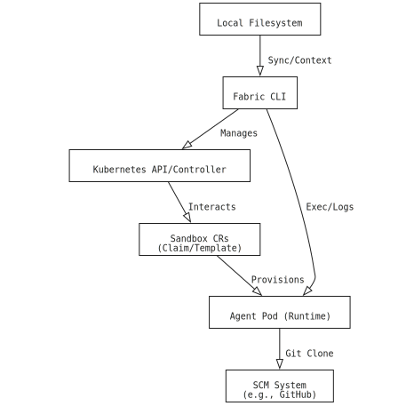

The Fabric platform integrates with Kubernetes to provide a scalable, isolated, and manageable runtime environment for [`fabric-agent`](https://github.com/pdlc-os/fabric/blob/b11448f8f01fdcf12deab96204417d87f8d46ab3/cmd/common.go#L525) instances. This integration allows agents to run as Kubernetes Pods, leveraging the cluster's resource management and orchestration capabilities while maintaining a developer experience consistent with local Docker environments.

The design for Kubernetes integration has evolved, moving from direct Pod management towards a more abstracted approach using custom resources. Initially, the system directly managed Kubernetes Pods, enabling immediate support for custom images, environment variables, and command propagation without relying on external Custom Resource Definitions (CRDs). This allowed the [`KubernetesRuntime`](https://github.com/pdlc-os/fabric/blob/b11448f8f01fdcf12deab96204417d87f8d46ab3/pkg/runtime/k8s_runtime.go#L49) to directly create and manage [`corev1.Pod`](https://github.com/pdlc-os/fabric/blob/b11448f8f01fdcf12deab96204417d87f8d46ab3/pkg/runtime/k8s_runtime.go#L429) objects.

A significant architectural shift involves the adoption of the [`agent-sandbox`](https://github.com/pdlc-os/fabric/blob/b11448f8f01fdcf12deab96204417d87f8d46ab3/hack/temp-cluster-walkthrough.md?plain=1#L3) standard, which utilizes [`SandboxClaim`](https://github.com/pdlc-os/fabric/blob/b11448f8f01fdcf12deab96204417d87f8d46ab3/pkg/k8s/api/v1alpha1/types.go#L153) and [`SandboxTemplate`](https://github.com/pdlc-os/fabric/blob/b11448f8f01fdcf12deab96204417d87f8d46ab3/pkg/k8s/api/v1alpha1/types.go#L122) custom resources for agent management. This approach provides improved isolation, lifecycle management, and policy enforcement across a fleet of agents, decoupling the [`fabric`](https://github.com/pdlc-os/fabric/blob/b11448f8f01fdcf12deab96204417d87f8d46ab3/README.md?plain=1#L1) CLI from low-level Pod details. The CLI interacts with high-level [`SandboxClaim`](https://github.com/pdlc-os/fabric/blob/b11448f8f01fdcf12deab96204417d87f8d46ab3/pkg/k8s/api/v1alpha1/types.go#L153) objects, and a [`Sandbox Controller`](https://github.com/pdlc-os/fabric/blob/b11448f8f01fdcf12deab96204417d87f8d46ab3/hack/temp-cluster-walkthrough.md?plain=1#L20) reconciles these claims to create the actual [`Sandbox`](https://github.com/pdlc-os/fabric/blob/b11448f8f01fdcf12deab96204417d87f8d46ab3/pkg/k8s/api/v1alpha1/types.go#L89) CRs, which in turn provision the agent Pods and Services.

Context synchronization is a critical aspect of this integration, bridging local development environments with remote Kubernetes Pods. This is achieved through a "snapshot" mechanism where the local project directory is archived ([`tar`](https://github.com/pdlc-os/fabric/blob/b11448f8f01fdcf12deab96204417d87f8d46ab3/pkg/config/templates.go#L305)) and streamed to the Pod's [`/workspace`](https://github.com/pdlc-os/fabric/blob/b11448f8f01fdcf12deab96204417d87f8d46ab3/agents.md?plain=1#L39) directory upon startup. For interactive development, [`fabric sync <agent-name>`](https://github.com/pdlc-os/fabric/blob/b11448f8f01fdcf12deab96204417d87f8d46ab3/cmd/sync.go#L92) provides explicit bidirectional file transfer, with [`Mutagen`](https://github.com/pdlc-os/fabric/blob/b11448f8f01fdcf12deab96204417d87f8d46ab3/changelog/2026-03-08-changelog.md?plain=1#L6)-based live synchronization enabling real-time updates between local and remote environments.

SCM integration, specifically for Git repositories, addresses the challenge of providing source code to remote Pods where local Git worktrees are impractical. The design incorporates an [`Init Container`](https://github.com/pdlc-os/fabric/blob/b11448f8f01fdcf12deab96204417d87f8d46ab3/README.md?plain=1#L44) that performs a [`git clone`](https://github.com/pdlc-os/fabric/blob/b11448f8f01fdcf12deab96204417d87f8d46ab3/go.mod#L1) into an [`emptyDir`](https://github.com/pdlc-os/fabric/blob/b11448f8f01fdcf12deab96204417d87f8d46ab3/pkg/hub/template_bootstrap_test.go#L891) volume within the Pod before the main agent container starts. This process handles repository URL resolution and various authentication strategies, including GitHub Apps, Personal Access Tokens, and GCP Secret Manager.

The integration has followed a phased roadmap towards production hardening, focusing on feature parity, correctness, and operational maturity. This includes enhancements in configuration handling, authentication and environment variable propagation, and robust error handling. Future considerations for production readiness include refined secret management, status reconciliation, automatic cleanup of Kubernetes resources, and the application of [`SecurityContext`](https://github.com/pdlc-os/fabric/blob/b11448f8f01fdcf12deab96204417d87f8d46ab3/pkg/runtime/k8s_runtime.go#L1216) settings and resource requests/limits for enhanced security and resource optimization.

Project-specific Kubernetes settings, such as [`context`](https://github.com/pdlc-os/fabric/blob/b11448f8f01fdcf12deab96204417d87f8d46ab3/pkg/api/types.go#L315), [`namespace`](https://github.com/pdlc-os/fabric/blob/b11448f8f01fdcf12deab96204417d87f8d46ab3/pkg/api/types.go#L200), [`runtimeClassName`](https://github.com/pdlc-os/fabric/blob/b11448f8f01fdcf12deab96204417d87f8d46ab3/pkg/api/types.go#L317), and resource allocations, can be defined in a [`kubernetes-config.json`](https://github.com/pdlc-os/fabric/blob/b11448f8f01fdcf12deab96204417d87f8d46ab3/pkg/config/paths.go#L204) file. This allows for flexible configuration tailored to specific projects, leveraging the user's standard KubeConfig for authentication within the cluster.

### OpenTelemetry (OTel) Design for Observability

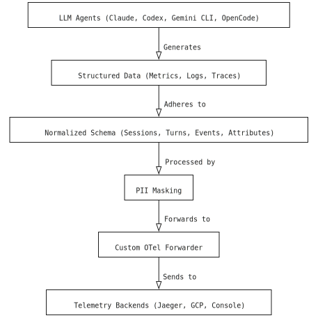

OpenTelemetry (OTel) within the Fabric project provides a standardized approach to collecting and managing metrics, logs, and trace data across various Large Language Model (LLM) agents. This standardization supports consistent monitoring and analytics for different agent implementations, such as Claude Code, Codex, Gemini CLI, and OpenCode. The foundational designs for this observability architecture are detailed in [`.design/metrics`](https://github.com/pdlc-os/fabric/blob/b11448f8f01fdcf12deab96204417d87f8d46ab3/.design/metrics).

A core principle of the OTel design involves organizing data into a logical hierarchy: Session, Turn, and Event, as described in [`.design/metrics/metrics-data-findings.md`](https://github.com/pdlc-os/fabric/blob/b11448f8f01fdcf12deab96204417d87f8d46ab3/.design/metrics/metrics-data-findings.md). A Session represents a long-lived interaction, such as a CLI execution or a persistent chat thread. A Turn encompasses a single round-trip, including user input, LLM processing, tool execution, and the final response. An Event captures discrete occurrences within a turn, like tool calls, API errors, or token count updates. This hierarchy accommodates both OTel-native instrumentation and JSON-log-based systems.

All OTel data is enriched with normalized metadata, referred to as Resource Attributes, to facilitate data slicing and analysis. These attributes include [`service.name`](https://github.com/pdlc-os/fabric/blob/b11448f8f01fdcf12deab96204417d87f8d46ab3/pkg/config/schemas/settings-v1.schema.json#L889) (identifying the service), [`session.id`](https://github.com/pdlc-os/fabric/blob/b11448f8f01fdcf12deab96204417d87f8d46ab3/examples/adk_fabric_agent/run.py#L74) (a unique UUID for the conversation), [`user.id`](https://github.com/pdlc-os/fabric/blob/b11448f8f01fdcf12deab96204417d87f8d46ab3/pkg/hub/web.go#L1387) (an anonymized user identifier), [`project.id`](https://github.com/pdlc-os/fabric/blob/b11448f8f01fdcf12deab96204417d87f8d46ab3/cmd/hub.go#L1288) (a hash or name of the repository/workspace), and [`version`](https://github.com/pdlc-os/fabric/blob/b11448f8f01fdcf12deab96204417d87f8d46ab3/cmd/hub.go#L2630) (the agent software version).

Normalized metrics, adhering to OpenTelemetry semantic conventions for Generative AI, are captured to provide insights into usage, cost, performance, and reliability. These include counters for input, output, and cached tokens ([`gen_ai.tokens.input`](https://github.com/pdlc-os/fabric/blob/b11448f8f01fdcf12deab96204417d87f8d46ab3/pkg/hub/metrics_dashboard.go#L207), [`gen_ai.tokens.output`](https://github.com/pdlc-os/fabric/blob/b11448f8f01fdcf12deab96204417d87f8d46ab3/pkg/hub/metrics_dashboard.go#L211), [`gen_ai.tokens.cached`](https://github.com/pdlc-os/fabric/blob/b11448f8f01fdcf12deab96204417d87f8d46ab3/pkg/fabrictool/hooks/handlers/telemetry.go#L126)). Performance and latency are measured with `gen_ai.latency.ttft` (Time to First Token) and `gen_ai.latency.total` (Total duration), while reliability is tracked by `gen_ai.error.count` for API failures.

Normalized logs, structured for debugging and auditing, capture specific events throughout an agent's operation. Examples include [`agent.session.start`](https://github.com/pdlc-os/fabric/blob/b11448f8f01fdcf12deab96204417d87f8d46ab3/pkg/fabrictool/hooks/handlers/telemetry.go#L28) (emitted on chat initiation), [`agent.user.prompt`](https://github.com/pdlc-os/fabric/blob/b11448f8f01fdcf12deab96204417d87f8d46ab3/harnesses/codex/provision.py#L193) (user input, with content redacted), [`agent.tool.call`](https://github.com/pdlc-os/fabric/blob/b11448f8f01fdcf12deab96204417d87f8d46ab3/extras/agent-viz/scripts/inspect_logs.py#L100) (details of tool invocation), and [`agent.tool.output`](https://github.com/pdlc-os/fabric/blob/b11448f8f01fdcf12deab96204417d87f8d46ab3/pkg/config/templates_test.go#L1360) (results of tool execution). The Claude Code OTel design, outlined in [`.design/metrics/claude-otel.md`](https://github.com/pdlc-os/fabric/blob/b11448f8f01fdcf12deab96204417d87f8d46ab3/.design/metrics/claude-otel.md), specifies log events such as [`agent.user.prompt`](https://github.com/pdlc-os/fabric/blob/b11448f8f01fdcf12deab96204417d87f8d46ab3/harnesses/codex/provision.py#L193), [`agent.tool.call`](https://github.com/pdlc-os/fabric/blob/b11448f8f01fdcf12deab96204417d87f8d46ab3/extras/agent-viz/scripts/inspect_logs.py#L100), and [`gen_ai.api.request`](https://github.com/pdlc-os/fabric/blob/b11448f8f01fdcf12deab96204417d87f8d46ab3/pkg/fabrictool/hooks/handlers/telemetry.go#L33). Similarly, the Codex OTel documentation in [`.design/metrics/codex-otel.md`](https://github.com/pdlc-os/fabric/blob/b11448f8f01fdcf12deab96204417d87f8d46ab3/.design/metrics/codex-otel.md) details events like `codex.sse_event` (reporting events from the AI stream) and `codex.user_prompt`.

Configuration options are available for filtering, sampling, and forwarding this data to various telemetry backends. For instance, the Codex advanced configuration described in [`.design/metrics/codex-config.md`](https://github.com/pdlc-os/fabric/blob/b11448f8f01fdcf12deab96204417d87f8d46ab3/.design/metrics/codex-config.md) enables OpenTelemetry log export and metrics, allowing control over the exporter type and event recording. The Gemini CLI utilizes a custom OTel forwarder, detailed in [`.design/metrics/gemini-custom-otel-forwarder.md`](https://github.com/pdlc-os/fabric/blob/b11448f8f01fdcf12deab96204417d87f8d46ab3/.design/metrics/gemini-custom-otel-forwarder.md), which acts as a middleware to filter and transform observability data. This forwarder ensures that [`session.id`](https://github.com/pdlc-os/fabric/blob/b11448f8f01fdcf12deab96204417d87f8d46ab3/examples/adk_fabric_agent/run.py#L74) is preserved for correlation. PII masking is a critical aspect, with a mandate for collectors or forwarders to redact or hash sensitive information like user prompts unless explicitly opted in, as highlighted in [`.design/metrics/metrics-data-findings.md`](https://github.com/pdlc-os/fabric/blob/b11448f8f01fdcf12deab96204417d87f8d46ab3/.design/metrics/metrics-data-findings.md).

For the Gemini CLI, the core logic for extracting and aggregating usage metrics from session data is explained in [`.design/metrics/gcli-session-core-logic.md`](https://github.com/pdlc-os/fabric/blob/b11448f8f01fdcf12deab96204417d87f8d46ab3/.design/metrics/gcli-session-core-logic.md). This involves discovering session data files, merging and deduplicating entries, and calculating various statistics such as total sessions, message counts, token usage, model usage, and estimating costs.

The OpenCode ecosystem also catalogs its telemetry data, including LLM and agent telemetry (OpenTelemetry), infrastructure observability, CLI event streams (structured JSON), and internal business events. As described in [`.design/metrics/opencode-otel.md`](https://github.com/pdlc-os/fabric/blob/b11448f8f01fdcf12deab96204417d87f8d46ab3/.design/metrics/opencode-otel.md), it leverages the Vercel AI SDK's experimental OpenTelemetry features and supports integration points like OTLP receivers, log tail consumers, and a plugin system for capturing and forwarding events.

### GitHub App Integration and Security Management

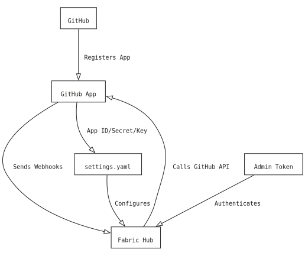

The Fabric platform integrates with GitHub via a GitHub App to enable seamless interaction with repositories for tasks such as content management and pull request handling. This integration requires a structured setup, careful configuration, and robust procedures for credential rotation to ensure security and operational continuity.

The core of the integration involves registering a GitHub App and configuring it within a Fabric Hub instance, as documented in [`.design/docs/github-app-setup.md`](https://github.com/pdlc-os/fabric/blob/b11448f8f01fdcf12deab96204417d87f8d46ab3/.design/docs/github-app-setup.md). This process includes defining the App's permissions (e.g., [`Contents`](https://github.com/pdlc-os/fabric/blob/b11448f8f01fdcf12deab96204417d87f8d46ab3/pkg/store/models.go#L1894), [`Metadata`](https://github.com/pdlc-os/fabric/blob/b11448f8f01fdcf12deab96204417d87f8d46ab3/pkg/store/store.go#L217), [`Pull requests`](https://github.com/pdlc-os/fabric/blob/b11448f8f01fdcf12deab96204417d87f8d46ab3/pkg/store/models.go#L659)) and subscribing to relevant events ([`Installation`](https://github.com/pdlc-os/fabric/blob/b11448f8f01fdcf12deab96204417d87f8d46ab3/pkg/hub/githubapp/githubapp.go#L478), [`Installation repositories`](https://github.com/pdlc-os/fabric/blob/b11448f8f01fdcf12deab96204417d87f8d46ab3/pkg/hub/githubapp/githubapp.go#L478)). A private key is generated for secure authentication, and a webhook secret is established to validate incoming events from GitHub. The Fabric Hub's configuration ([`settings.yaml`](https://github.com/pdlc-os/fabric/blob/b11448f8f01fdcf12deab96204417d87f8d46ab3/README.md?plain=1#L58)) must be updated with the App's [`app_id`](https://github.com/pdlc-os/fabric/blob/b11448f8f01fdcf12deab96204417d87f8d46ab3/pkg/ent/mutation.go#L10813), [`private_key_path`](https://github.com/pdlc-os/fabric/blob/b11448f8f01fdcf12deab96204417d87f8d46ab3/pkg/config/settings_v1.go#L301), and [`webhook_secret`](https://github.com/pdlc-os/fabric/blob/b11448f8f01fdcf12deab96204417d87f8d46ab3/pkg/config/settings_v1.go#L303). Once configured, the GitHub App is installed on a GitHub organization or user account, allowing the Hub to auto-match groves (groups of agents) by Git remote URL.

A critical aspect of maintaining security and operational continuity is the secure rotation of GitHub App credentials, detailed in [`.design/docs/github-app-rotation.md`](https://github.com/pdlc-os/fabric/blob/b11448f8f01fdcf12deab96204417d87f8d46ab3/.design/docs/github-app-rotation.md). The rotation process for the private key is designed to be zero-downtime, leveraging GitHub's support for multiple active private keys. This allows for a graceful transition where a new key is generated, stored, and configured in the Fabric Hub, with verification before the old key is decommissioned. In contrast, webhook secret rotation involves a brief impact window, as GitHub does not support multiple active webhook secrets. The procedure requires updating the secret on GitHub and then immediately updating the Fabric Hub's configuration. To minimize disruption, it is recommended to perform this during low-activity periods and restart the Hub promptly.

Webhook troubleshooting is also a key consideration, especially if the Fabric Hub is not publicly reachable or if events are not being processed correctly. The documentation provides guidance on diagnosing issues, including checking Hub reachability, firewall rules, and the consistency of the webhook secret. If webhooks are not enabled, the Hub can rely on periodic health checks and token minting time checks to detect changes, with manual discovery options available.

### Investigations and Post-Mortems

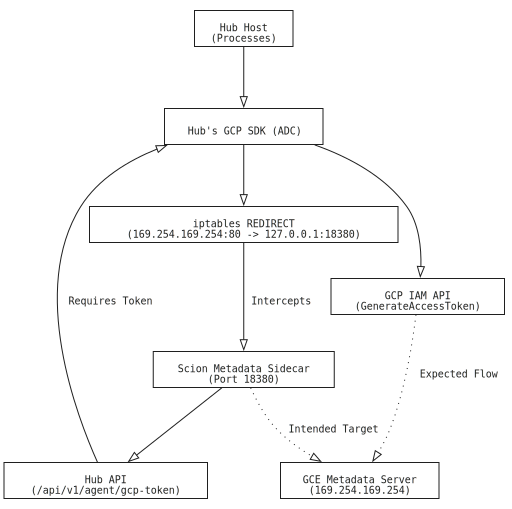

This section compiles analyses of critical system issues, offering insights into their root causes and proposed resolutions. A notable post-mortem details a metadata server 502 error, which surfaced as intermittent failures when fetching Google Cloud authentication tokens. Investigations revealed two primary contributing factors: CPU throttling affecting sidecar containers in applications and [`iptables`](https://github.com/pdlc-os/fabric/blob/b11448f8f01fdcf12deab96204417d87f8d46ab3/pkg/agent/run.go#L1286) rule interference.

The [`iptables`](https://github.com/pdlc-os/fabric/blob/b11448f8f01fdcf12deab96204417d87f8d46ab3/pkg/agent/run.go#L1286) issue specifically created a circular dependency. An [`iptables`](https://github.com/pdlc-os/fabric/blob/b11448f8f01fdcf12deab96204417d87f8d46ab3/pkg/agent/run.go#L1286) rule, implemented by [`setupIPTablesRedirect`](https://github.com/pdlc-os/fabric/blob/b11448f8f01fdcf12deab96204417d87f8d46ab3/pkg/fabrictool/metadata/iptables.go#L31) in [`pkg/fabrictool/metadata/iptables.go`](https://github.com/pdlc-os/fabric/blob/b11448f8f01fdcf12deab96204417d87f8d46ab3/pkg/fabrictool/metadata/iptables.go), redirected all outgoing traffic destined for the Google Cloud metadata server ([`169.254.169.254`](https://github.com/pdlc-os/fabric/blob/b11448f8f01fdcf12deab96204417d87f8d46ab3/pkg/fabrictool/hub/oidc.go#L224)) to a local [`fabric`](https://github.com/pdlc-os/fabric/blob/b11448f8f01fdcf12deab96204417d87f8d46ab3/README.md?plain=1#L1) metadata sidecar. This interception, however, unintentionally captured the Hub's own Google Cloud SDK credential requests, leading to a loop where the Hub tried to reach the metadata server, was redirected to the sidecar, which then called back to the Hub, attempting to use credentials that were themselves stuck in the redirection loop. This problem was particularly insidious because it manifested only after cached Google Cloud access tokens expired, typically an hour after initial setup.

Another identified issue was a "thundering herd" problem in token caching. The metadata sidecar, specifically [`pkg/fabrictool/metadata/server.go`](https://github.com/pdlc-os/fabric/blob/b11448f8f01fdcf12deab96204417d87f8d46ab3/pkg/fabrictool/metadata/server.go), lacked a mechanism to consolidate multiple concurrent token refresh requests. When a cached token expired, numerous requests would independently attempt to fetch a new token, potentially overwhelming the Google Cloud IAM API despite existing rate limiters.

To address these issues, solutions included modifying the system to skip [`iptables`](https://github.com/pdlc-os/fabric/blob/b11448f8f01fdcf12deab96204417d87f8d46ab3/pkg/agent/run.go#L1286) metadata interception when operating in host network mode and implementing a singleflight mechanism within [`pkg/fabrictool/metadata/server.go`](https://github.com/pdlc-os/fabric/blob/b11448f8f01fdcf12deab96204417d87f8d46ab3/pkg/fabrictool/metadata/server.go) to ensure that concurrent token fetches coalesce into a single upstream call. The post-mortem also led to further code fixes, such as shortening sidecar timeouts, introducing a Hub-side token cache, and rectifying a goroutine leak in the rate limiter, as detailed in [`.design/post-mortems/2026-05-01-metadata-server-502.md`](https://github.com/pdlc-os/fabric/blob/b11448f8f01fdcf12deab96204417d87f8d46ab3/.design/post-mortems/2026-05-01-metadata-server-502.md). These investigations highlight the importance of understanding network namespace sharing, robust error reporting, and carefully designed defense-in-depth mechanisms for system stability.

## Developer Utilities and Local Development

| Script | Location | Purpose |
| --- | --- | --- |
| `setup.sh` | `hack/` | Sets up an isolated test environment, builds the `fabric` binary, and initializes a test grove. |
| `cleanup.sh` | `hack/` | Cleans up test artifacts, including stopping and removing agents and specific `.fabric` directories. |
| `smoke_test.sh` | `hack/` | Builds the `fabric` binary and runs basic functionality smoke tests (`--help`). |
| `test_auth.sh` / `test_oauth.sh` | `hack/` | Test authentication flows, including environment variables, `--no-auth` flag, and OAuth discovery. |
| `create-cluster.sh` | `hack/` | Creates a GKE Autopilot cluster and configures `kubectl` for interaction. |
| `version.sh` | `hack/` | Displays version information by extracting Git commit hash and build time for Go `ldflags`. |
| `merge-work.sh` | `hack/` | Merges an agent's branch onto main, with retries and rebase requests upon divergence. |
| `pr-deps.sh` | `scripts/` | Analyzes open PRs for dependency graphs, topological merge order, and file overlaps. |
| `hub-env-integration-test.sh` | `scripts/` | Tests CRUD operations for environment variables at user and grove scopes via Hub API. |
| `hub-secret-integration-test.sh` | `scripts/` | Tests CRUD operations for secrets at user and grove scopes, supporting various secret types. |
| `template-integration-test.sh` | `scripts/` | Comprehensive test suite for template management, including Hub API, upload/download flows, and runtime integration. |
| `dist.sh` | `hack/` | Builds and distributes the `fabric` CLI binary across platforms to a GCS bucket. |
| `install.sh` | `hack/` | End-user script to install the `fabric` CLI client from a GCS distribution bucket. |
| `gce-demo-*` scripts | `scripts/starter-hub/` | A suite of scripts for provisioning, deploying, and managing a Fabric Hub on a Google Compute Engine VM. |

The Fabric project provides a suite of developer utilities and scripts to streamline local development, testing, and infrastructure provisioning. These tools facilitate the setup of isolated environments, manage authentication flows, orchestrate Kubernetes clusters, and perform API-level integration and stress testing. They also include functionalities for code quality checks and the management of various project aspects like PR dependencies, templates, environment variables, secrets, and Cloud Run deployments.

The [`hack`](https://github.com/pdlc-os/fabric/blob/b11448f8f01fdcf12deab96204417d87f8d46ab3/hack) directory contains a collection of scripts and Go utilities that support development and operations rather than end-user tooling. Scripts like [`setup.sh`](https://github.com/pdlc-os/fabric/blob/b11448f8f01fdcf12deab96204417d87f8d46ab3/hack/setup.sh#L18) prepare an isolated test environment by building the [`fabric`](https://github.com/pdlc-os/fabric/blob/b11448f8f01fdcf12deab96204417d87f8d46ab3/README.md?plain=1#L1) CLI and initializing a [`grove`](https://github.com/pdlc-os/fabric/blob/b11448f8f01fdcf12deab96204417d87f8d46ab3/Makefile#L72), while [`cleanup.sh`](https://github.com/pdlc-os/fabric/blob/b11448f8f01fdcf12deab96204417d87f8d46ab3/hack/README.md?plain=1#L12) removes agents and configurations to ensure a clean state, particularly for testing. Authentication mechanisms are tested through [`test_auth.sh`](https://github.com/pdlc-os/fabric/blob/b11448f8f01fdcf12deab96204417d87f8d46ab3/hack/README.md?plain=1#L14) and [`test_oauth.sh`](https://github.com/pdlc-os/fabric/blob/b11448f8f01fdcf12deab96204417d87f8d46ab3/hack/README.md?plain=1#L14), which validate API key propagation and OAuth flows.

The [`hack/apitest`](https://github.com/pdlc-os/fabric/blob/b11448f8f01fdcf12deab96204417d87f8d46ab3/hack/apitest) Go application is designed to validate the robustness and performance of Fabric hubs through API-level integration and stress testing, focusing on connection pooling, keepalive mechanisms, and multi-replica behavior under various load conditions. It performs phases like "Concurrent CRUD Storm" to simulate heavy load, "Cross-Replica Read-After-Write" to check replication consistency, "Concurrent Duplicate-ID Create" to test conflict resolution, and "Idle-then-Burst" to assess stale connection handling. Similarly, the [`hack/dbdiag`](https://github.com/pdlc-os/fabric/blob/b11448f8f01fdcf12deab96204417d87f8d46ab3/hack/dbdiag) Go program diagnoses PostgreSQL database pool saturation by reporting CloudSQL connection and advisory lock usage. For local API integration testing, [`hack/minttoken`](https://github.com/pdlc-os/fabric/blob/b11448f8f01fdcf12deab96204417d87f8d46ab3/hack/minttoken) provides a utility to mint long-lived user access-token JWTs.

Kubernetes integration is facilitated by scripts like [`create-cluster.sh`](https://github.com/pdlc-os/fabric/blob/b11448f8f01fdcf12deab96204417d87f8d46ab3/hack/README.md?plain=1#L17), which automates the creation of a GKE Autopilot cluster and configures [`kubectl`](https://github.com/pdlc-os/fabric/blob/b11448f8f01fdcf12deab96204417d87f8d46ab3/hack/k8s-nfs/README.md?plain=1#L18). The [`hack/k8s-nfs`](https://github.com/pdlc-os/fabric/blob/b11448f8f01fdcf12deab96204417d87f8d46ab3/hack/k8s-nfs) directory contains Kubernetes manifests specifically for testing NFS-based shared workspace coordination in GKE. Code quality is maintained by scripts such as [`check-project-compat-literals.sh`](https://github.com/pdlc-os/fabric/blob/b11448f8f01fdcf12deab96204417d87f8d46ab3/Makefile#L74), which identifies and flags legacy "grove" terminology in Go source files, ensuring consistency with updated vocabulary.

The [`scripts`](https://github.com/pdlc-os/fabric/blob/b11448f8f01fdcf12deab96204417d87f8d46ab3/scripts) directory extends these capabilities with additional integration tests and developer utilities. For example, [`pr-deps.sh`](https://github.com/pdlc-os/fabric/blob/b11448f8f01fdcf12deab96204417d87f8d46ab3/scripts/README.md?plain=1#L7) analyzes dependencies within GitHub pull requests, providing topological merge order and detecting file overlaps. Diagnostic tools like [`scripts/vm-pulse.sh`](https://github.com/pdlc-os/fabric/blob/b11448f8f01fdcf12deab96204417d87f8d46ab3/scripts/vm-pulse.sh) offer a "pulse check" for virtual machines, gathering performance metrics. Integration tests like [`scripts/checktemplate-2.sh`](https://github.com/pdlc-os/fabric/blob/b11448f8f01fdcf12deab96204417d87f8d46ab3/scripts/checktemplate-2.sh), [`scripts/hub-env-integration-test.sh`](https://github.com/pdlc-os/fabric/blob/b11448f8f01fdcf12deab96204417d87f8d46ab3/scripts/hub-env-integration-test.sh), [`scripts/hub-secret-integration-test.sh`](https://github.com/pdlc-os/fabric/blob/b11448f8f01fdcf12deab96204417d87f8d46ab3/scripts/hub-secret-integration-test.sh), and [`scripts/template-integration-test.sh`](https://github.com/pdlc-os/fabric/blob/b11448f8f01fdcf12deab96204417d87f8d46ab3/scripts/template-integration-test.sh) validate template management, Hub environment variables, secret storage, and the hosted template system, respectively. For deployment, the [`scripts/cloudrun`](https://github.com/pdlc-os/fabric/blob/b11448f8f01fdcf12deab96204417d87f8d46ab3/scripts/cloudrun) subdirectory manages the deployment of a scalable Fabric Hub/Web service and co-located Runtime Broker on Google Cloud Run, leveraging Cloud SQL, GCS, and Secret Manager. The [`scripts/starter-hub`](https://github.com/pdlc-os/fabric/blob/b11448f8f01fdcf12deab96204417d87f8d46ab3/scripts/starter-hub) subdirectory provides scripts for deploying and managing a Fabric Hub on Google Cloud Engine, encompassing initial provisioning, configuration, and certificate management.

### API Integration and Stress Testing

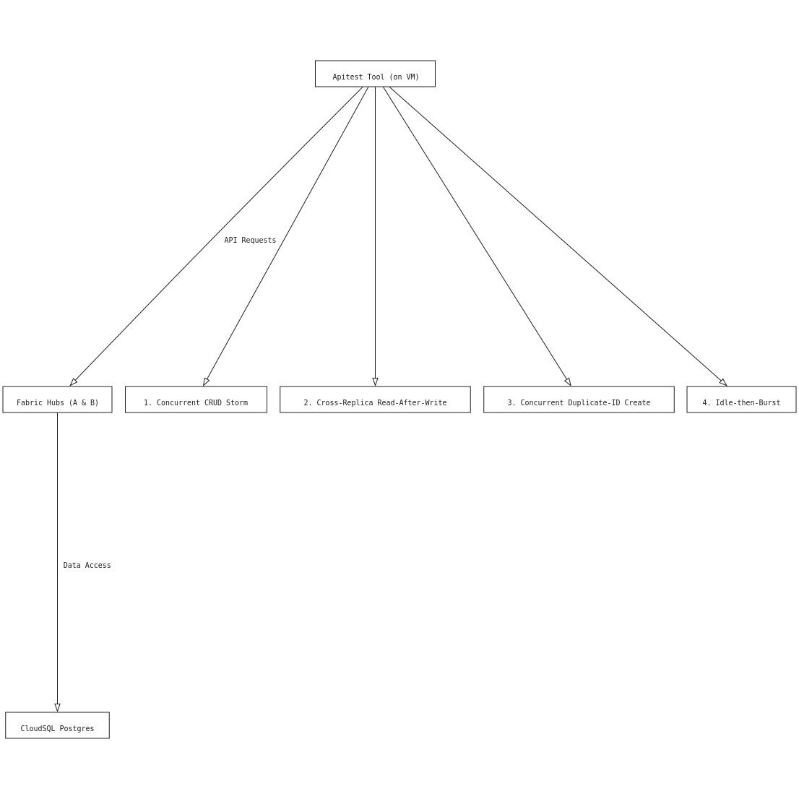

The [`apitest`](https://github.com/pdlc-os/fabric/blob/b11448f8f01fdcf12deab96204417d87f8d46ab3/hack/README.md?plain=1#L25) Go application, found in [`hack/apitest`](https://github.com/pdlc-os/fabric/blob/b11448f8f01fdcf12deab96204417d87f8d46ab3/hack/apitest), is a tool for evaluating the performance and resilience of Fabric Hub deployments. It focuses on validating network behavior such as connection pooling, keepalive mechanisms, and data replication under various load conditions, particularly when two Fabric hubs share a common PostgreSQL database instance. The tool is designed to be deployed on a VM geographically proximate to the hubs to ensure testing accuracy reflective of internal network latencies.

The testing methodology employs four distinct phases:

- **Concurrent CRUD Storm**: This phase simulates high concurrency by performing create, read, and delete operations on projects across both hubs simultaneously. It quantifies latency, success rates, and instances of significant operational delays.
- **Cross-Replica Read-After-Write**: This phase assesses the speed and consistency of data replication. Projects are created on one hub, and immediate read attempts are made from the other, differentiating between instant, delayed, and missed data visibility.
- **Concurrent Duplicate-ID Create**: This phase tests the API's conflict resolution capabilities by attempting to create projects with identical explicit IDs across multiple workers and hubs concurrently. The expected outcome is a single successful creation and subsequent conflict errors for duplicate attempts.
- **Idle-then-Burst**: This phase investigates how the system handles stale network connections. It initializes connection pools, then introduces an idle period before executing a burst of requests to determine if connections are appropriately managed or if performance stalls occur.

The application leverages Go's concurrency primitives, such as goroutines and [`sync.WaitGroup`](https://github.com/pdlc-os/fabric/blob/b11448f8f01fdcf12deab96204417d87f8d46ab3/cmd/stop.go#L200), to simulate real-world, multi-user scenarios. Metrics are collected using [`atomic.AddInt64`](https://github.com/pdlc-os/fabric/blob/b11448f8f01fdcf12deab96204417d87f8d46ab3/hack/apitest/main.go#L92) for thread-safe counting and [`sync.Mutex`](https://github.com/pdlc-os/fabric/blob/b11448f8f01fdcf12deab96204417d87f8d46ab3/cmd/stop.go#L199) for protecting latency data. Configuration, including hub URLs and authentication tokens, is managed through environment variables, enhancing the tool's adaptability. Project uniqueness in tests is ensured by [`uuid.NewString`](https://github.com/pdlc-os/fabric/blob/b11448f8f01fdcf12deab96204417d87f8d46ab3/pkg/hub/server.go#L697), and [`http.Client`](https://github.com/pdlc-os/fabric/blob/b11448f8f01fdcf12deab96204417d87f8d46ab3/cmd/hub.go#L2645) timeouts prevent indefinite hangs during network operations. Detailed error reporting, including HTTP status codes and response bodies, is provided for any API failures.

### PostgreSQL Database Diagnostics

The [`dbdiag`](https://github.com/pdlc-os/fabric/blob/b11448f8f01fdcf12deab96204417d87f8d46ab3/hack/README.md?plain=1#L26) Go program, located in [`hack/dbdiag`](https://github.com/pdlc-os/fabric/blob/b11448f8f01fdcf12deab96204417d87f8d46ab3/hack/dbdiag), provides diagnostic information for PostgreSQL databases, specifically focusing on connection pool usage and advisory locks within CloudSQL environments. This tool helps identify and troubleshoot potential database saturation issues by reporting critical metrics.

It connects to a PostgreSQL database using connection string details from the [`PG_DSN`](https://github.com/pdlc-os/fabric/blob/b11448f8f01fdcf12deab96204417d87f8d46ab3/hack/dbdiag/main.go#L15) environment variable. The program then queries the database to retrieve the configured maximum connections and the number of currently active connections. It also offers a detailed breakdown of connection states, categorizing active connections by the application name and their current state. Furthermore, [`dbdiag`](https://github.com/pdlc-os/fabric/blob/b11448f8f01fdcf12deab96204417d87f8d46ab3/hack/README.md?plain=1#L26) reports the count of advisory locks currently held within the database. The [`main.go`](https://github.com/pdlc-os/fabric/blob/b11448f8f01fdcf12deab96204417d87f8d46ab3/docs/design/broker-fanout.md?plain=1#L437) file orchestrates these queries and presents the gathered statistics.

### Kubernetes NFS Shared Workspace Testing

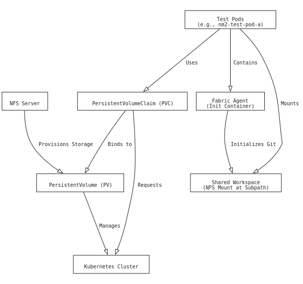

The [`hack/k8s-nfs`](https://github.com/pdlc-os/fabric/blob/b11448f8f01fdcf12deab96204417d87f8d46ab3/hack/k8s-nfs) directory provides Kubernetes manifests for testing and validating Network File System (NFS)-based shared workspace coordination within Kubernetes environments, particularly Google Kubernetes Engine (GKE). These resources aid developers in testing how Fabric agents interact with shared storage.

The core of this testing setup is in configuring persistent storage. The manifest file [`hack/k8s-nfs/README.md`](https://github.com/pdlc-os/fabric/blob/b11448f8f01fdcf12deab96204417d87f8d46ab3/hack/k8s-nfs/README.md) details how [`PersistentVolume`](https://github.com/pdlc-os/fabric/blob/b11448f8f01fdcf12deab96204417d87f8d46ab3/hack/k8s-nfs/README.md?plain=1#L7) (PV) and [`PersistentVolumeClaim`](https://github.com/pdlc-os/fabric/blob/b11448f8f01fdcf12deab96204417d87f8d46ab3/hack/k8s-nfs/README.md?plain=1#L7) (PVC) are defined to connect to a shared NFS storage server. This ensures that agents can access a consistent and shared filesystem.

To validate different aspects of shared workspace behavior, various test scenarios are provided. For example, one scenario, described in [`hack/k8s-nfs/README.md`](https://github.com/pdlc-os/fabric/blob/b11448f8f01fdcf12deab96204417d87f8d46ab3/hack/k8s-nfs/README.md), involves a single pod mounting a PVC at a subpath. This pod provisions a Git workspace via an init container and verifies permissions and filesystem isolation, confirming an agent's ability to correctly set up its environment within a shared volume. More complex scenarios, also outlined in [`hack/k8s-nfs/README.md`](https://github.com/pdlc-os/fabric/blob/b11448f8f01fdcf12deab96204417d87f8d46ab3/hack/k8s-nfs/README.md), involve two concurrent pods sharing the same PVC but utilizing distinct subpaths. These tests validate parallel provisioning and runtime isolation, which is critical for orchestrating multiple agents. Additionally, an advanced multi-container pod template, further detailed in [`hack/k8s-nfs/README.md`](https://github.com/pdlc-os/fabric/blob/b11448f8f01fdcf12deab96204417d87f8d46ab3/hack/k8s-nfs/README.md), allows for verification of volume mounts, mount boundaries, and runtime execution behavior in intricate agent configurations. These tests collectively ensure the stability and proper functioning of Fabric agents when they interact with shared storage in a Kubernetes cluster.

### JWT Minting for Local API Testing

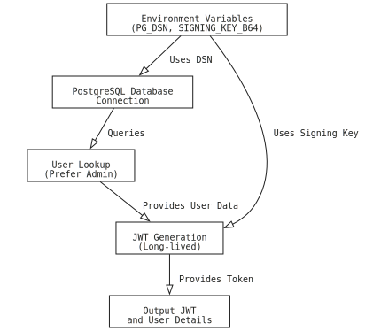

The [`minttoken`](https://github.com/pdlc-os/fabric/blob/b11448f8f01fdcf12deab96204417d87f8d46ab3/extras/fabric-chat-app/internal/identity/identity.go#L68) utility, located in the directory [`hack/minttoken`](https://github.com/pdlc-os/fabric/blob/b11448f8f01fdcf12deab96204417d87f8d46ab3/hack/minttoken), is a Go program designed for generating long-lived JSON Web Tokens (JWTs) specifically for local API integration testing. This tool enables developers to obtain valid access tokens without needing to go through a full authentication flow, facilitating testing of API endpoints that require user authentication.

The utility operates by connecting to a PostgreSQL database to retrieve an existing user. It prioritizes finding an 'admin' user for testing purposes; otherwise, it selects the oldest created user. Once a user is identified, [`minttoken`](https://github.com/pdlc-os/fabric/blob/b11448f8f01fdcf12deab96204417d87f8d46ab3/extras/fabric-chat-app/internal/identity/identity.go#L68) uses a configured signing key to generate a JWT for that user. This token is designed to have a long validity period (e.g., 30 days when using [`hub.ClientTypeCLI`](https://github.com/pdlc-os/fabric/blob/b11448f8f01fdcf12deab96204417d87f8d46ab3/hack/minttoken/main.go#L54)), which is beneficial for continuous integration and development environments where frequent token refreshes would be cumbersome. The generated JWT is then outputted for use in API requests, while user details are logged to standard error. The [`minttoken`](https://github.com/pdlc-os/fabric/blob/b11448f8f01fdcf12deab96204417d87f8d46ab3/extras/fabric-chat-app/internal/identity/identity.go#L68) utility is strictly for testing and development, and it is not integrated into the production system.

### Google Cloud Run Deployment and Management

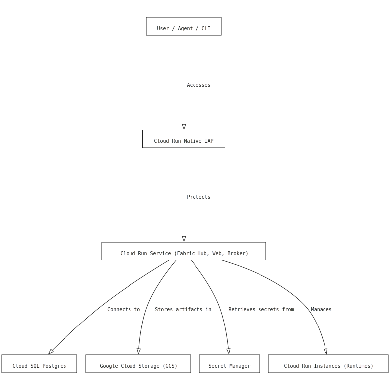

The Fabric project leverages Google Cloud Run for deploying a horizontally scalable Fabric Hub and Web service, along with a co-located stateless Runtime Broker. This setup integrates deeply with various Google Cloud services, including Cloud SQL for PostgreSQL for transactional data, Google Cloud Storage (GCS) for artifact storage, and Secret Manager for sensitive configuration data. To ensure secure access, the deployment utilizes Cloud Run's native Identity-Aware Proxy (IAP).

The deployment process is primarily orchestrated by the [`deploy.sh`](https://github.com/pdlc-os/fabric/blob/b11448f8f01fdcf12deab96204417d87f8d46ab3/docs-site/README.md?plain=1#L72) script located in [`scripts/cloudrun`](https://github.com/pdlc-os/fabric/blob/b11448f8f01fdcf12deab96204417d87f8d46ab3/scripts/cloudrun). This script automates a comprehensive set of tasks, from configuring Google Cloud IAM service accounts with appropriate roles to building and pushing the Fabric Hub container image to Artifact Registry. It manages sensitive information, such as database passwords and session secrets, by storing them securely in Secret Manager.

The [`deploy.sh`](https://github.com/pdlc-os/fabric/blob/b11448f8f01fdcf12deab96204417d87f8d46ab3/docs-site/README.md?plain=1#L72) script is designed to be idempotent, allowing it to be run multiple times without adverse effects. It dynamically renders a [`hub-settings-template.yaml`](https://github.com/pdlc-os/fabric/blob/b11448f8f01fdcf12deab96204417d87f8d46ab3/scripts/cloudrun/deploy.sh#L137) file, substituting placeholders with actual deployment values to configure the Hub service for production. It also handles the configuration of IAP for the deployed service, either using custom OAuth clients or Google-managed ones, and grants necessary permissions for secure access. A key design choice is the script's ability to discover the deployed service's public URL and update the application settings if it changes, ensuring continuous connectivity.

The core of the Fabric Hub Cloud Run container is defined by the [`Dockerfile`](https://github.com/pdlc-os/fabric/blob/b11448f8f01fdcf12deab96204417d87f8d46ab3/agents.md?plain=1#L138) in [`scripts/cloudrun`](https://github.com/pdlc-os/fabric/blob/b11448f8f01fdcf12deab96204417d87f8d46ab3/scripts/cloudrun). This multi-stage Dockerfile builds the web frontend, compiles the Go binary with embedded web assets, and creates a minimal Debian-based runtime environment. The [`entrypoint.sh`](https://github.com/pdlc-os/fabric/blob/b11448f8f01fdcf12deab96204417d87f8d46ab3/scripts/cloudrun/README.md?plain=1#L149) script, also in [`scripts/cloudrun`](https://github.com/pdlc-os/fabric/blob/b11448f8f01fdcf12deab96204417d87f8d46ab3/scripts/cloudrun), is executed when the container starts. It prepares the server environment by handling secret-mounted settings and then launches the [`fabric`](https://github.com/pdlc-os/fabric/blob/b11448f8f01fdcf12deab96204417d87f8d46ab3/README.md?plain=1#L1) server in foreground, production, hub, runtime broker, and web-enabled modes. This ensures the container functions as a complete Fabric Hub and Runtime Broker instance, ready to manage agents and their operations. For further details on the conceptual architecture, refer to [Hosted Mode Architecture and Client-Side Interaction](#design-specifications-and-architecture-hosted-mode-architecture-and-client-side-interaction).

### Google Cloud Engine Starter Hub Deployment

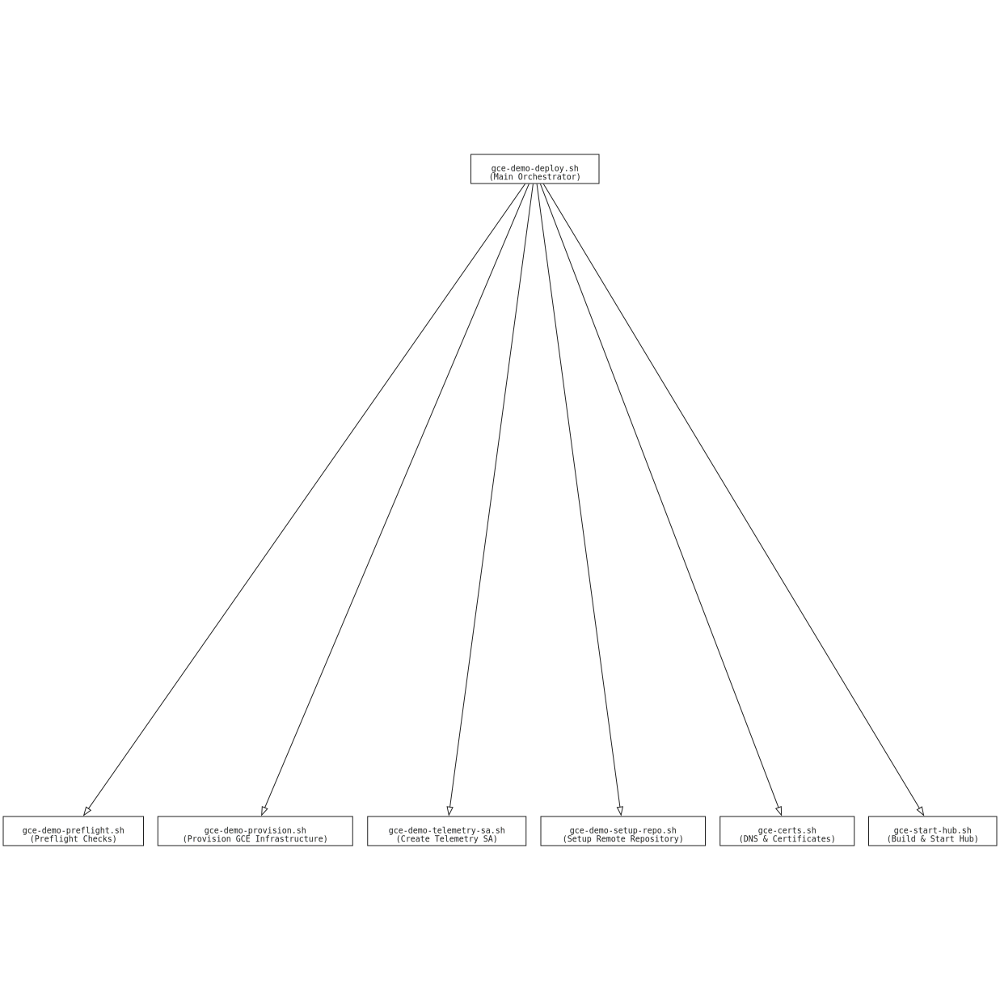

The process for deploying and managing a Fabric Hub on Google Cloud Engine (GCE) is outlined by a set of scripts located in the [`scripts/starter-hub`](https://github.com/pdlc-os/fabric/blob/b11448f8f01fdcf12deab96204417d87f8d46ab3/scripts/starter-hub) directory. These scripts manage initial provisioning, configuration, environment setup, SSL certificate management, code deployment, and teardown, and support both Docker-based deployments and optional Google Kubernetes Engine (GKE) deployments.

The deployment relies on a central configuration script, [`scripts/starter-hub/hub-config.sh`](https://github.com/pdlc-os/fabric/blob/b11448f8f01fdcf12deab96204417d87f8d46ab3/scripts/starter-hub/hub-config.sh), which defines variables like [`HUB_NAME`](https://github.com/pdlc-os/fabric/blob/b11448f8f01fdcf12deab96204417d87f8d46ab3/scripts/starter-hub/README.md?plain=1#L17) and [`BASE_DOMAIN`](https://github.com/pdlc-os/fabric/blob/b11448f8f01fdcf12deab96204417d87f8d46ab3/scripts/starter-hub/README.md?plain=1#L18), allowing for parameterized and repeatable deployments across different environments (e.g., staging, production). This script is sourced by all other scripts to ensure consistent settings.

The overall deployment is orchestrated by [`scripts/starter-hub/gce-demo-deploy.sh`](https://github.com/pdlc-os/fabric/blob/b11448f8f01fdcf12deab96204417d87f8d46ab3/scripts/starter-hub/gce-demo-deploy.sh), which executes a sequence of modular scripts. Before any resources are provisioned, [`scripts/starter-hub/gce-demo-preflight.sh`](https://github.com/pdlc-os/fabric/blob/b11448f8f01fdcf12deab96204417d87f8d46ab3/scripts/starter-hub/gce-demo-preflight.sh) performs comprehensive checks to validate the local development environment, [`gcloud`](https://github.com/pdlc-os/fabric/blob/b11448f8f01fdcf12deab96204417d87f8d46ab3/cmd/build.go#L170) authentication, environment file configuration, GCP APIs, IAM permissions, and DNS readiness. This preflight step consolidates warnings and errors to help streamline problem resolution.

Infrastructure provisioning, including the GCE virtual machine, associated service accounts, and firewall rules, is handled by [`scripts/starter-hub/gce-demo-provision.sh`](https://github.com/pdlc-os/fabric/blob/b11448f8f01fdcf12deab96204417d87f8d46ab3/scripts/starter-hub/gce-demo-provision.sh). This script can also optionally provision a GKE cluster using [`scripts/starter-hub/gce-demo-cluster.sh`](https://github.com/pdlc-os/fabric/blob/b11448f8f01fdcf12deab96204417d87f8d46ab3/scripts/starter-hub/gce-demo-cluster.sh) and a dedicated service account for telemetry data via [`scripts/starter-hub/gce-demo-telemetry-sa.sh`](https://github.com/pdlc-os/fabric/blob/b11448f8f01fdcf12deab96204417d87f8d46ab3/scripts/starter-hub/gce-demo-telemetry-sa.sh).

After the infrastructure is in place, [`scripts/starter-hub/gce-demo-setup-repo.sh`](https://github.com/pdlc-os/fabric/blob/b11448f8f01fdcf12deab96204417d87f8d46ab3/scripts/starter-hub/gce-demo-setup-repo.sh) prepares the GCE instance by setting up a dedicated [`fabric`](https://github.com/pdlc-os/fabric/blob/b11448f8f01fdcf12deab96204417d87f8d46ab3/README.md?plain=1#L1) user and cloning or updating the Fabric Git repository. Certificate management is then handled by [`scripts/starter-hub/gce-certs.sh`](https://github.com/pdlc-os/fabric/blob/b11448f8f01fdcf12deab96204417d87f8d46ab3/scripts/starter-hub/gce-certs.sh), which automates the setup of Cloud DNS and obtains Let's Encrypt wildcard certificates. Finally, [`scripts/starter-hub/gce-start-hub.sh`](https://github.com/pdlc-os/fabric/blob/b11448f8f01fdcf12deab96204417d87f8d46ab3/scripts/starter-hub/gce-start-hub.sh) deploys and manages the Fabric Hub application, including building binaries, uploading configurations, and managing the [`systemd`](https://github.com/pdlc-os/fabric/blob/b11448f8f01fdcf12deab96204417d87f8d46ab3/go.mod#L93) service and Caddy web server.

The scripts are designed to be largely idempotent, meaning they can be re-run without causing unintended side effects, and they emphasize modularity, allowing individual components of the deployment to be managed separately. For managing various Cloud Run deployments, see [Google Cloud Run Deployment and Management](#developer-utilities-and-local-development-google-cloud-run-deployment-and-management).

### PR Dependency Analysis and Merge Ordering

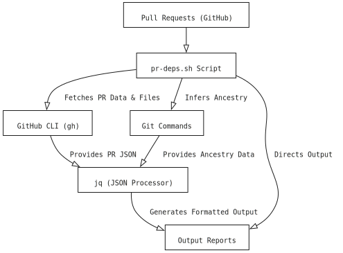

The [`pr-deps.sh`](https://github.com/pdlc-os/fabric/blob/b11448f8f01fdcf12deab96204417d87f8d46ab3/scripts/README.md?plain=1#L7) script, located at [`scripts/pr-deps.sh`](https://github.com/pdlc-os/fabric/blob/b11448f8f01fdcf12deab96204417d87f8d46ab3/scripts/pr-deps.sh), is a utility for analyzing dependencies within open GitHub pull requests. It provides functionalities for visualizing branch dependencies, determining a topological merge order, and detecting file overlaps to streamline development workflows.

The script identifies dependencies by performing ancestry checks between pull request branches using [`git`](https://github.com/pdlc-os/fabric/blob/b11448f8f01fdcf12deab96204417d87f8d46ab3/agents.md?plain=1#L102) commands, fetching remote [`refs/pull/<number>/head`](https://github.com/pdlc-os/fabric/blob/b11448f8f01fdcf12deab96204417d87f8d46ab3/scripts/pr-deps.sh#L179) to analyze local ancestry. After identifying all ancestry-based dependencies, it applies a transitive reduction to simplify the dependency graph, retaining only direct dependencies.

To determine a valid merge order, the [`cmd_order`](https://github.com/pdlc-os/fabric/blob/b11448f8f01fdcf12deab96204417d87f8d46ab3/scripts/pr-deps.sh#L368) function within [`pr-deps.sh`](https://github.com/pdlc-os/fabric/blob/b11448f8f01fdcf12deab96204417d87f8d46ab3/scripts/README.md?plain=1#L7) performs a topological sort on pull requests using [`jq`](https://github.com/pdlc-os/fabric/blob/b11448f8f01fdcf12deab96204417d87f8d46ab3/scripts/pr-deps.sh#L102). This process includes logic to detect and report cycles in the dependency graph, which can prevent a clear merge order.

For detecting file overlaps, the [`cmd_files`](https://github.com/pdlc-os/fabric/blob/b11448f8f01fdcf12deab96204417d87f8d46ab3/scripts/pr-deps.sh#L438) function fetches file lists for pull requests using the [`gh pr view`](https://github.com/pdlc-os/fabric/blob/b11448f8f01fdcf12deab96204417d87f8d46ab3/scripts/pr-deps.sh#L138) command and then utilizes [`jq`](https://github.com/pdlc-os/fabric/blob/b11448f8f01fdcf12deab96204417d87f8d46ab3/scripts/pr-deps.sh#L102) to identify and report any pairwise file overlaps. This helps prevent merge conflicts by highlighting potential areas of contention before merging.

The script offers options to visualize dependencies in Graphviz DOT format via [`cmd_graph_dot`](https://github.com/pdlc-os/fabric/blob/b11448f8f01fdcf12deab96204417d87f8d46ab3/scripts/pr-deps.sh#L349), which can aid in understanding complex relationships between pull requests. It leverages the GitHub CLI ([`gh`](https://github.com/pdlc-os/fabric/blob/b11448f8f01fdcf12deab96204417d87f8d46ab3/cmd/create.go#L147)) for API interaction and [`jq`](https://github.com/pdlc-os/fabric/blob/b11448f8f01fdcf12deab96204417d87f8d46ab3/scripts/pr-deps.sh#L102) for efficient JSON data manipulation, allowing for robust processing of pull request information.

### VM Pulse Health Diagnostics

The [`scripts/vm-pulse.sh`](https://github.com/pdlc-os/fabric/blob/b11448f8f01fdcf12deab96204417d87f8d46ab3/scripts/vm-pulse.sh) script serves as a diagnostic tool designed to provide a "pulse check" of a virtual machine's health and performance. It gathers various metrics to identify potential bottlenecks or issues affecting system resources, scheduler behavior, Docker container performance, and I/O latency.

The script's functionality is organized into four main diagnostic areas. It first provides an overview of **System Resources**, reporting host memory usage and, if available, CPU and memory Pressure Stall Information (PSI) metrics. This is followed by an analysis of **Scheduler & Thread Density**, which includes virtual memory statistics and counts of threads for critical processes like [`dockerd`](https://github.com/pdlc-os/fabric/blob/b11448f8f01fdcf12deab96204417d87f8d46ab3/scripts/vm-pulse.sh#L52) and [`containerd`](https://github.com/pdlc-os/fabric/blob/b11448f8f01fdcf12deab96204417d87f8d46ab3/scripts/vm-pulse.sh#L52). For environments utilizing Docker, the script identifies **Docker Top Offenders** by listing containers with high CPU consumption and checks for kernel-level cgroup throttling. Finally, it assesses **I/O & Latency** by providing extended I/O statistics and reporting on context-switching tasks, distinguishing between voluntary and involuntary switches.

A key design choice for the script is its use of the [`check_tool`](https://github.com/pdlc-os/fabric/blob/b11448f8f01fdcf12deab96204417d87f8d46ab3/scripts/vm-pulse.sh#L27) function, which verifies the availability of command-line utilities required for each diagnostic step. This ensures that the script can run gracefully, even if some tools are not installed, preventing errors and allowing partial execution. The script produces colorized output to enhance readability, using ANSI escape codes to emphasize headers and warnings.

## Issue and Pull Request Management

| Template Type | File Path | Purpose/Key Information Requested |
| --- | --- | --- |
| Pull Request | `.github/PULL_REQUEST_TEMPLATE.md` | Provides a checklist for PRs, ensuring tests pass and documentation is updated. |
| Bug Report | `.github/ISSUE_TEMPLATE/bug_report.md` | Collects detailed information about bugs, including steps to reproduce, expected/actual behavior, debug output, and environment details. |
| Feature Request | `.github/ISSUE_TEMPLATE/feature_request.md` | Solicits suggestions for new features or improvements, covering problem/motivation, proposed solution, and alternatives. |

The Fabric project utilizes GitHub issue and pull request templates to standardize contributions and streamline development workflows. These templates guide users through providing necessary information, ensuring issues are actionable and contributions align with project goals.

For bug reporting, a structured template, located at [`.github/ISSUE_TEMPLATE/bug_report.md`](https://github.com/pdlc-os/fabric/blob/b11448f8f01fdcf12deab96204417d87f8d46ab3/.github/ISSUE_TEMPLATE/bug_report.md), prompts users to detail the problem, steps to reproduce, expected versus actual behavior, and environmental context. This includes crucial diagnostic information such as debug output and server logs, encouraging the use of the [`--debug`](https://github.com/pdlc-os/fabric/blob/b11448f8f01fdcf12deab96204417d87f8d46ab3/cmd/root.go#L51) flag for comprehensive data. The template also requests specific details about the Fabric version, runtime environment (e.g., Docker), and agent harness (e.g., Claude) in use.

Similarly, feature requests use a dedicated template at [`.github/ISSUE_TEMPLATE/feature_request.md`](https://github.com/pdlc-os/fabric/blob/b11448f8f01fdcf12deab96204417d87f8d46ab3/.github/ISSUE_TEMPLATE/feature_request.md). This template encourages contributors to articulate the problem or motivation for a new feature, propose solutions, and mention any alternatives considered. Issues created using this template are automatically labeled as [`enhancement`](https://github.com/pdlc-os/fabric/blob/b11448f8f01fdcf12deab96204417d87f8d46ab3/pkg/store/models.go#L1316).

For code contributions, a pull request template, found at [`.github/PULL_REQUEST_TEMPLATE.md`](https://github.com/pdlc-os/fabric/blob/b11448f8f01fdcf12deab96204417d87f8d46ab3/.github/PULL_REQUEST_TEMPLATE.md), serves as a checklist and guide. It reminds contributors to link their pull requests to existing issues, verify that all tests pass, and consider documentation updates. The template also recommends opening an issue for discussion prior to coding changes, fostering collaboration and alignment on proposed modifications.

### Standardized Bug Reporting Process

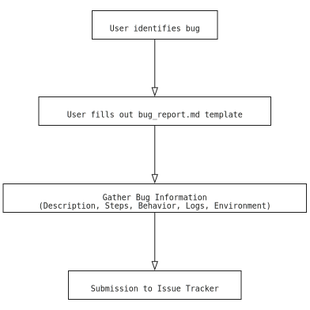

The process for submitting bug reports in the Fabric project is standardized through the use of a dedicated template, located at [`.github/ISSUE_TEMPLATE/bug_report.md`](https://github.com/pdlc-os/fabric/blob/b11448f8f01fdcf12deab96204417d87f8d46ab3/.github/ISSUE_TEMPLATE/bug_report.md). This template guides users in providing comprehensive diagnostic information, which is critical for efficient issue resolution.

When a bug is reported, the template prompts for several key pieces of information: a clear description of the bug, detailed steps to reproduce it, the expected behavior, and the actual behavior observed. To aid in debugging, users are specifically asked to include [`Debug Output`](https://github.com/pdlc-os/fabric/blob/b11448f8f01fdcf12deab96204417d87f8d46ab3/cmd/hub.go#L106) and [`Server logs`](https://github.com/pdlc-os/fabric/blob/b11448f8f01fdcf12deab96204417d87f8d46ab3/web/AGENTS.md?plain=1#L35) generated by re-running relevant [`fabric`](https://github.com/pdlc-os/fabric/blob/b11448f8f01fdcf12deab96204417d87f8d46ab3/README.md?plain=1#L1) commands with the [`--debug`](https://github.com/pdlc-os/fabric/blob/b11448f8f01fdcf12deab96204417d87f8d46ab3/cmd/root.go#L51) flag. These logs, often extensive, are encapsulated within expandable Markdown [`
`](https://github.com/pdlc-os/fabric/blob/b11448f8f01fdcf12deab96204417d87f8d46ab3/pkg/runtimebroker/nfs_mount.go#L241) tags to maintain readability of the issue.

Furthermore, the template requires environmental details, such as the [`Fabric version`](https://github.com/pdlc-os/fabric/blob/b11448f8f01fdcf12deab96204417d87f8d46ab3/Makefile#L1) (obtained via the [`fabric version`](https://github.com/pdlc-os/fabric/blob/b11448f8f01fdcf12deab96204417d87f8d46ab3/Makefile#L1) command), the specific [`Runtime`](https://github.com/pdlc-os/fabric/blob/b11448f8f01fdcf12deab96204417d87f8d46ab3/pkg/api/types.go#L583) environment (e.g., Docker, Apple Virtualization, Kubernetes), and the [`Harness`](https://github.com/pdlc-os/fabric/blob/b11448f8f01fdcf12deab96204417d87f8d46ab3/pkg/api/harness.go#L23) being used (e.g., Claude, Gemini). This structured approach ensures that developers receive all necessary context upfront, minimizing the back-and-forth required to gather information and accelerating the debugging process. The overarching issue management process is further detailed in [Issue and Pull Request Management](#issue-and-pull-request-management).

### Feature Request Submission Guidelines

Feature requests for the Fabric project are submitted using a structured template to ensure clarity and provide necessary context for efficient evaluation and implementation. The template, found at [`.github/ISSUE_TEMPLATE/feature_request.md`](https://github.com/pdlc-os/fabric/blob/b11448f8f01fdcf12deab96204417d87f8d46ab3/.github/ISSUE_TEMPLATE/feature_request.md), prompts contributors to articulate the problem or motivation behind the requested feature, propose a solution, list any alternatives considered, and provide additional relevant context. When this template is used, the system automatically labels the new issue as an [`enhancement`](https://github.com/pdlc-os/fabric/blob/b11448f8f01fdcf12deab96204417d87f8d46ab3/pkg/store/models.go#L1316), streamlining the categorization of contributions. For broader context on how issues and pull requests are managed, see [Issue and Pull Request Management](#issue-and-pull-request-management).

### Pull Request Submission and Checklist

The Fabric project standardizes the pull request (PR) submission process through a dedicated template, defined in [`.github/PULL_REQUEST_TEMPLATE.md`](https://github.com/pdlc-os/fabric/blob/b11448f8f01fdcf12deab96204417d87f8d46ab3/.github/PULL_REQUEST_TEMPLATE.md). This template guides contributors to link their PRs to existing issues, ensuring traceability and providing necessary context for changes. It also includes a pre-submission checklist that prompts contributors to verify that tests pass and that documentation updates have been considered, promoting code quality and maintainability. Furthermore, the template encourages prior discussion of proposed changes by recommending that an issue be opened for discussion before coding begins. This approach helps align contributions with project goals and streamlines the review process. For detailed guidelines on bug reporting and feature requests, refer to [Standardized Bug Reporting Process](#issue-and-pull-request-management-standardized-bug-reporting-process) and [Feature Request Submission Guidelines](#issue-and-pull-request-management-feature-request-submission-guidelines).

## Fabric Broker Protobuf and gRPC Services

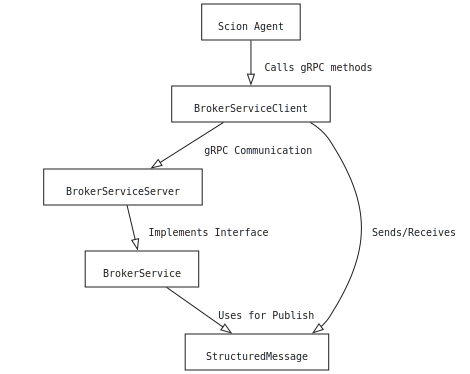

The Fabric platform utilizes Protocol Buffers (Protobuf) and gRPC for inter-service communication within its broker component, defining the mechanisms for message exchange, configuration management, and health monitoring. This approach ensures strong typing, language independence, and efficient serialization for communication between various Fabric agents and services.

The core of this system is the [`BrokerService`](https://github.com/pdlc-os/fabric/blob/b11448f8f01fdcf12deab96204417d87f8d46ab3/proto/broker/v1/broker.proto#L23), defined in Protobuf and implemented as a gRPC service. This service facilitates several key operations:

- **Message Brokering**: Agents can publish messages, subscribe to topics, and unsubscribe from them. Messages are structured using [`StructuredMessage`](https://github.com/pdlc-os/fabric/blob/b11448f8f01fdcf12deab96204417d87f8d46ab3/proto/broker/v1/broker.proto#L33), a comprehensive data structure that includes fields for versioning, timestamps, sender and recipient identification, message content, type, channel, and metadata, enabling robust inter-agent communication.
- **Configuration Management**: The service allows for dynamic configuration of the broker, enabling runtime adjustments to its behavior.
- **Health and Information Checks**: Clients can query the broker's operational status and retrieve general information about its capabilities and state, supporting system monitoring and diagnostics.

The [`BrokerService`](https://github.com/pdlc-os/fabric/blob/b11448f8f01fdcf12deab96204417d87f8d46ab3/proto/broker/v1/broker.proto#L23)'s definitions in Protobuf are used to generate Go client and server interfaces, located in [`proto/broker/v1`](https://github.com/pdlc-os/fabric/blob/b11448f8f01fdcf12deab96204417d87f8d46ab3/proto/broker/v1). The [`BrokerServiceClient`](https://github.com/pdlc-os/fabric/blob/b11448f8f01fdcf12deab96204417d87f8d46ab3/proto/broker/v1/broker_grpc.pb.go#L50) provides the client-side API for interacting with the broker, while the [`BrokerServiceServer`](https://github.com/pdlc-os/fabric/blob/b11448f8f01fdcf12deab96204417d87f8d46ab3/proto/broker/v1/broker_grpc.pb.go#L133) interface defines the contract for server implementations. The use of [`UnimplementedBrokerServiceServer`](https://github.com/pdlc-os/fabric/blob/b11448f8f01fdcf12deab96204417d87f8d46ab3/proto/broker/v1/broker_grpc.pb.go#L148) ensures forward compatibility, allowing new methods to be added to the service definition without breaking existing server implementations. This generated code is fundamental for integrating diverse components within the Fabric ecosystem, enabling seamless and reliable communication among agents.

### Message Brokering RPCs and `StructuredMessage`

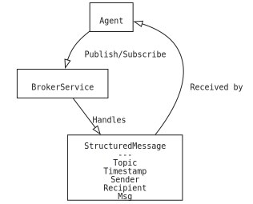

The Fabric message broker, defined by Protobuf and gRPC services in [`proto`](https://github.com/pdlc-os/fabric/blob/b11448f8f01fdcf12deab96204417d87f8d46ab3/proto), facilitates inter-agent communication within the Fabric ecosystem. This broker provides core functionalities for agents to [`Publish`](https://github.com/pdlc-os/fabric/blob/b11448f8f01fdcf12deab96204417d87f8d46ab3/pkg/plugin/config.go#L136) messages, [`Subscribe`](https://github.com/pdlc-os/fabric/blob/b11448f8f01fdcf12deab96204417d87f8d46ab3/pkg/hub/events.go#L52) to message topics, and [`Unsubscribe`](https://github.com/pdlc-os/fabric/blob/b11448f8f01fdcf12deab96204417d87f8d46ab3/pkg/eventbus/fanout.go#L274) from them.

The central data structure for these interactions is the [`StructuredMessage`](https://github.com/pdlc-os/fabric/blob/b11448f8f01fdcf12deab96204417d87f8d46ab3/proto/broker/v1/broker.proto#L33), which encapsulates various fields to ensure robust and context-rich communication. These fields include [`Version`](https://github.com/pdlc-os/fabric/blob/b11448f8f01fdcf12deab96204417d87f8d46ab3/cmd/hub.go#L2630), [`Timestamp`](https://github.com/pdlc-os/fabric/blob/b11448f8f01fdcf12deab96204417d87f8d46ab3/pkg/api/types.go#L839), [`Sender`](https://github.com/pdlc-os/fabric/blob/b11448f8f01fdcf12deab96204417d87f8d46ab3/pkg/hub/events.go#L186), [`Recipient`](https://github.com/pdlc-os/fabric/blob/b11448f8f01fdcf12deab96204417d87f8d46ab3/pkg/hub/events.go#L188), [`Msg`](https://github.com/pdlc-os/fabric/blob/b11448f8f01fdcf12deab96204417d87f8d46ab3/pkg/hub/events.go#L190) (the message content itself), [`Type`](https://github.com/pdlc-os/fabric/blob/b11448f8f01fdcf12deab96204417d87f8d46ab3/pkg/api/types.go#L48), [`Channel`](https://github.com/pdlc-os/fabric/blob/b11448f8f01fdcf12deab96204417d87f8d46ab3/pkg/store/models.go#L1556), and [`Metadata`](https://github.com/pdlc-os/fabric/blob/b11448f8f01fdcf12deab96204417d87f8d46ab3/pkg/store/store.go#L217) (a map for additional key-value data). Other important fields include [`Plain`](https://github.com/pdlc-os/fabric/blob/b11448f8f01fdcf12deab96204417d87f8d46ab3/pkg/hub/server.go#L2059) (for plain text messages), [`Raw`](https://github.com/pdlc-os/fabric/blob/b11448f8f01fdcf12deab96204417d87f8d46ab3/pkg/api/skill_uri.go#L30) (for raw data), [`Urgent`](https://github.com/pdlc-os/fabric/blob/b11448f8f01fdcf12deab96204417d87f8d46ab3/pkg/hub/events.go#L192) (to indicate high priority), [`Broadcasted`](https://github.com/pdlc-os/fabric/blob/b11448f8f01fdcf12deab96204417d87f8d46ab3/pkg/hub/events.go#L193) (for messages intended for all subscribers), [`ObserverOnly`](https://github.com/pdlc-os/fabric/blob/b11448f8f01fdcf12deab96204417d87f8d46ab3/pkg/messages/types.go#L104) (for messages only meant for monitoring), [`Status`](https://github.com/pdlc-os/fabric/blob/b11448f8f01fdcf12deab96204417d87f8d46ab3/cmd/hub.go#L2629) (for status updates), [`Attachments`](https://github.com/pdlc-os/fabric/blob/b11448f8f01fdcf12deab96204417d87f8d46ab3/pkg/messages/types.go#L106) (for linked resources), [`ThreadId`](https://github.com/pdlc-os/fabric/blob/b11448f8f01fdcf12deab96204417d87f8d46ab3/proto/broker/v1/broker.pb.go#L59) (for conversational threading), and [`Visibility`](https://github.com/pdlc-os/fabric/blob/b11448f8f01fdcf12deab96204417d87f8d46ab3/pkg/api/types.go#L597) (to control message audience).

The gRPC client-side interface, [`BrokerServiceClient`](https://github.com/pdlc-os/fabric/blob/b11448f8f01fdcf12deab96204417d87f8d46ab3/proto/broker/v1/broker_grpc.pb.go#L50), allows agents to interact with the broker by invoking RPCs like [`Publish`](https://github.com/pdlc-os/fabric/blob/b11448f8f01fdcf12deab96204417d87f8d46ab3/pkg/plugin/config.go#L136) (using a [`PublishRequest`](https://github.com/pdlc-os/fabric/blob/b11448f8f01fdcf12deab96204417d87f8d46ab3/proto/broker/v1/broker.proto#L62) containing a [`Topic`](https://github.com/pdlc-os/fabric/blob/b11448f8f01fdcf12deab96204417d87f8d46ab3/pkg/projectcompat/topics.go#L46) and a [`StructuredMessage`](https://github.com/pdlc-os/fabric/blob/b11448f8f01fdcf12deab96204417d87f8d46ab3/proto/broker/v1/broker.proto#L33)), [`Subscribe`](https://github.com/pdlc-os/fabric/blob/b11448f8f01fdcf12deab96204417d87f8d46ab3/pkg/hub/events.go#L52) (with a [`SubscribeRequest`](https://github.com/pdlc-os/fabric/blob/b11448f8f01fdcf12deab96204417d87f8d46ab3/proto/broker/v1/broker.proto#L69) specifying a [`Pattern`](https://github.com/pdlc-os/fabric/blob/b11448f8f01fdcf12deab96204417d87f8d46ab3/pkg/plugin/broker_plugin.go#L52) for topics), and [`Unsubscribe`](https://github.com/pdlc-os/fabric/blob/b11448f8f01fdcf12deab96204417d87f8d46ab3/pkg/eventbus/fanout.go#L274) (with an [`UnsubscribeRequest`](https://github.com/pdlc-os/fabric/blob/b11448f8f01fdcf12deab96204417d87f8d46ab3/proto/broker/v1/broker.proto#L75) and its associated [`Pattern`](https://github.com/pdlc-os/fabric/blob/b11448f8f01fdcf12deab96204417d87f8d46ab3/pkg/plugin/broker_plugin.go#L52)). For a more detailed look at the client-side and server-side implementations, refer to [Generated Go Client and Server Interfaces](#fabric-broker-protobuf-and-grpc-services-generated-go-client-and-server-interfaces).

### Broker Configuration and Information Retrieval

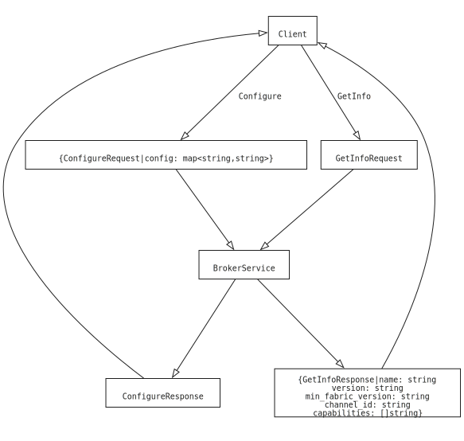

The [`BrokerService`](https://github.com/pdlc-os/fabric/blob/b11448f8f01fdcf12deab96204417d87f8d46ab3/proto/broker/v1/broker.proto#L23) offers two primary mechanisms for interacting with the broker's operational parameters and metadata: [`Configure`](https://github.com/pdlc-os/fabric/blob/b11448f8f01fdcf12deab96204417d87f8d46ab3/pkg/plugin/config.go#L142) and [`GetInfo`](https://github.com/pdlc-os/fabric/blob/b11448f8f01fdcf12deab96204417d87f8d46ab3/pkg/plugin/config.go#L144).

The [`Configure`](https://github.com/pdlc-os/fabric/blob/b11448f8f01fdcf12deab96204417d87f8d46ab3/pkg/plugin/config.go#L142) RPC, defined with [`ConfigureRequest`](https://github.com/pdlc-os/fabric/blob/b11448f8f01fdcf12deab96204417d87f8d46ab3/proto/broker/v1/broker.proto#L56) and [`ConfigureResponse`](https://github.com/pdlc-os/fabric/blob/b11448f8f01fdcf12deab96204417d87f8d46ab3/proto/broker/v1/broker.proto#L60), allows dynamic adjustment of the broker's settings. Clients can send key-value pairs representing configuration parameters to modify the broker's behavior at runtime. This provides a way to adapt the broker's operation without requiring a restart, supporting flexible deployments and administrative adjustments.

Conversely, the [`GetInfo`](https://github.com/pdlc-os/fabric/blob/b11448f8f01fdcf12deab96204417d87f8d46ab3/pkg/plugin/config.go#L144) RPC (using [`GetInfoRequest`](https://github.com/pdlc-os/fabric/blob/b11448f8f01fdcf12deab96204417d87f8d46ab3/proto/broker/v1/broker.proto#L89) and [`GetInfoResponse`](https://github.com/pdlc-os/fabric/blob/b11448f8f01fdcf12deab96204417d87f8d46ab3/proto/broker/v1/broker.proto#L91)) enables clients to retrieve detailed operational information and metadata about the Fabric broker. This includes fundamental attributes like the broker's name, version, and the minimum compatible Fabric version. It also provides insight into the broker's [`ChannelId`](https://github.com/pdlc-os/fabric/blob/b11448f8f01fdcf12deab96204417d87f8d46ab3/proto/broker/v1/broker.pb.go#L700) and a list of its [`Capabilities`](https://github.com/pdlc-os/fabric/blob/b11448f8f01fdcf12deab96204417d87f8d46ab3/pkg/store/models.go#L354), which can inform clients about the broker's feature set and operational limits. These RPCs are part of the core [`BrokerService`](https://github.com/pdlc-os/fabric/blob/b11448f8f01fdcf12deab96204417d87f8d46ab3/proto/broker/v1/broker.proto#L23) interface, with their definitions residing in [`proto/broker/v1/broker.pb.go`](https://github.com/pdlc-os/fabric/blob/b11448f8f01fdcf12deab96204417d87f8d46ab3/proto/broker/v1/broker.pb.go) and their gRPC client/server interfaces in [`proto/broker/v1/broker_grpc.pb.go`](https://github.com/pdlc-os/fabric/blob/b11448f8f01fdcf12deab96204417d87f8d46ab3/proto/broker/v1/broker_grpc.pb.go). For more details on the messaging structures used in these RPCs, refer to [Message Brokering RPCs and `StructuredMessage`](#fabric-broker-protobuf-and-grpc-services-message-brokering-rpcs-and-structuredmessage).

### Health Check Mechanisms and Status Reporting

The [`BrokerService`](https://github.com/pdlc-os/fabric/blob/b11448f8f01fdcf12deab96204417d87f8d46ab3/proto/broker/v1/broker.proto#L23) provides a [`HealthCheck`](https://github.com/pdlc-os/fabric/blob/b11448f8f01fdcf12deab96204417d87f8d46ab3/pkg/plugin/config.go#L146) RPC, enabling clients to query the operational status of the Fabric message brokering service. This mechanism is critical for ensuring the reliability and availability of inter-agent communication within the Fabric ecosystem. By allowing clients to ascertain the broker's health, it facilitates proactive monitoring and rapid response to potential service disruptions. The [`HealthCheckRequest`](https://github.com/pdlc-os/fabric/blob/b11448f8f01fdcf12deab96204417d87f8d46ab3/proto/broker/v1/broker.proto#L81) and [`HealthCheckResponse`](https://github.com/pdlc-os/fabric/blob/b11448f8f01fdcf12deab96204417d87f8d46ab3/proto/broker/v1/broker.proto#L83) messages, defined in [`proto/broker/v1/broker.pb.go`](https://github.com/pdlc-os/fabric/blob/b11448f8f01fdcf12deab96204417d87f8d46ab3/proto/broker/v1/broker.pb.go), are used to initiate and respond to these health checks, respectively. This allows for straightforward integration into monitoring systems and ensures that agents and other Fabric components can confirm the broker's readiness to process messages.

### Generated Go Client and Server Interfaces

The Protobuf definitions within the [`proto`](https://github.com/pdlc-os/fabric/blob/b11448f8f01fdcf12deab96204417d87f8d46ab3/proto) directory generate Go code that facilitates client-side interaction with and server-side implementation of the [`BrokerService`](https://github.com/pdlc-os/fabric/blob/b11448f8f01fdcf12deab96204417d87f8d46ab3/proto/broker/v1/broker.proto#L23). The [`BrokerServiceClient`](https://github.com/pdlc-os/fabric/blob/b11448f8f01fdcf12deab96204417d87f8d46ab3/proto/broker/v1/broker_grpc.pb.go#L50) is the interface clients use to interact with the broker's functionalities, such as publishing and subscribing to messages, configuring the broker, and checking its health. On the server side, the [`BrokerServiceServer`](https://github.com/pdlc-os/fabric/blob/b11448f8f01fdcf12deab96204417d87f8d46ab3/proto/broker/v1/broker_grpc.pb.go#L133) interface defines the contract that any implementation must satisfy to provide these broker services. For integrating a server implementation with a gRPC runtime, the [`RegisterBrokerServiceServer`](https://github.com/pdlc-os/fabric/blob/b11448f8f01fdcf12deab96204417d87f8d46ab3/proto/broker/v1/broker_grpc.pb.go#L178) function is used, which binds the concrete [`BrokerServiceServer`](https://github.com/pdlc-os/fabric/blob/b11448f8f01fdcf12deab96204417d87f8d46ab3/proto/broker/v1/broker_grpc.pb.go#L133) implementation to the gRPC server. This generated code, located in [`proto/broker/v1`](https://github.com/pdlc-os/fabric/blob/b11448f8f01fdcf12deab96204417d87f8d46ab3/proto/broker/v1), ensures type safety and a structured approach to inter-service communication within the Fabric ecosystem.

## Task Management and Onboarding

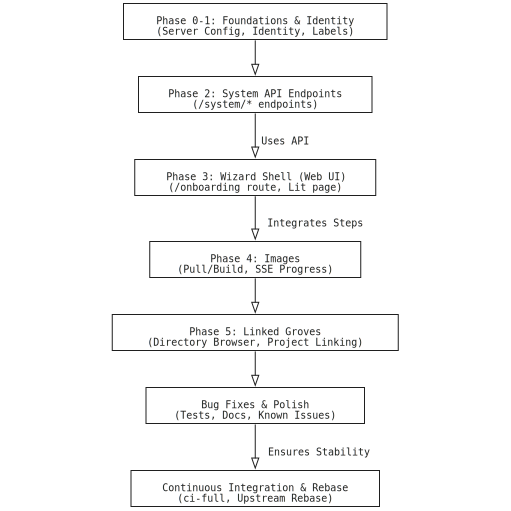

The [`.tasks`](https://github.com/pdlc-os/fabric/blob/b11448f8f01fdcf12deab96204417d87f8d46ab3/.tasks) directory serves as a central repository for the development and maintenance of the workstation onboarding experience for the Fabric project. This includes detailed task breakdowns, records of bug fixes, and instructions for rebasing feature branches into the main codebase.

The onboarding process is structured into several development phases. Initial phases (as documented in [`.tasks/phase-0-1-foundations-identity.md`](https://github.com/pdlc-os/fabric/blob/b11448f8f01fdcf12deab96204417d87f8d46ab3/.tasks/phase-0-1-foundations-identity.md) and [`.tasks/phase-2-system-api.md`](https://github.com/pdlc-os/fabric/blob/b11448f8f01fdcf12deab96204417d87f8d46ab3/.tasks/phase-2-system-api.md)) focus on foundational server configurations, managing user identities, and establishing core system API endpoints. These APIs ([`/api/v1/system/check`](https://github.com/pdlc-os/fabric/blob/b11448f8f01fdcf12deab96204417d87f8d46ab3/web/src/components/pages/onboarding.ts#L687), [`/api/v1/system/runtime`](https://github.com/pdlc-os/fabric/blob/b11448f8f01fdcf12deab96204417d87f8d46ab3/web/src/components/pages/onboarding.ts#L757), [`/api/v1/system/status`](https://github.com/pdlc-os/fabric/blob/b11448f8f01fdcf12deab96204417d87f8d46ab3/web/src/components/pages/onboarding.ts#L488), [`/api/v1/system/identity`](https://github.com/pdlc-os/fabric/blob/b11448f8f01fdcf12deab96204417d87f8d46ab3/pkg/hub/server.go#L2760), [`/api/v1/system/init`](https://github.com/pdlc-os/fabric/blob/b11448f8f01fdcf12deab96204417d87f8d46ab3/pkg/hub/server.go#L2764)) provide diagnostics, runtime configuration, onboarding status, identity management, and machine initialization. Access to these endpoints is restricted to workstation environments and protected by authentication.

Subsequent phases, such as the one described in [`.tasks/phase-3-wizard-shell.md`](https://github.com/pdlc-os/fabric/blob/b11448f8f01fdcf12deab96204417d87f8d46ab3/.tasks/phase-3-wizard-shell.md), introduce the web-based onboarding wizard. This wizard guides users through steps like identity collection, system checks, runtime selection, and initial harness seeding. It is designed to be resumable and handles daemon launch behavior, including automatically opening the browser to the onboarding URL if the machine is not yet onboarded. Image pulling and local build options, detailed in [`.tasks/phase-4-images.md`](https://github.com/pdlc-os/fabric/blob/b11448f8f01fdcf12deab96204417d87f8d46ab3/.tasks/phase-4-images.md), provide users with mechanisms to acquire necessary container images, with real-time progress streamed via Server-Sent Events (SSE).

The "linked groves" functionality, outlined in [`.tasks/phase-5-linked-groves.md`](https://github.com/pdlc-os/fabric/blob/b11448f8f01fdcf12deab96204417d87f8d46ab3/.tasks/phase-5-linked-groves.md), enables users to designate local directories as Fabric projects. This involves server-side directory browsing with robust path safety checks to prevent unauthorized access or conflicts with Fabric's internal directories. This feature is integrated into both the project creation UI and the onboarding wizard.

Throughout these development phases, the [`.tasks`](https://github.com/pdlc-os/fabric/blob/b11448f8f01fdcf12deab96204417d87f8d46ab3/.gcloudignore#L65) directory also captures efforts to address bugs and refine the user experience. For example, [`.tasks/onboarding-bugs-3-4-5.md`](https://github.com/pdlc-os/fabric/blob/b11448f8f01fdcf12deab96204417d87f8d46ab3/.tasks/onboarding-bugs-3-4-5.md) details fixes for issues like the wizard skipping steps on fresh installs, incorrect display of image names, and the unavailability of local builds for Homebrew installations. Enhancements for phantom daemon processes and a forced stop mechanism for [`fabric server stop`](https://github.com/pdlc-os/fabric/blob/b11448f8f01fdcf12deab96204417d87f8d46ab3/README.md?plain=1#L1) are documented in [`.tasks/phantom-daemon-fix.md`](https://github.com/pdlc-os/fabric/blob/b11448f8f01fdcf12deab96204417d87f8d46ab3/.tasks/phantom-daemon-fix.md). Feedback from code reviews is systematically addressed, as shown in [`.tasks/pr-264-feedback.md`](https://github.com/pdlc-os/fabric/blob/b11448f8f01fdcf12deab96204417d87f8d46ab3/.tasks/pr-264-feedback.md), [`.tasks/review-fixes-round-1.md`](https://github.com/pdlc-os/fabric/blob/b11448f8f01fdcf12deab96204417d87f8d46ab3/.tasks/review-fixes-round-1.md), and [`.tasks/review-fixes-round-2.md`](https://github.com/pdlc-os/fabric/blob/b11448f8f01fdcf12deab96204417d87f8d46ab3/.tasks/review-fixes-round-2.md), covering aspects like error handling, concurrency, and security vulnerabilities.

Finally, the project finalization and integration tasks, described in [`.tasks/phase-6-polish.md`](https://github.com/pdlc-os/fabric/blob/b11448f8f01fdcf12deab96204417d87f8d46ab3/.tasks/phase-6-polish.md) and [`.tasks/rebase-workstation-improvements.md`](https://github.com/pdlc-os/fabric/blob/b11448f8f01fdcf12deab96204417d87f8d46ab3/.tasks/rebase-workstation-improvements.md), ensure the feature's correctness, usability, and documentation. This includes writing comprehensive tests, updating user-facing documentation, and providing instructions for rebasing the feature branch while resolving potential conflicts. An overall CI fixup strategy is also documented in [`.tasks/ci-full-fix.md`](https://github.com/pdlc-os/fabric/blob/b11448f8f01fdcf12deab96204417d87f8d46ab3/.tasks/ci-full-fix.md), ensuring that all continuous integration checks pass before final integration.

### Workstation Onboarding Feature Development Phases

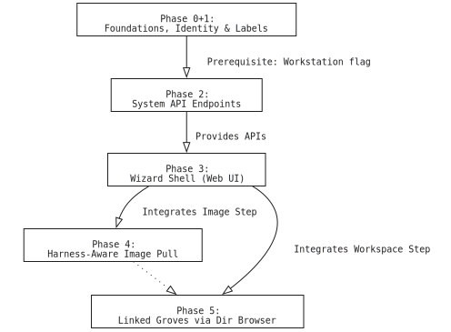

The workstation onboarding experience is developed in phases, each addressing a distinct aspect of setting up a Fabric environment for local development.

The initial foundational phase ([`Phase 0`](https://github.com/pdlc-os/fabric/blob/b11448f8f01fdcf12deab96204417d87f8d46ab3/cmd/list.go#L3)) establishes core server configurations and identity management for the workstation, as outlined in [`.tasks/phase-0-1-foundations-identity.md`](https://github.com/pdlc-os/fabric/blob/b11448f8f01fdcf12deab96204417d87f8d46ab3/.tasks/phase-0-1-foundations-identity.md). This includes modifying the [`hub.ServerConfig`](https://github.com/pdlc-os/fabric/blob/b11448f8f01fdcf12deab96204417d87f8d46ab3/pkg/config/hub_config.go#L282) by adding a [`Workstation bool`](https://github.com/pdlc-os/fabric/blob/b11448f8f01fdcf12deab96204417d87f8d46ab3/cmd/server.go#L28) field to delineate workstation-specific functionality and safeguarding access to certain API endpoints using a [`requireWorkstation`](https://github.com/pdlc-os/fabric/blob/b11448f8f01fdcf12deab96204417d87f8d46ab3/pkg/hub/server.go#L2852) middleware. It also enables the retrieval of an embedded broker ID via the [`GetEmbeddedBrokerID()`](https://github.com/pdlc-os/fabric/blob/b11448f8f01fdcf12deab96204417d87f8d46ab3/pkg/hub/server.go#L1389) accessor to support subsequent linked-grove creation processes. Identity management is enhanced by adding [`Username`](https://github.com/pdlc-os/fabric/blob/b11448f8f01fdcf12deab96204417d87f8d46ab3/pkg/hub/devauth.go#L87), [`DisplayName`](https://github.com/pdlc-os/fabric/blob/b11448f8f01fdcf12deab96204417d87f8d46ab3/pkg/hub/devauth.go#L93), and [`Email string`](https://github.com/pdlc-os/fabric/blob/b11448f8f01fdcf12deab96204417d87f8d46ab3/cmd/hub.go#L72) fields to [`DevAuthConfig`](https://github.com/pdlc-os/fabric/blob/b11448f8f01fdcf12deab96204417d87f8d46ab3/pkg/config/hub_config.go#L188) (found in [`pkg/config/hub_config.go`](https://github.com/pdlc-os/fabric/blob/b11448f8f01fdcf12deab96204417d87f8d46ab3/pkg/config/hub_config.go)) and [`V1AuthConfig`](https://github.com/pdlc-os/fabric/blob/b11448f8f01fdcf12deab96204417d87f8d46ab3/pkg/config/settings_v1.go#L421) (in [`pkg/config/settings_v1.go`](https://github.com/pdlc-os/fabric/blob/b11448f8f01fdcf12deab96204417d87f8d46ab3/pkg/config/settings_v1.go)), which are then used to construct [`DevUser`](https://github.com/pdlc-os/fabric/blob/b11448f8f01fdcf12deab96204417d87f8d46ab3/pkg/hub/devauth.go#L40) (in [`pkg/hub/devauth.go`](https://github.com/pdlc-os/fabric/blob/b11448f8f01fdcf12deab96204417d87f8d46ab3/pkg/hub/devauth.go)) and can be updated via a dedicated [`PUT /api/v1/system/identity`](https://github.com/pdlc-os/fabric/blob/b11448f8f01fdcf12deab96204417d87f8d46ab3/pkg/hub/server.go#L237) endpoint. This phase also includes textual updates to standardize the terminology of "developer token" across the CLI (in [`cmd`](https://github.com/pdlc-os/fabric/blob/b11448f8f01fdcf12deab96204417d87f8d46ab3/cmd)), UI (in `/pdlc-os/fabric/web/src/`), and documentation.

Building upon this foundation, [`Phase 2`](https://github.com/pdlc-os/fabric/blob/b11448f8f01fdcf12deab96204417d87f8d46ab3/cmd/list.go#L3) introduces a set of system API endpoints under [`/api/v1/system/`](https://github.com/pdlc-os/fabric/blob/b11448f8f01fdcf12deab96204417d87f8d46ab3/pkg/hub/server.go#L190) to facilitate the workstation onboarding wizard, as detailed in [`.tasks/phase-2-system-api.md`](https://github.com/pdlc-os/fabric/blob/b11448f8f01fdcf12deab96204417d87f8d46ab3/.tasks/phase-2-system-api.md). These endpoints act as thin wrappers around existing Go logic, exposing functionalities for diagnostics ([`GET /api/v1/system/check`](https://github.com/pdlc-os/fabric/blob/b11448f8f01fdcf12deab96204417d87f8d46ab3/pkg/hub/server.go#L146)), runtime configuration management ([`GET`](https://github.com/pdlc-os/fabric/blob/b11448f8f01fdcf12deab96204417d87f8d46ab3/pkg/hub/web.go#L903), [`PUT /api/v1/system/runtime`](https://github.com/pdlc-os/fabric/blob/b11448f8f01fdcf12deab96204417d87f8d46ab3/pkg/hub/server.go#L237)), overall onboarding status reporting ([`GET /api/v1/system/status`](https://github.com/pdlc-os/fabric/blob/b11448f8f01fdcf12deab96204417d87f8d46ab3/pkg/hub/server.go#L146)), identity updates ([`PUT /api/v1/system/identity`](https://github.com/pdlc-os/fabric/blob/b11448f8f01fdcf12deab96204417d87f8d46ab3/pkg/hub/server.go#L237)), and machine initialization ([`POST /api/v1/system/init`](https://github.com/pdlc-os/fabric/blob/b11448f8f01fdcf12deab96204417d87f8d46ab3/pkg/hub/server.go#L237)). All these endpoints are protected by the [`requireWorkstation`](https://github.com/pdlc-os/fabric/blob/b11448f8f01fdcf12deab96204417d87f8d46ab3/pkg/hub/server.go#L2852) middleware, ensuring they are only accessible in workstation environments, and by standard authentication mechanisms. The [`GatherDiagnostics`](https://github.com/pdlc-os/fabric/blob/b11448f8f01fdcf12deab96204417d87f8d46ab3/pkg/hub/system_handlers.go#L49) function, which extracts diagnostic logic and returns [`DiagnosticResult`](https://github.com/pdlc-os/fabric/blob/b11448f8f01fdcf12deab96204417d87f8d46ab3/pkg/hub/system_handlers.go#L38) structs, supports structured reporting of system health. Similarly, the [`OnboardingStatus`](https://github.com/pdlc-os/fabric/blob/b11448f8f01fdcf12deab96204417d87f8d46ab3/pkg/hub/system_handlers.go#L295) struct provides a comprehensive view of the onboarding progress, and the [`InitMachine`](https://github.com/pdlc-os/fabric/blob/b11448f8f01fdcf12deab96204417d87f8d46ab3/pkg/config/init.go#L554) function, designed to be idempotent, handles the initial setup including the seeding of selected harness configurations. New routes are registered within the [`MountHubAPI`](https://github.com/pdlc-os/fabric/blob/b11448f8f01fdcf12deab96204417d87f8d46ab3/pkg/hub/web.go#L565) function in [`pkg/hub/web.go`](https://github.com/pdlc-os/fabric/blob/b11448f8f01fdcf12deab96204417d87f8d46ab3/pkg/hub/web.go), and handler implementations reside in [`pkg/hub/system_handlers.go`](https://github.com/pdlc-os/fabric/blob/b11448f8f01fdcf12deab96204417d87f8d46ab3/pkg/hub/system_handlers.go).

[`Phase 3`](https://github.com/pdlc-os/fabric/blob/b11448f8f01fdcf12deab96204417d87f8d46ab3/cmd/list.go#L131) focuses on the development of the web-based onboarding wizard itself, as described in [`.tasks/phase-3-wizard-shell.md`](https://github.com/pdlc-os/fabric/blob/b11448f8f01fdcf12deab96204417d87f8d46ab3/.tasks/phase-3-wizard-shell.md). Accessible via the [`/onboarding`](https://github.com/pdlc-os/fabric/blob/b11448f8f01fdcf12deab96204417d87f8d46ab3/cmd/server_daemon.go#L518) route (registered in [`web/src/client/main.ts`](https://github.com/pdlc-os/fabric/blob/b11448f8f01fdcf12deab96204417d87f8d46ab3/web/src/client/main.ts)), this wizard guides users through a linear, step-by-step first-run setup process, covering identity collection, system checks, runtime selection, and harness installation. The wizard integrates with the API endpoints established in [`Phase 2`](https://github.com/pdlc-os/fabric/blob/b11448f8f01fdcf12deab96204417d87f8d46ab3/cmd/list.go#L3) to manage state and actions. For instance, it calls [`PUT /system/identity`](https://github.com/pdlc-os/fabric/blob/b11448f8f01fdcf12deab96204417d87f8d46ab3/pkg/hub/server.go#L237) to save user details and [`GET /system/check`](https://github.com/pdlc-os/fabric/blob/b11448f8f01fdcf12deab96204417d87f8d46ab3/pkg/hub/server.go#L146) to validate system prerequisites. This phase also modifies the daemon launch behavior (in [`printWorkstationQuickstart`](https://github.com/pdlc-os/fabric/blob/b11448f8f01fdcf12deab96204417d87f8d46ab3/cmd/server_daemon.go#L519) within [`cmd/server_daemon.go`](https://github.com/pdlc-os/fabric/blob/b11448f8f01fdcf12deab96204417d87f8d46ab3/cmd/server_daemon.go)) to automatically direct users to the [`/onboarding`](https://github.com/pdlc-os/fabric/blob/b11448f8f01fdcf12deab96204417d87f8d46ab3/cmd/server_daemon.go#L518) URL if the workstation is not yet onboarded, and can auto-open the URL in a browser for a seamless initial experience. The [`fabric-page-onboarding`](https://github.com/pdlc-os/fabric/blob/b11448f8f01fdcf12deab96204417d87f8d46ab3/web/src/components/pages/onboarding.ts#L1454) Lit page implements the wizard's UI, managing steps and validating input.

In [`Phase 4`](https://github.com/pdlc-os/fabric/blob/b11448f8f01fdcf12deab96204417d87f8d46ab3/cmd/list.go#L131), image management capabilities are integrated into the onboarding process, as detailed in [`.tasks/phase-4-images.md`](https://github.com/pdlc-os/fabric/blob/b11448f8f01fdcf12deab96204417d87f8d46ab3/.tasks/phase-4-images.md). This includes Go-native image pulling with per-image progress updates delivered via Server-Sent Events (SSE), and the option for local image building, also with streaming log output. The wizard's "Images" step orchestrates these operations, using core logic for image operations. The [`PullImages`](https://github.com/pdlc-os/fabric/blob/b11448f8f01fdcf12deab96204417d87f8d46ab3/pkg/runtime/imagepull.go#L55) function manages the sequential pulling of images and communicates their status (e.g., "queued," "pulling," "done," "error") using [`PullResult`](https://github.com/pdlc-os/fabric/blob/b11448f8f01fdcf12deab96204417d87f8d46ab3/pkg/util/git.go#L643) structs. Both image pulling and local builds are initiated as background jobs, providing a [`jobId`](https://github.com/pdlc-os/fabric/blob/b11448f8f01fdcf12deab96204417d87f8d46ab3/pkg/hub/system_handlers.go#L556) to the client for real-time status tracking via SSE. The "Images" step is designed to be non-blocking, allowing users to skip image installation and proceed. The UI orchestration for these operations occurs within [`web/src/components/pages/onboarding.ts`](https://github.com/pdlc-os/fabric/blob/b11448f8f01fdcf12deab96204417d87f8d46ab3/web/src/components/pages/onboarding.ts).

Finally, [`Phase 5`](https://github.com/pdlc-os/fabric/blob/b11448f8f01fdcf12deab96204417d87f8d46ab3/GLOSSARY.md?plain=1#L206) introduces "Linked Groves" functionality, enabling users to link existing local directories as projects, primarily for workstation use, as outlined in [`.tasks/phase-5-linked-groves.md`](https://github.com/pdlc-os/fabric/blob/b11448f8f01fdcf12deab96204417d87f8d46ab3/.tasks/phase-5-linked-groves.md). This involves new API endpoints in [`pkg/hub/system_handlers.go`](https://github.com/pdlc-os/fabric/blob/b11448f8f01fdcf12deab96204417d87f8d46ab3/pkg/hub/system_handlers.go) for safe filesystem interaction, including listing directory contents ([`GET /api/v1/system/fs/list`](https://github.com/pdlc-os/fabric/blob/b11448f8f01fdcf12deab96204417d87f8d46ab3/pkg/hub/server.go#L146)), creating new directories ([`POST /api/v1/system/fs/mkdir`](https://github.com/pdlc-os/fabric/blob/b11448f8f01fdcf12deab96204417d87f8d46ab3/pkg/hub/server.go#L237)), and validating paths ([`POST /api/v1/system/fs/validate-path`](https://github.com/pdlc-os/fabric/blob/b11448f8f01fdcf12deab96204417d87f8d46ab3/pkg/hub/server.go#L237)). These endpoints are strictly guarded by [`requireWorkstation`](https://github.com/pdlc-os/fabric/blob/b11448f8f01fdcf12deab96204417d87f8d46ab3/pkg/hub/server.go#L2852) and [`assertLoopback`](https://github.com/pdlc-os/fabric/blob/b11448f8f01fdcf12deab96204417d87f8d46ab3/pkg/hub/server.go#L2863) to ensure they are only accessible on local workstation environments. A [`PathClass`](https://github.com/pdlc-os/fabric/blob/b11448f8f01fdcf12deab96204417d87f8d46ab3/pkg/hub/fs_safety.go#L40) struct and [`ClassifyPath`](https://github.com/pdlc-os/fabric/blob/b11448f8f01fdcf12deab96204417d87f8d46ab3/pkg/hub/fs_safety.go#L52) function in [`pkg/hub/fs_safety.go`](https://github.com/pdlc-os/fabric/blob/b11448f8f01fdcf12deab96204417d87f8d46ab3/pkg/hub/fs_safety.go) classify paths based on their existence, type, Git status, and whether they are Fabric-managed, with a "hard-fail" rule to prevent linking internal project structures. The [`fabric-dir-browser`](https://github.com/pdlc-os/fabric/blob/b11448f8f01fdcf12deab96204417d87f8d46ab3/web/src/components/shared/dir-browser.ts#L441) Lit element component is introduced for navigating the local filesystem within the UI, used in both the project creation flow ([`web/src/components/pages/project-create.ts`](https://github.com/pdlc-os/fabric/blob/b11448f8f01fdcf12deab96204417d87f8d46ab3/web/src/components/pages/project-create.ts)) and the onboarding wizard's workspace step ([`web/src/components/pages/onboarding.ts`](https://github.com/pdlc-os/fabric/blob/b11448f8f01fdcf12deab96204417d87f8d46ab3/web/src/components/pages/onboarding.ts)). The process for linking a local directory involves creating a hub-native project and then adding the local path as a provider, allowing for retry mechanisms. The [`EmbeddedBrokerID`](https://github.com/pdlc-os/fabric/blob/b11448f8f01fdcf12deab96204417d87f8d46ab3/pkg/hub/system_handlers.go#L303) is also included in the [`OnboardingStatus`](https://github.com/pdlc-os/fabric/blob/b11448f8f01fdcf12deab96204417d87f8d46ab3/pkg/hub/system_handlers.go#L295) response to support this functionality.

### Onboarding Bug Fixes and Refinements

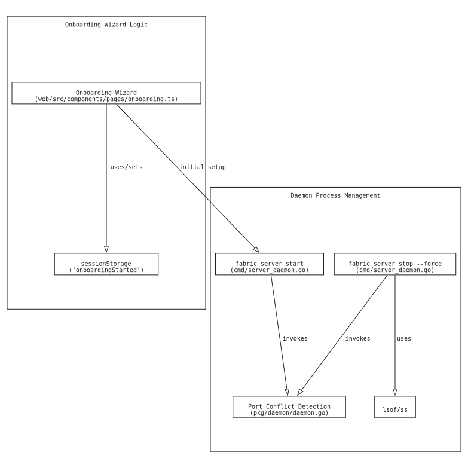

This section addresses several issues identified within the Fabric onboarding wizard and the underlying daemon process management. The fixes aim to improve user experience during initial setup and enhance system stability.

One area of refinement concerns the onboarding wizard's behavior on fresh installations. Initially, the wizard might skip steps due to logic designed to resume progress. This was resolved by introducing a flag, persisted in [`sessionStorage`](https://github.com/pdlc-os/fabric/blob/b11448f8f01fdcf12deab96204417d87f8d46ab3/web/src/client/main.ts#L244), to differentiate between a new user experience and a returning one. This ensures that new users consistently start from the first step, providing a guided onboarding journey. See [Workstation Onboarding Feature Development Phases](#task-management-and-onboarding-workstation-onboarding-feature-development-phases) for more details on the wizard's phases.

Another set of improvements focuses on image name display and local build capabilities within the onboarding process. The wizard now accurately presents full registry-qualified image names, which was achieved by extending the backend API to expose the configured image registry, ensuring consistency between backend configuration and frontend display. Furthermore, the "Build locally" option is now conditionally presented, preventing its invocation for environments where the necessary build scripts are unavailable, such as Homebrew installations. This involves a backend check for script availability and a corresponding frontend adjustment to hide the option if building locally is not supported.

To enhance system robustness, particularly after unclean shutdowns or reinstallation, fixes were implemented to handle "phantom" daemon processes. These processes could continue occupying server ports without a corresponding PID file, leading to conflicts during subsequent server starts. This issue was tackled in two ways: first, by introducing a port conflict detection mechanism in the server startup process. Before a new [`fabric`](https://github.com/pdlc-os/fabric/blob/b11448f8f01fdcf12deab96204417d87f8d46ab3/README.md?plain=1#L1) server instance starts, it probes the required ports to identify any existing listeners. If conflicts are found, the server start is blocked, and the user is advised to forcefully stop any lingering processes. Second, a [`--force`](https://github.com/pdlc-os/fabric/blob/b11448f8f01fdcf12deab96204417d87f8d46ab3/agents.md?plain=1#L140) flag was added to the [`fabric server stop`](https://github.com/pdlc-os/fabric/blob/b11448f8f01fdcf12deab96204417d87f8d46ab3/README.md?plain=1#L1) command. When activated, this flag enables the command to actively identify and terminate processes listening on Fabric's ports, even if no PID file exists, thereby resolving potential port contention. This functionality typically uses platform-specific tools like [`lsof`](https://github.com/pdlc-os/fabric/blob/b11448f8f01fdcf12deab96204417d87f8d46ab3/pkg/daemon/ports.go#L44) to identify PIDs associated with occupied ports and then terminates them.

### Code Review Feedback and Security Fixes

| Issue | File Path | Solution Implemented |
| --- | --- | --- |
| **H1** | `web/src/components/pages/onboarding.ts` | Added `else-if` branch to handle top-level error events in image pull mode, preventing infinite spinner. |
| **H2, H3, M1** | `web/src/components/shared/dir-browser.ts` | Normalized Windows path separators to `/`, fixed `navigateToBreadcrumb` to correctly handle Windows drive letters, and updated `..` entry condition to exclude Windows drive roots. |
| **M2** | `pkg/hub/system_handlers.go` | Added a check for `scanner.Err()` after the `bufio.Scanner` loop to publish errors if a log line exceeds the buffer size. |
| **M3** | `pkg/runtime/imagepull.go` | Implemented `ctx.Err()` check at the beginning of each iteration in the image pull loop to allow for context cancellation during server shutdown. |
| **M4** | `pkg/hub/system_handlers.go` | Added an `atomic.Bool` to the `Server` struct to prevent multiple concurrent image build requests, returning `StatusConflict` if a build is already in progress. |
| **M1 (Round 1)** | `pkg/hub/system_handlers.go` | Replaced home-boundary check with `resolved != home && !strings.HasPrefix(resolved, home+sep)` to prevent sibling-prefix bypass. |
| **M2, N1 (Round 2)** | `pkg/hub/system_handlers.go` | Modified `handlePutRuntime` to update the `Runtime` field of the active profile and ensured `handleGetRuntime` uses the same "default" fallback for empty `ActiveProfile`. |
| **M3 (Round 1)** | `pkg/hub/system_handlers.go` | Added documentation to `handleFSValidatePath` explicitly stating the intentional lack of a home-boundary fence for linked groves and ensured `assertLoopback` is applied. |
| **m1, m2, m3, m5 (Round 1), m4, m5 (Round 2)** | Various | Addressed minor issues including using the binary's executable path for build scripts, increasing `ClassifyPath` project cap, using `apiFetch` in `project-create.ts`, replacing `context.Background()` with a server-lifetime context in goroutines, and removing `devUser` self-shadowing. |

This section details the implementation of fixes based on code review feedback, addressing various issues identified during the development process. These fixes enhance the stability, security, and user experience of the Fabric platform, covering critical areas such as image pulling, path handling, concurrency, and context management.

A set of high-priority fixes targeted the image pulling mechanism and directory browsing. For instance, an infinite spinner issue in the web UI, located in [`web/src/components/pages/onboarding.ts`](https://github.com/pdlc-os/fabric/blob/b11448f8f01fdcf12deab96204417d87f8d46ab3/web/src/components/pages/onboarding.ts), was resolved to ensure proper error handling during early image pull failures. This ensures that the UI accurately reflects the build status, preventing indefinite loading states. Path normalization for Windows systems was also a focus, particularly in [`web/src/components/shared/dir-browser.ts`](https://github.com/pdlc-os/fabric/blob/b11448f8f01fdcf12deab96204417d87f8d46ab3/web/src/components/shared/dir-browser.ts), to correctly handle backslashes and drive letters, which are crucial for consistent directory navigation and display across different operating systems. This prevents incorrect breadcrumb generation and ensures that the parent directory ([`..`](https://github.com/pdlc-os/fabric/blob/b11448f8f01fdcf12deab96204417d87f8d46ab3/Makefile#L56)) entry behaves as expected on Windows drive roots.

Further refinements addressed potential vulnerabilities and inconsistencies. A significant security fix in [`pkg/hub/system_handlers.go`](https://github.com/pdlc-os/fabric/blob/b11448f8f01fdcf12deab96204417d87f8d46ab3/pkg/hub/system_handlers.go) and [`pkg/hub/fs_safety.go`](https://github.com/pdlc-os/fabric/blob/b11448f8f01fdcf12deab96204417d87f8d46ab3/pkg/hub/fs_safety.go) corrected a home-directory boundary check to prevent "sibling-prefix bypasses," ensuring that agent operations are strictly confined to their designated home directories. This improves the isolation and security of agent environments. Concurrency control for local image builds was introduced in [`pkg/hub/system_handlers.go`](https://github.com/pdlc-os/fabric/blob/b11448f8f01fdcf12deab96204417d87f8d46ab3/pkg/hub/system_handlers.go) to prevent multiple simultaneous builds, which could lead to race conditions and instability. This uses an atomic boolean to ensure only one build process is active at any given time, gracefully handling concurrent requests.

In terms of system stability and resource management, [`context.Background()`](https://github.com/pdlc-os/fabric/blob/b11448f8f01fdcf12deab96204417d87f8d46ab3/cmd/hub.go#L736) instances in goroutines, particularly within image pull and build operations in [`pkg/hub/system_handlers.go`](https://github.com/pdlc-os/fabric/blob/b11448f8f01fdcf12deab96204417d87f8d46ab3/pkg/hub/system_handlers.go) and [`pkg/runtime/imagepull.go`](https://github.com/pdlc-os/fabric/blob/b11448f8f01fdcf12deab96204417d87f8d46ab3/pkg/runtime/imagepull.go), were replaced with server-lifetime contexts. This change is crucial for ensuring that goroutines are properly canceled during server shutdowns, preventing resource leaks and improving the overall shutdown process. Additionally, a check for [`scanner.Err()`](https://github.com/pdlc-os/fabric/blob/b11448f8f01fdcf12deab96204417d87f8d46ab3/pkg/hubclient/agents.go#L718) was added in [`pkg/hub/system_handlers.go`](https://github.com/pdlc-os/fabric/blob/b11448f8f01fdcf12deab96204417d87f8d46ab3/pkg/hub/system_handlers.go) after log scanning loops to catch errors, such as excessively long log lines, which could otherwise go unnoticed and lead to incomplete or corrupted log processing.

Finally, user authentication and API interactions also received attention. For consistency with other authenticated API calls, [`apiFetch()`](https://github.com/pdlc-os/fabric/blob/b11448f8f01fdcf12deab96204417d87f8d46ab3/web/src/client/api.ts#L25) was implemented for project creation in [`web/src/components/pages/project-create.ts`](https://github.com/pdlc-os/fabric/blob/b11448f8f01fdcf12deab96204417d87f8d46ab3/web/src/components/pages/project-create.ts). This standardizes how the frontend interacts with the backend, leveraging existing authentication and error handling mechanisms. An edge case in [`handlePutRuntime`](https://github.com/pdlc-os/fabric/blob/b11448f8f01fdcf12deab96204417d87f8d46ab3/pkg/hub/system_handlers.go#L173) in [`pkg/hub/system_handlers.go`](https://github.com/pdlc-os/fabric/blob/b11448f8f01fdcf12deab96204417d87f8d46ab3/pkg/hub/system_handlers.go) was addressed to ensure consistent behavior when [`ActiveProfile`](https://github.com/pdlc-os/fabric/blob/b11448f8f01fdcf12deab96204417d87f8d46ab3/pkg/hubclient/types.go#L202) is an empty string, preventing discrepancies between setting and retrieving runtime configurations. These fixes collectively contribute to a more robust, secure, and user-friendly Fabric platform.

### Project Finalization and Rebase Instructions

| File Path | Status | Purpose/Feature |
| --- | --- | --- |
| `pkg/daemon/ports.go` | New | Phantom daemon detection |
| `pkg/hub/system_handlers.go`, `pkg/hub/system_identity.go`, `pkg/hub/fs_safety.go` | New | `/system/*` API endpoints, identity management, and file system safety checks |
| `pkg/runtime/imagepull.go` | New | Go-native image pulling |
| `web/src/components/pages/onboarding.ts`, `web/src/components/shared/dir-browser.ts` | New | Onboarding wizard and directory browser UI components |
| `cmd/root.go` | Conflict-Resolved | Git worktree detection and version check guarding |
| `cmd/server_daemon.go` | Conflict-Resolved | Onboarding status, quickstart output, and port conflict detection |
| `cmd/server_foreground.go`, `cmd/server.go` | Conflict-Resolved | Hosted mode adjustments and `stop --force` flag |
| `pkg/hub/server.go` | Modified | Server configuration, middleware (`requireWorkstation`, `assertLoopback`), and embedded broker ID |
| `pkg/hub/web.go`, `pkg/hub/seed.go`, `pkg/hub/auth.go`, `pkg/hub/devauth.go` | Modified | Developer auto-login, user seeding, and authentication logic |
| `pkg/config/settings_v1.go`, `pkg/config/hub_config.go` | Modified | Added fields for developer authentication configuration |
| `web/src/components/app-shell.ts`, `web/src/components/pages/project-create.ts` | Modified | UI updates for onboarding and linked grove project creation |

The Fabric project's workstation onboarding feature undergoes a finalization process that includes comprehensive testing, documentation updates, and end-to-end verification before integration into the main codebase. Go tests are written for new functionality, such as the [`requireWorkstation`](https://github.com/pdlc-os/fabric/blob/b11448f8f01fdcf12deab96204417d87f8d46ab3/pkg/hub/server.go#L2852) middleware, which ensures access control based on workstation status, and the [`ClassifyPath`](https://github.com/pdlc-os/fabric/blob/b11448f8f01fdcf12deab96204417d87f8d46ab3/pkg/hub/fs_safety.go#L52) function in [`pkg/hub/fs_safety.go`](https://github.com/pdlc-os/fabric/blob/b11448f8f01fdcf12deab96204417d87f8d46ab3/pkg/hub/fs_safety.go), responsible for validating linked grove paths. Documentation, including the primary [`README.md`](https://github.com/pdlc-os/fabric/blob/b11448f8f01fdcf12deab96204417d87f8d46ab3/README.md?plain=1#L83) file, is updated to reflect the new workstation onboarding experience, providing quick-start guides and ensuring consistency in CLI output.

The integration of the workstation onboarding feature into the main codebase involves a rebase strategy, as detailed in [`.tasks/rebase-workstation-improvements.md`](https://github.com/pdlc-os/fabric/blob/b11448f8f01fdcf12deab96204417d87f8d46ab3/.tasks/rebase-workstation-improvements.md). This process prioritizes preserving all changes from the feature branch while incorporating upstream updates. New files specific to the onboarding experience, such as [`pkg/hub/system_handlers.go`](https://github.com/pdlc-os/fabric/blob/b11448f8f01fdcf12deab96204417d87f8d46ab3/pkg/hub/system_handlers.go) for system API endpoints and [`web/src/components/pages/onboarding.ts`](https://github.com/pdlc-os/fabric/blob/b11448f8f01fdcf12deab96204417d87f8d46ab3/web/src/components/pages/onboarding.ts) for the onboarding wizard, are preserved without conflict. For files that have been modified in both the feature branch and upstream, conflict resolution ensures that both sets of changes are retained. This includes modifications to [`cmd/root.go`](https://github.com/pdlc-os/fabric/blob/b11448f8f01fdcf12deab96204417d87f8d46ab3/cmd/root.go) for Git version checks and [`cmd/server_daemon.go`](https://github.com/pdlc-os/fabric/blob/b11448f8f01fdcf12deab96204417d87f8d46ab3/cmd/server_daemon.go) for port conflict detection, among others. The rebase process concludes with a verification step, ensuring that the project builds successfully and all tests pass before the rebased branch is force-pushed.

## Changelogs and Release Notes

| Date | Component | Category | Summary |
| --- | --- | --- | --- |
| 2026-02-19 | Core Architectural Enhancements | Breaking Change | Consolidated web server into a single Go binary, removed NATS and Koa dependencies. |
| 2026-02-22 | Agent Management | Feature | Implemented soft-delete lifecycle for agents and initial execution limits. |
| 2026-02-23 | Workspace | Feature | Introduced Hub-Managed Groves for creating workspaces directly via Hub API/UI without Git. |
| 2026-02-28 | Core Architectural Enhancements | Breaking Change | Canonical agent state refactor completed, unifying `Status` and `SessionStatus`. |
| 2026-03-04 | Authentication | Breaking Change | Unified `ResolvedAuth` model replaced legacy harness-specific authentication methods. |
| 2026-03-06 | Configuration | Breaking Change | Runtime profiles and runtimes are now managed globally, not at the grove level. |
| 2026-03-09 | Core Architectural Enhancements | Breaking Change | Project rebranded to `pdlc-os/fabric`, Go module renamed. |
| 2026-03-13 | Workspace | Breaking Change | Linked Git Grove IDs unified to deterministic 16-char hex hash (later UUID). |
| 2026-03-14 | Core Architectural Enhancements | Breaking Change | All Grove IDs standardized to unified UUID format. |
| 2026-03-18 | Authentication | Breaking Change | User Access Tokens (UATs) replaced legacy API key system (`sk_live_*`). |
| 2026-03-22 | Template | Breaking Change | Custom templates now automatically inherit from `default` template's `home/` directory. |
| 2026-03-29 | Workspace | Breaking Change | Transitioned from deterministic hashing to random UUIDs for grove IDs to support multiple groves per git repository. |
| 2026-03-30 | Security | Breaking Change | Hub-scoped secrets are now uniquely namespaced by Hub Instance ID to prevent collisions. |
| 2026-03-31 | Authentication | Breaking Change | Rotating user-signing-key now invalidates all active sessions and redirects to "session expired" page. |
| 2026-04-02 | Template | Breaking Change | `POST /api/v1/groves/{groveId}/sync-templates` endpoint replaced with `POST /api/v1/groves/{groveId}/import-templates`. |
| 2026-04-03 | Authentication | Breaking Change | ADC secret renamed, and `GOOGLE_APPLICATION_CREDENTIALS` no longer set by default. |
| 2026-04-06 | Messaging | Breaking Change | Google Chat App migrated to Workspace Add-on architecture, requiring configuration updates. |
| 2026-04-07 | Authentication | Breaking Change | Hub fails to start if GCP Secret Manager signing key verification fails. |
| 2026-04-21 | Security | Breaking Change | Agent CLI now blocks resource management commands inside containers without a reachable Hub endpoint. |
| 2026-04-27 | Template | Breaking Change | Claude harness environment variables (`ANTHROPIC_MODEL`, `ANTHROPIC_SMALL_FAST_MODEL`) moved from `settings.json` to `config.yaml`. |
| 2026-05-04 | Messaging | Breaking Change | Chat App `/fabric` command split into `/fabric` (messaging) and `/fabricAdmin` (admin tasks). |
| 2026-05-08 | Lifecycle | Breaking Change | `fabric start` now defaults to resuming suspended agents; `fabric suspend` is gated on harness support. |
| 2026-05-11 | Core Architectural Enhancements | Feature | Comprehensive, multi-phase migration of "Grove" terminology to "Project" across the ecosystem. |
| 2026-05-14 | Core Architectural Enhancements | Breaking Change | The term "Grove" has been officially retired in favor of "Project." |
| 2026-05-14 | State | Breaking Change | `ActivityIdle` renamed to `ActivityWorking` for more accurate agent status reflection. |
| 2026-06-01 | CLI / Internal API | Breaking Change | `fabric broker` renamed to `fabric runtime-broker` to avoid confusion with message brokers. |
| 2026-06-05 | Workspace Pathing | Breaking Change | Workspace file browser now resolves to `groves/` instead of `projects/`. |
| 2026-06-06 | Agents | Breaking Change | Agent slugs are now enforced to be unique within a single project. |

The [`fabric`](https://github.com/pdlc-os/fabric/blob/b11448f8f01fdcf12deab96204417d87f8d46ab3/README.md?plain=1#L1) platform maintains a detailed changelog in the [`changelog`](https://github.com/pdlc-os/fabric/blob/b11448f8f01fdcf12deab96204417d87f8d46ab3/changelog) directory, which documents architectural shifts, new features, and bug fixes across various components. These changelogs serve as a historical record of continuous improvements and development milestones, structured to highlight significant changes for each release.

Core architectural enhancements include the consolidation of the web server into a single Go binary, unifying the Hub API and Web server on a single port for simplified deployment. A unified scheduling system manages recurring Hub tasks and one-shot timers, providing automated heartbeat timeout detection for "zombie" agents. A daemon mode for the [`fabric server`](https://github.com/pdlc-os/fabric/blob/b11448f8f01fdcf12deab96204417d87f8d46ab3/agents.md?plain=1#L1) is available for workstation use with integrated lifecycle management.

Agent management and lifecycle have seen continuous improvements. The agent status model has been refined for consistent activity representation across the Hub, Store, Runtime Broker, CLI, and Web UI. Agents can now be soft-deleted and restored, and execution limits such as [`max_turns`](https://github.com/pdlc-os/fabric/blob/b11448f8f01fdcf12deab96204417d87f8d46ab3/web/src/shared/types.ts#L328) and [`max_duration`](https://github.com/pdlc-os/fabric/blob/b11448f8f01fdcf12deab96204417d87f8d46ab3/web/src/shared/types.ts#L330) have been implemented. Agent isolation has been enhanced through externalizing non-Git grove data and agent home directories using [`tmpfs shadow mounts`](https://github.com/pdlc-os/fabric/blob/b11448f8f01fdcf12deab96204417d87f8d46ab3/pkg/runtime/common.go#L154), and structured logging captures agent state transitions.

Authentication and authorization features have been significantly advanced. Production secret backends are now strictly required for secret [`Set`](https://github.com/pdlc-os/fabric/blob/b11448f8f01fdcf12deab96204417d87f8d46ab3/pkg/hub/auth.go#L555) operations, and a "secrets-gather" flow provides interactive CLI prompts for missing values. Policy-based authorization enforces strict rules based on [`grove membership`](https://github.com/pdlc-os/fabric/blob/b11448f8f01fdcf12deab96204417d87f8d46ab3/cmd/hub.go#L311) and agent ownership, with a capability-based access control system. Unified harness authentication supports [`API Key`](https://github.com/pdlc-os/fabric/blob/b11448f8f01fdcf12deab96204417d87f8d46ab3/agents.md?plain=1#L31), [`Vertex AI`](https://github.com/pdlc-os/fabric/blob/b11448f8f01fdcf12deab96204417d87f8d46ab3/pkg/harness/generic.go#L52), [`ADC`](https://github.com/pdlc-os/fabric/blob/b11448f8f01fdcf12deab96204417d87f8d46ab3/pkg/api/types.go#L517), and [`OAuth`](https://github.com/pdlc-os/fabric/blob/b11448f8f01fdcf12deab96204417d87f8d46ab3/pkg/config/hub_config.go#L302), and user access tokens ([`UATs`](https://github.com/pdlc-os/fabric/blob/b11448f8f01fdcf12deab96204417d87f8d46ab3/cmd/hub_token.go#L40)) provide granular scoping. GCP identity and metadata server emulation are supported for agents, including a Web UI for Service Account management.

Workspace and grove management has evolved with hub-first Git workspaces, allowing remote workspaces to be created directly from Git URLs. Hub-managed groves support project workspace creation via the Hub API and Web UI without external Git, and direct workspace file management. Grove IDs are unified to UUIDs to support multiple groves per Git remote, and persistent, mutable shared directories are available for agents. A [`Grove Workspace Sync`](https://github.com/pdlc-os/fabric/blob/b11448f8f01fdcf12deab96204417d87f8d46ab3/pkg/store/models.go#L138) system includes [`WebDAV Support`](https://github.com/pdlc-os/fabric/blob/b11448f8f01fdcf12deab96204417d87f8d46ab3/changelog/2026-03-31-changelog.md?plain=1#L10) and [`Linked Grove Cache Relay`](https://github.com/pdlc-os/fabric/blob/b11448f8f01fdcf12deab96204417d87f8d46ab3/pkg/hub/project_webdav.go#L52).

The template and configuration system has been refined to support harness-agnostic templates with [`agent_instructions`](https://github.com/pdlc-os/fabric/blob/b11448f8f01fdcf12deab96204417d87f8d46ab3/web/src/components/pages/agent-configure.ts#L40), [`system_prompt`](https://github.com/pdlc-os/fabric/blob/b11448f8f01fdcf12deab96204417d87f8d46ab3/web/src/components/pages/agent-configure.ts#L39), and [`default_harness_config`](https://github.com/pdlc-os/fabric/blob/b11448f8f01fdcf12deab96204417d87f8d46ab3/pkg/ent/mutation.go#L36744) fields. Template bootstrapping automatically loads local agent templates into the Hub database on server startup. Grove template synchronization and management allow for API, CLI, and Web UI-based updates, and a refactored template import system expands template discovery to various sources. Robust support for harness skills within agent templates automatically merges and mounts them into harness-specific directories.

The Web UI/UX has been continuously enhanced with new list pages, client-side routing, and real-time updates via [`Server-Sent Events`](https://github.com/pdlc-os/fabric/blob/b11448f8f01fdcf12deab96204417d87f8d46ab3/pkg/hub/web.go#L1008) ([`SSE`](https://github.com/pdlc-os/fabric/blob/b11448f8f01fdcf12deab96204417d87f8d46ab3/pkg/api/harness_capabilities.go#L66)). Improvements to the web terminal include clipboard support and [`tmux`](https://github.com/pdlc-os/fabric/blob/b11448f8f01fdcf12deab96204417d87f8d46ab3/README.md?plain=1#L74) integration. The agent detail page has been re-architected into a high-density, tabbed layout, and an inline file editor with Markdown preview is available.

Observability and telemetry capabilities include telemetry injection into settings, a native OpenTelemetry (OTLP) pipeline with GCP credential injection and exporters, and an end-to-end cloud log viewer. The metrics pipeline has been overhauled to enrich OTel resource attributes, and a 3D agent activity visualizer tool dynamically discovers agents and files from log events.

Messaging and notification systems have been developed with a multi-phase framework for real-time subscriptions to agent status events, an integrated notification system with [`SSE`](https://github.com/pdlc-os/fabric/blob/b11448f8f01fdcf12deab96204417d87f8d46ab3/pkg/api/harness_capabilities.go#L66) delivery and browser push support, and a bidirectional messaging system with a message store, human inbox, and [`MessageBrokerProxy`](https://github.com/pdlc-os/fabric/blob/b11448f8f01fdcf12deab96204417d87f8d46ab3/pkg/hub/messagebroker.go#L46).

Kubernetes integration includes native secret mounting, GKE security enhancements like [`Workload Identity`](https://github.com/pdlc-os/fabric/blob/b11448f8f01fdcf12deab96204417d87f8d46ab3/pkg/api/types.go#L318), native GKE runtime support, PTY support, and Autopilot compatibility. GitHub App integration provides JWT-based authentication, automated token refresh, Git credential helper functionality, and an Admin Management UI.

### Core Architecture and Infrastructure Updates

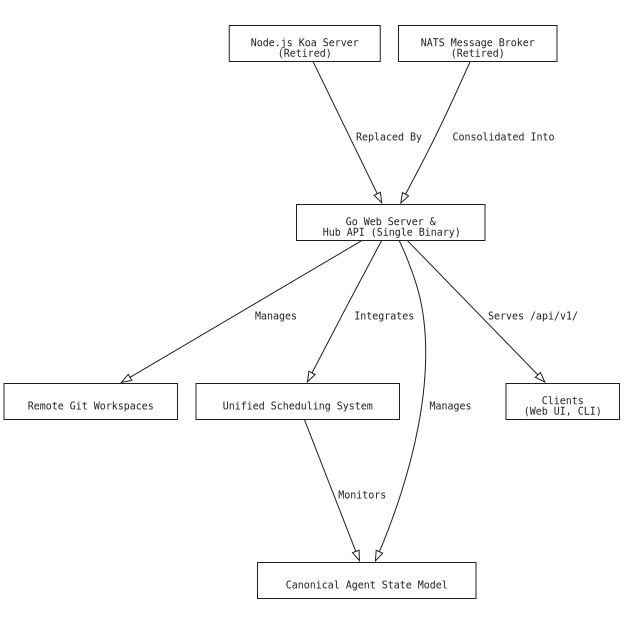

The Fabric platform's core architecture has undergone significant evolution to enhance its efficiency, scalability, and maintainability. A key architectural shift involved consolidating the web server and the Hub API into a single Go binary, unifying what were previously separate [`Node.js Koa`](https://github.com/pdlc-os/fabric/blob/b11448f8f01fdcf12deab96204417d87f8d46ab3/agents.md?plain=1#L20) and [`NATS`](https://github.com/pdlc-os/fabric/blob/b11448f8f01fdcf12deab96204417d87f8d46ab3/GLOSSARY.md?plain=1#L145) components. This consolidation, documented in the [Changelogs and Release Notes](#changelogs-and-release-notes) (specifically, [`changelog/2026-02-19-changelog.md`](https://github.com/pdlc-os/fabric/blob/b11448f8f01fdcf12deab96204417d87f8d46ab3/changelog/2026-02-19-changelog.md) and [`changelog/2026-02-20-changelog.md`](https://github.com/pdlc-os/fabric/blob/b11448f8f01fdcf12deab96204417d87f8d46ab3/changelog/2026-02-20-changelog.md)), streamlined the serving of the web frontend, SPA routing, and Server-Sent Events (SSE) through a single process. All API traffic is now routed under [`/api/v1/`](https://github.com/pdlc-os/fabric/blob/b11448f8f01fdcf12deab96204417d87f8d46ab3/pkg/hub/web.go#L569), simplifying local deployments and addressing Cross-Origin Resource Sharing (CORS) issues.

Further infrastructural improvements include the introduction of a unified scheduling system for managing recurring and one-shot tasks within the Hub. This system, detailed in [`changelog/2026-02-28-changelog.md`](https://github.com/pdlc-os/fabric/blob/b11448f8f01fdcf12deab96204417d87f8d46ab3/changelog/2026-02-28-changelog.md), also incorporates automated heartbeat timeout detection to identify and manage "zombie" agents. To support administrative operations and platform maintenance, a new UI was developed, providing tools for triggering actions such as image pulls and server rebuilds, complete with run histories and configurable executors (documented in [`changelog/2026-03-31-changelog.md`](https://github.com/pdlc-os/fabric/blob/b11448f8f01fdcf12deab96204417d87f8d46ab3/changelog/2026-03-31-changelog.md)). Additionally, a daemon mode for the [`fabric server`](https://github.com/pdlc-os/fabric/blob/b11448f8f01fdcf12deab96204417d87f8d46ab3/agents.md?plain=1#L1) was introduced in [`changelog/2026-03-07-changelog.md`](https://github.com/pdlc-os/fabric/blob/b11448f8f01fdcf12deab96204417d87f8d46ab3/changelog/2026-03-07-changelog.md), optimizing its operation for workstation environments with integrated lifecycle management. These changes collectively aim to create a more robust, integrated, and easily manageable platform for agent orchestration.

### Agent Management and Lifecycle Enhancements

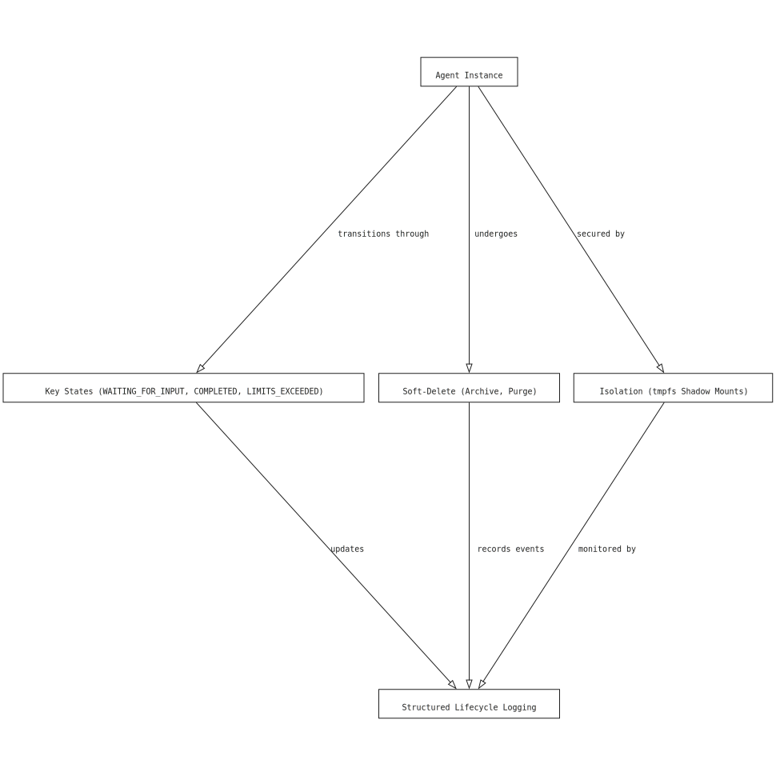

Agent lifecycle management in Fabric has undergone continuous refinement to improve agent autonomy, reliability, and security. A significant change involved the refactoring of the agent status model, unifying [`SessionStatus`](https://github.com/pdlc-os/fabric/blob/b11448f8f01fdcf12deab96204417d87f8d46ab3/changelog/2026-02-20-changelog.md?plain=1#L6) into a primary [`Status`](https://github.com/pdlc-os/fabric/blob/b11448f8f01fdcf12deab96204417d87f8d46ab3/cmd/hub.go#L2629) field and introducing "sticky" statuses like [`WAITING_FOR_INPUT`](https://github.com/pdlc-os/fabric/blob/b11448f8f01fdcf12deab96204417d87f8d46ab3/agents.md?plain=1#L44) and [`COMPLETED`](https://github.com/pdlc-os/fabric/blob/b11448f8f01fdcf12deab96204417d87f8d46ab3/agents.md?plain=1#L44). This change provided a more consistent representation of agent activity across the Hub, store, runtime broker, CLI, and web UI. See [Core Architecture and Infrastructure Updates](#changelogs-and-release-notes-core-architecture-and-infrastructure-updates) for further details.

To manage agent data more effectively, a full soft-delete lifecycle was implemented for agents. This includes Hub-side archiving, a [`fabric restore`](https://github.com/pdlc-os/fabric/blob/b11448f8f01fdcf12deab96204417d87f8d46ab3/cmd/restore.go#L22) command for recovery, filtering for deleted agents, and automated background purging, as described in [`changelog/2026-02-22-changelog.md`](https://github.com/pdlc-os/fabric/blob/b11448f8f01fdcf12deab96204417d87f8d46ab3/changelog/2026-02-22-changelog.md). Server-side settings were also introduced to configure soft-delete retention periods and workspace file preservation.

Agent execution is now subject to defined limits, with an infrastructure supporting [`max_turns`](https://github.com/pdlc-os/fabric/blob/b11448f8f01fdcf12deab96204417d87f8d46ab3/web/src/shared/types.ts#L328) and [`max_duration`](https://github.com/pdlc-os/fabric/blob/b11448f8f01fdcf12deab96204417d87f8d46ab3/web/src/shared/types.ts#L330) constraints. Exceeding these limits transitions an agent into a [`LIMITS_EXCEEDED`](https://github.com/pdlc-os/fabric/blob/b11448f8f01fdcf12deab96204417d87f8d46ab3/cmd/notifications.go#L49) state, as noted in [`changelog/2026-02-22-changelog.md`](https://github.com/pdlc-os/fabric/blob/b11448f8f01fdcf12deab96204417d87f8d46ab3/changelog/2026-02-22-changelog.md) and further refined in [`changelog/2026-03-01-changelog.md`](https://github.com/pdlc-os/fabric/blob/b11448f8f01fdcf12deab96204417d87f8d46ab3/changelog/2026-03-01-changelog.md) to include [`max_model_calls`](https://github.com/pdlc-os/fabric/blob/b11448f8f01fdcf12deab96204417d87f8d46ab3/web/src/shared/types.ts#L329).

Enhanced agent isolation and security are achieved by externalizing non-Git grove data and agent home directories using [`tmpfs shadow mounts`](https://github.com/pdlc-os/fabric/blob/b11448f8f01fdcf12deab96204417d87f8d46ab3/pkg/runtime/common.go#L154), as detailed in [`changelog/2026-03-08-changelog.md`](https://github.com/pdlc-os/fabric/blob/b11448f8f01fdcf12deab96204417d87f8d46ab3/changelog/2026-03-08-changelog.md). This approach prevents agents from persisting unauthorized changes outside their designated work areas.

Structured logging was added to the broker for agent state transitions (creation, start, stop, deletion), including [`agent_id`](https://github.com/pdlc-os/fabric/blob/b11448f8f01fdcf12deab96204417d87f8d46ab3/pkg/ent/mutation.go#L5939) and [`grove_id`](https://github.com/pdlc-os/fabric/blob/b11448f8f01fdcf12deab96204417d87f8d46ab3/agents.md?plain=1#L176) metadata. This provides better observability into the agent lifecycle, aiding in debugging and monitoring, as documented in [`changelog/2026-03-23-changelog.md`](https://github.com/pdlc-os/fabric/blob/b11448f8f01fdcf12deab96204417d87f8d46ab3/changelog/2026-03-23-changelog.md). These logging enhancements contribute to the overall [Observability, Telemetry, and Visualization](#changelogs-and-release-notes-observability-telemetry-and-visualization) efforts within the Fabric platform.

### Authentication, Authorization, and Security Features

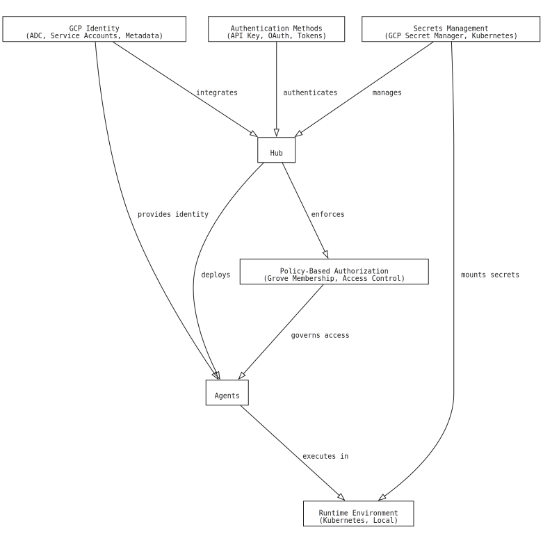

Advancements in authentication and authorization provide secure access and controlled operations for Fabric agents and users. Secrets management is a core component, with a production secret backend (e.g., Google Cloud Secret Manager) becoming a strict requirement for [`Set`](https://github.com/pdlc-os/fabric/blob/b11448f8f01fdcf12deab96204417d87f8d46ab3/pkg/hub/auth.go#L555) operations across user, grove, and runtime broker scopes, replacing plaintext fallbacks for enhanced security. For Kubernetes agents, native secret mounting is supported, including [`GKE CSI`](https://github.com/pdlc-os/fabric/blob/b11448f8f01fdcf12deab96204417d87f8d46ab3/cmd/doctor.go#L38) drivers, for robust credential management. The environment gathering pipeline also includes a "secrets-gather" mechanism, allowing templates to define required secrets and providing interactive CLI prompts for missing values, with secrets securely backed by the configured provider.

Policy-based authorization, introduced on February 24, 2026, enforces strict access controls for agent operations. Agent creation requires [`grove membership`](https://github.com/pdlc-os/fabric/blob/b11448f8f01fdcf12deab96204417d87f8d46ab3/cmd/hub.go#L311), while interaction (PTY, messaging) and deletion are restricted to the agent's owner or system administrators. This access control extends hierarchically with [`Transitive Agent Access (Ancestry)`](https://github.com/pdlc-os/fabric/blob/b11448f8f01fdcf12deab96204417d87f8d46ab3/changelog/2026-03-26-changelog.md?plain=1#L6). A [`Capability-Based Access Control`](https://github.com/pdlc-os/fabric/blob/b11448f8f01fdcf12deab96204417d87f8d46ab3/docs-site/src/content/docs/hub-admin/permissions.md?plain=1#L50) system further refines access, utilizing [`_capabilities`](https://github.com/pdlc-os/fabric/blob/b11448f8f01fdcf12deab96204417d87f8d46ab3/web/src/shared/types.ts#L50) annotations in API responses.

Unified harness authentication provides a centralized [`AuthConfig`](https://github.com/pdlc-os/fabric/blob/b11448f8f01fdcf12deab96204417d87f8d46ab3/pkg/hub/auth.go#L31) that supports various methods, including [`API Key`](https://github.com/pdlc-os/fabric/blob/b11448f8f01fdcf12deab96204417d87f8d46ab3/agents.md?plain=1#L31), [`Vertex AI`](https://github.com/pdlc-os/fabric/blob/b11448f8f01fdcf12deab96204417d87f8d46ab3/pkg/harness/generic.go#L52), [`ADC`](https://github.com/pdlc-os/fabric/blob/b11448f8f01fdcf12deab96204417d87f8d46ab3/pkg/api/types.go#L517), and [`OAuth`](https://github.com/pdlc-os/fabric/blob/b11448f8f01fdcf12deab96204417d87f8d46ab3/pkg/config/hub_config.go#L302). This multi-phase refactoring of the agent authentication pipeline aims for consistency and security across different environments. User Access Tokens (UATs), designated as [`fabric_pat_*`](https://github.com/pdlc-os/fabric/blob/b11448f8f01fdcf12deab96204417d87f8d46ab3/pkg/hub/auth.go#L79) tokens, replace legacy API keys, offering granular scoping and CLI management through [`fabric auth tokens`](https://github.com/pdlc-os/fabric/blob/b11448f8f01fdcf12deab96204417d87f8d46ab3/cmd/hub.go#L362).

GCP identity and metadata server emulation enables agents to securely access GCP resources. This includes a Web UI for Service Account management and [`iptables`](https://github.com/pdlc-os/fabric/blob/b11448f8f01fdcf12deab96204417d87f8d46ab3/pkg/agent/run.go#L1286) interception to ensure that agents can leverage GCP services with hub-minted service accounts. GitHub App integration facilitates secure communication and token management for Git-based operations. This integration provides JWT-based authentication, automated token refresh, and Git credential helper functionality.

### Workspace and Grove Management Evolution

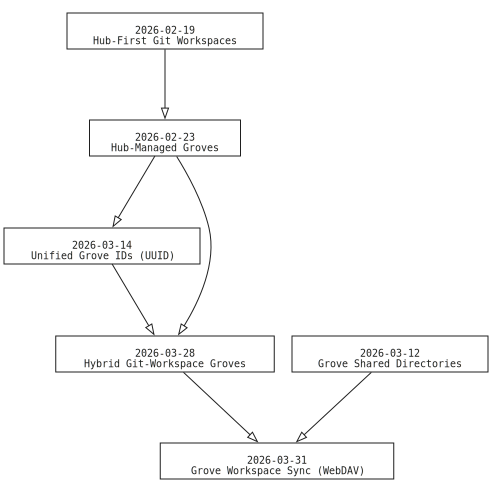

The management of agent workspaces and groves within the Fabric platform has undergone a significant evolution, moving towards a more integrated and flexible system. Initially, the platform introduced the concept of Hub-first Git workspaces, allowing for the creation of remote workspaces directly from Git URLs. This provided a centralized approach to version-controlled agent environments.

This was further expanded with the introduction of Hub-managed groves, decoupling workspace management from external Git repositories. This allowed for project workspace creation directly via the Hub API and Web UI, automatically initializing with a standard [`.fabric`](https://github.com/pdlc-os/fabric/blob/b11448f8f01fdcf12deab96204417d87f8d46ab3/agents.md?plain=1#L34) structure. The ability to directly manage workspace files through the Hub API further reduced reliance on external Git for these groves, as noted in [`changelog/2026-02-24-changelog.md`](https://github.com/pdlc-os/fabric/blob/b11448f8f01fdcf12deab96204417d87f8d46ab3/changelog/2026-02-24-changelog.md).

To standardize and unify identifiers, Grove IDs were transitioned to UUIDs, initially using deterministic hex hashes and later moving to random UUIDs to support multiple groves per Git remote, as documented in [`changelog/2026-03-14-changelog.md`](https://github.com/pdlc-os/fabric/blob/b11448f8f01fdcf12deab96204417d87f8d46ab3/changelog/2026-03-14-changelog.md) and [`changelog/2026-03-29-changelog.md`](https://github.com/pdlc-os/fabric/blob/b11448f8f01fdcf12deab96204417d87f8d46ab3/changelog/2026-03-29-changelog.md).

For agents requiring persistent storage, the platform introduced shared persistent directories within a grove. These directories support various storage backends, including local filesystems and Kubernetes [`PersistentVolumeClaims`](https://github.com/pdlc-os/fabric/blob/b11448f8f01fdcf12deab96204417d87f8d46ab3/pkg/runtime/k8s_runtime.go#L808), and are manageable via [`fabric shared-dir`](https://github.com/pdlc-os/fabric/blob/b11448f8f01fdcf12deab96204417d87f8d46ab3/cmd/cli_mode.go#L9) CLI commands, as detailed in [`changelog/2026-03-12-changelog.md`](https://github.com/pdlc-os/fabric/blob/b11448f8f01fdcf12deab96204417d87f8d46ab3/changelog/2026-03-12-changelog.md).

Workspace synchronization capabilities were also enhanced with the completion of the Grove Workspace Sync system, incorporating WebDAV support, a linked grove cache relay, and new CLI [`sync`](https://github.com/pdlc-os/fabric/blob/b11448f8f01fdcf12deab96204417d87f8d46ab3/pkg/runtime/mock.go#L101) commands, as outlined in [`changelog/2026-03-31-changelog.md`](https://github.com/pdlc-os/fabric/blob/b11448f8f01fdcf12deab96204417d87f8d46ab3/changelog/2026-03-31-changelog.md).

Finally, a new grove type emerged, combining remote Git repositories with local workspaces. These hybrid Git-workspace groves feature automated provisioning, offering a flexible environment for agents that benefit from both version-controlled code and dynamic local modifications, as described in [`changelog/2026-03-28-changelog.md`](https://github.com/pdlc-os/fabric/blob/b11448f8f01fdcf12deab96204417d87f8d46ab3/changelog/2026-03-28-changelog.md). This evolution in workspace and grove management provides a robust and adaptable framework for agent operation within Fabric.

### Template and Configuration System Refinements

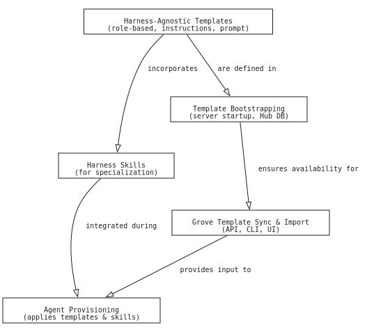

The Fabric platform has undergone significant enhancements to its template and configuration system to improve flexibility, consistency, and ease of management for agents. A key development is the introduction of harness-agnostic templates, which allow agents to define their roles and instructions independently of specific Large Language Model (LLM) implementations. This is achieved through fields such as [`agent_instructions`](https://github.com/pdlc-os/fabric/blob/b11448f8f01fdcf12deab96204417d87f8d46ab3/web/src/components/pages/agent-configure.ts#L40), [`system_prompt`](https://github.com/pdlc-os/fabric/blob/b11448f8f01fdcf12deab96204417d87f8d46ab3/web/src/components/pages/agent-configure.ts#L39), and [`default_harness_config`](https://github.com/pdlc-os/fabric/blob/b11448f8f01fdcf12deab96204417d87f8d46ab3/pkg/ent/mutation.go#L36744), enabling templates to specify an agent's behavior without being tied to a particular harness. This evolution is documented in [`changelog/2026-02-24-changelog.md`](https://github.com/pdlc-os/fabric/blob/b11448f8f01fdcf12deab96204417d87f8d46ab3/changelog/2026-02-24-changelog.md).

To streamline development and deployment, a template bootstrapping mechanism was introduced, automatically loading local agent templates into the Hub database upon server startup, as noted in [`changelog/2026-02-25-changelog.md`](https://github.com/pdlc-os/fabric/blob/b11448f8f01fdcf12deab96204417d87f8d46ab3/changelog/2026-02-25-changelog.md). This ensures that newly defined or updated templates are immediately available within the system.

Further refinements include robust support for harness skills within agent templates. These skills are automatically merged and mounted into harness-specific directories (e.g., [`.claude/skills`](https://github.com/pdlc-os/fabric/blob/b11448f8f01fdcf12deab96204417d87f8d46ab3/harnesses/claude/config.yaml#L34)), ensuring that agents have access to the necessary tools and capabilities for their designated harness. This feature significantly enhances the modularity and reusability of agent configurations, as detailed in [`changelog/2026-03-13-changelog.md`](https://github.com/pdlc-os/fabric/blob/b11448f8f01fdcf12deab96204417d87f8d46ab3/changelog/2026-03-13-changelog.md).

For managing templates at a broader scope, grove template synchronization and management capabilities were added. This allows for synchronizing grove-level templates with the Hub via API endpoints like [`POST /api/v1/groves/{groveId}/sync-templates`](https://github.com/pdlc-os/fabric/blob/b11448f8f01fdcf12deab96204417d87f8d46ab3/changelog/2026-03-14-changelog.md?plain=1#L10), CLI commands ([`fabric templates sync --all`](https://github.com/pdlc-os/fabric/blob/b11448f8f01fdcf12deab96204417d87f8d46ab3/agents.md?plain=1#L1)), and through the Web UI. This ensures consistency across different groves and simplifies the distribution of templates within projects, as described in [`changelog/2026-03-14-changelog.md`](https://github.com/pdlc-os/fabric/blob/b11448f8f01fdcf12deab96204417d87f8d46ab3/changelog/2026-03-14-changelog.md).

A significant architectural overhaul of the template import system replaced the previous container-based approach with a direct server-side import mechanism. This refactor expanded template discovery to include deep GitHub paths, archives, [`rclone`](https://github.com/pdlc-os/fabric/blob/b11448f8f01fdcf12deab96204417d87f8d46ab3/go.mod#L33) URIs, and direct Fabric template imports, moving from [`POST /api/v1/groves/{groveId}/sync-templates`](https://github.com/pdlc-os/fabric/blob/b11448f8f01fdcf12deab96204417d87f8d46ab3/changelog/2026-03-14-changelog.md?plain=1#L10) to [`POST /api/v1/groves/{groveId}/import-templates`](https://github.com/pdlc-os/fabric/blob/b11448f8f01fdcf12deab96204417d87f8d46ab3/changelog/2026-04-02-changelog.md?plain=1#L6). This change, documented in [`changelog/2026-04-02-changelog.md`](https://github.com/pdlc-os/fabric/blob/b11448f8f01fdcf12deab96204417d87f8d46ab3/changelog/2026-04-02-changelog.md), streamlines the process of integrating diverse template sources into the Fabric platform, offering greater flexibility and efficiency in agent setup and configuration.

### User Interface and Experience (UI/UX) Improvements

| Feature Area | Specific Enhancement | Timeframe |
| --- | --- | --- |
| **Agent Management** | Advanced filtering options ("My Agents", "My Groves"), consistent action buttons across real-time updates, Broker column in table view, dedicated "Create Agent" UI. | Mar 2026 - Apr 2026 |
| **Workspace & Files** | Dot-file visibility toggle, hybrid search for file browsers, content previews, shared directory ZIP downloads, improved GitHub URL rendering. | Mar 2026 - May 2026 |
| **Terminal & PTY** | Tmux mouse toggle, native copy/paste, Shift+Enter support, terminal activity badge, improved window switcher, `DISCONNECTED` overlay. | Mar 2026 - Jun 2026 |
| **Notifications & Messaging** | Browser push notifications, Discord/Telegram integration, real-time message stream for agents, dedicated inbox tray with unread counts, improved message rendering. | Mar 2026 - May 2026 |
| **Admin & Configuration** | Web-based server config editor, integrated update mechanism, unified user/invite/allow list management, project rename support. | Mar 2026 - Jun 2026 |
| **Visualizations** | Agent activity visualizer with log replay, 3D graph, enhanced animations, Markdown rendering for inter-agent messages. | Mar 2026 - Jun 2026 |
| **Branding & UI Consistency** | SVG favicon, standardized icons, Dark Mode improvements, consistent error messaging. | Mar 2026 - Apr 2026 |
| **Performance** | Optimistic UI updates, SSE connection pooling, route-based code splitting, SQLite connection pooling. | Mar 2026 - May 2026 |
| **Project Management** | New "Project" terminology (formerly "Grove"), dedicated settings tabs (General, Limits, Resources), workspace mode selector. | May 2026 - Jun 2026 |
| **Auth & Identity** | User Access Tokens (UATs), GitHub App integration, GCP Identity/metadata emulation, automated token refresh, Google IAP auth proxy. | Mar 2026 - Jun 2026 |

The Fabric platform's Web UI/UX has undergone continuous refinement to enhance user interaction and provide real-time visibility into agent operations. Early improvements included the introduction of new list pages for various entities, the implementation of client-side routing, and the integration of real-time updates via Server-Sent Events (SSE). These enhancements facilitate a dynamic user experience, where changes to agents and other resources are reflected promptly without requiring page reloads. The use of SSE for real-time updates is further elaborated in [Real-time State Management and SSE](#fabric-web-user-interface-real-time-state-management-and-sse).

A significant area of focus has been the web terminal, which has seen numerous improvements to boost usability and functionality. These include the addition of native clipboard copy/paste support, making it easier for users to interact with agent outputs and inputs. Further enhancements integrated [`tmux`](https://github.com/pdlc-os/fabric/blob/b11448f8f01fdcf12deab96204417d87f8d46ab3/README.md?plain=1#L74) functionalities, such as mouse toggling and key binding support ([`C-b m`](https://github.com/pdlc-os/fabric/blob/b11448f8f01fdcf12deab96204417d87f8d46ab3/changelog/2026-03-11-changelog.md?plain=1#L7)), to provide a more robust and familiar terminal experience directly within the browser.

The agent detail UI has been re-architected to present information more efficiently. This overhaul introduced a high-density, tabbed layout, segmenting agent details into logical categories like "Status," "Configuration," and "Messages," thereby improving navigation and information accessibility.

Most recently, an inline file and template editor was introduced, featuring integrated Markdown preview and fuzzy filtering. This editor enables users to browse and edit template files directly within the web interface, streamlining the process of managing agent configurations and instructions. The evolution of templating and configuration systems is further discussed in [Template and Configuration System Refinements](#changelogs-and-release-notes-template-and-configuration-system-refinements). Additionally, the development of a cloud log viewer system, including a new Hub API for log retrieval and a dedicated "Messages" tab in the Web UI, provides comprehensive visibility into agent activities and communications.

### Observability, Telemetry, and Visualization

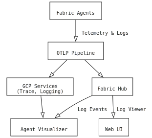

Advancements in observability and telemetry within Fabric have focused on providing comprehensive insights into agent activity and system health. This includes the introduction of telemetry injection into the settings schema, as noted in the changelog for [`changelog/2026-02-19-changelog.md`](https://github.com/pdlc-os/fabric/blob/b11448f8f01fdcf12deab96204417d87f8d46ab3/changelog/2026-02-19-changelog.md).

A native OpenTelemetry Protocol (OTLP) pipeline was established, enabling the system to receive and forward logs, with support for Google Cloud Platform (GCP) credential injection. This pipeline was further enhanced with native Google Cloud Trace and Cloud Logging exporters, as detailed in the changelogs for [`changelog/2026-03-03-changelog.md`](https://github.com/pdlc-os/fabric/blob/b11448f8f01fdcf12deab96204417d87f8d46ab3/changelog/2026-03-03-changelog.md) and [`changelog/2026-03-06-changelog.md`](https://github.com/pdlc-os/fabric/blob/b11448f8f01fdcf12deab96204417d87f8d46ab3/changelog/2026-03-06-changelog.md). This integration allows for standardized data collection and export to GCP services for comprehensive monitoring.

An end-to-end cloud log viewer system was implemented, featuring a Hub API for log retrieval and a dedicated [`Messages`](https://github.com/pdlc-os/fabric/blob/b11448f8f01fdcf12deab96204417d87f8d46ab3/pkg/hubclient/client.go#L94) tab within the Web UI, which is documented in [`changelog/2026-03-07-changelog.md`](https://github.com/pdlc-os/fabric/blob/b11448f8f01fdcf12deab96204417d87f8d46ab3/changelog/2026-03-07-changelog.md). This provides a centralized interface for reviewing agent and system logs.

The metrics pipeline underwent an overhaul, enriching OpenTelemetry (OTel) resource attributes to capture more detailed telemetry, particularly for tools like [`Codex`](https://github.com/pdlc-os/fabric/blob/b11448f8f01fdcf12deab96204417d87f8d46ab3/README.md?plain=1#L83), to track tool usage and token counts, as described in [`changelog/2026-03-12-changelog.md`](https://github.com/pdlc-os/fabric/blob/b11448f8f01fdcf12deab96204417d87f8d46ab3/changelog/2026-03-12-changelog.md).

For visualizing agent activity, a 3D agent activity visualizer tool was developed. Initially, this tool dynamically discovered agents and files from log events, and later incorporated [`fs-watcher`](https://github.com/pdlc-os/fabric/blob/b11448f8f01fdcf12deab96204417d87f8d46ab3/extras/fs-watcher-tool/go.mod#L1) for filesystem telemetry, enabling a log-driven approach to visualization. These developments are highlighted across changelogs, including [`changelog/2026-03-22-changelog.md`](https://github.com/pdlc-os/fabric/blob/b11448f8f01fdcf12deab96204417d87f8d46ab3/changelog/2026-03-22-changelog.md), [`changelog/2026-03-24-changelog.md`](https://github.com/pdlc-os/fabric/blob/b11448f8f01fdcf12deab96204417d87f8d46ab3/changelog/2026-03-24-changelog.md), [`changelog/2026-03-25-changelog.md`](https://github.com/pdlc-os/fabric/blob/b11448f8f01fdcf12deab96204417d87f8d46ab3/changelog/2026-03-25-changelog.md), and [`changelog/2026-03-28-changelog.md`](https://github.com/pdlc-os/fabric/blob/b11448f8f01fdcf12deab96204417d87f8d46ab3/changelog/2026-03-28-changelog.md). This visualizer assists in understanding agent communications, file interactions, and overall workflow. Additional details on the [`agent-viz`](https://github.com/pdlc-os/fabric/blob/b11448f8f01fdcf12deab96204417d87f8d46ab3/extras/agent-viz/go.mod#L1) tool can be found in [Agent Activity Visualization with `agent-viz`](#auxiliary-tools-and-integrations-agent-activity-visualization-with-agent-viz).

### Messaging and Notification System Development

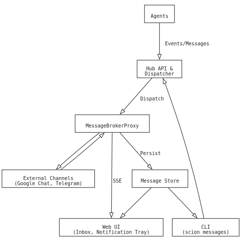

The Fabric platform features a comprehensive messaging and notification system designed to facilitate real-time communication within the ecosystem. This system has undergone a multi-phase evolution, culminating in a robust framework for agent-to-agent and agent-to-user interactions.

A core component of this system is the capability for real-time subscriptions to agent status events. This is supported by a notification dispatcher and corresponding Hub API endpoints, which allow for the tracking of agent activities. This framework was further expanded into an integrated notification system that leverages Server-Sent Events (SSE) for delivery, offering agent-scoped filtering and browser push support for user notifications. The web user interface also includes a notification tray to centralize these updates.

The messaging system enables bidirectional communication, which has evolved to include a dedicated message store for persistence. A "human inbox" provides a centralized location for users to manage messages from agents, accessible via both the command-line interface and the Hub API. For real-time delivery of messages, a [`MessageBrokerProxy`](https://github.com/pdlc-os/fabric/blob/b11448f8f01fdcf12deab96204417d87f8d46ab3/pkg/hub/messagebroker.go#L46) is utilized, ensuring that agents can send outbound messages efficiently. Further details on how agents utilize the messaging system can be found in [Inter-Agent and User Communication Protocols](#fabric-platform-skills-inter-agent-and-user-communication-protocols).

The development milestones of these features are extensively documented in the changelog, particularly from [`changelog/2026-02-24-changelog.md`](https://github.com/pdlc-os/fabric/blob/b11448f8f01fdcf12deab96204417d87f8d46ab3/changelog/2026-02-24-changelog.md) to [`changelog/2026-03-28-changelog.md`](https://github.com/pdlc-os/fabric/blob/b11448f8f01fdcf12deab96204417d87f8d46ab3/changelog/2026-03-28-changelog.md), which detail the continuous enhancements and architectural decisions that shaped the messaging and notification capabilities within Fabric.

### Kubernetes and GitHub Integrations

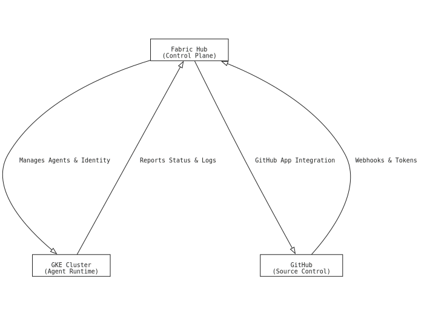

The platform provides extensive integration with Kubernetes environments, particularly Google Kubernetes Engine (GKE), and GitHub.

For Kubernetes, a key focus has been on enhancing agent security and operational efficiency. The system now supports native secret mounting for Kubernetes agents, a crucial component for securely injecting sensitive information into agent containers. This is achieved through mechanisms that leverage CSI drivers, providing robust fallback paths for credential access. Further security enhancements include the integration of GKE-specific features like [Workload Identity](https://cloud.google.com/kubernetes-engine/docs/how-to/workload-identity), which strengthens the authentication of applications running on GKE by associating Kubernetes Service Accounts with Google Service Accounts. Native support for GKE runtimes has been introduced, streamlining the deployment and management of agents within GKE clusters, alongside corresponding cluster provisioning scripts. The Kubernetes runtime has matured to achieve feature parity with other execution environments, with a strong emphasis on production hardening and launch readiness. This includes native PTY (pseudo-terminal) support via the Kubernetes Go client API for interactive agent sessions and compatibility with GKE Autopilot, Google Cloud's managed Kubernetes service.

On the GitHub integration front, a multi-phase approach has been implemented to integrate Fabric Hub instances with GitHub via a GitHub App. This integration provides JWT-based authentication, allowing secure communication between the Fabric Hub and GitHub. It includes infrastructure to link groves (logical groupings of agents and resources) with GitHub App installations. The system also features automated token refresh capabilities, ensuring continuous and secure access without manual intervention. A Git credential helper functionality has been introduced, simplifying Git operations for agents by handling authentication seamlessly. Additionally, an administrative management UI provides tools for configuring and monitoring these GitHub integrations. The system allows for enhanced authentication token minting directly from source Groves, further streamlining the workflow for agents interacting with GitHub repositories.
